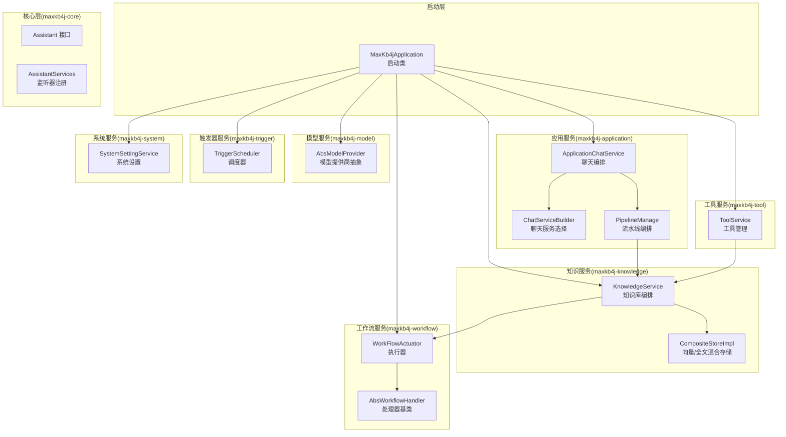
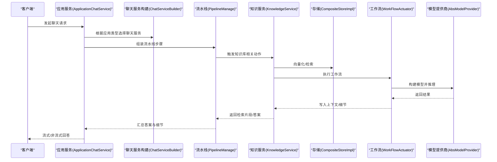
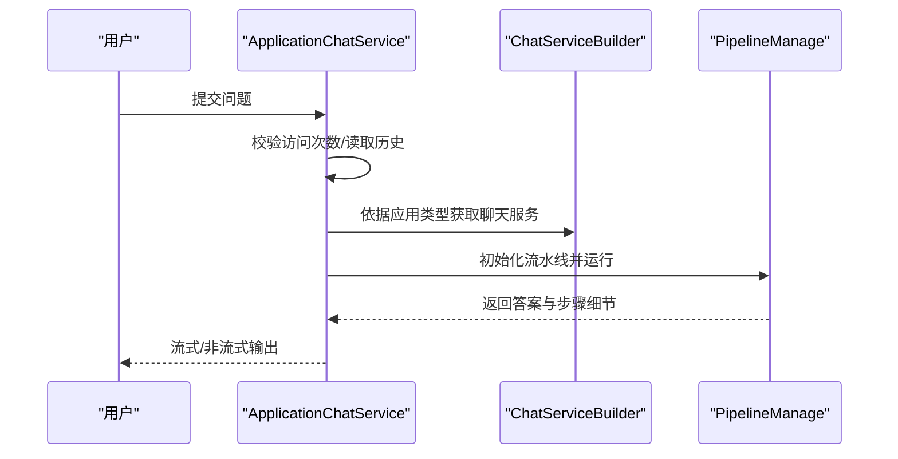
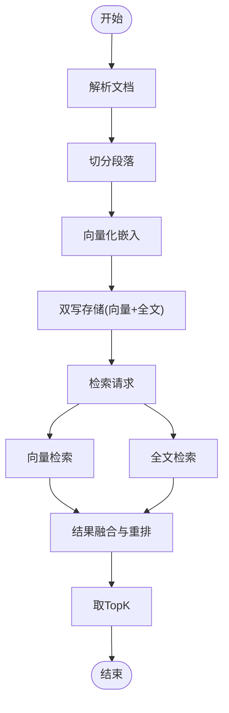
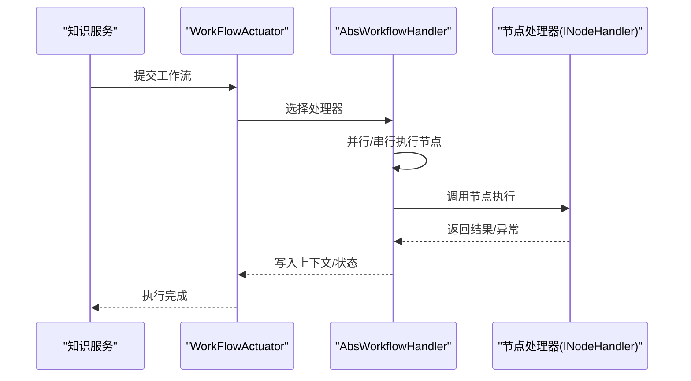
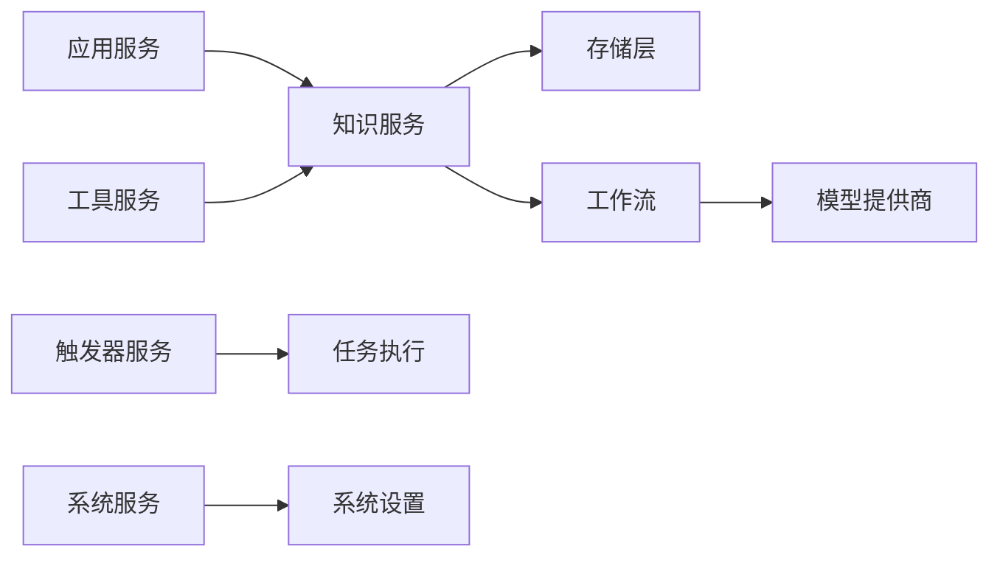

# 核心模块详解

<cite>
**本文引用的文件**
- [Assistant.java](file://maxkb4j-core/src/main/java/com/maxkb4j/core/assistant/Assistant.java)
- [AssistantServices.java](file://maxkb4j-core/src/main/java/com/maxkb4j/core/langchain4j/AssistantServices.java)
- [ApplicationChatService.java](file://maxkb4j-service/maxkb4j-application/src/main/java/com/maxkb4j/application/service/ApplicationChatService.java)
- [ChatServiceBuilder.java](file://maxkb4j-service/maxkb4j-application/src/main/java/com/maxkb4j/application/builder/ChatServiceBuilder.java)
- [PipelineManage.java](file://maxkb4j-service/maxkb4j-application/src/main/java/com/maxkb4j/application/pipeline/PipelineManage.java)
- [KnowledgeService.java](file://maxkb4j-service/maxkb4j-knowledge/src/main/java/com/maxkb4j/knowledge/service/KnowledgeService.java)
- [CompositeStoreImpl.java](file://maxkb4j-service/maxkb4j-knowledge/src/main/java/com/maxkb4j/knowledge/store/CompositeStoreImpl.java)
- [AbsModelProvider.java](file://maxkb4j-service/maxkb4j-model/src/main/java/com/maxkb4j/model/provider/AbsModelProvider.java)
- [WorkFlowActuator.java](file://maxkb4j-service/maxkb4j-workflow/src/main/java/com/maxkb4j/workflow/service/WorkFlowActuator.java)
- [AbsWorkflowHandler.java](file://maxkb4j-service/maxkb4j-workflow/src/main/java/com/maxkb4j/workflow/handler/AbsWorkflowHandler.java)
- [TriggerScheduler.java](file://maxkb4j-service/maxkb4j-trigger/src/main/java/com/maxkb4j/trigger/service/TriggerScheduler.java)
- [ToolService.java](file://maxkb4j-service/maxkb4j-tool/src/main/java/com/maxkb4j/tool/service/ToolService.java)
- [SystemSettingService.java](file://maxkb4j-service/maxkb4j-system/src/main/java/com/maxkb4j/system/service/SystemSettingService.java)
- [MaxKb4jApplication.java](file://maxkb4j-start/src/main/java/com/maxkb4j/start/MaxKb4jApplication.java)
</cite>

## 目录
1. [引言](#引言)
2. [项目结构](#项目结构)
3. [核心组件](#核心组件)
4. [架构总览](#架构总览)
5. [详细组件分析](#详细组件分析)
6. [依赖分析](#依赖分析)
7. [性能考虑](#性能考虑)
8. [故障排查指南](#故障排查指南)
9. [结论](#结论)
10. [附录](#附录)

## 引言
本文件面向MaxKB4j核心模块，系统性梳理应用服务、知识服务、模型服务、工作流服务、触发器服务、工具服务与系统服务等模块的设计理念、实现原理与使用方法。文档以“模块职责边界、核心组件、接口设计、扩展点”为主线，辅以模块协作关系图与数据流转示例，帮助读者快速理解并高效扩展系统。

## 项目结构
MaxKB4j采用多模块分层架构，核心模块位于maxkb4j-core，业务能力分布在maxkb4j-service下的各子模块，启动入口在maxkb4j-start。整体通过Spring Boot自动装配与扫描机制加载，启用定时任务与缓存能力。

图表来源
- [MaxKb4jApplication.java:10-22](file://maxkb4j-start/src/main/java/com/maxkb4j/start/MaxKb4jApplication.java#L10-L22)
- [ApplicationChatService.java:50-137](file://maxkb4j-service/maxkb4j-application/src/main/java/com/maxkb4j/application/service/ApplicationChatService.java#L50-L137)
- [ChatServiceBuilder.java:14-37](file://maxkb4j-service/maxkb4j-application/src/main/java/com/maxkb4j/application/builder/ChatServiceBuilder.java#L14-L37)
- [PipelineManage.java:24-61](file://maxkb4j-service/maxkb4j-application/src/main/java/com/maxkb4j/application/pipeline/PipelineManage.java#L24-L61)
- [KnowledgeService.java:66-294](file://maxkb4j-service/maxkb4j-knowledge/src/main/java/com/maxkb4j/knowledge/service/KnowledgeService.java#L66-L294)
- [CompositeStoreImpl.java:21-143](file://maxkb4j-service/maxkb4j-knowledge/src/main/java/com/maxkb4j/knowledge/store/CompositeStoreImpl.java#L21-L143)
- [AbsModelProvider.java:36-244](file://maxkb4j-service/maxkb4j-model/src/main/java/com/maxkb4j/model/provider/AbsModelProvider.java#L36-L244)
- [WorkFlowActuator.java:16-36](file://maxkb4j-service/maxkb4j-workflow/src/main/java/com/maxkb4j/workflow/service/WorkFlowActuator.java#L16-L36)
- [AbsWorkflowHandler.java:27-189](file://maxkb4j-service/maxkb4j-workflow/src/main/java/com/maxkb4j/workflow/handler/AbsWorkflowHandler.java#L27-L189)
- [TriggerScheduler.java:29-233](file://maxkb4j-service/maxkb4j-trigger/src/main/java/com/maxkb4j/trigger/service/TriggerScheduler.java#L29-L233)
- [ToolService.java:49-291](file://maxkb4j-service/maxkb4j-tool/src/main/java/com/maxkb4j/tool/service/ToolService.java#L49-L291)
- [SystemSettingService.java:17-34](file://maxkb4j-service/maxkb4j-system/src/main/java/com/maxkb4j/system/service/SystemSettingService.java#L17-L34)

章节来源
- [MaxKb4jApplication.java:10-22](file://maxkb4j-start/src/main/java/com/maxkb4j/start/MaxKb4jApplication.java#L10-L22)

## 核心组件
- 应用服务模块
  - 职责：对外提供聊天能力，支持简单聊天与工作流聊天；负责访问次数校验、历史记录管理、分享链接生成与导出。
  - 关键组件：ApplicationChatService、ChatServiceBuilder、PipelineManage。
  - 扩展点：通过ChatServiceBuilder按应用类型选择具体聊天实现；PipelineManage支持自定义步骤链路。
- 知识服务模块
  - 职责：知识库生命周期管理、文档解析与切分、向量化与检索、问题生成、工作流编排与版本发布。
  - 关键组件：KnowledgeService、CompositeStoreImpl（向量/全文混合存储）。
  - 扩展点：工作流节点注册与执行；存储层可替换或扩展。
- 模型服务模块
  - 职责：统一抽象多提供商模型能力，提供参数解析、凭据表单、模型构建与禁用模型占位。
  - 关键组件：AbsModelProvider及其子类。
  - 扩展点：新增提供商只需继承抽象类并实现所需模型构建方法。
- 工作流服务模块
  - 职责：工作流执行器与处理器基类，支持节点并行执行、超时与异常统一处理、状态流转。
  - 关键组件：WorkFlowActuator、AbsWorkflowHandler。
  - 扩展点：自定义节点处理器与异常解析链。
- 触发器服务模块
  - 职责：基于调度类型（每日/每周/每月/间隔）的定时任务调度与重调度。
  - 关键组件：TriggerScheduler。
  - 扩展点：新增调度类型与计算策略。
- 工具服务模块
  - 职责：工具管理（导入/导出/连接测试/解压技能包）、MCP工具枚举、权限与可见性控制。
  - 关键组件：ToolService。
  - 扩展点：工具类型扩展、连接器与验证器扩展。
- 系统服务模块
  - 职责：系统设置持久化与邮箱连通性测试。
  - 关键组件：SystemSettingService。
  - 扩展点：新增系统设置类型与测试方法。

章节来源
- [ApplicationChatService.java:50-137](file://maxkb4j-service/maxkb4j-application/src/main/java/com/maxkb4j/application/service/ApplicationChatService.java#L50-L137)
- [ChatServiceBuilder.java:14-37](file://maxkb4j-service/maxkb4j-application/src/main/java/com/maxkb4j/application/builder/ChatServiceBuilder.java#L14-L37)
- [PipelineManage.java:24-61](file://maxkb4j-service/maxkb4j-application/src/main/java/com/maxkb4j/application/pipeline/PipelineManage.java#L24-L61)
- [KnowledgeService.java:66-294](file://maxkb4j-service/maxkb4j-knowledge/src/main/java/com/maxkb4j/knowledge/service/KnowledgeService.java#L66-L294)
- [CompositeStoreImpl.java:21-143](file://maxkb4j-service/maxkb4j-knowledge/src/main/java/com/maxkb4j/knowledge/store/CompositeStoreImpl.java#L21-L143)
- [AbsModelProvider.java:36-244](file://maxkb4j-service/maxkb4j-model/src/main/java/com/maxkb4j/model/provider/AbsModelProvider.java#L36-L244)
- [WorkFlowActuator.java:16-36](file://maxkb4j-service/maxkb4j-workflow/src/main/java/com/maxkb4j/workflow/service/WorkFlowActuator.java#L16-L36)
- [AbsWorkflowHandler.java:27-189](file://maxkb4j-service/maxkb4j-workflow/src/main/java/com/maxkb4j/workflow/handler/AbsWorkflowHandler.java#L27-L189)
- [TriggerScheduler.java:29-233](file://maxkb4j-service/maxkb4j-trigger/src/main/java/com/maxkb4j/trigger/service/TriggerScheduler.java#L29-L233)
- [ToolService.java:49-291](file://maxkb4j-service/maxkb4j-tool/src/main/java/com/maxkb4j/tool/service/ToolService.java#L49-L291)
- [SystemSettingService.java:17-34](file://maxkb4j-service/maxkb4j-system/src/main/java/com/maxkb4j/system/service/SystemSettingService.java#L17-L34)

## 架构总览
系统以“启动类”为入口，通过Spring容器装配各模块组件。应用服务负责对外聊天编排，知识服务负责RAG流程（解析、切分、向量化、检索），模型服务提供统一的模型提供商抽象，工作流服务负责节点级执行与异常处理，触发器服务负责定时任务调度，工具服务负责外部工具与MCP集成，系统服务负责系统配置与连通性测试。

图表来源
- [ApplicationChatService.java:115-137](file://maxkb4j-service/maxkb4j-application/src/main/java/com/maxkb4j/application/service/ApplicationChatService.java#L115-L137)
- [ChatServiceBuilder.java:29-36](file://maxkb4j-service/maxkb4j-application/src/main/java/com/maxkb4j/application/builder/ChatServiceBuilder.java#L29-L36)
- [PipelineManage.java:39-61](file://maxkb4j-service/maxkb4j-application/src/main/java/com/maxkb4j/application/pipeline/PipelineManage.java#L39-L61)
- [KnowledgeService.java:271-294](file://maxkb4j-service/maxkb4j-knowledge/src/main/java/com/maxkb4j/knowledge/service/KnowledgeService.java#L271-L294)
- [CompositeStoreImpl.java:118-140](file://maxkb4j-service/maxkb4j-knowledge/src/main/java/com/maxkb4j/knowledge/store/CompositeStoreImpl.java#L118-L140)
- [WorkFlowActuator.java:22-34](file://maxkb4j-service/maxkb4j-workflow/src/main/java/com/maxkb4j/workflow/service/WorkFlowActuator.java#L22-L34)
- [AbsModelProvider.java:161-229](file://maxkb4j-service/maxkb4j-model/src/main/java/com/maxkb4j/model/provider/AbsModelProvider.java#L161-L229)

## 详细组件分析

### 应用服务模块
- 设计理念
  - 通过Builder模式按应用类型选择聊天服务，支持简单聊天与工作流聊天。
  - 使用PipelineManage将多步骤（如检索、生成、后处理）串联，便于扩展与可观测。
  - 结合缓存与访问统计，保障并发与配额控制。
- 核心组件
  - ApplicationChatService：聊天入口，负责会话初始化、历史读取、访问次数检查、异步执行与导出。
  - ChatServiceBuilder：按应用类型映射到具体聊天实现。
  - PipelineManage：流水线编排，维护上下文、历史消息拼接、排除重复段落、收集步骤细节。
- 接口设计与扩展点
  - Assistant接口定义聊天契约（同步/流式），配合AssistantServices注册监听器，便于埋点与可观测。
  - PipelineManage支持动态添加步骤，便于插入新的处理阶段（如重排序、后过滤）。
- 数据流转示例
  - 客户端发起聊天 → ApplicationChatService读取历史/校验配额 → 选择聊天服务 → PipelineManage执行步骤 → 返回答案与细节。

图表来源
- [ApplicationChatService.java:115-137](file://maxkb4j-service/maxkb4j-application/src/main/java/com/maxkb4j/application/service/ApplicationChatService.java#L115-L137)
- [ChatServiceBuilder.java:29-36](file://maxkb4j-service/maxkb4j-application/src/main/java/com/maxkb4j/application/builder/ChatServiceBuilder.java#L29-L36)
- [PipelineManage.java:39-61](file://maxkb4j-service/maxkb4j-application/src/main/java/com/maxkb4j/application/pipeline/PipelineManage.java#L39-L61)

章节来源
- [ApplicationChatService.java:50-137](file://maxkb4j-service/maxkb4j-application/src/main/java/com/maxkb4j/application/service/ApplicationChatService.java#L50-L137)
- [ChatServiceBuilder.java:14-37](file://maxkb4j-service/maxkb4j-application/src/main/java/com/maxkb4j/application/builder/ChatServiceBuilder.java#L14-L37)
- [PipelineManage.java:24-61](file://maxkb4j-service/maxkb4j-application/src/main/java/com/maxkb4j/application/pipeline/PipelineManage.java#L24-L61)
- [Assistant.java:11-21](file://maxkb4j-core/src/main/java/com/maxkb4j/core/assistant/Assistant.java#L11-L21)
- [AssistantServices.java:13-26](file://maxkb4j-core/src/main/java/com/maxkb4j/core/langchain4j/AssistantServices.java#L13-L26)

### 知识服务模块
- 设计理念
  - 以工作流为核心编排文档处理（解析、切分、向量化、检索、问题生成），支持版本发布与回滚。
  - 存储层采用复合存储（向量+全文），兼顾召回质量与性能，并提供双写一致性保障。
- 核心组件
  - KnowledgeService：知识库增删改查、导出、版本管理、工作流执行、资源映射。
  - CompositeStoreImpl：统一upsert/delete/search接口，双写向量与全文存储，异步聚合检索结果。
- 接口设计与扩展点
  - 支持通过工作流节点扩展数据源（本地文件/MCP/网页）与处理步骤。
  - 存储层可替换为其他实现（如纯向量或纯全文）。
- 数据流转示例
  - 用户上传文档 → KnowledgeService解析/切分 → CompositeStoreImpl双写向量与全文 → 检索时并行查询并融合排序。

图表来源
- [KnowledgeService.java:193-197](file://maxkb4j-service/maxkb4j-knowledge/src/main/java/com/maxkb4j/knowledge/service/KnowledgeService.java#L193-L197)
- [CompositeStoreImpl.java:27-43](file://maxkb4j-service/maxkb4j-knowledge/src/main/java/com/maxkb4j/knowledge/store/CompositeStoreImpl.java#L27-L43)
- [CompositeStoreImpl.java:118-140](file://maxkb4j-service/maxkb4j-knowledge/src/main/java/com/maxkb4j/knowledge/store/CompositeStoreImpl.java#L118-L140)

章节来源
- [KnowledgeService.java:66-294](file://maxkb4j-service/maxkb4j-knowledge/src/main/java/com/maxkb4j/knowledge/service/KnowledgeService.java#L66-L294)
- [CompositeStoreImpl.java:21-143](file://maxkb4j-service/maxkb4j-knowledge/src/main/java/com/maxkb4j/knowledge/store/CompositeStoreImpl.java#L21-L143)

### 模型服务模块
- 设计理念
  - 抽象统一的模型提供商接口，屏蔽不同厂商差异；提供参数解析、凭据表单与禁用模型占位，便于灰度与降级。
- 核心组件
  - AbsModelProvider：提供HTTP客户端构建、参数解析辅助方法、模型能力开关与默认禁用实现。
- 接口设计与扩展点
  - 新增提供商只需继承并实现所需模型构建方法；支持按模型类型返回参数表单。
- 使用方法
  - 在应用/知识服务中通过提供商构建具体模型实例，结合LangChain4j进行推理。

章节来源
- [AbsModelProvider.java:36-244](file://maxkb4j-service/maxkb4j-model/src/main/java/com/maxkb4j/model/provider/AbsModelProvider.java#L36-L244)

### 工作流服务模块
- 设计理念
  - 采用策略模式选择处理器，处理器基类统一节点执行、并行调度、超时与异常处理、状态更新与上下文写入。
- 核心组件
  - WorkFlowActuator：根据工作流类型选择处理器。
  - AbsWorkflowHandler：模板方法执行节点链路，支持并行与串行组合。
- 接口设计与扩展点
  - 自定义节点处理器与异常解析链，满足复杂业务场景。
- 数据流转示例
  - 知识服务触发工作流 → WorkFlowActuator选择处理器 → AbsWorkflowHandler并行执行节点 → 统一异常处理与状态更新。

图表来源
- [WorkFlowActuator.java:22-34](file://maxkb4j-service/maxkb4j-workflow/src/main/java/com/maxkb4j/workflow/service/WorkFlowActuator.java#L22-L34)
- [AbsWorkflowHandler.java:40-84](file://maxkb4j-service/maxkb4j-workflow/src/main/java/com/maxkb4j/workflow/handler/AbsWorkflowHandler.java#L40-L84)

章节来源
- [WorkFlowActuator.java:16-36](file://maxkb4j-service/maxkb4j-workflow/src/main/java/com/maxkb4j/workflow/service/WorkFlowActuator.java#L16-L36)
- [AbsWorkflowHandler.java:27-189](file://maxkb4j-service/maxkb4j-workflow/src/main/java/com/maxkb4j/workflow/handler/AbsWorkflowHandler.java#L27-L189)

### 触发器服务模块
- 设计理念
  - 基于Spring TaskScheduler实现多种调度类型（每日/每周/每月/间隔），启动时加载并调度，支持重调度与取消。
- 核心组件
  - TriggerScheduler：加载触发器、计算下次运行时间、调度执行、重调度与取消。
- 使用方法
  - 配置触发器设置（scheduleType、时间/间隔参数），系统自动调度执行任务。

章节来源
- [TriggerScheduler.java:29-233](file://maxkb4j-service/maxkb4j-trigger/src/main/java/com/maxkb4j/trigger/service/TriggerScheduler.java#L29-L233)

### 工具服务模块
- 设计理念
  - 统一工具生命周期管理（保存/导入/导出/连接测试/删除），支持技能包解压与MCP工具枚举。
- 核心组件
  - ToolService：分页查询、保存/更新、导入/导出、连接测试、目录清理、VO组装。
- 使用方法
  - 通过工具类型与作用域筛选工具，支持私有/公开范围与权限控制。

章节来源
- [ToolService.java:49-291](file://maxkb4j-service/maxkb4j-tool/src/main/java/com/maxkb4j/tool/service/ToolService.java#L49-L291)

### 系统服务模块
- 设计理念
  - 系统设置集中管理，支持类型化配置与连通性测试。
- 核心组件
  - SystemSettingService：保存/更新配置、测试连通性。
- 使用方法
  - 通过type区分设置类型，meta中存放具体配置项。

章节来源
- [SystemSettingService.java:17-34](file://maxkb4j-service/maxkb4j-system/src/main/java/com/maxkb4j/system/service/SystemSettingService.java#L17-L34)

## 依赖分析
- 模块内聚与耦合
  - 应用服务与知识服务通过工作流与存储层耦合，形成清晰的RAG闭环。
  - 模型服务为上层提供统一抽象，降低对具体提供商的耦合。
  - 工具服务与知识服务存在间接耦合（工具参与工作流节点）。
- 外部依赖
  - LangChain4j用于AI服务与模型集成。
  - Spring TaskScheduler用于定时任务。
  - MyBatis-Plus用于数据访问。
- 循环依赖
  - 当前结构未见循环依赖迹象，模块边界清晰。

图表来源
- [ApplicationChatService.java:50-137](file://maxkb4j-service/maxkb4j-application/src/main/java/com/maxkb4j/application/service/ApplicationChatService.java#L50-L137)
- [KnowledgeService.java:66-294](file://maxkb4j-service/maxkb4j-knowledge/src/main/java/com/maxkb4j/knowledge/service/KnowledgeService.java#L66-L294)
- [CompositeStoreImpl.java:21-143](file://maxkb4j-service/maxkb4j-knowledge/src/main/java/com/maxkb4j/knowledge/store/CompositeStoreImpl.java#L21-L143)
- [WorkFlowActuator.java:16-36](file://maxkb4j-service/maxkb4j-workflow/src/main/java/com/maxkb4j/workflow/service/WorkFlowActuator.java#L16-L36)
- [AbsModelProvider.java:36-244](file://maxkb4j-service/maxkb4j-model/src/main/java/com/maxkb4j/model/provider/AbsModelProvider.java#L36-L244)
- [ToolService.java:49-291](file://maxkb4j-service/maxkb4j-tool/src/main/java/com/maxkb4j/tool/service/ToolService.java#L49-L291)
- [TriggerScheduler.java:29-233](file://maxkb4j-service/maxkb4j-trigger/src/main/java/com/maxkb4j/trigger/service/TriggerScheduler.java#L29-L233)
- [SystemSettingService.java:17-34](file://maxkb4j-service/maxkb4j-system/src/main/java/com/maxkb4j/system/service/SystemSettingService.java#L17-L34)

## 性能考虑
- 并行与异步
  - 知识服务工作流节点并行执行，提升吞吐；存储层检索采用异步聚合，减少等待。
- 缓存与配额
  - 应用服务使用缓存与访问统计，避免重复计算与滥用。
- I/O优化
  - 存储层双写与异步聚合，建议在高并发场景下评估数据库与对象存储的限流策略。
- 超时与降级
  - 工作流节点执行超时与异常统一处理，避免阻塞；模型提供商默认禁用实现便于降级。

## 故障排查指南
- 聊天无响应或异常
  - 检查访问配额与缓存状态；查看应用服务异常日志与Sink错误推送。
- 向量化/检索异常
  - 核对存储层双写状态与异常日志；确认向量维度与模型一致。
- 工作流节点超时
  - 调整节点执行超时时间；检查节点处理器实现与外部依赖。
- 定时任务未执行
  - 检查触发器状态与调度配置；确认任务调度器线程池可用性。
- 工具导入/连接失败
  - 校验工具配置与连接器实现；查看导入导出处理器日志。

章节来源
- [ApplicationChatService.java:139-150](file://maxkb4j-service/maxkb4j-application/src/main/java/com/maxkb4j/application/service/ApplicationChatService.java#L139-L150)
- [AbsWorkflowHandler.java:64-84](file://maxkb4j-service/maxkb4j-workflow/src/main/java/com/maxkb4j/workflow/handler/AbsWorkflowHandler.java#L64-L84)
- [TriggerScheduler.java:162-169](file://maxkb4j-service/maxkb4j-trigger/src/main/java/com/maxkb4j/trigger/service/TriggerScheduler.java#L162-L169)
- [ToolService.java:133-140](file://maxkb4j-service/maxkb4j-tool/src/main/java/com/maxkb4j/tool/service/ToolService.java#L133-L140)

## 结论
MaxKB4j通过清晰的模块划分与统一抽象，实现了从聊天编排到知识处理、从模型集成到工作流执行的完整链路。模块间以接口与事件为契约，具备良好的扩展性与可维护性。建议在生产环境中关注并发与I/O瓶颈、完善可观测性与告警体系，并持续沉淀工作流节点与工具生态。

## 附录
- 快速定位
  - 聊天入口：ApplicationChatService
  - 知识处理：KnowledgeService + CompositeStoreImpl
  - 模型抽象：AbsModelProvider
  - 工作流执行：WorkFlowActuator + AbsWorkflowHandler
  - 定时调度：TriggerScheduler
  - 工具管理：ToolService
  - 系统设置：SystemSettingService