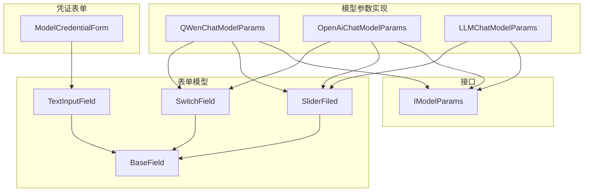
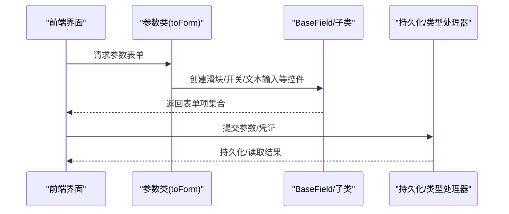
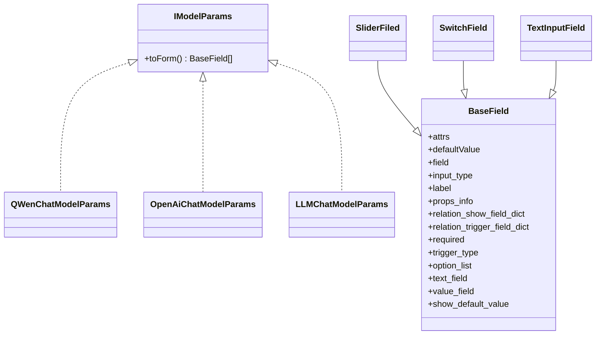
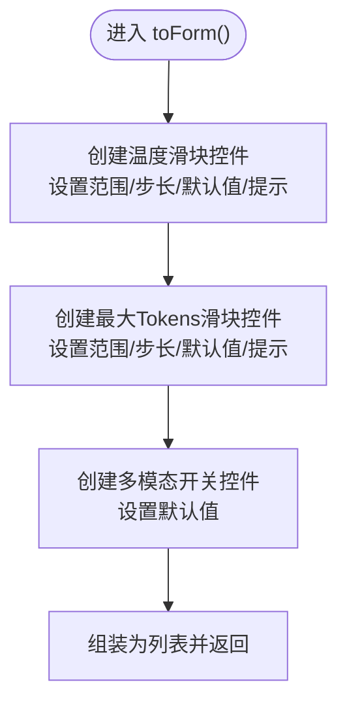
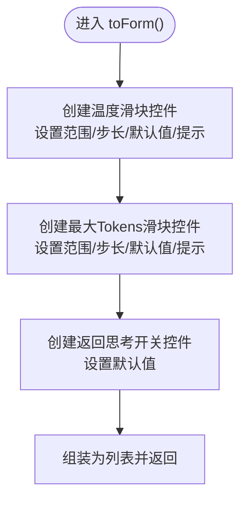
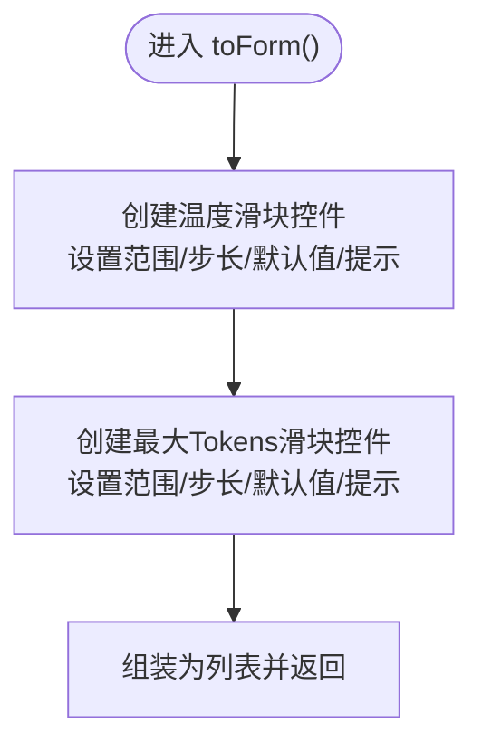
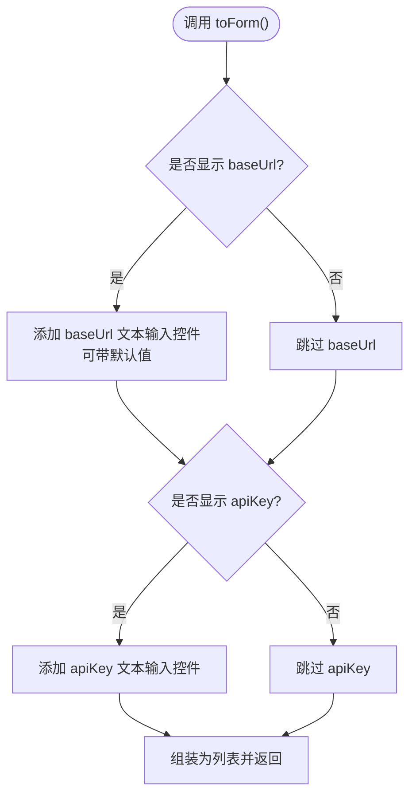
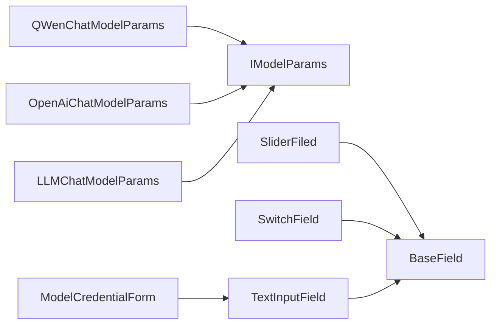

# 参数管理

<cite>
**本文引用的文件**
- [QWenChatModelParams.java](file://maxkb4j-service/maxkb4j-model/src/main/java/com/maxkb4j/model/custom/params/impl/QWenChatModelParams.java)
- [OpenAiChatModelParams.java](file://maxkb4j-service/maxkb4j-model/src/main/java/com/maxkb4j/model/custom/params/impl/OpenAiChatModelParams.java)
- [LLMChatModelParams.java](file://maxkb4j-service/maxkb4j-model/src/main/java/com/maxkb4j/model/custom/params/impl/LLMChatModelParams.java)
- [ModelCredentialForm.java](file://maxkb4j-service/maxkb4j-model/src/main/java/com/maxkb4j/model/custom/credential/ModelCredentialForm.java)
- [IModelParams.java](file://maxkb4j-service-api/maxkb4j-model-api/src/main/java/com/maxkb4j/model/service/IModelParams.java)
- [BaseField.java](file://maxkb4j-common/src/main/java/com/maxkb4j/common/domain/form/BaseField.java)
- [SliderFiled.java](file://maxkb4j-common/src/main/java/com/maxkb4j/common/domain/form/SliderFiled.java)
- [SwitchField.java](file://maxkb4j-common/src/main/java/com/maxkb4j/common/domain/form/SwitchField.java)
- [TextInputField.java](file://maxkb4j-common/src/main/java/com/maxkb4j/common/domain/form/TextInputField.java)
</cite>

## 目录
1. [简介](#简介)
2. [项目结构](#项目结构)
3. [核心组件](#核心组件)
4. [架构总览](#架构总览)
5. [详细组件分析](#详细组件分析)
6. [依赖分析](#依赖分析)
7. [性能考虑](#性能考虑)
8. [故障排查指南](#故障排查指南)
9. [结论](#结论)
10. [附录](#附录)

## 简介
本文件系统性梳理 MaxKB4j 模型参数管理的设计与实现，重点覆盖以下方面：
- 各类模型参数类的结构设计与配置项、默认值设定：如 QWenChatModelParams、OpenAiChatModelParams、LLMChatModelParams 等。
- 凭证表单（ModelCredentialForm）的字段定义、显示控制与默认值策略。
- 参数的序列化/反序列化与动态配置更新机制（基于通用表单模型与类型处理器）。
- 最佳实践与安全注意事项（敏感信息处理、参数校验策略）。

## 项目结构
模型参数与凭证表单位于服务层与公共模块中，采用“接口 + 具体实现 + 表单模型”的分层设计：
- 接口层：IModelParams 定义统一的参数表单生成能力。
- 实现层：各厂商或场景的参数类实现 IModelParams，按需暴露滑块、开关等表单控件。
- 表单模型层：BaseField 及其子类（SliderFiled、SwitchField、TextInputField）描述控件属性、默认值、必填等元信息。
- 凭证表单层：ModelCredentialForm 根据展示需求动态组合 baseUrl 与 apiKey 字段。

图表来源
- [QWenChatModelParams.java:1-26](file://maxkb4j-service/maxkb4j-model/src/main/java/com/maxkb4j/model/custom/params/impl/QWenChatModelParams.java#L1-L26)
- [OpenAiChatModelParams.java:1-22](file://maxkb4j-service/maxkb4j-model/src/main/java/com/maxkb4j/model/custom/params/impl/OpenAiChatModelParams.java#L1-L22)
- [LLMChatModelParams.java:1-20](file://maxkb4j-service/maxkb4j-model/src/main/java/com/maxkb4j/model/custom/params/impl/LLMChatModelParams.java#L1-L20)
- [IModelParams.java:1-12](file://maxkb4j-service-api/maxkb4j-model-api/src/main/java/com/maxkb4j/model/service/IModelParams.java#L1-L12)
- [BaseField.java:1-27](file://maxkb4j-common/src/main/java/com/maxkb4j/common/domain/form/BaseField.java#L1-L27)
- [SliderFiled.java:1-40](file://maxkb4j-common/src/main/java/com/maxkb4j/common/domain/form/SliderFiled.java#L1-L40)
- [SwitchField.java:1-24](file://maxkb4j-common/src/main/java/com/maxkb4j/common/domain/form/SwitchField.java#L1-L24)
- [TextInputField.java:1-35](file://maxkb4j-common/src/main/java/com/maxkb4j/common/domain/form/TextInputField.java#L1-L35)
- [ModelCredentialForm.java:1-38](file://maxkb4j-service/maxkb4j-model/src/main/java/com/maxkb4j/model/custom/credential/ModelCredentialForm.java#L1-L38)

章节来源
- [QWenChatModelParams.java:1-26](file://maxkb4j-service/maxkb4j-model/src/main/java/com/maxkb4j/model/custom/params/impl/QWenChatModelParams.java#L1-L26)
- [OpenAiChatModelParams.java:1-22](file://maxkb4j-service/maxkb4j-model/src/main/java/com/maxkb4j/model/custom/params/impl/OpenAiChatModelParams.java#L1-L22)
- [LLMChatModelParams.java:1-20](file://maxkb4j-service/maxkb4j-model/src/main/java/com/maxkb4j/model/custom/params/impl/LLMChatModelParams.java#L1-L20)
- [ModelCredentialForm.java:1-38](file://maxkb4j-service/maxkb4j-model/src/main/java/com/maxkb4j/model/custom/credential/ModelCredentialForm.java#L1-L38)
- [IModelParams.java:1-12](file://maxkb4j-service-api/maxkb4j-model-api/src/main/java/com/maxkb4j/model/service/IModelParams.java#L1-L12)
- [BaseField.java:1-27](file://maxkb4j-common/src/main/java/com/maxkb4j/common/domain/form/BaseField.java#L1-L27)
- [SliderFiled.java:1-40](file://maxkb4j-common/src/main/java/com/maxkb4j/common/domain/form/SliderFiled.java#L1-L40)
- [SwitchField.java:1-24](file://maxkb4j-common/src/main/java/com/maxkb4j/common/domain/form/SwitchField.java#L1-L24)
- [TextInputField.java:1-35](file://maxkb4j-common/src/main/java/com/maxkb4j/common/domain/form/TextInputField.java#L1-L35)

## 核心组件
- IModelParams：统一的参数表单生成接口，要求实现 toForm() 返回一组 BaseField 描述的表单项。
- BaseField 及其子类：描述表单项的输入类型、标签、默认值、必填、选项列表、联动关系等元数据。
- 具体参数类：以 QWenChatModelParams、OpenAiChatModelParams、LLMChatModelParams 为代表，按模型特性选择 Slider、Switch 等控件并设置默认值。
- 凭证表单 ModelCredentialForm：根据 showBaseUrl/showApiKey 控制显示，支持默认 baseUrl 注入。

章节来源
- [IModelParams.java:1-12](file://maxkb4j-service-api/maxkb4j-model-api/src/main/java/com/maxkb4j/model/service/IModelParams.java#L1-L12)
- [BaseField.java:1-27](file://maxkb4j-common/src/main/java/com/maxkb4j/common/domain/form/BaseField.java#L1-L27)
- [SliderFiled.java:1-40](file://maxkb4j-common/src/main/java/com/maxkb4j/common/domain/form/SliderFiled.java#L1-L40)
- [SwitchField.java:1-24](file://maxkb4j-common/src/main/java/com/maxkb4j/common/domain/form/SwitchField.java#L1-L24)
- [TextInputField.java:1-35](file://maxkb4j-common/src/main/java/com/maxkb4j/common/domain/form/TextInputField.java#L1-L35)
- [QWenChatModelParams.java:1-26](file://maxkb4j-service/maxkb4j-model/src/main/java/com/maxkb4j/model/custom/params/impl/QWenChatModelParams.java#L1-L26)
- [OpenAiChatModelParams.java:1-22](file://maxkb4j-service/maxkb4j-model/src/main/java/com/maxkb4j/model/custom/params/impl/OpenAiChatModelParams.java#L1-L22)
- [LLMChatModelParams.java:1-20](file://maxkb4j-service/maxkb4j-model/src/main/java/com/maxkb4j/model/custom/params/impl/LLMChatModelParams.java#L1-L20)
- [ModelCredentialForm.java:1-38](file://maxkb4j-service/maxkb4j-model/src/main/java/com/maxkb4j/model/custom/credential/ModelCredentialForm.java#L1-L38)

## 架构总览
参数管理采用“接口约束 + 表单模型 + 动态组合”的架构：
- 参数类通过 toForm() 将内部配置映射为 BaseField 列表，供前端渲染与交互。
- 凭证表单根据运行时参数决定是否显示 baseUrl 与 apiKey，并可设置默认值。
- 序列化/反序列化由通用类型处理器负责，确保参数在数据库与业务层之间稳定传递。

图表来源
- [QWenChatModelParams.java:18-24](file://maxkb4j-service/maxkb4j-model/src/main/java/com/maxkb4j/model/custom/params/impl/QWenChatModelParams.java#L18-L24)
- [OpenAiChatModelParams.java:14-20](file://maxkb4j-service/maxkb4j-model/src/main/java/com/maxkb4j/model/custom/params/impl/OpenAiChatModelParams.java#L14-L20)
- [LLMChatModelParams.java:13-17](file://maxkb4j-service/maxkb4j-model/src/main/java/com/maxkb4j/model/custom/params/impl/LLMChatModelParams.java#L13-L17)
- [ModelCredentialForm.java:27-36](file://maxkb4j-service/maxkb4j-model/src/main/java/com/maxkb4j/model/custom/credential/ModelCredentialForm.java#L27-L36)
- [BaseField.java:11-26](file://maxkb4j-common/src/main/java/com/maxkb4j/common/domain/form/BaseField.java#L11-L26)

## 详细组件分析

### 参数接口与表单模型
- IModelParams.toForm()：统一的表单生成入口，返回 List<BaseField>。
- BaseField：承载控件元信息（输入类型、标签、默认值、必填、选项、联动等）。
- SliderFiled：滑块控件，支持最小值、最大值、步长、精度、提示等配置。
- SwitchField：开关控件，用于布尔型参数。
- TextInputField：文本输入控件，支持占位符与默认值。

图表来源
- [IModelParams.java:8-11](file://maxkb4j-service-api/maxkb4j-model-api/src/main/java/com/maxkb4j/model/service/IModelParams.java#L8-L11)
- [BaseField.java:11-26](file://maxkb4j-common/src/main/java/com/maxkb4j/common/domain/form/BaseField.java#L11-L26)
- [SliderFiled.java:9-38](file://maxkb4j-common/src/main/java/com/maxkb4j/common/domain/form/SliderFiled.java#L9-L38)
- [SwitchField.java:5-22](file://maxkb4j-common/src/main/java/com/maxkb4j/common/domain/form/SwitchField.java#L5-L22)
- [TextInputField.java:7-33](file://maxkb4j-common/src/main/java/com/maxkb4j/common/domain/form/TextInputField.java#L7-L33)
- [QWenChatModelParams.java:15-24](file://maxkb4j-service/maxkb4j-model/src/main/java/com/maxkb4j/model/custom/params/impl/QWenChatModelParams.java#L15-L24)
- [OpenAiChatModelParams.java:12-20](file://maxkb4j-service/maxkb4j-model/src/main/java/com/maxkb4j/model/custom/params/impl/OpenAiChatModelParams.java#L12-L20)
- [LLMChatModelParams.java:11-18](file://maxkb4j-service/maxkb4j-model/src/main/java/com/maxkb4j/model/custom/params/impl/LLMChatModelParams.java#L11-L18)

章节来源
- [IModelParams.java:1-12](file://maxkb4j-service-api/maxkb4j-model-api/src/main/java/com/maxkb4j/model/service/IModelParams.java#L1-L12)
- [BaseField.java:1-27](file://maxkb4j-common/src/main/java/com/maxkb4j/common/domain/form/BaseField.java#L1-L27)
- [SliderFiled.java:1-40](file://maxkb4j-common/src/main/java/com/maxkb4j/common/domain/form/SliderFiled.java#L1-L40)
- [SwitchField.java:1-24](file://maxkb4j-common/src/main/java/com/maxkb4j/common/domain/form/SwitchField.java#L1-L24)
- [TextInputField.java:1-35](file://maxkb4j-common/src/main/java/com/maxkb4j/common/domain/form/TextInputField.java#L1-L35)

### QWenChatModelParams 参数设计
- 配置项
  - 温度（Slider）：范围、步长、默认值、提示信息。
  - 输出最大 Tokens（Slider）：范围、步长、默认值、提示信息。
  - 是否为多模态模型（Switch）：布尔开关，默认 false。
- 默认值策略：温度默认值、最大 Tokens 默认值在构造函数中显式设置；多模态开关默认 false。
- 表单生成：toForm() 返回上述三个 BaseField 的有序列表，供前端渲染。

图表来源
- [QWenChatModelParams.java:18-24](file://maxkb4j-service/maxkb4j-model/src/main/java/com/maxkb4j/model/custom/params/impl/QWenChatModelParams.java#L18-L24)
- [SliderFiled.java:12-38](file://maxkb4j-common/src/main/java/com/maxkb4j/common/domain/form/SliderFiled.java#L12-L38)
- [SwitchField.java:7-22](file://maxkb4j-common/src/main/java/com/maxkb4j/common/domain/form/SwitchField.java#L7-L22)

章节来源
- [QWenChatModelParams.java:1-26](file://maxkb4j-service/maxkb4j-model/src/main/java/com/maxkb4j/model/custom/params/impl/QWenChatModelParams.java#L1-L26)

### OpenAiChatModelParams 参数设计
- 配置项
  - 温度（Slider）：范围、步长、默认值、提示信息。
  - 输出最大 Tokens（Slider）：范围、步长、默认值、提示信息。
  - 是否返回思考（Switch）：布尔开关，默认 true。
- 默认值策略：温度与最大 Tokens 默认值在构造函数中显式设置；返回思考默认 true。
- 表单生成：toForm() 返回上述三个 BaseField 的有序列表。

图表来源
- [OpenAiChatModelParams.java:14-20](file://maxkb4j-service/maxkb4j-model/src/main/java/com/maxkb4j/model/custom/params/impl/OpenAiChatModelParams.java#L14-L20)
- [SliderFiled.java:12-38](file://maxkb4j-common/src/main/java/com/maxkb4j/common/domain/form/SliderFiled.java#L12-L38)
- [SwitchField.java:7-22](file://maxkb4j-common/src/main/java/com/maxkb4j/common/domain/form/SwitchField.java#L7-L22)

章节来源
- [OpenAiChatModelParams.java:1-22](file://maxkb4j-service/maxkb4j-model/src/main/java/com/maxkb4j/model/custom/params/impl/OpenAiChatModelParams.java#L1-L22)

### LLMChatModelParams 参数设计
- 配置项
  - 温度（Slider）：范围、步长、默认值、提示信息。
  - 输出最大 Tokens（Slider）：范围、步长、默认值、提示信息。
- 默认值策略：温度与最大 Tokens 默认值在构造函数中显式设置。
- 表单生成：toForm() 返回上述两个 BaseField 的有序列表。

图表来源
- [LLMChatModelParams.java:13-17](file://maxkb4j-service/maxkb4j-model/src/main/java/com/maxkb4j/model/custom/params/impl/LLMChatModelParams.java#L13-L17)
- [SliderFiled.java:12-38](file://maxkb4j-common/src/main/java/com/maxkb4j/common/domain/form/SliderFiled.java#L12-L38)

章节来源
- [LLMChatModelParams.java:1-20](file://maxkb4j-service/maxkb4j-model/src/main/java/com/maxkb4j/model/custom/params/impl/LLMChatModelParams.java#L1-L20)

### 凭证表单 ModelCredentialForm 设计
- 字段定义
  - showBaseUrl：是否显示 baseUrl 输入框。
  - showApiKey：是否显示 apiKey 输入框。
  - defaultBaseUrl：可选的默认 baseUrl。
- 构造方式
  - 两参构造：控制 baseUrl 与 apiKey 显示。
  - 三参构造：强制显示 baseUrl，并注入默认值。
- 表单生成
  - toForm() 根据布尔标志动态添加 TextInputField，分别对应“API 域名”和“API KEY”。

图表来源
- [ModelCredentialForm.java:16-25](file://maxkb4j-service/maxkb4j-model/src/main/java/com/maxkb4j/model/custom/credential/ModelCredentialForm.java#L16-L25)
- [ModelCredentialForm.java:27-36](file://maxkb4j-service/maxkb4j-model/src/main/java/com/maxkb4j/model/custom/credential/ModelCredentialForm.java#L27-L36)
- [TextInputField.java:8-33](file://maxkb4j-common/src/main/java/com/maxkb4j/common/domain/form/TextInputField.java#L8-L33)

章节来源
- [ModelCredentialForm.java:1-38](file://maxkb4j-service/maxkb4j-model/src/main/java/com/maxkb4j/model/custom/credential/ModelCredentialForm.java#L1-L38)
- [TextInputField.java:1-35](file://maxkb4j-common/src/main/java/com/maxkb4j/common/domain/form/TextInputField.java#L1-L35)

## 依赖分析
- 参数类对 IModelParams 的依赖：所有具体参数类均实现 toForm()，形成统一的表单生成协议。
- 表单模型对 BaseField 的继承：SliderFiled、SwitchField、TextInputField 统一扩展 BaseField 的元信息。
- 凭证表单对 BaseField 的依赖：通过 TextInputField 组合出表单项。
- 类间耦合与内聚：参数类与表单模型解耦，仅通过 BaseField 协议交互；凭证表单与参数类无直接耦合，通过各自 toForm() 输出独立的表单集合。

图表来源
- [QWenChatModelParams.java:15-24](file://maxkb4j-service/maxkb4j-model/src/main/java/com/maxkb4j/model/custom/params/impl/QWenChatModelParams.java#L15-L24)
- [OpenAiChatModelParams.java:12-20](file://maxkb4j-service/maxkb4j-model/src/main/java/com/maxkb4j/model/custom/params/impl/OpenAiChatModelParams.java#L12-L20)
- [LLMChatModelParams.java:11-18](file://maxkb4j-service/maxkb4j-model/src/main/java/com/maxkb4j/model/custom/params/impl/LLMChatModelParams.java#L11-L18)
- [IModelParams.java:8-11](file://maxkb4j-service-api/maxkb4j-model-api/src/main/java/com/maxkb4j/model/service/IModelParams.java#L8-L11)
- [SliderFiled.java:9-38](file://maxkb4j-common/src/main/java/com/maxkb4j/common/domain/form/SliderFiled.java#L9-L38)
- [SwitchField.java:5-22](file://maxkb4j-common/src/main/java/com/maxkb4j/common/domain/form/SwitchField.java#L5-L22)
- [TextInputField.java:7-33](file://maxkb4j-common/src/main/java/com/maxkb4j/common/domain/form/TextInputField.java#L7-L33)
- [ModelCredentialForm.java:27-36](file://maxkb4j-service/maxkb4j-model/src/main/java/com/maxkb4j/model/custom/credential/ModelCredentialForm.java#L27-L36)

章节来源
- [QWenChatModelParams.java:1-26](file://maxkb4j-service/maxkb4j-model/src/main/java/com/maxkb4j/model/custom/params/impl/QWenChatModelParams.java#L1-L26)
- [OpenAiChatModelParams.java:1-22](file://maxkb4j-service/maxkb4j-model/src/main/java/com/maxkb4j/model/custom/params/impl/OpenAiChatModelParams.java#L1-L22)
- [LLMChatModelParams.java:1-20](file://maxkb4j-service/maxkb4j-model/src/main/java/com/maxkb4j/model/custom/params/impl/LLMChatModelParams.java#L1-L20)
- [ModelCredentialForm.java:1-38](file://maxkb4j-service/maxkb4j-model/src/main/java/com/maxkb4j/model/custom/credential/ModelCredentialForm.java#L1-L38)
- [IModelParams.java:1-12](file://maxkb4j-service-api/maxkb4j-model-api/src/main/java/com/maxkb4j/model/service/IModelParams.java#L1-L12)
- [BaseField.java:1-27](file://maxkb4j-common/src/main/java/com/maxkb4j/common/domain/form/BaseField.java#L1-L27)
- [SliderFiled.java:1-40](file://maxkb4j-common/src/main/java/com/maxkb4j/common/domain/form/SliderFiled.java#L1-L40)
- [SwitchField.java:1-24](file://maxkb4j-common/src/main/java/com/maxkb4j/common/domain/form/SwitchField.java#L1-L24)
- [TextInputField.java:1-35](file://maxkb4j-common/src/main/java/com/maxkb4j/common/domain/form/TextInputField.java#L1-L35)

## 性能考虑
- 表单构建开销：toForm() 通常在配置加载或页面渲染时触发，建议避免在高频路径重复创建大量 BaseField 对象；可考虑缓存静态表单结构。
- 默认值与校验：滑块控件的默认值与边界值应在构造阶段一次性设置，减少运行期判断成本。
- 前后端交互：表单元信息通过 BaseField 传输，建议保持字段精简，避免冗余元数据导致序列化体积增大。

## 故障排查指南
- 表单字段缺失
  - 现象：前端未显示预期控件。
  - 排查：确认参数类 toForm() 是否正确创建对应 BaseField；检查构造函数中默认值与必填标记。
  - 参考路径：[QWenChatModelParams.java:18-24](file://maxkb4j-service/maxkb4j-model/src/main/java/com/maxkb4j/model/custom/params/impl/QWenChatModelParams.java#L18-L24)、[OpenAiChatModelParams.java:14-20](file://maxkb4j-service/maxkb4j-model/src/main/java/com/maxkb4j/model/custom/params/impl/OpenAiChatModelParams.java#L14-L20)、[LLMChatModelParams.java:13-17](file://maxkb4j-service/maxkb4j-model/src/main/java/com/maxkb4j/model/custom/params/impl/LLMChatModelParams.java#L13-L17)
- 凭证字段不显示
  - 现象：baseUrl 或 apiKey 未出现在表单。
  - 排查：检查 ModelCredentialForm 构造参数与 toForm() 条件分支。
  - 参考路径：[ModelCredentialForm.java:16-25](file://maxkb4j-service/maxkb4j-model/src/main/java/com/maxkb4j/model/custom/credential/ModelCredentialForm.java#L16-L25)、[ModelCredentialForm.java:27-36](file://maxkb4j-service/maxkb4j-model/src/main/java/com/maxkb4j/model/custom/credential/ModelCredentialForm.java#L27-L36)
- 默认值未生效
  - 现象：控件未显示默认值或超出范围。
  - 排查：核对 SliderFiled/SwitchField/TextInputField 的默认值设置与必填标记；确认 BaseField 的 show_default_value。
  - 参考路径：[SliderFiled.java:12-38](file://maxkb4j-common/src/main/java/com/maxkb4j/common/domain/form/SliderFiled.java#L12-L38)、[SwitchField.java:7-22](file://maxkb4j-common/src/main/java/com/maxkb4j/common/domain/form/SwitchField.java#L7-L22)、[TextInputField.java:24-33](file://maxkb4j-common/src/main/java/com/maxkb4j/common/domain/form/TextInputField.java#L24-L33)、[BaseField.java:11-26](file://maxkb4j-common/src/main/java/com/maxkb4j/common/domain/form/BaseField.java#L11-L26)

## 结论
本参数管理系统通过 IModelParams 接口与 BaseField 表单模型，实现了参数与凭证的统一描述与动态渲染。具体参数类与凭证表单以最小耦合的方式协作，既保证了扩展性，又便于前端一致化处理。结合默认值与必填标记，系统在易用性与可控性之间取得平衡。

## 附录
- 序列化/反序列化与动态配置更新
  - 通用做法：将 BaseField 列表序列化为 JSON 存储；读取时反序列化为对象树，再按需渲染到前端。
  - 更新机制：当参数类或凭证表单变更时，重新执行 toForm() 生成新表单结构，前端据此刷新控件。
  - 参考路径：[BaseField.java:11-26](file://maxkb4j-common/src/main/java/com/maxkb4j/common/domain/form/BaseField.java#L11-L26)
- 最佳实践与安全注意事项
  - 敏感信息加密存储：API Key 等敏感字段应加密存储，读取时解密；避免明文落库。
  - 参数校验策略：在 toForm() 中明确必填与默认值，在服务端接收后进行范围与格式二次校验。
  - 版本兼容：新增参数时保留向后兼容字段，避免破坏既有表单结构。