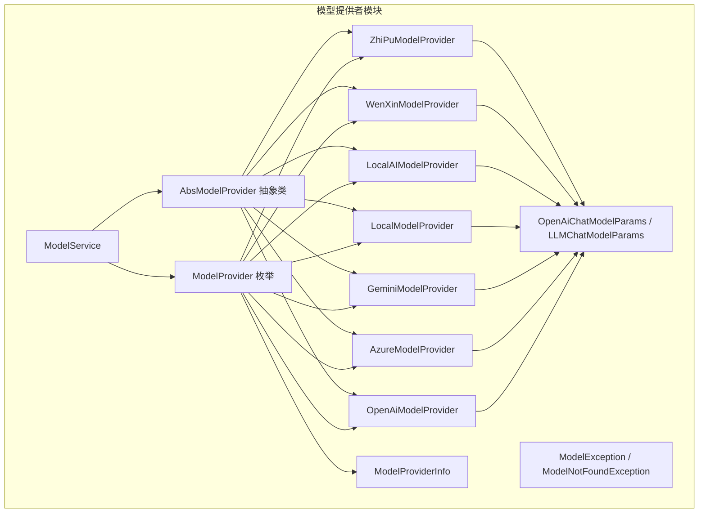
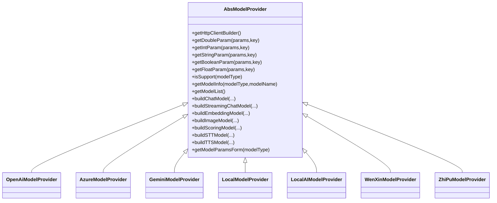
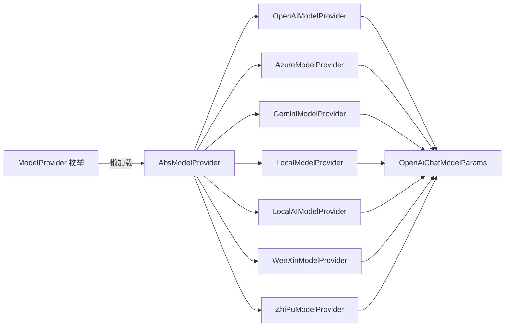
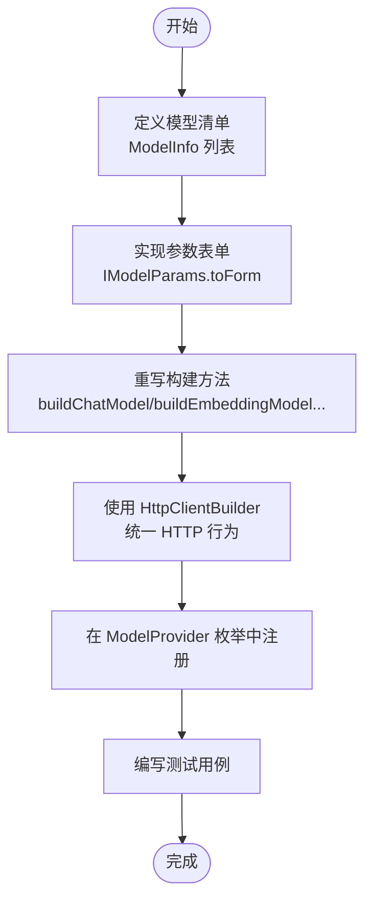

# 模型提供者架构

<cite>
**本文引用的文件**
- [AbsModelProvider.java](file://maxkb4j-service/maxkb4j-model/src/main/java/com/maxkb4j/model/provider/AbsModelProvider.java)
- [OpenAiModelProvider.java](file://maxkb4j-service/maxkb4j-model/src/main/java/com/maxkb4j/model/provider/OpenAiModelProvider.java)
- [AzureModelProvider.java](file://maxkb4j-service/maxkb4j-model/src/main/java/com/maxkb4j/model/provider/AzureModelProvider.java)
- [GeminiModelProvider.java](file://maxkb4j-service/maxkb4j-model/src/main/java/com/maxkb4j/model/provider/GeminiModelProvider.java)
- [LocalModelProvider.java](file://maxkb4j-service/maxkb4j-model/src/main/java/com/maxkb4j/model/provider/LocalModelProvider.java)
- [LocalAIModelProvider.java](file://maxkb4j-service/maxkb4j-model/src/main/java/com/maxkb4j/model/provider/LocalAIModelProvider.java)
- [WenXinModelProvider.java](file://maxkb4j-service/maxkb4j-model/src/main/java/com/maxkb4j/model/provider/WenXinModelProvider.java)
- [ZhiPuModelProvider.java](file://maxkb4j-service/maxkb4j-model/src/main/java/com/maxkb4j/model/provider/ZhiPuModelProvider.java)
- [ModelProvider.java](file://maxkb4j-service/maxkb4j-model/src/main/java/com/maxkb4j/model/enums/ModelProvider.java)
- [ModelProviderInfo.java](file://maxkb4j-service/maxkb4j-model/src/main/java/com/maxkb4j/model/vo/ModelProviderInfo.java)
- [OpenAiChatModelParams.java](file://maxkb4j-service/maxkb4j-model/src/main/java/com/maxkb4j/model/custom/params/impl/OpenAiChatModelParams.java)
- [LLMChatModelParams.java](file://maxkb4j-service/maxkb4j-model/src/main/java/com/maxkb4j/model/custom/params/impl/LLMChatModelParams.java)
- [ModelException.java](file://maxkb4j-service/maxkb4j-model/src/main/java/com/maxkb4j/model/exception/ModelException.java)
- [ModelNotFoundException.java](file://maxkb4j-service/maxkb4j-model/src/main/java/com/maxkb4j/model/exception/ModelNotFoundException.java)
- [ModelService.java](file://maxkb4j-service/maxkb4j-model/src/main/java/com/maxkb4j/model/service/ModelService.java)
</cite>

## 目录
1. [引言](#引言)
2. [项目结构](#项目结构)
3. [核心组件](#核心组件)
4. [架构总览](#架构总览)
5. [详细组件分析](#详细组件分析)
6. [依赖关系分析](#依赖关系分析)
7. [性能考量](#性能考量)
8. [故障排查指南](#故障排查指南)
9. [结论](#结论)
10. [附录：自定义模型提供者开发指南](#附录自定义模型提供者开发指南)

## 引言
本文件系统性解析 MaxKB4j 中“模型提供者”（Model Provider）架构的设计与实现，重点覆盖：
- 抽象基类 AbsModelProvider 的核心接口与扩展机制
- HTTP 客户端构建、参数提取工具方法、模型类型支持检查
- 典型提供者实现策略（OpenAI、Azure、Gemini、本地模型等）
- 认证机制、API 调用封装与错误处理策略
- 自定义模型提供者的开发步骤与集成要点（模型列表、参数表单、实例构建）

## 项目结构
模型提供者位于 maxkb4j-model 模块中，采用“枚举 + 抽象基类 + 具体实现 + VO/异常 + 参数表单”的分层设计：
- 枚举层：ModelProvider 统一注册与懒加载各提供者实例
- 抽象层：AbsModelProvider 定义通用能力与默认行为
- 实现层：各厂商提供者继承抽象类并实现具体构建逻辑
- 配置层：参数表单类 IModelParams 提供统一表单定义
- 视图层：ModelProviderInfo 封装提供者元信息与图标资源
- 异常层：ModelException 及其子类用于模型相关错误

图表来源
- [ModelProvider.java:1-96](file://maxkb4j-service/maxkb4j-model/src/main/java/com/maxkb4j/model/enums/ModelProvider.java#L1-L96)
- [AbsModelProvider.java:1-245](file://maxkb4j-service/maxkb4j-model/src/main/java/com/maxkb4j/model/provider/AbsModelProvider.java#L1-L245)
- [OpenAiModelProvider.java:1-126](file://maxkb4j-service/maxkb4j-model/src/main/java/com/maxkb4j/model/provider/OpenAiModelProvider.java#L1-L126)
- [AzureModelProvider.java:1-78](file://maxkb4j-service/maxkb4j-model/src/main/java/com/maxkb4j/model/provider/AzureModelProvider.java#L1-L78)
- [GeminiModelProvider.java:1-66](file://maxkb4j-service/maxkb4j-model/src/main/java/com/maxkb4j/model/provider/GeminiModelProvider.java#L1-L66)
- [LocalModelProvider.java:1-27](file://maxkb4j-service/maxkb4j-model/src/main/java/com/maxkb4j/model/provider/LocalModelProvider.java#L1-L27)
- [LocalAIModelProvider.java:1-63](file://maxkb4j-service/maxkb4j-model/src/main/java/com/maxkb4j/model/provider/LocalAIModelProvider.java#L1-L63)
- [WenXinModelProvider.java:1-61](file://maxkb4j-service/maxkb4j-model/src/main/java/com/maxkb4j/model/provider/WenXinModelProvider.java#L1-L61)
- [ZhiPuModelProvider.java:1-78](file://maxkb4j-service/maxkb4j-model/src/main/java/com/maxkb4j/model/provider/ZhiPuModelProvider.java#L1-L78)
- [ModelProviderInfo.java:1-44](file://maxkb4j-service/maxkb4j-model/src/main/java/com/maxkb4j/model/vo/ModelProviderInfo.java#L1-L44)
- [OpenAiChatModelParams.java:1-22](file://maxkb4j-service/maxkb4j-model/src/main/java/com/maxkb4j/model/custom/params/impl/OpenAiChatModelParams.java#L1-L22)
- [LLMChatModelParams.java:1-20](file://maxkb4j-service/maxkb4j-model/src/main/java/com/maxkb4j/model/custom/params/impl/LLMChatModelParams.java#L1-L20)
- [ModelException.java:1-12](file://maxkb4j-service/maxkb4j-model/src/main/java/com/maxkb4j/model/exception/ModelException.java#L1-L12)
- [ModelNotFoundException.java:1-12](file://maxkb4j-service/maxkb4j-model/src/main/java/com/maxkb4j/model/exception/ModelNotFoundException.java#L1-L12)
- [ModelService.java:1-174](file://maxkb4j-service/maxkb4j-model/src/main/java/com/maxkb4j/model/service/ModelService.java#L1-L174)

章节来源
- [ModelProvider.java:1-96](file://maxkb4j-service/maxkb4j-model/src/main/java/com/maxkb4j/model/enums/ModelProvider.java#L1-L96)
- [AbsModelProvider.java:1-245](file://maxkb4j-service/maxkb4j-model/src/main/java/com/maxkb4j/model/provider/AbsModelProvider.java#L1-L245)

## 核心组件
- 抽象基类 AbsModelProvider
  - HTTP 客户端构建：提供延迟初始化的 HttpClientBuilder，默认基于 SpringRestClient + HttpComponentsClientHttpRequestFactory
  - 参数提取工具：提供安全获取 Double/Integer/String/Boolean/Float 的工具方法，避免空指针
  - 模型能力：isSupport、getModelInfo、getModelList 等统一接口；未启用的能力默认返回禁用实现
  - 参数表单：统一暴露模型参数表单入口，按模型类型返回对应表单
- 枚举 ModelProvider
  - 统一注册各提供者，使用懒加载与静态缓存避免构造开销
  - 提供静态查询方法与 ModelProviderInfo 包装
- 参数表单
  - IModelParams 接口与具体实现（如 OpenAiChatModelParams、LLMChatModelParams）定义参数字段与校验规则
- 异常体系
  - ModelException 作为根异常；ModelNotFoundException 用于模型未找到场景

章节来源
- [AbsModelProvider.java:36-245](file://maxkb4j-service/maxkb4j-model/src/main/java/com/maxkb4j/model/provider/AbsModelProvider.java#L36-L245)
- [ModelProvider.java:11-96](file://maxkb4j-service/maxkb4j-model/src/main/java/com/maxkb4j/model/enums/ModelProvider.java#L11-L96)
- [OpenAiChatModelParams.java:11-22](file://maxkb4j-service/maxkb4j-model/src/main/java/com/maxkb4j/model/custom/params/impl/OpenAiChatModelParams.java#L11-L22)
- [LLMChatModelParams.java:10-20](file://maxkb4j-service/maxkb4j-model/src/main/java/com/maxkb4j/model/custom/params/impl/LLMChatModelParams.java#L10-L20)
- [ModelException.java:1-12](file://maxkb4j-service/maxkb4j-model/src/main/java/com/maxkb4j/model/exception/ModelException.java#L1-L12)
- [ModelNotFoundException.java:1-12](file://maxkb4j-service/maxkb4j-model/src/main/java/com/maxkb4j/model/exception/ModelNotFoundException.java#L1-L12)

## 架构总览
模型提供者采用“工厂 + 注册表 + 懒加载”的模式：
- 枚举 ModelProvider 作为注册中心，维护提供者名称到实例的映射
- AbsModelProvider 作为抽象工厂，定义统一的构建接口与默认行为
- 各具体提供者仅关注自身 API 差异（认证、URL、参数映射），共享通用能力
- 参数表单与 VO 层解耦业务与展示

图表来源
- [AbsModelProvider.java:36-245](file://maxkb4j-service/maxkb4j-model/src/main/java/com/maxkb4j/model/provider/AbsModelProvider.java#L36-L245)
- [OpenAiModelProvider.java:29-126](file://maxkb4j-service/maxkb4j-model/src/main/java/com/maxkb4j/model/provider/OpenAiModelProvider.java#L29-L126)
- [AzureModelProvider.java:21-78](file://maxkb4j-service/maxkb4j-model/src/main/java/com/maxkb4j/model/provider/AzureModelProvider.java#L21-L78)
- [GeminiModelProvider.java:19-66](file://maxkb4j-service/maxkb4j-model/src/main/java/com/maxkb4j/model/provider/GeminiModelProvider.java#L19-L66)
- [LocalModelProvider.java:11-27](file://maxkb4j-service/maxkb4j-model/src/main/java/com/maxkb4j/model/provider/LocalModelProvider.java#L11-L27)
- [LocalAIModelProvider.java:19-63](file://maxkb4j-service/maxkb4j-model/src/main/java/com/maxkb4j/model/provider/LocalAIModelProvider.java#L19-L63)
- [WenXinModelProvider.java:19-61](file://maxkb4j-service/maxkb4j-model/src/main/java/com/maxkb4j/model/provider/WenXinModelProvider.java#L19-L61)
- [ZhiPuModelProvider.java:21-78](file://maxkb4j-service/maxkb4j-model/src/main/java/com/maxkb4j/model/provider/ZhiPuModelProvider.java#L21-L78)

## 详细组件分析

### 抽象基类 AbsModelProvider
- HTTP 客户端构建
  - 通过 buildHttpClientBuilder 返回 HttpClientBuilder，默认使用 SpringRestClient + HttpComponentsClientHttpRequestFactory
  - 采用双重检查锁定的延迟初始化，避免构造阶段的耗时操作
- 参数提取工具
  - 提供 getDoubleParam/getIntParam/getStringParam/getBooleanParam/getFloatParam，均对空值进行安全处理
- 能力开关与默认实现
  - isSupport 与 getModelInfo 基于 getModelList 进行过滤
  - 未启用的能力（如图像/评分/语音）默认返回禁用实现，确保调用链稳定
- 参数表单
  - getModelParamsForm 根据模型类型返回对应表单；LLM 类型默认返回通用表单

章节来源
- [AbsModelProvider.java:44-115](file://maxkb4j-service/maxkb4j-model/src/main/java/com/maxkb4j/model/provider/AbsModelProvider.java#L44-L115)
- [AbsModelProvider.java:122-147](file://maxkb4j-service/maxkb4j-model/src/main/java/com/maxkb4j/model/provider/AbsModelProvider.java#L122-L147)
- [AbsModelProvider.java:161-229](file://maxkb4j-service/maxkb4j-model/src/main/java/com/maxkb4j/model/provider/AbsModelProvider.java#L161-L229)
- [AbsModelProvider.java:231-242](file://maxkb4j-service/maxkb4j-model/src/main/java/com/maxkb4j/model/provider/AbsModelProvider.java#L231-L242)

### 枚举与注册中心 ModelProvider
- 注册与懒加载
  - 在构造阶段不直接创建实例，通过 createModelProvider 的 switch 分支按需创建
  - 提供 PROVIDER_MAP 静态映射，支持 O(1) 查询
- 信息封装
  - getInfo 返回 ModelProviderInfo，包含提供者标识、名称与图标（SVG 内容）
- 安全查询
  - get 方法对空输入抛出非法参数异常，不存在的提供者返回空

章节来源
- [ModelProvider.java:37-82](file://maxkb4j-service/maxkb4j-model/src/main/java/com/maxkb4j/model/enums/ModelProvider.java#L37-L82)
- [ModelProviderInfo.java:18-41](file://maxkb4j-service/maxkb4j-model/src/main/java/com/maxkb4j/model/vo/ModelProviderInfo.java#L18-L41)

### 参数表单与模型类型支持
- 表单定义
  - OpenAiChatModelParams：温度、最大 Tokens、是否返回思考
  - LLMChatModelParams：温度、最大 Tokens
- 类型支持
  - AbsModelProvider 的 getModelParamsForm 仅在模型类型为 LLM 时返回聊天参数表单

章节来源
- [OpenAiChatModelParams.java:14-20](file://maxkb4j-service/maxkb4j-model/src/main/java/com/maxkb4j/model/custom/params/impl/OpenAiChatModelParams.java#L14-L20)
- [LLMChatModelParams.java:13-17](file://maxkb4j-service/maxkb4j-model/src/main/java/com/maxkb4j/model/custom/params/impl/LLMChatModelParams.java#L13-L17)
- [AbsModelProvider.java:231-242](file://maxkb4j-service/maxkb4j-model/src/main/java/com/maxkb4j/model/provider/AbsModelProvider.java#L231-L242)

### 具体提供者实现策略

#### OpenAI 提供者
- 模型清单：覆盖 LLM、Embedding、Vision、TTI、STT 等多类型
- 认证与基础地址：默认基础地址，支持从凭据覆盖
- 参数映射：温度、最大 Tokens、是否返回思考等
- 特殊能力：STT/TTS 通过自定义模型包装

章节来源
- [OpenAiModelProvider.java:31-43](file://maxkb4j-service/maxkb4j-model/src/main/java/com/maxkb4j/model/provider/OpenAiModelProvider.java#L31-L43)
- [OpenAiModelProvider.java:66-124](file://maxkb4j-service/maxkb4j-model/src/main/java/com/maxkb4j/model/provider/OpenAiModelProvider.java#L66-L124)

#### Azure 提供者
- 模型清单：LLM、Embedding、Vision、TTI
- 认证：使用部署名（deploymentName）替代模型名
- 参数映射：温度、最大 Tokens

章节来源
- [AzureModelProvider.java:23-34](file://maxkb4j-service/maxkb4j-model/src/main/java/com/maxkb4j/model/provider/AzureModelProvider.java#L23-L34)
- [AzureModelProvider.java:43-76](file://maxkb4j-service/maxkb4j-model/src/main/java/com/maxkb4j/model/provider/AzureModelProvider.java#L43-L76)

#### Gemini 提供者
- 模型清单：LLM、Embedding、Vision
- 认证：API Key
- 参数映射：最大输出 Tokens、温度

章节来源
- [GeminiModelProvider.java:21-27](file://maxkb4j-service/maxkb4j-model/src/main/java/com/maxkb4j/model/provider/GeminiModelProvider.java#L21-L27)
- [GeminiModelProvider.java:36-64](file://maxkb4j-service/maxkb4j-model/src/main/java/com/maxkb4j/model/provider/GeminiModelProvider.java#L36-L64)

#### 本地模型提供者
- LocalModelProvider：无内置模型，凭据表单关闭
- LocalAIModelProvider：内置默认基础地址，凭据表单开启

章节来源
- [LocalModelProvider.java:13-24](file://maxkb4j-service/maxkb4j-model/src/main/java/com/maxkb4j/model/provider/LocalModelProvider.java#L13-L24)
- [LocalAIModelProvider.java:21-32](file://maxkb4j-service/maxkb4j-model/src/main/java/com/maxkb4j/model/provider/LocalAIModelProvider.java#L21-L32)
- [LocalAIModelProvider.java:35-61](file://maxkb4j-service/maxkb4j-model/src/main/java/com/maxkb4j/model/provider/LocalAIModelProvider.java#L35-L61)

#### 其他提供者
- WenXinModelProvider：百度文心一言，覆盖 LLM 与 Embedding
- ZhiPuModelProvider：智谱 GLM，覆盖 LLM、Embedding、Vision、TTI

章节来源
- [WenXinModelProvider.java:21-26](file://maxkb4j-service/maxkb4j-model/src/main/java/com/maxkb4j/model/provider/WenXinModelProvider.java#L21-L26)
- [WenXinModelProvider.java:34-59](file://maxkb4j-service/maxkb4j-model/src/main/java/com/maxkb4j/model/provider/WenXinModelProvider.java#L34-L59)
- [ZhiPuModelProvider.java:23-35](file://maxkb4j-service/maxkb4j-model/src/main/java/com/maxkb4j/model/provider/ZhiPuModelProvider.java#L23-L35)
- [ZhiPuModelProvider.java:43-76](file://maxkb4j-service/maxkb4j-model/src/main/java/com/maxkb4j/model/provider/ZhiPuModelProvider.java#L43-L76)

### API 调用封装与错误处理
- API 调用封装
  - 各提供者通过 LangChain4j 的具体模型类（如 OpenAiChatModel、AzureOpenAiChatModel 等）进行封装
  - 默认使用 AbsModelProvider 的 HttpClientBuilder，保证一致的 HTTP 行为
- 错误处理
  - ModelException 作为统一异常根类型
  - ModelNotFoundException 用于模型未找到场景
  - ModelService 在更新模型时对密钥进行掩码处理，保护敏感信息

章节来源
- [ModelException.java:6-12](file://maxkb4j-service/maxkb4j-model/src/main/java/com/maxkb4j/model/exception/ModelException.java#L6-L12)
- [ModelNotFoundException.java:6-12](file://maxkb4j-service/maxkb4j-model/src/main/java/com/maxkb4j/model/exception/ModelNotFoundException.java#L6-L12)
- [ModelService.java:120-131](file://maxkb4j-service/maxkb4j-model/src/main/java/com/maxkb4j/model/service/ModelService.java#L120-L131)

## 依赖关系分析
- 组件耦合
  - ModelProvider 与各提供者之间为“注册表 + 工厂”关系，低耦合高内聚
  - AbsModelProvider 与具体提供者为继承关系，共享通用能力
- 外部依赖
  - HTTP 客户端：SpringRestClient + HttpComponentsClientHttpRequestFactory
  - 模型库：LangChain4j 及其生态（OpenAI、Azure、Gemini、LocalAI、Qianfan、Zhipu 等）
- 循环依赖
  - 未见循环依赖迹象，枚举与提供者之间为单向依赖

图表来源
- [ModelProvider.java:48-67](file://maxkb4j-service/maxkb4j-model/src/main/java/com/maxkb4j/model/enums/ModelProvider.java#L48-L67)
- [AbsModelProvider.java:36-245](file://maxkb4j-service/maxkb4j-model/src/main/java/com/maxkb4j/model/provider/AbsModelProvider.java#L36-L245)
- [OpenAiModelProvider.java:29-126](file://maxkb4j-service/maxkb4j-model/src/main/java/com/maxkb4j/model/provider/OpenAiModelProvider.java#L29-L126)
- [AzureModelProvider.java:21-78](file://maxkb4j-service/maxkb4j-model/src/main/java/com/maxkb4j/model/provider/AzureModelProvider.java#L21-L78)
- [GeminiModelProvider.java:19-66](file://maxkb4j-service/maxkb4j-model/src/main/java/com/maxkb4j/model/provider/GeminiModelProvider.java#L19-L66)
- [LocalModelProvider.java:11-27](file://maxkb4j-service/maxkb4j-model/src/main/java/com/maxkb4j/model/provider/LocalModelProvider.java#L11-L27)
- [LocalAIModelProvider.java:19-63](file://maxkb4j-service/maxkb4j-model/src/main/java/com/maxkb4j/model/provider/LocalAIModelProvider.java#L19-L63)
- [WenXinModelProvider.java:19-61](file://maxkb4j-service/maxkb4j-model/src/main/java/com/maxkb4j/model/provider/WenXinModelProvider.java#L19-L61)
- [ZhiPuModelProvider.java:21-78](file://maxkb4j-service/maxkb4j-model/src/main/java/com/maxkb4j/model/provider/ZhiPuModelProvider.java#L21-L78)
- [OpenAiChatModelParams.java:11-22](file://maxkb4j-service/maxkb4j-model/src/main/java/com/maxkb4j/model/custom/params/impl/OpenAiChatModelParams.java#L11-L22)

## 性能考量
- HTTP 客户端复用
  - 通过延迟初始化与单例 HttpClientBuilder，减少重复创建开销
- 缓存策略
  - ModelService 对模型实体使用 Caffeine 缓存，1 分钟写/访问过期，降低数据库压力
- 参数提取
  - 工具方法统一空值处理，避免分支判断带来的额外成本

章节来源
- [AbsModelProvider.java:44-60](file://maxkb4j-service/maxkb4j-model/src/main/java/com/maxkb4j/model/provider/AbsModelProvider.java#L44-L60)
- [ModelService.java:45-52](file://maxkb4j-service/maxkb4j-model/src/main/java/com/maxkb4j/model/service/ModelService.java#L45-L52)

## 故障排查指南
- 模型未找到
  - 使用 ModelNotFoundException 定位问题，检查模型 ID 与提供者配置
- 凭据问题
  - 更新模型时若密钥被掩码，服务端会保留原密钥，避免误覆盖
- HTTP 调用失败
  - 检查 HttpClientBuilder 是否正确初始化，确认基础地址与 API Key 配置
- 参数映射错误
  - 确认参数表单与实际模型参数一致，必要时扩展 IModelParams 实现

章节来源
- [ModelNotFoundException.java:8-12](file://maxkb4j-service/maxkb4j-model/src/main/java/com/maxkb4j/model/exception/ModelNotFoundException.java#L8-L12)
- [ModelService.java:120-131](file://maxkb4j-service/maxkb4j-model/src/main/java/com/maxkb4j/model/service/ModelService.java#L120-L131)
- [AbsModelProvider.java:44-60](file://maxkb4j-service/maxkb4j-model/src/main/java/com/maxkb4j/model/provider/AbsModelProvider.java#L44-L60)

## 结论
该模型提供者架构以 AbsModelProvider 为核心抽象，结合枚举注册与懒加载机制，实现了对多家模型厂商的统一接入。通过参数表单与默认能力封装，既保证了扩展性，又降低了接入复杂度。建议在新增提供者时遵循现有模式：定义模型清单、实现参数表单、重写必要的构建方法，并在枚举中注册。

## 附录：自定义模型提供者开发指南
- 步骤一：定义模型清单
  - 在提供者类中声明静态 ModelInfo 列表，包含模型名称、显示名称与类型
- 步骤二：实现参数表单
  - 实现 IModelParams.toForm，返回 BaseField 列表，描述温度、最大 Tokens 等参数
- 步骤三：重写构建方法
  - 至少实现 getModelList 与需要的 build*Model 方法（如 buildChatModel、buildEmbeddingModel）
  - 使用 AbsModelProvider 的参数提取工具与 HttpClientBuilder
- 步骤四：注册与测试
  - 在 ModelProvider 枚举中添加条目并完成懒加载
  - 编写单元测试验证模型支持、参数映射与构建流程

图表来源
- [AbsModelProvider.java:44-60](file://maxkb4j-service/maxkb4j-model/src/main/java/com/maxkb4j/model/provider/AbsModelProvider.java#L44-L60)
- [OpenAiChatModelParams.java:14-20](file://maxkb4j-service/maxkb4j-model/src/main/java/com/maxkb4j/model/custom/params/impl/OpenAiChatModelParams.java#L14-L20)
- [ModelProvider.java:48-67](file://maxkb4j-service/maxkb4j-model/src/main/java/com/maxkb4j/model/enums/ModelProvider.java#L48-L67)