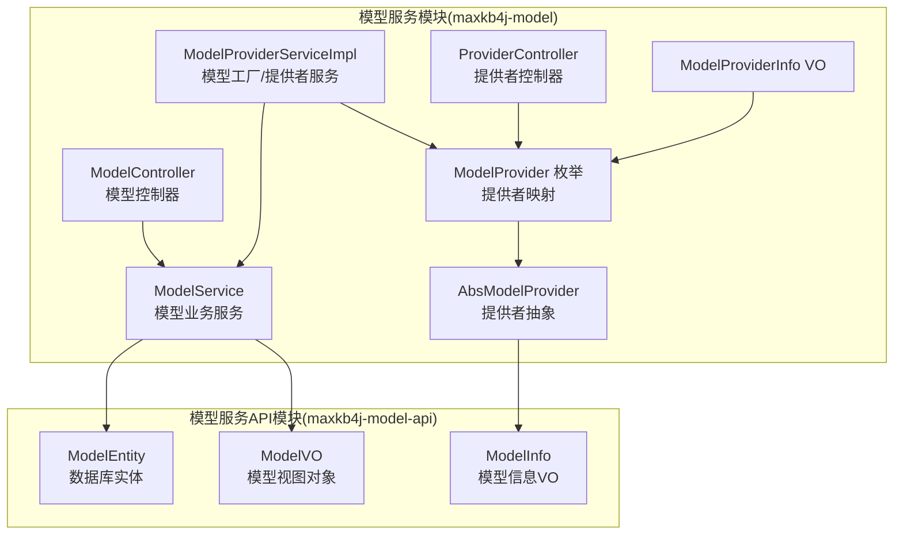
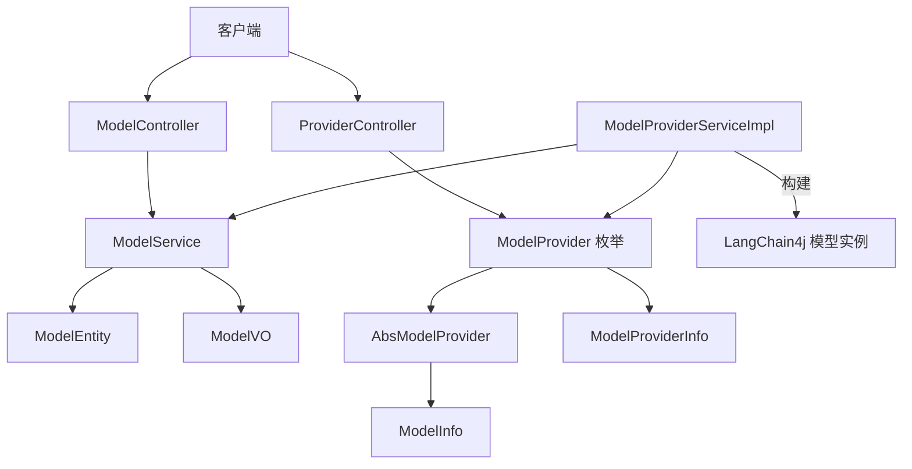
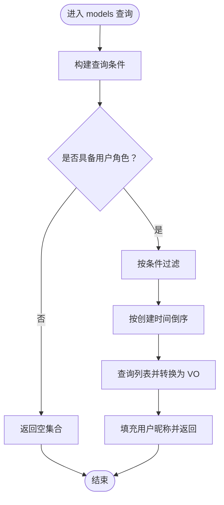
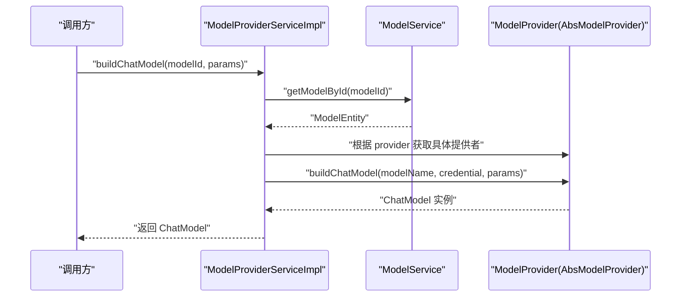
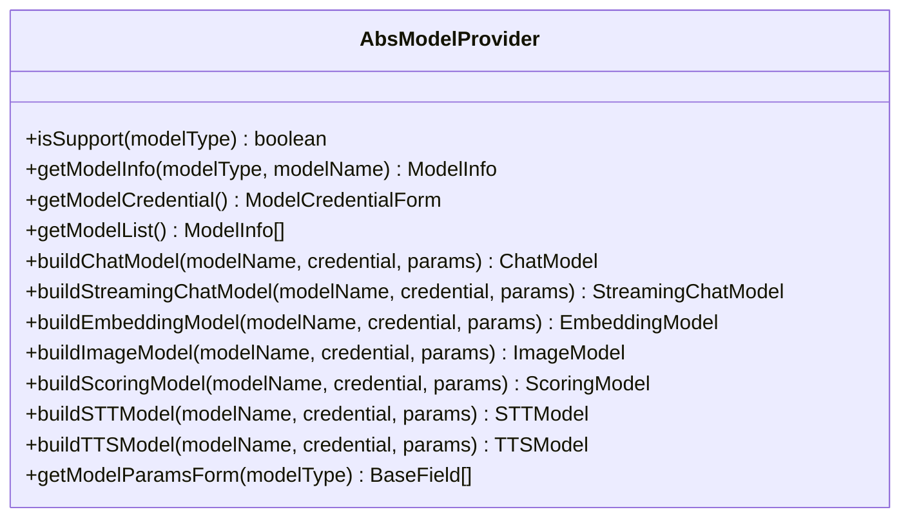
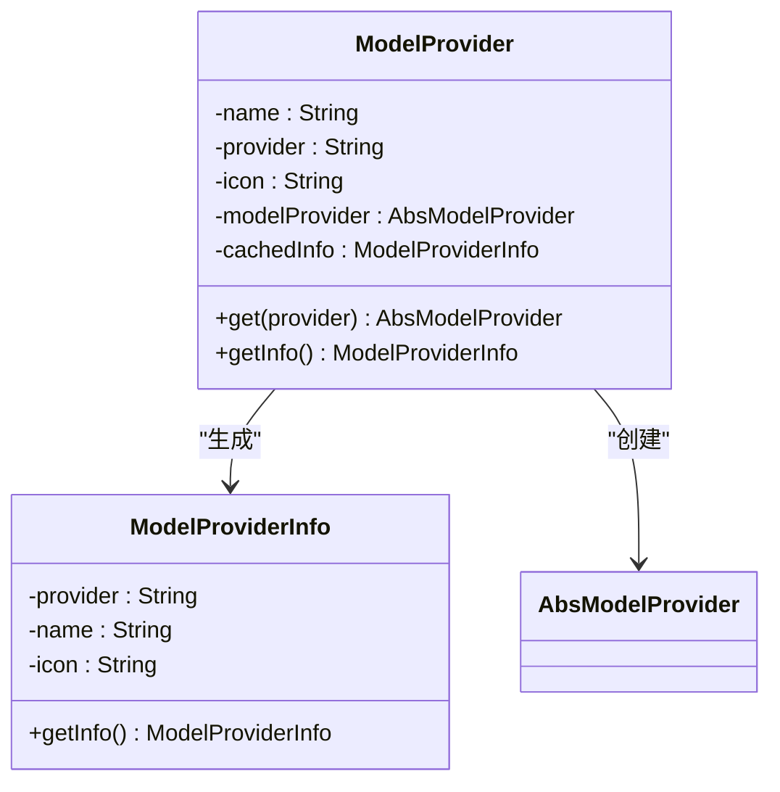
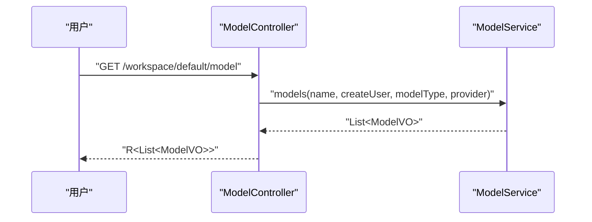
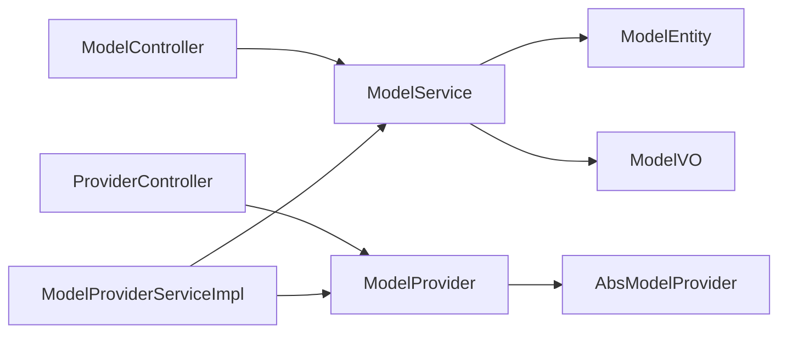

# 模型服务接口

<cite>
**本文引用的文件**
- [ModelService.java](file://maxkb4j-service/maxkb4j-model/src/main/java/com/maxkb4j/model/service/ModelService.java)
- [ModelController.java](file://maxkb4j-service/maxkb4j-model/src/main/java/com/maxkb4j/model/controller/ModelController.java)
- [AbsModelProvider.java](file://maxkb4j-service/maxkb4j-model/src/main/java/com/maxkb4j/model/provider/AbsModelProvider.java)
- [ModelProviderServiceImpl.java](file://maxkb4j-service/maxkb4j-model/src/main/java/com/maxkb4j/model/service/impl/ModelProviderServiceImpl.java)
- [ModelProvider.java](file://maxkb4j-service/maxkb4j-model/src/main/java/com/maxkb4j/model/enums/ModelProvider.java)
- [ModelProviderInfo.java](file://maxkb4j-service/maxkb4j-model/src/main/java/com/maxkb4j/model/vo/ModelProviderInfo.java)
- [ProviderController.java](file://maxkb4j-service/maxkb4j-model/src/main/java/com/maxkb4j/model/controller/ProviderController.java)
- [ModelEntity.java](file://maxkb4j-service-api/maxkb4j-model-api/src/main/java/com/maxkb4j/model/entity/ModelEntity.java)
- [ModelVO.java](file://maxkb4j-service-api/maxkb4j-model-api/src/main/java/com/maxkb4j/model/vo/ModelVO.java)
- [ModelInfo.java](file://maxkb4j-service-api/maxkb4j-model-api/src/main/java/com/maxkb4j/model/vo/ModelInfo.java)
</cite>

## 目录
1. [简介](#简介)
2. [项目结构](#项目结构)
3. [核心组件](#核心组件)
4. [架构总览](#架构总览)
5. [详细组件分析](#详细组件分析)
6. [依赖分析](#依赖分析)
7. [性能考虑](#性能考虑)
8. [故障排查指南](#故障排查指南)
9. [结论](#结论)
10. [附录](#附录)

## 简介
本文件系统性阐述 MaxKB4j 模型服务接口的设计与实现，覆盖统一接口定义、模型操作抽象、参数校验、服务实现与负载均衡策略、REST API 设计与请求处理流程、使用示例、错误处理与性能监控方案，以及 API 版本管理与向后兼容性保障。重点围绕以下模块展开：
- 统一模型服务接口：ModelService 提供模型的查询、创建、更新、删除、凭据访问与缓存等能力
- 模型工厂与提供者：ModelProviderServiceImpl 基于模型 ID 解析具体提供者并构建 LangChain4j 模型实例
- 抽象提供者：AbsModelProvider 定义模型类型支持、参数表单、凭据表单与各类模型构建器
- 控制器层：ModelController 与 ProviderController 提供模型与提供者信息的 REST 接口
- 数据模型：ModelEntity、ModelVO、ModelInfo 映射数据库实体与对外 VO

## 项目结构
模型服务相关代码主要分布在两个子模块：
- maxkb4j-model：包含服务实现、控制器、提供者抽象与枚举
- maxkb4j-model-api：包含数据模型与 VO 的 API 定义

**图表来源**
- [ModelService.java:40-174](file://maxkb4j-service/maxkb4j-model/src/main/java/com/maxkb4j/model/service/ModelService.java#L40-L174)
- [ModelProviderServiceImpl.java:29-131](file://maxkb4j-service/maxkb4j-model/src/main/java/com/maxkb4j/model/service/impl/ModelProviderServiceImpl.java#L29-L131)
- [AbsModelProvider.java:36-245](file://maxkb4j-service/maxkb4j-model/src/main/java/com/maxkb4j/model/provider/AbsModelProvider.java#L36-L245)
- [ModelController.java:24-86](file://maxkb4j-service/maxkb4j-model/src/main/java/com/maxkb4j/model/controller/ModelController.java#L24-L86)
- [ProviderController.java:29-89](file://maxkb4j-service/maxkb4j-model/src/main/java/com/maxkb4j/model/controller/ProviderController.java#L29-L89)
- [ModelProvider.java:11-96](file://maxkb4j-service/maxkb4j-model/src/main/java/com/maxkb4j/model/enums/ModelProvider.java#L11-L96)
- [ModelProviderInfo.java:12-44](file://maxkb4j-service/maxkb4j-model/src/main/java/com/maxkb4j/model/vo/ModelProviderInfo.java#L12-L44)
- [ModelEntity.java:21-44](file://maxkb4j-service-api/maxkb4j-model-api/src/main/java/com/maxkb4j/model/entity/ModelEntity.java#L21-L44)
- [ModelVO.java:9-12](file://maxkb4j-service-api/maxkb4j-model-api/src/main/java/com/maxkb4j/model/vo/ModelVO.java#L9-L12)
- [ModelInfo.java:9-34](file://maxkb4j-service-api/maxkb4j-model-api/src/main/java/com/maxkb4j/model/vo/ModelInfo.java#L9-L34)

**章节来源**
- [ModelService.java:40-174](file://maxkb4j-service/maxkb4j-model/src/main/java/com/maxkb4j/model/service/ModelService.java#L40-L174)
- [ModelProviderServiceImpl.java:29-131](file://maxkb4j-service/maxkb4j-model/src/main/java/com/maxkb4j/model/service/impl/ModelProviderServiceImpl.java#L29-L131)
- [AbsModelProvider.java:36-245](file://maxkb4j-service/maxkb4j-model/src/main/java/com/maxkb4j/model/provider/AbsModelProvider.java#L36-L245)
- [ModelController.java:24-86](file://maxkb4j-service/maxkb4j-model/src/main/java/com/maxkb4j/model/controller/ModelController.java#L24-L86)
- [ProviderController.java:29-89](file://maxkb4j-service/maxkb4j-model/src/main/java/com/maxkb4j/model/controller/ProviderController.java#L29-L89)
- [ModelProvider.java:11-96](file://maxkb4j-service/maxkb4j-model/src/main/java/com/maxkb4j/model/enums/ModelProvider.java#L11-L96)
- [ModelProviderInfo.java:12-44](file://maxkb4j-service/maxkb4j-model/src/main/java/com/maxkb4j/model/vo/ModelProviderInfo.java#L12-L44)
- [ModelEntity.java:21-44](file://maxkb4j-service-api/maxkb4j-model-api/src/main/java/com/maxkb4j/model/entity/ModelEntity.java#L21-L44)
- [ModelVO.java:9-12](file://maxkb4j-service-api/maxkb4j-model-api/src/main/java/com/maxkb4j/model/vo/ModelVO.java#L9-L12)
- [ModelInfo.java:9-34](file://maxkb4j-service-api/maxkb4j-model-api/src/main/java/com/maxkb4j/model/vo/ModelInfo.java#L9-L34)

## 核心组件
- 统一模型服务接口：ModelService
  - 支持按条件筛选模型列表、创建模型、更新模型、删除模型、获取模型详情与凭据、带缓存的模型查询
  - 内置基于 Caffeine 的本地缓存，提升模型查询性能
- 模型工厂与提供者服务：ModelProviderServiceImpl
  - 根据模型 ID 获取模型实体与对应提供者，构建 LangChain4j 的 Chat、StreamingChat、Embedding、Image、Scoring、TTS、STT 模型实例
  - 提供异常处理：模型不存在、提供者缺失
- 抽象提供者：AbsModelProvider
  - 定义模型类型支持判断、模型清单、凭据与参数表单、各类模型构建器（默认禁用实现）
- 提供者枚举与信息：ModelProvider、ModelProviderInfo
  - 枚举维护提供者名称、标识与图标，并延迟创建具体提供者实例
  - 预加载 SVG 图标到内存，减少运行时 IO
- 控制器层：ModelController、ProviderController
  - 提供模型的增删改查、参数表单管理与提供者信息查询
  - 基于权限注解进行访问控制

**章节来源**
- [ModelService.java:40-174](file://maxkb4j-service/maxkb4j-model/src/main/java/com/maxkb4j/model/service/ModelService.java#L40-L174)
- [ModelProviderServiceImpl.java:29-131](file://maxkb4j-service/maxkb4j-model/src/main/java/com/maxkb4j/model/service/impl/ModelProviderServiceImpl.java#L29-L131)
- [AbsModelProvider.java:36-245](file://maxkb4j-service/maxkb4j-model/src/main/java/com/maxkb4j/model/provider/AbsModelProvider.java#L36-L245)
- [ModelProvider.java:11-96](file://maxkb4j-service/maxkb4j-model/src/main/java/com/maxkb4j/model/enums/ModelProvider.java#L11-L96)
- [ModelProviderInfo.java:12-44](file://maxkb4j-service/maxkb4j-model/src/main/java/com/maxkb4j/model/vo/ModelProviderInfo.java#L12-L44)
- [ModelController.java:24-86](file://maxkb4j-service/maxkb4j-model/src/main/java/com/maxkb4j/model/controller/ModelController.java#L24-L86)
- [ProviderController.java:29-89](file://maxkb4j-service/maxkb4j-model/src/main/java/com/maxkb4j/model/controller/ProviderController.java#L29-L89)

## 架构总览
模型服务采用“控制器-服务-提供者”分层架构，结合枚举与工厂模式实现多提供者统一接入与实例化。

**图表来源**
- [ModelController.java:24-86](file://maxkb4j-service/maxkb4j-model/src/main/java/com/maxkb4j/model/controller/ModelController.java#L24-L86)
- [ProviderController.java:29-89](file://maxkb4j-service/maxkb4j-model/src/main/java/com/maxkb4j/model/controller/ProviderController.java#L29-L89)
- [ModelService.java:40-174](file://maxkb4j-service/maxkb4j-model/src/main/java/com/maxkb4j/model/service/ModelService.java#L40-L174)
- [ModelProviderServiceImpl.java:29-131](file://maxkb4j-service/maxkb4j-model/src/main/java/com/maxkb4j/model/service/impl/ModelProviderServiceImpl.java#L29-L131)
- [ModelProvider.java:11-96](file://maxkb4j-service/maxkb4j-model/src/main/java/com/maxkb4j/model/enums/ModelProvider.java#L11-L96)
- [AbsModelProvider.java:36-245](file://maxkb4j-service/maxkb4j-model/src/main/java/com/maxkb4j/model/provider/AbsModelProvider.java#L36-L245)
- [ModelEntity.java:21-44](file://maxkb4j-service-api/maxkb4j-model-api/src/main/java/com/maxkb4j/model/entity/ModelEntity.java#L21-L44)
- [ModelVO.java:9-12](file://maxkb4j-service-api/maxkb4j-model-api/src/main/java/com/maxkb4j/model/vo/ModelVO.java#L9-L12)
- [ModelInfo.java:9-34](file://maxkb4j-service-api/maxkb4j-model-api/src/main/java/com/maxkb4j/model/vo/ModelInfo.java#L9-L34)
- [ModelProviderInfo.java:12-44](file://maxkb4j-service/maxkb4j-model/src/main/java/com/maxkb4j/model/vo/ModelProviderInfo.java#L12-L44)

## 详细组件分析

### 统一模型服务接口：ModelService
职责与能力
- 列表查询：支持按名称、创建人、模型类型、提供者过滤，排序并返回 VO 列表；对普通用户进行资源授权限制
- 创建模型：校验名称唯一性，填充默认字段与状态，持久化并建立所有权授权
- 更新模型：支持凭据安全更新（保留密钥掩码逻辑），并失效本地缓存
- 删除模型：移除授权并删除记录
- 查询详情：返回模型信息并对当前用户隐藏敏感凭据
- 凭据访问：仅对当前用户可见真实凭据
- 缓存优化：基于 Caffeine 的本地缓存，按 ID 查询常用字段，提升性能

复杂度与性能
- 查询：基于 MyBatis Plus 条件构造，时间复杂度 O(n) 遍历结果集；缓存命中为 O(1)
- 更新/删除：单条记录操作，时间复杂度 O(1)
- 缓存：最大容量与过期策略平衡内存占用与命中率

错误处理
- 名称冲突抛出业务异常
- 权限不足返回空集或拒绝访问

**图表来源**
- [ModelService.java:54-101](file://maxkb4j-service/maxkb4j-model/src/main/java/com/maxkb4j/model/service/ModelService.java#L54-L101)

**章节来源**
- [ModelService.java:40-174](file://maxkb4j-service/maxkb4j-model/src/main/java/com/maxkb4j/model/service/ModelService.java#L40-L174)
- [ModelEntity.java:21-44](file://maxkb4j-service-api/maxkb4j-model-api/src/main/java/com/maxkb4j/model/entity/ModelEntity.java#L21-L44)
- [ModelVO.java:9-12](file://maxkb4j-service-api/maxkb4j-model-api/src/main/java/com/maxkb4j/model/vo/ModelVO.java#L9-L12)

### 模型工厂与提供者服务：ModelProviderServiceImpl
职责与能力
- 根据模型 ID 获取模型实体与对应提供者
- 构建多种 LangChain4j 模型实例：Chat、StreamingChat、Embedding、Image、Scoring、TTS、STT
- 参数透传与默认值处理
- 异常处理：模型不存在、提供者缺失

**图表来源**
- [ModelProviderServiceImpl.java:33-44](file://maxkb4j-service/maxkb4j-model/src/main/java/com/maxkb4j/model/service/impl/ModelProviderServiceImpl.java#L33-L44)
- [ModelService.java:164-172](file://maxkb4j-service/maxkb4j-model/src/main/java/com/maxkb4j/model/service/ModelService.java#L164-L172)
- [AbsModelProvider.java:161-163](file://maxkb4j-service/maxkb4j-model/src/main/java/com/maxkb4j/model/provider/AbsModelProvider.java#L161-L163)

**章节来源**
- [ModelProviderServiceImpl.java:29-131](file://maxkb4j-service/maxkb4j-model/src/main/java/com/maxkb4j/model/service/impl/ModelProviderServiceImpl.java#L29-L131)
- [ModelService.java:164-172](file://maxkb4j-service/maxkb4j-model/src/main/java/com/maxkb4j/model/service/ModelService.java#L164-L172)
- [AbsModelProvider.java:161-163](file://maxkb4j-service/maxkb4j-model/src/main/java/com/maxkb4j/model/provider/AbsModelProvider.java#L161-L163)

### 抽象提供者：AbsModelProvider
职责与能力
- 定义模型类型支持判断与模型清单查询
- 提供凭据表单与参数表单的默认实现
- 提供各类模型构建器，默认返回禁用实现以确保安全

**图表来源**
- [AbsModelProvider.java:36-245](file://maxkb4j-service/maxkb4j-model/src/main/java/com/maxkb4j/model/provider/AbsModelProvider.java#L36-L245)

**章节来源**
- [AbsModelProvider.java:36-245](file://maxkb4j-service/maxkb4j-model/src/main/java/com/maxkb4j/model/provider/AbsModelProvider.java#L36-L245)

### 提供者枚举与信息：ModelProvider、ModelProviderInfo
职责与能力
- ModelProvider：枚举所有提供者，延迟创建具体提供者实例，提供静态映射与信息获取
- ModelProviderInfo：封装提供者名称、标识与图标，启动时预加载 SVG 图标

**图表来源**
- [ModelProvider.java:11-96](file://maxkb4j-service/maxkb4j-model/src/main/java/com/maxkb4j/model/enums/ModelProvider.java#L11-L96)
- [ModelProviderInfo.java:12-44](file://maxkb4j-service/maxkb4j-model/src/main/java/com/maxkb4j/model/vo/ModelProviderInfo.java#L12-L44)

**章节来源**
- [ModelProvider.java:11-96](file://maxkb4j-service/maxkb4j-model/src/main/java/com/maxkb4j/model/enums/ModelProvider.java#L11-L96)
- [ModelProviderInfo.java:12-44](file://maxkb4j-service/maxkb4j-model/src/main/java/com/maxkb4j/model/vo/ModelProviderInfo.java#L12-L44)

### 控制器层：ModelController 与 ProviderController
职责与能力
- ModelController：提供模型的增删改查、参数表单管理、凭据访问与列表聚合
- ProviderController：提供模型提供者列表、模型类型列表、参数表单、模型清单等查询接口

**图表来源**
- [ModelController.java:35-39](file://maxkb4j-service/maxkb4j-model/src/main/java/com/maxkb4j/model/controller/ModelController.java#L35-L39)
- [ModelService.java:54-101](file://maxkb4j-service/maxkb4j-model/src/main/java/com/maxkb4j/model/service/ModelService.java#L54-L101)

**章节来源**
- [ModelController.java:24-86](file://maxkb4j-service/maxkb4j-model/src/main/java/com/maxkb4j/model/controller/ModelController.java#L24-L86)
- [ProviderController.java:29-89](file://maxkb4j-service/maxkb4j-model/src/main/java/com/maxkb4j/model/controller/ProviderController.java#L29-L89)

## 依赖分析
- 组件耦合
  - ModelController 依赖 ModelService
  - ModelProviderServiceImpl 依赖 ModelService 与 ModelProvider 枚举
  - ProviderController 依赖 ModelProvider 枚举与 AbsModelProvider
  - ModelService 依赖 ModelEntity、ModelVO、用户服务与权限服务
- 外部依赖
  - LangChain4j 模型接口用于构建不同类型的模型实例
  - Caffeine 用于本地缓存
  - MyBatis Plus 用于数据访问

**图表来源**
- [ModelController.java:24-86](file://maxkb4j-service/maxkb4j-model/src/main/java/com/maxkb4j/model/controller/ModelController.java#L24-L86)
- [ModelService.java:40-174](file://maxkb4j-service/maxkb4j-model/src/main/java/com/maxkb4j/model/service/ModelService.java#L40-L174)
- [ModelProviderServiceImpl.java:29-131](file://maxkb4j-service/maxkb4j-model/src/main/java/com/maxkb4j/model/service/impl/ModelProviderServiceImpl.java#L29-L131)
- [ModelProvider.java:11-96](file://maxkb4j-service/maxkb4j-model/src/main/java/com/maxkb4j/model/enums/ModelProvider.java#L11-L96)
- [AbsModelProvider.java:36-245](file://maxkb4j-service/maxkb4j-model/src/main/java/com/maxkb4j/model/provider/AbsModelProvider.java#L36-L245)
- [ModelEntity.java:21-44](file://maxkb4j-service-api/maxkb4j-model-api/src/main/java/com/maxkb4j/model/entity/ModelEntity.java#L21-L44)
- [ModelVO.java:9-12](file://maxkb4j-service-api/maxkb4j-model-api/src/main/java/com/maxkb4j/model/vo/ModelVO.java#L9-L12)

**章节来源**
- [ModelController.java:24-86](file://maxkb4j-service/maxkb4j-model/src/main/java/com/maxkb4j/model/controller/ModelController.java#L24-L86)
- [ModelService.java:40-174](file://maxkb4j-service/maxkb4j-model/src/main/java/com/maxkb4j/model/service/ModelService.java#L40-L174)
- [ModelProviderServiceImpl.java:29-131](file://maxkb4j-service/maxkb4j-model/src/main/java/com/maxkb4j/model/service/impl/ModelProviderServiceImpl.java#L29-L131)
- [ModelProvider.java:11-96](file://maxkb4j-service/maxkb4j-model/src/main/java/com/maxkb4j/model/enums/ModelProvider.java#L11-L96)
- [AbsModelProvider.java:36-245](file://maxkb4j-service/maxkb4j-model/src/main/java/com/maxkb4j/model/provider/AbsModelProvider.java#L36-L245)
- [ModelEntity.java:21-44](file://maxkb4j-service-api/maxkb4j-model-api/src/main/java/com/maxkb4j/model/entity/ModelEntity.java#L21-L44)
- [ModelVO.java:9-12](file://maxkb4j-service-api/maxkb4j-model-api/src/main/java/com/maxkb4j/model/vo/ModelVO.java#L9-L12)

## 性能考虑
- 缓存策略：ModelService 使用 Caffeine 缓存模型实体，键为模型 ID，超时策略为写入与访问后过期，容量上限与初始容量平衡内存占用与命中率
- 查询优化：列表查询使用条件构造器与排序，避免全表扫描；对普通用户进行授权过滤，减少无效数据传输
- 构建优化：ModelProviderServiceImpl 在构建模型前先解析提供者，避免重复查找；提供者实例通过枚举延迟创建，降低启动成本
- IO 优化：ProviderInfo 启动时预加载 SVG 图标，运行时直接从内存读取

[本节为通用性能建议，无需特定文件来源]

## 故障排查指南
常见问题与定位
- 模型未找到：检查模型 ID 是否为空、是否存在；查看日志中“Model not found”提示
- 提供者缺失：确认模型的 provider 字段是否正确，枚举中是否存在该提供者
- 权限不足：普通用户只能看到授权范围内的模型；检查用户角色与资源授权
- 凭据安全：更新模型时若使用掩码密钥，需确保 baseUrl 正确传递

定位步骤
- 控制器层：确认请求路径与权限注解是否匹配
- 服务层：检查 ModelService 的查询条件与缓存失效逻辑
- 工厂层：确认 ModelProviderServiceImpl 的模型解析与提供者获取流程

**章节来源**
- [ModelProviderServiceImpl.java:103-113](file://maxkb4j-service/maxkb4j-model/src/main/java/com/maxkb4j/model/service/impl/ModelProviderServiceImpl.java#L103-L113)
- [ModelService.java:120-131](file://maxkb4j-service/maxkb4j-model/src/main/java/com/maxkb4j/model/service/ModelService.java#L120-L131)

## 结论
本模型服务接口通过统一的 ModelService、可扩展的 AbsModelProvider 与集中式枚举管理，实现了多提供者模型的统一接入与实例化。控制器层提供完善的 REST API，涵盖模型生命周期管理与提供者信息查询。配合本地缓存与延迟初始化策略，整体在易用性与性能之间取得良好平衡。后续可在提供者扩展点增加负载均衡与熔断降级策略，进一步增强稳定性与弹性。

[本节为总结性内容，无需特定文件来源]

## 附录

### 使用示例（路径指引）
- 获取模型列表
  - 请求：GET /api/admin/workspace/default/model
  - 参数：name、createUser、modelType、provider
  - 返回：R<List<ModelVO>>
  - 参考：[ModelController.java:35-39](file://maxkb4j-service/maxkb4j-model/src/main/java/com/maxkb4j/model/controller/ModelController.java#L35-L39)
- 创建模型
  - 请求：POST /api/admin/workspace/default/model
  - 参数：ModelEntity
  - 返回：R<Boolean>
  - 参考：[ModelController.java:28-32](file://maxkb4j-service/maxkb4j-model/src/main/java/com/maxkb4j/model/controller/ModelController.java#L28-L32)
- 更新模型参数表单
  - 请求：PUT /api/admin/workspace/default/model/{id}/model_params_form
  - 参数：JSONArray
  - 返回：R<JSONArray>
  - 参考：[ModelController.java:76-84](file://maxkb4j-service/maxkb4j-model/src/main/java/com/maxkb4j/model/controller/ModelController.java#L76-L84)
- 获取提供者列表
  - 请求：GET /api/admin/provider
  - 参数：modelType（可选）
  - 返回：R<List<ModelProviderInfo>>
  - 参考：[ProviderController.java:31-42](file://maxkb4j-service/maxkb4j-model/src/main/java/com/maxkb4j/model/controller/ProviderController.java#L31-L42)
- 获取模型参数表单
  - 请求：GET /api/admin/provider/model_params_form
  - 参数：provider、modelType、modelName
  - 返回：R<List<BaseField>>
  - 参考：[ProviderController.java:62-73](file://maxkb4j-service/maxkb4j-model/src/main/java/com/maxkb4j/model/controller/ProviderController.java#L62-L73)

### 错误处理与异常
- 模型不存在：抛出 ModelNotFoundException 并记录日志
- 提供者缺失：抛出 IllegalStateException
- 权限不足：普通用户无权访问时返回空集合或拒绝访问
- 名称冲突：创建模型时抛出业务异常

**章节来源**
- [ModelProviderServiceImpl.java:103-113](file://maxkb4j-service/maxkb4j-model/src/main/java/com/maxkb4j/model/service/impl/ModelProviderServiceImpl.java#L103-L113)
- [ModelService.java:104-109](file://maxkb4j-service/maxkb4j-model/src/main/java/com/maxkb4j/model/service/ModelService.java#L104-L109)

### 性能监控方案
- 缓存命中率：监控 Caffeine 的命中率与过期统计
- 数据库查询：记录列表查询的执行时间与条件过滤效果
- 模型构建：记录不同提供者的构建耗时与失败率
- 日志审计：记录模型操作的关键事件与异常堆栈

[本节为通用监控建议，无需特定文件来源]

### API 版本管理与向后兼容
- 命名规范：接口路径采用 /api/admin 前缀，便于未来扩展 /v1、/v2
- 兼容策略：新增字段采用可选参数与默认值，避免破坏既有调用
- 迁移路径：提供参数表单与模型清单接口，辅助前端适配新旧字段

[本节为通用版本管理建议，无需特定文件来源]