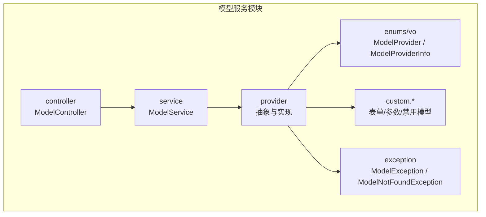
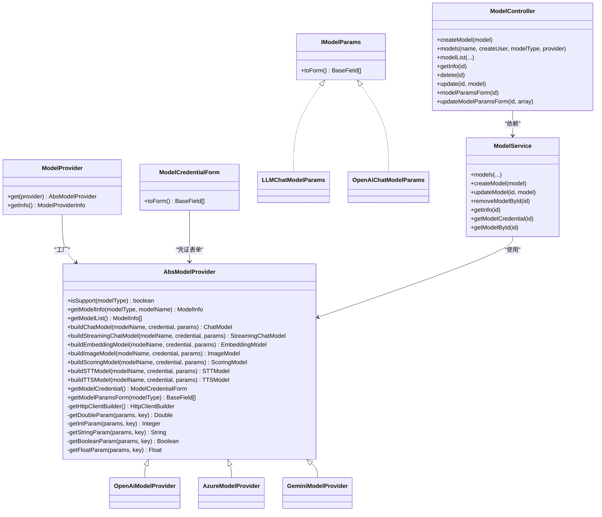
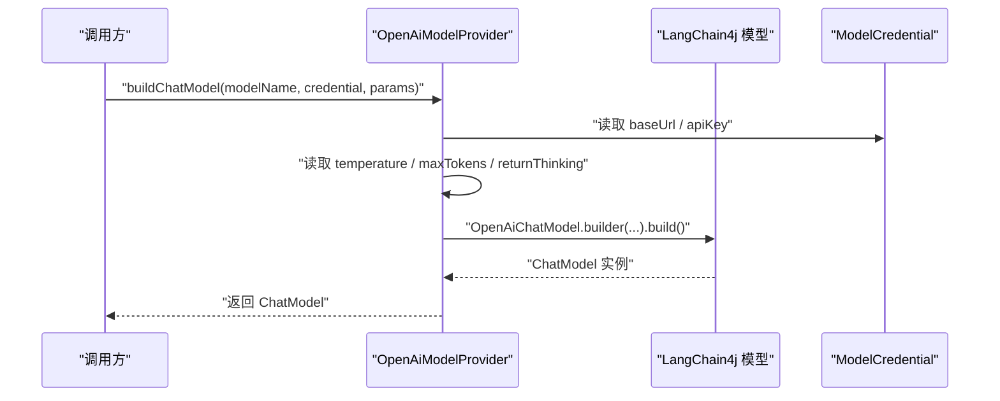
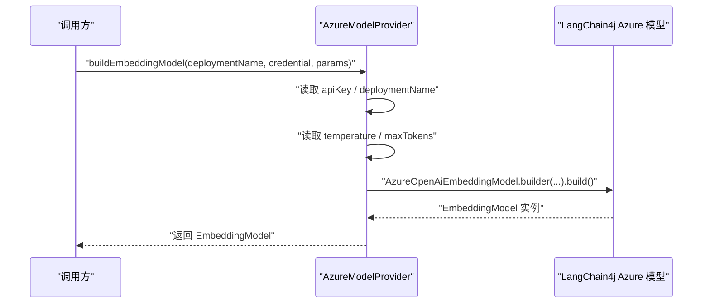
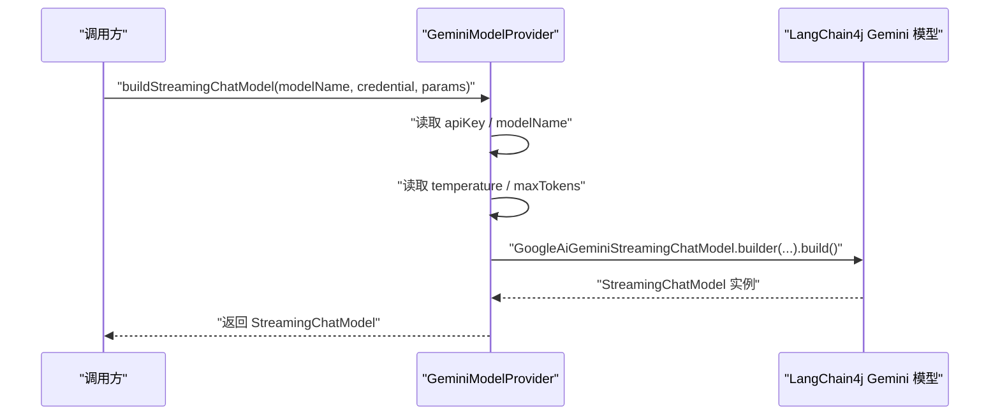
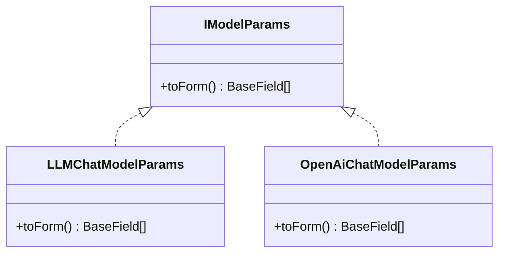
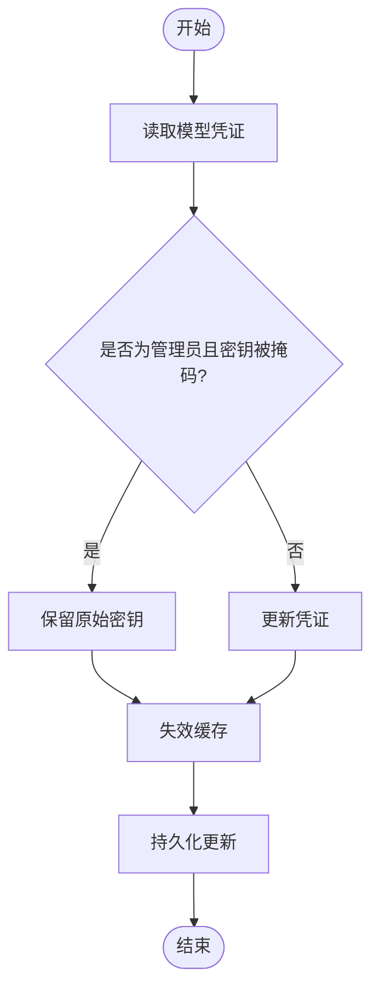
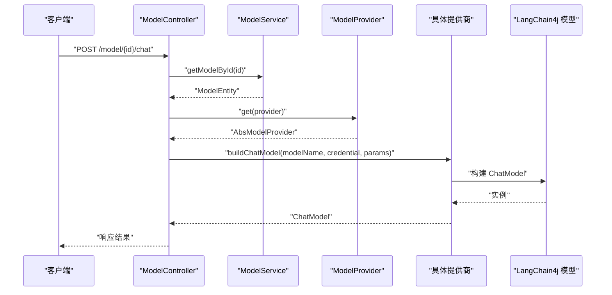
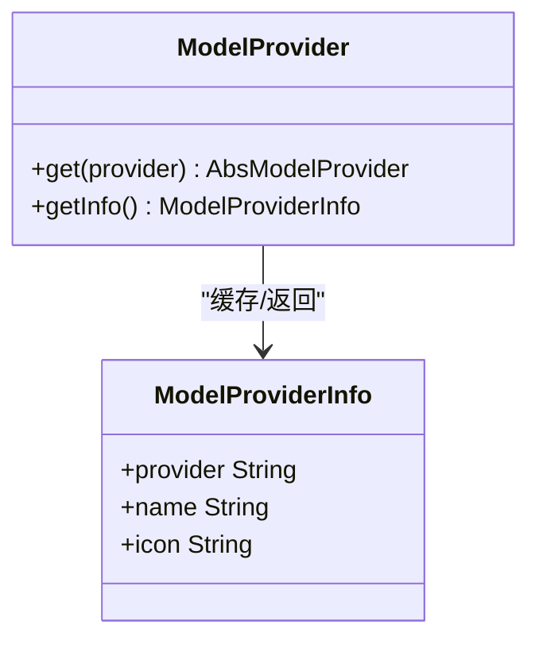
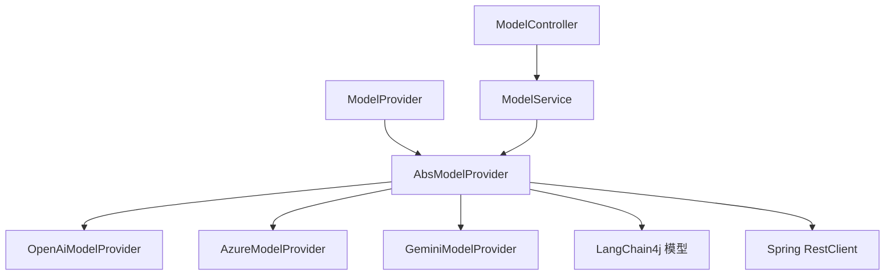

# 模型服务模块 (maxkb4j-model)

<cite>
**本文引用的文件**
- [AbsModelProvider.java](file://maxkb4j-service/maxkb4j-model/src/main/java/com/maxkb4j/model/provider/AbsModelProvider.java)
- [OpenAiModelProvider.java](file://maxkb4j-service/maxkb4j-model/src/main/java/com/maxkb4j/model/provider/OpenAiModelProvider.java)
- [AzureModelProvider.java](file://maxkb4j-service/maxkb4j-model/src/main/java/com/maxkb4j/model/provider/AzureModelProvider.java)
- [GeminiModelProvider.java](file://maxkb4j-service/maxkb4j-model/src/main/java/com/maxkb4j/model/provider/GeminiModelProvider.java)
- [ModelProvider.java](file://maxkb4j-service/maxkb4j-model/src/main/java/com/maxkb4j/model/enums/ModelProvider.java)
- [ModelCredentialForm.java](file://maxkb4j-service/maxkb4j-model/src/main/java/com/maxkb4j/model/custom/credential/ModelCredentialForm.java)
- [LLMChatModelParams.java](file://maxkb4j-service/maxkb4j-model/src/main/java/com/maxkb4j/model/custom/params/impl/LLMChatModelParams.java)
- [OpenAiChatModelParams.java](file://maxkb4j-service/maxkb4j-model/src/main/java/com/maxkb4j/model/custom/params/impl/OpenAiChatModelParams.java)
- [ModelService.java](file://maxkb4j-service/maxkb4j-model/src/main/java/com/maxkb4j/model/service/ModelService.java)
- [ModelController.java](file://maxkb4j-service/maxkb4j-model/src/main/java/com/maxkb4j/model/controller/ModelController.java)
- [ModelEntity.java](file://maxkb4j-service-api/maxkb4j-model-api/src/main/java/com/maxkb4j/model/entity/ModelEntity.java)
- [IModelParams.java](file://maxkb4j-service-api/maxkb4j-model-api/src/main/java/com/maxkb4j/model/service/IModelParams.java)
- [IModelProviderService.java](file://maxkb4j-service-api/maxkb4j-model-api/src/main/java/com/maxkb4j/model/service/IModelProviderService.java)
- [ModelProviderInfo.java](file://maxkb4j-service/maxkb4j-model/src/main/java/com/maxkb4j/model/vo/ModelProviderInfo.java)
- [ModelException.java](file://maxkb4j-service/maxkb4j-model/src/main/java/com/maxkb4j/model/exception/ModelException.java)
- [ModelNotFoundException.java](file://maxkb4j-service/maxkb4j-model/src/main/java/com/maxkb4j/model/exception/ModelNotFoundException.java)
</cite>

## 目录
1. [简介](#简介)
2. [项目结构](#项目结构)
3. [核心组件](#核心组件)
4. [架构总览](#架构总览)
5. [详细组件分析](#详细组件分析)
6. [依赖分析](#依赖分析)
7. [性能考虑](#性能考虑)
8. [故障排查指南](#故障排查指南)
9. [结论](#结论)
10. [附录：配置与最佳实践](#附录配置与最佳实践)

## 简介
本文件面向“模型服务模块”（maxkb4j-model），系统性阐述多提供商模型集成架构，重点解析 AbsModelProvider 抽象基类的设计思想与扩展模式，并深入说明 OpenAiModelProvider、AzureModelProvider、GeminiModelProvider 等主流 AI 提供商的集成方式。文档同时覆盖模型参数管理（ModelParams）、凭证管理机制、统一接口设计与调用流程，并提供配置示例与性能优化建议，帮助开发者快速理解与扩展。

## 项目结构
模型服务模块位于 maxkb4j-service/maxkb4j-model 下，主要由以下层次构成：
- provider 层：定义抽象基类与各提供商的具体实现
- custom.* 层：自定义表单、禁用模型、参数模板等
- service 层：模型实体的业务服务
- controller 层：模型资源的对外接口
- enums 与 vo：枚举与值对象，用于提供者信息与图标缓存
- exception：领域异常类型

图示来源
- [AbsModelProvider.java:36-244](file://maxkb4j-service/maxkb4j-model/src/main/java/com/maxkb4j/model/provider/AbsModelProvider.java#L36-L244)
- [ModelService.java:40-173](file://maxkb4j-service/maxkb4j-model/src/main/java/com/maxkb4j/model/service/ModelService.java#L40-L173)
- [ModelController.java:24-85](file://maxkb4j-service/maxkb4j-model/src/main/java/com/maxkb4j/model/controller/ModelController.java#L24-L85)
- [ModelProvider.java:11-95](file://maxkb4j-service/maxkb4j-model/src/main/java/com/maxkb4j/model/enums/ModelProvider.java#L11-L95)
- [ModelProviderInfo.java:12-43](file://maxkb4j-service/maxkb4j-model/src/main/java/com/maxkb4j/model/vo/ModelProviderInfo.java#L12-L43)

章节来源
- [AbsModelProvider.java:36-244](file://maxkb4j-service/maxkb4j-model/src/main/java/com/maxkb4j/model/provider/AbsModelProvider.java#L36-L244)
- [ModelService.java:40-173](file://maxkb4j-service/maxkb4j-model/src/main/java/com/maxkb4j/model/service/ModelService.java#L40-L173)
- [ModelController.java:24-85](file://maxkb4j-service/maxkb4j-model/src/main/java/com/maxkb4j/model/controller/ModelController.java#L24-L85)
- [ModelProvider.java:11-95](file://maxkb4j-service/maxkb4j-model/src/main/java/com/maxkb4j/model/enums/ModelProvider.java#L11-L95)
- [ModelProviderInfo.java:12-43](file://maxkb4j-service/maxkb4j-model/src/main/java/com/maxkb4j/model/vo/ModelProviderInfo.java#L12-L43)

## 核心组件
- 抽象基类 AbsModelProvider：定义统一的模型构建契约（聊天、流式聊天、嵌入、图像、评分、语音等），并提供参数读取工具与 HTTP 客户端延迟初始化策略。
- 具体提供商实现：OpenAiModelProvider、AzureModelProvider、GeminiModelProvider 等，按 LangChain4j 的对应模型类进行封装。
- 参数模板：LLMChatModelParams、OpenAiChatModelParams 等，将模型参数以表单字段形式暴露。
- 凭证表单：ModelCredentialForm，统一管理 baseUrl 与 apiKey 的展示与默认值。
- 枚举与值对象：ModelProvider 统一枚举与懒加载工厂；ModelProviderInfo 负责图标资源缓存。
- 业务服务与控制器：ModelService 提供模型的增删改查与缓存；ModelController 提供对外 REST 接口。
- 异常体系：ModelException 及其子类 ModelNotFoundException，用于模型相关错误处理。

章节来源
- [AbsModelProvider.java:36-244](file://maxkb4j-service/maxkb4j-model/src/main/java/com/maxkb4j/model/provider/AbsModelProvider.java#L36-L244)
- [OpenAiModelProvider.java:29-125](file://maxkb4j-service/maxkb4j-model/src/main/java/com/maxkb4j/model/provider/OpenAiModelProvider.java#L29-L125)
- [AzureModelProvider.java:21-77](file://maxkb4j-service/maxkb4j-model/src/main/java/com/maxkb4j/model/provider/AzureModelProvider.java#L21-L77)
- [GeminiModelProvider.java:19-65](file://maxkb4j-service/maxkb4j-model/src/main/java/com/maxkb4j/model/provider/GeminiModelProvider.java#L19-L65)
- [LLMChatModelParams.java:10-19](file://maxkb4j-service/maxkb4j-model/src/main/java/com/maxkb4j/model/custom/params/impl/LLMChatModelParams.java#L10-L19)
- [OpenAiChatModelParams.java:12-21](file://maxkb4j-service/maxkb4j-model/src/main/java/com/maxkb4j/model/custom/params/impl/OpenAiChatModelParams.java#L12-L21)
- [ModelCredentialForm.java:10-37](file://maxkb4j-service/maxkb4j-model/src/main/java/com/maxkb4j/model/custom/credential/ModelCredentialForm.java#L10-L37)
- [ModelProvider.java:11-95](file://maxkb4j-service/maxkb4j-model/src/main/java/com/maxkb4j/model/enums/ModelProvider.java#L11-L95)
- [ModelProviderInfo.java:12-43](file://maxkb4j-service/maxkb4j-model/src/main/java/com/maxkb4j/model/vo/ModelProviderInfo.java#L12-L43)
- [ModelService.java:40-173](file://maxkb4j-service/maxkb4j-model/src/main/java/com/maxkb4j/model/service/ModelService.java#L40-L173)
- [ModelController.java:24-85](file://maxkb4j-service/maxkb4j-model/src/main/java/com/maxkb4j/model/controller/ModelController.java#L24-L85)
- [ModelException.java:6-12](file://maxkb4j-service/maxkb4j-model/src/main/java/com/maxkb4j/model/exception/ModelException.java#L6-L12)
- [ModelNotFoundException.java:6-12](file://maxkb4j-service/maxkb4j-model/src/main/java/com/maxkb4j/model/exception/ModelNotFoundException.java#L6-L12)

## 架构总览
多提供商模型集成采用“抽象基类 + 工厂枚举”的分层设计：
- 抽象层：AbsModelProvider 定义统一的模型构建方法族与参数读取工具，屏蔽不同提供商差异。
- 扩展层：各提供商实现类仅关注自身特有参数与客户端配置。
- 枚举工厂：ModelProvider 将字符串提供商标识映射到具体实现，支持懒加载与缓存。
- 表单与参数：通过 IModelParams 与 BaseField 将参数以表单形式暴露给前端或配置界面。
- 凭证与缓存：ModelCredentialForm 统一凭据表单；ModelService 对模型实体做轻量缓存，提升查询性能。

图示来源
- [AbsModelProvider.java:36-244](file://maxkb4j-service/maxkb4j-model/src/main/java/com/maxkb4j/model/provider/AbsModelProvider.java#L36-L244)
- [OpenAiModelProvider.java:29-125](file://maxkb4j-service/maxkb4j-model/src/main/java/com/maxkb4j/model/provider/OpenAiModelProvider.java#L29-L125)
- [AzureModelProvider.java:21-77](file://maxkb4j-service/maxkb4j-model/src/main/java/com/maxkb4j/model/provider/AzureModelProvider.java#L21-L77)
- [GeminiModelProvider.java:19-65](file://maxkb4j-service/maxkb4j-model/src/main/java/com/maxkb4j/model/provider/GeminiModelProvider.java#L19-L65)
- [ModelProvider.java:48-82](file://maxkb4j-service/maxkb4j-model/src/main/java/com/maxkb4j/model/enums/ModelProvider.java#L48-L82)
- [ModelCredentialForm.java:10-37](file://maxkb4j-service/maxkb4j-model/src/main/java/com/maxkb4j/model/custom/credential/ModelCredentialForm.java#L10-L37)
- [LLMChatModelParams.java:10-19](file://maxkb4j-service/maxkb4j-model/src/main/java/com/maxkb4j/model/custom/params/impl/LLMChatModelParams.java#L10-L19)
- [OpenAiChatModelParams.java:12-21](file://maxkb4j-service/maxkb4j-model/src/main/java/com/maxkb4j/model/custom/params/impl/OpenAiChatModelParams.java#L12-L21)
- [ModelService.java:40-173](file://maxkb4j-service/maxkb4j-model/src/main/java/com/maxkb4j/model/service/ModelService.java#L40-L173)
- [ModelController.java:24-85](file://maxkb4j-service/maxkb4j-model/src/main/java/com/maxkb4j/model/controller/ModelController.java#L24-L85)

## 详细组件分析

### 抽象基类：AbsModelProvider
- 设计要点
  - 统一模型构建方法族：聊天、流式聊天、嵌入、图像、评分、语音等，默认返回禁用实现，便于子类按需覆盖。
  - 参数安全读取：提供 getDoubleParam、getIntParam、getStringParam、getBooleanParam、getFloatParam 等空值安全方法。
  - HTTP 客户端延迟初始化：通过 HttpClientBuilder 与 SpringRestClient 配置，避免在构造阶段引入阻塞。
  - 凭证表单：getModelCredential 返回 ModelCredentialForm，控制 baseUrl 与 apiKey 的显示与默认值。
  - 参数表单：getModelParamsForm 根据模型类型返回对应参数表单（如 LLM 默认返回 LLMChatModelParams）。
- 扩展建议
  - 子类仅需实现 getModelList 与需要的 build* 方法，其他保持默认即可。
  - 注意参数键名与 LangChain4j 构建器参数的映射一致性。

章节来源
- [AbsModelProvider.java:36-244](file://maxkb4j-service/maxkb4j-model/src/main/java/com/maxkb4j/model/provider/AbsModelProvider.java#L36-L244)

### 具体提供商实现

#### OpenAI 提供商：OpenAiModelProvider
- 支持模型类型：LLM、EMBEDDING、STT、TTS、VISION、TTI（图像生成）
- 特性
  - 默认基础地址：提供 getDefaultBaseUrl
  - 参数映射：temperature、maxTokens、returnThinking 等
  - 语音模型：通过自定义 OpenAiSTTModel 与 OpenAiTTSModel 包装
- 调用流程
  - 从 ModelCredential 读取 baseUrl 与 apiKey
  - 从 params 读取 temperature、maxTokens、returnThinking
  - 通过 OpenAiChatModel/StreamingChatModel/EmbeddingModel/ImageModel 构建实例

图示来源
- [OpenAiModelProvider.java:66-76](file://maxkb4j-service/maxkb4j-model/src/main/java/com/maxkb4j/model/provider/OpenAiModelProvider.java#L66-L76)

章节来源
- [OpenAiModelProvider.java:29-125](file://maxkb4j-service/maxkb4j-model/src/main/java/com/maxkb4j/model/provider/OpenAiModelProvider.java#L29-L125)

#### Azure OpenAI 提供商：AzureModelProvider
- 支持模型类型：LLM、EMBEDDING、VISION、TTI
- 特性
  - 使用 deploymentName 作为模型名
  - 参数映射：temperature、maxTokens
- 调用流程
  - 从 ModelCredential 读取 apiKey
  - 从 params 读取 temperature、maxTokens
  - 通过 AzureOpenAiChatModel/StreamingChatModel/EmbeddingModel/ImageModel 构建实例

图示来源
- [AzureModelProvider.java:63-67](file://maxkb4j-service/maxkb4j-model/src/main/java/com/maxkb4j/model/provider/AzureModelProvider.java#L63-L67)

章节来源
- [AzureModelProvider.java:21-77](file://maxkb4j-service/maxkb4j-model/src/main/java/com/maxkb4j/model/provider/AzureModelProvider.java#L21-L77)

#### Gemini 提供商：GeminiModelProvider
- 支持模型类型：LLM、EMBEDDING、VISION
- 特性
  - 参数映射：temperature、maxOutputTokens（对应 maxTokens）
- 调用流程
  - 从 ModelCredential 读取 apiKey
  - 从 params 读取 temperature、maxTokens
  - 通过 GoogleAiGeminiChatModel/StreamingChatModel/EmbeddingModel 构建实例

图示来源
- [GeminiModelProvider.java:47-54](file://maxkb4j-service/maxkb4j-model/src/main/java/com/maxkb4j/model/provider/GeminiModelProvider.java#L47-L54)

章节来源
- [GeminiModelProvider.java:19-65](file://maxkb4j-service/maxkb4j-model/src/main/java/com/maxkb4j/model/provider/GeminiModelProvider.java#L19-L65)

### 参数管理：ModelParams
- IModelParams 接口：统一 toForm() 输出 BaseField 列表
- LLMChatModelParams：为通用 LLM 提供 temperature 与 maxTokens 的滑块表单
- OpenAiChatModelParams：在 LLM 基础上增加 returnThinking 开关
- 使用场景
  - 控制器通过 ModelController 获取模型参数表单
  - 业务侧在创建/更新模型时持久化参数表单

图示来源
- [IModelParams.java:8-11](file://maxkb4j-service-api/maxkb4j-model-api/src/main/java/com/maxkb4j/model/service/IModelParams.java#L8-L11)
- [LLMChatModelParams.java:10-19](file://maxkb4j-service/maxkb4j-model/src/main/java/com/maxkb4j/model/custom/params/impl/LLMChatModelParams.java#L10-L19)
- [OpenAiChatModelParams.java:12-21](file://maxkb4j-service/maxkb4j-model/src/main/java/com/maxkb4j/model/custom/params/impl/OpenAiChatModelParams.java#L12-L21)

章节来源
- [IModelParams.java:8-11](file://maxkb4j-service-api/maxkb4j-model-api/src/main/java/com/maxkb4j/model/service/IModelParams.java#L8-L11)
- [LLMChatModelParams.java:10-19](file://maxkb4j-service/maxkb4j-model/src/main/java/com/maxkb4j/model/custom/params/impl/LLMChatModelParams.java#L10-L19)
- [OpenAiChatModelParams.java:12-21](file://maxkb4j-service/maxkb4j-model/src/main/java/com/maxkb4j/model/custom/params/impl/OpenAiChatModelParams.java#L12-L21)

### 凭证管理机制
- ModelCredentialForm
  - 控制 baseUrl 与 apiKey 的表单展示
  - OpenAiModelProvider.getDefaultBaseUrl 作为默认基础地址
- ModelService
  - 在更新模型时对密钥进行掩码保护
  - 提供 getModelCredential(id) 读取凭证
- ModelController
  - 对外暴露模型 CRUD 与参数表单维护接口

图示来源
- [ModelService.java:120-131](file://maxkb4j-service/maxkb4j-model/src/main/java/com/maxkb4j/model/service/ModelService.java#L120-L131)
- [ModelCredentialForm.java:10-37](file://maxkb4j-service/maxkb4j-model/src/main/java/com/maxkb4j/model/custom/credential/ModelCredentialForm.java#L10-L37)
- [OpenAiModelProvider.java:47-62](file://maxkb4j-service/maxkb4j-model/src/main/java/com/maxkb4j/model/provider/OpenAiModelProvider.java#L47-L62)

章节来源
- [ModelService.java:120-131](file://maxkb4j-service/maxkb4j-model/src/main/java/com/maxkb4j/model/service/ModelService.java#L120-L131)
- [ModelCredentialForm.java:10-37](file://maxkb4j-service/maxkb4j-model/src/main/java/com/maxkb4j/model/custom/credential/ModelCredentialForm.java#L10-L37)
- [OpenAiModelProvider.java:47-62](file://maxkb4j-service/maxkb4j-model/src/main/java/com/maxkb4j/model/provider/OpenAiModelProvider.java#L47-L62)

### 统一接口设计与调用流程
- IModelProviderService（接口定义）
  - 提供 buildChatModel/buildStreamingChatModel/buildEmbeddingModel/buildImageModel/buildScoringModel/buildTTSModel/buildSTTModel 的统一入口
  - 支持带模型参数的重载版本
- 实际调用链
  - 控制器接收请求，解析模型标识与参数
  - 通过 ModelService 获取模型实体与凭证
  - 通过 ModelProvider 枚举获取具体提供商实例
  - 调用提供商的 build* 方法返回 LangChain4j 模型实例
  - 业务层执行推理/嵌入/图像生成等操作

图示来源
- [ModelController.java:24-85](file://maxkb4j-service/maxkb4j-model/src/main/java/com/maxkb4j/model/controller/ModelController.java#L24-L85)
- [ModelService.java:164-172](file://maxkb4j-service/maxkb4j-model/src/main/java/com/maxkb4j/model/service/ModelService.java#L164-L172)
- [ModelProvider.java:77-82](file://maxkb4j-service/maxkb4j-model/src/main/java/com/maxkb4j/model/enums/ModelProvider.java#L77-L82)
- [AbsModelProvider.java:161-163](file://maxkb4j-service/maxkb4j-model/src/main/java/com/maxkb4j/model/provider/AbsModelProvider.java#L161-L163)

章节来源
- [IModelProviderService.java:14-35](file://maxkb4j-service-api/maxkb4j-model-api/src/main/java/com/maxkb4j/model/service/IModelProviderService.java#L14-L35)
- [ModelController.java:24-85](file://maxkb4j-service/maxkb4j-model/src/main/java/com/maxkb4j/model/controller/ModelController.java#L24-L85)
- [ModelService.java:164-172](file://maxkb4j-service/maxkb4j-model/src/main/java/com/maxkb4j/model/service/ModelService.java#L164-L172)
- [ModelProvider.java:77-82](file://maxkb4j-service/maxkb4j-model/src/main/java/com/maxkb4j/model/enums/ModelProvider.java#L77-L82)
- [AbsModelProvider.java:161-163](file://maxkb4j-service/maxkb4j-model/src/main/java/com/maxkb4j/model/provider/AbsModelProvider.java#L161-L163)

### 提供商枚举与图标缓存：ModelProvider 与 ModelProviderInfo
- ModelProvider
  - 枚举所有支持的提供商，懒加载创建具体实现
  - 提供静态映射 PROVIDER_MAP，按字符串标识查找
  - getInfo() 返回 ModelProviderInfo，包含图标 SVG 内容
- ModelProviderInfo
  - 启动时预加载所有图标至内存缓存
  - 通过 IoUtil 读取 classpath 下的 SVG 文件

图示来源
- [ModelProvider.java:48-94](file://maxkb4j-service/maxkb4j-model/src/main/java/com/maxkb4j/model/enums/ModelProvider.java#L48-L94)
- [ModelProviderInfo.java:12-43](file://maxkb4j-service/maxkb4j-model/src/main/java/com/maxkb4j/model/vo/ModelProviderInfo.java#L12-L43)

章节来源
- [ModelProvider.java:48-94](file://maxkb4j-service/maxkb4j-model/src/main/java/com/maxkb4j/model/enums/ModelProvider.java#L48-L94)
- [ModelProviderInfo.java:12-43](file://maxkb4j-service/maxkb4j-model/src/main/java/com/maxkb4j/model/vo/ModelProviderInfo.java#L12-L43)

## 依赖分析
- 组件内聚与耦合
  - AbsModelProvider 与各提供商实现之间为“抽象依赖”，耦合度低，扩展性强
  - ModelProvider 作为工厂，解耦调用方与具体实现
  - ModelService 与控制器通过接口与枚举交互，不直接依赖具体提供商类
- 外部依赖
  - LangChain4j：提供 ChatModel、StreamingChatModel、EmbeddingModel、ImageModel、ScoringModel 等模型抽象
  - Spring RestClient 与 HttpClientBuilder：统一 HTTP 客户端配置
  - MyBatis-Plus：模型实体的持久化
  - Caffeine：ModelService 的轻量缓存

图示来源
- [AbsModelProvider.java:36-244](file://maxkb4j-service/maxkb4j-model/src/main/java/com/maxkb4j/model/provider/AbsModelProvider.java#L36-L244)
- [OpenAiModelProvider.java:29-125](file://maxkb4j-service/maxkb4j-model/src/main/java/com/maxkb4j/model/provider/OpenAiModelProvider.java#L29-L125)
- [AzureModelProvider.java:21-77](file://maxkb4j-service/maxkb4j-model/src/main/java/com/maxkb4j/model/provider/AzureModelProvider.java#L21-L77)
- [GeminiModelProvider.java:19-65](file://maxkb4j-service/maxkb4j-model/src/main/java/com/maxkb4j/model/provider/GeminiModelProvider.java#L19-L65)
- [ModelProvider.java:48-82](file://maxkb4j-service/maxkb4j-model/src/main/java/com/maxkb4j/model/enums/ModelProvider.java#L48-L82)
- [ModelService.java:40-173](file://maxkb4j-service/maxkb4j-model/src/main/java/com/maxkb4j/model/service/ModelService.java#L40-L173)
- [ModelController.java:24-85](file://maxkb4j-service/maxkb4j-model/src/main/java/com/maxkb4j/model/controller/ModelController.java#L24-L85)

章节来源
- [AbsModelProvider.java:36-244](file://maxkb4j-service/maxkb4j-model/src/main/java/com/maxkb4j/model/provider/AbsModelProvider.java#L36-L244)
- [ModelProvider.java:48-82](file://maxkb4j-service/maxkb4j-model/src/main/java/com/maxkb4j/model/enums/ModelProvider.java#L48-L82)
- [ModelService.java:40-173](file://maxkb4j-service/maxkb4j-model/src/main/java/com/maxkb4j/model/service/ModelService.java#L40-L173)
- [ModelController.java:24-85](file://maxkb4j-service/maxkb4j-model/src/main/java/com/maxkb4j/model/controller/ModelController.java#L24-L85)

## 性能考虑
- HTTP 客户端延迟初始化：避免在构造阶段创建昂贵对象，减少启动时间与内存占用
- 模型实体缓存：ModelService 使用 Caffeine 缓存模型实体，1 分钟 TTL，降低数据库压力
- 参数表单缓存：ModelProviderInfo 启动时预加载 SVG 图标，避免运行时 IO
- 流式模型优先：在长文本生成场景优先选择 StreamingChatModel，改善用户体验
- 并发安全：HTTP 客户端与图标缓存均采用线程安全策略

章节来源
- [AbsModelProvider.java:44-60](file://maxkb4j-service/maxkb4j-model/src/main/java/com/maxkb4j/model/provider/AbsModelProvider.java#L44-L60)
- [ModelService.java:45-52](file://maxkb4j-service/maxkb4j-model/src/main/java/com/maxkb4j/model/service/ModelService.java#L45-L52)
- [ModelProviderInfo.java:18-23](file://maxkb4j-service/maxkb4j-model/src/main/java/com/maxkb4j/model/vo/ModelProviderInfo.java#L18-L23)

## 故障排查指南
- 模型未找到
  - 现象：调用 build* 方法时无可用实现
  - 排查：确认模型标识与提供商映射是否正确；检查 ModelProvider.get(provider) 是否返回非空
- 凭证无效
  - 现象：HTTP 请求返回鉴权失败
  - 排查：核对 baseUrl 与 apiKey；确认掩码逻辑未误伤真实密钥
- 参数不生效
  - 现象：temperature 或 maxTokens 未按预期工作
  - 排查：确认参数键名与提供商实现一致；检查参数表单是否正确持久化
- 异常类型
  - ModelException：通用模型异常
  - ModelNotFoundException：模型不存在

章节来源
- [ModelProvider.java:77-82](file://maxkb4j-service/maxkb4j-model/src/main/java/com/maxkb4j/model/enums/ModelProvider.java#L77-L82)
- [ModelService.java:120-131](file://maxkb4j-service/maxkb4j-model/src/main/java/com/maxkb4j/model/service/ModelService.java#L120-L131)
- [ModelException.java:6-12](file://maxkb4j-service/maxkb4j-model/src/main/java/com/maxkb4j/model/exception/ModelException.java#L6-L12)
- [ModelNotFoundException.java:6-12](file://maxkb4j-service/maxkb4j-model/src/main/java/com/maxkb4j/model/exception/ModelNotFoundException.java#L6-L12)

## 结论
本模块通过抽象基类与工厂枚举实现了对多提供商模型的统一接入，既保证了扩展性，又降低了使用复杂度。OpenAI、Azure、Gemini 等主流提供商以最小适配成本融入统一框架；参数与凭证的表单化设计提升了可配置性与安全性；结合缓存与延迟初始化策略，兼顾了性能与稳定性。建议在新增提供商时遵循现有契约，确保参数键名一致与异常处理完备。

## 附录：配置与最佳实践
- 配置示例（路径参考）
  - 模型实体：见 [ModelEntity.java:21-43](file://maxkb4j-service-api/maxkb4j-model-api/src/main/java/com/maxkb4j/model/entity/ModelEntity.java#L21-L43)
  - 模型控制器：见 [ModelController.java:24-85](file://maxkb4j-service/maxkb4j-model/src/main/java/com/maxkb4j/model/controller/ModelController.java#L24-L85)
  - 模型服务：见 [ModelService.java:40-173](file://maxkb4j-service/maxkb4j-model/src/main/java/com/maxkb4j/model/service/ModelService.java#L40-L173)
  - 抽象提供商：见 [AbsModelProvider.java:36-244](file://maxkb4j-service/maxkb4j-model/src/main/java/com/maxkb4j/model/provider/AbsModelProvider.java#L36-L244)
  - OpenAI 提供商：见 [OpenAiModelProvider.java:29-125](file://maxkb4j-service/maxkb4j-model/src/main/java/com/maxkb4j/model/provider/OpenAiModelProvider.java#L29-L125)
  - Azure 提供商：见 [AzureModelProvider.java:21-77](file://maxkb4j-service/maxkb4j-model/src/main/java/com/maxkb4j/model/provider/AzureModelProvider.java#L21-L77)
  - Gemini 提供商：见 [GeminiModelProvider.java:19-65](file://maxkb4j-service/maxkb4j-model/src/main/java/com/maxkb4j/model/provider/GeminiModelProvider.java#L19-L65)
  - 参数模板：见 [LLMChatModelParams.java:10-19](file://maxkb4j-service/maxkb4j-model/src/main/java/com/maxkb4j/model/custom/params/impl/LLMChatModelParams.java#L10-L19)、[OpenAiChatModelParams.java:12-21](file://maxkb4j-service/maxkb4j-model/src/main/java/com/maxkb4j/model/custom/params/impl/OpenAiChatModelParams.java#L12-L21)
  - 凭证表单：见 [ModelCredentialForm.java:10-37](file://maxkb4j-service/maxkb4j-model/src/main/java/com/maxkb4j/model/custom/credential/ModelCredentialForm.java#L10-L37)
  - 枚举与图标：见 [ModelProvider.java:11-95](file://maxkb4j-service/maxkb4j-model/src/main/java/com/maxkb4j/model/enums/ModelProvider.java#L11-L95)、[ModelProviderInfo.java:12-43](file://maxkb4j-service/maxkb4j-model/src/main/java/com/maxkb4j/model/vo/ModelProviderInfo.java#L12-L43)
- 最佳实践
  - 新增提供商时，先在 ModelProvider 中注册，并提供默认图标
  - 参数键名保持与 LangChain4j 构建器一致，避免映射歧义
  - 对敏感参数（如 apiKey）进行掩码处理并在必要时保留原值
  - 使用流式模型提升长文本生成体验
  - 合理设置 maxTokens 与 temperature，平衡质量与成本