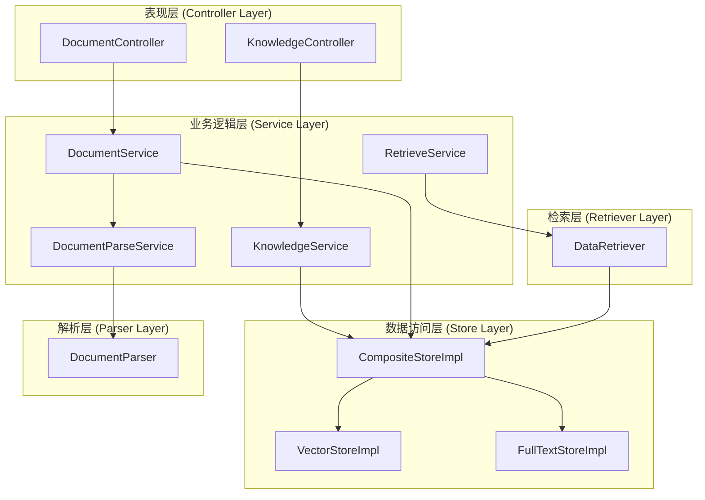
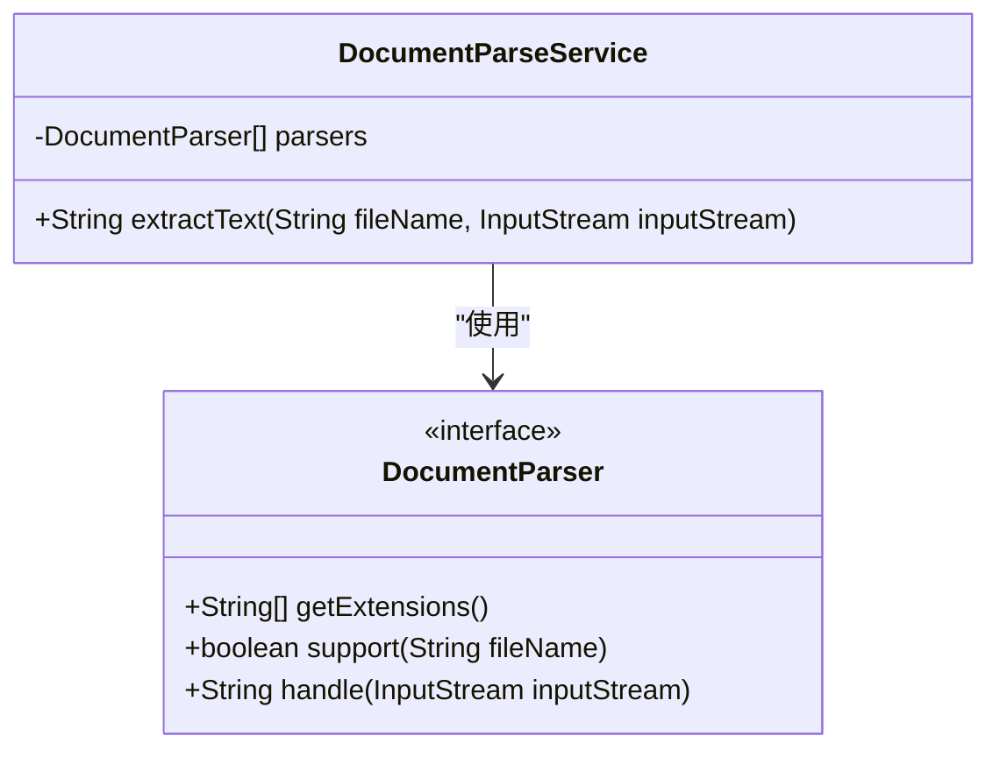
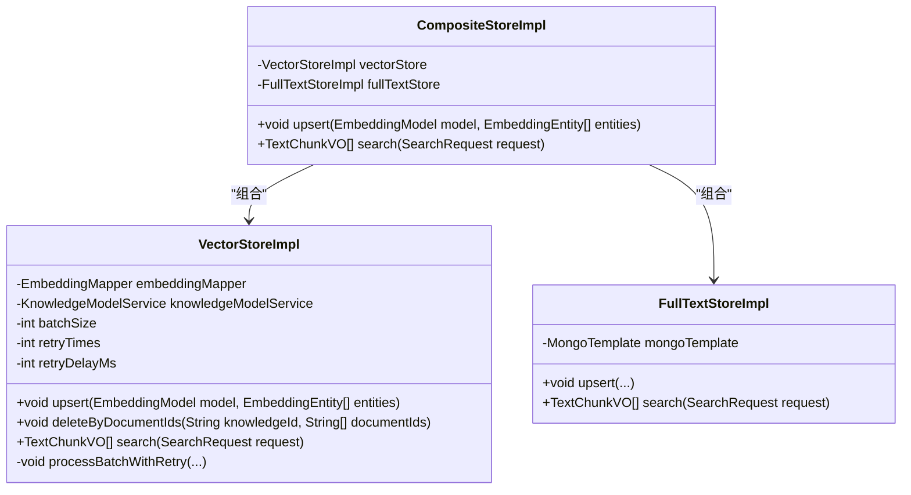
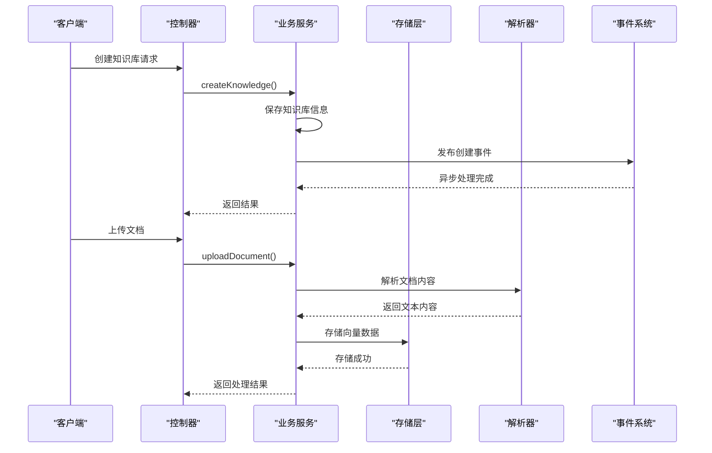
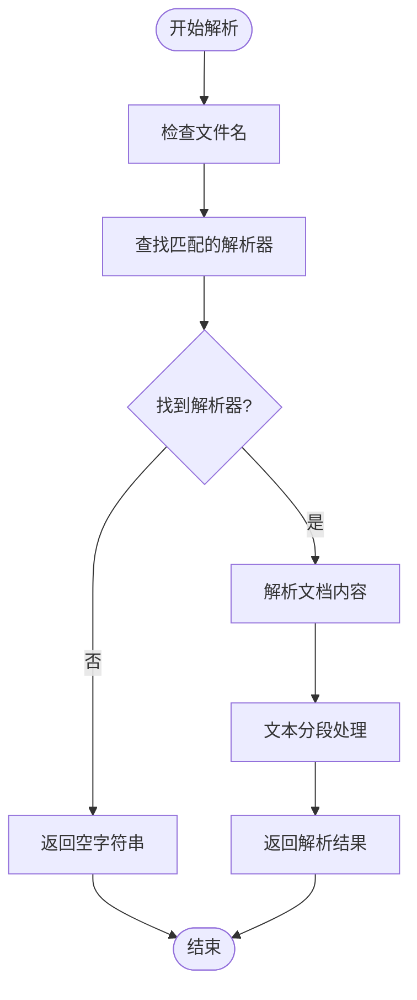
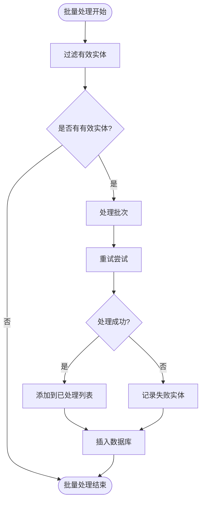
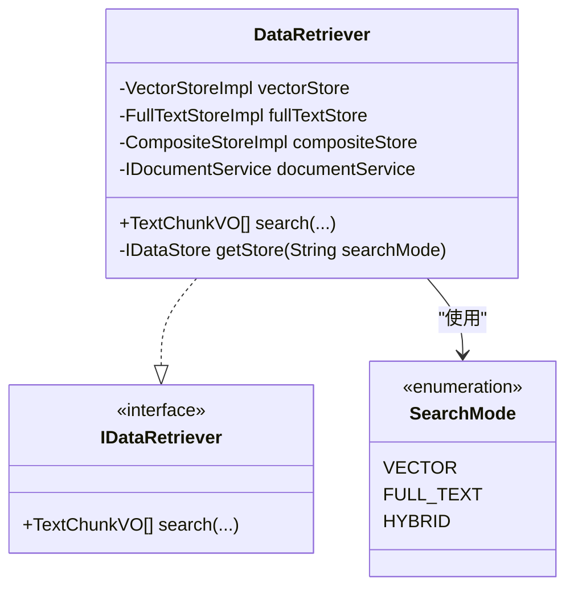
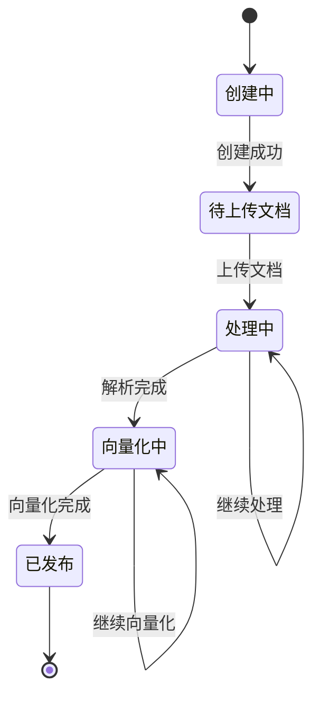
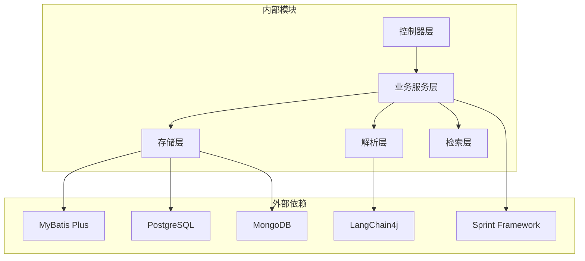

# 知识服务模块 (maxkb4j-knowledge) 技术文档

<cite>
**本文档引用的文件**
- [DocumentParser.java](file://maxkb4j-service/maxkb4j-knowledge/src/main/java/com/maxkb4j/knowledge/parser/DocumentParser.java)
- [VectorStoreImpl.java](file://maxkb4j-service/maxkb4j-knowledge/src/main/java/com/maxkb4j/knowledge/store/VectorStoreImpl.java)
- [DataRetriever.java](file://maxkb4j-service/maxkb4j-knowledge/src/main/java/com/maxkb4j/knowledge/retriever/DataRetriever.java)
- [DocumentParseService.java](file://maxkb4j-service/maxkb4j-knowledge/src/main/java/com/maxkb4j/knowledge/service/DocumentParseService.java)
- [KnowledgeService.java](file://maxkb4j-service/maxkb4j-knowledge/src/main/java/com/maxkb4j/knowledge/service/KnowledgeService.java)
- [CompositeStoreImpl.java](file://maxkb4j-service/maxkb4j-knowledge/src/main/java/com/maxkb4j/knowledge/store/CompositeStoreImpl.java)
- [FullTextStoreImpl.java](file://maxkb4j-service/maxkb4j-knowledge/src/main/java/com/maxkb4j/knowledge/store/FullTextStoreImpl.java)
- [DocumentService.java](file://maxkb4j-service/maxkb4j-knowledge/src/main/java/com/maxkb4j/knowledge/service/DocumentService.java)
- [RetrieveService.java](file://maxkb4j-service/maxkb4j-knowledge/src/main/java/com/maxkb4j/knowledge/service/RetrieveService.java)
- [KnowledgeController.java](file://maxkb4j-service/maxkb4j-knowledge/src/main/java/com/maxkb4j/knowledge/controller/KnowledgeController.java)
- [DocumentController.java](file://maxkb4j-service/maxkb4j-knowledge/src/main/java/com/maxkb4j/knowledge/controller/DocumentController.java)
- [IDataStore.java](file://maxkb4j-service-api/maxkb4j-knowledge-api/src/main/java/com/maxkb4j/knowledge/store/IDataStore.java)
- [IDataRetriever.java](file://maxkb4j-service-api/maxkb4j-knowledge-api/src/main/java/com/maxkb4j/knowledge/retrieval/IDataRetriever.java)
</cite>

## 目录
1. [简介](#简介)
2. [项目结构](#项目结构)
3. [核心组件](#核心组件)
4. [架构概览](#架构概览)
5. [详细组件分析](#详细组件分析)
6. [依赖关系分析](#依赖关系分析)
7. [性能考虑](#性能考虑)
8. [故障排除指南](#故障排除指南)
9. [结论](#结论)
10. [附录](#附录)

## 简介

maxkb4j-knowledge 是 MaxKB4j 项目中的知识服务模块，提供了完整的知识库管理解决方案。该模块实现了从文档上传、解析、分段到向量化存储和智能检索的全流程功能。

本模块的核心特性包括：
- 多格式文档解析支持（PDF、Word、Excel、Markdown等）
- 向量存储与全文检索的混合搜索模式
- 工作流驱动的知识库构建
- 分布式事务处理和事件驱动架构
- 完整的权限控制和审计功能

## 项目结构

知识服务模块采用分层架构设计，主要包含以下核心层次：

**图表来源**
- [KnowledgeController.java:36-187](file://maxkb4j-service/maxkb4j-knowledge/src/main/java/com/maxkb4j/knowledge/controller/KnowledgeController.java#L36-L187)
- [DocumentController.java:27-177](file://maxkb4j-service/maxkb4j-knowledge/src/main/java/com/maxkb4j/knowledge/controller/DocumentController.java#L27-L177)

**章节来源**
- [KnowledgeController.java:36-187](file://maxkb4j-service/maxkb4j-knowledge/src/main/java/com/maxkb4j/knowledge/controller/KnowledgeController.java#L36-L187)
- [DocumentController.java:27-177](file://maxkb4j-service/maxkb4j-knowledge/src/main/java/com/maxkb4j/knowledge/controller/DocumentController.java#L27-L177)

## 核心组件

### 文档解析器接口

DocumentParser 接口定义了统一的文档解析规范，支持多种文件格式的自动识别和解析。

**图表来源**
- [DocumentParser.java:6-17](file://maxkb4j-service/maxkb4j-knowledge/src/main/java/com/maxkb4j/knowledge/parser/DocumentParser.java#L6-L17)
- [DocumentParseService.java:14-27](file://maxkb4j-service/maxkb4j-knowledge/src/main/java/com/maxkb4j/knowledge/service/DocumentParseService.java#L14-L27)

### 向量存储实现

VectorStoreImpl 提供了基于 PostgreSQL pgvector 的向量存储解决方案，支持批量处理和重试机制。

**图表来源**
- [VectorStoreImpl.java:34-288](file://maxkb4j-service/maxkb4j-knowledge/src/main/java/com/maxkb4j/knowledge/store/VectorStoreImpl.java#L34-L288)
- [CompositeStoreImpl.java:21-143](file://maxkb4j-service/maxkb4j-knowledge/src/main/java/com/maxkb4j/knowledge/store/CompositeStoreImpl.java#L21-L143)
- [FullTextStoreImpl.java:31-170](file://maxkb4j-service/maxkb4j-knowledge/src/main/java/com/maxkb4j/knowledge/store/FullTextStoreImpl.java#L31-L170)

**章节来源**
- [VectorStoreImpl.java:34-288](file://maxkb4j-service/maxkb4j-knowledge/src/main/java/com/maxkb4j/knowledge/store/VectorStoreImpl.java#L34-L288)
- [CompositeStoreImpl.java:21-143](file://maxkb4j-service/maxkb4j-knowledge/src/main/java/com/maxkb4j/knowledge/store/CompositeStoreImpl.java#L21-L143)
- [FullTextStoreImpl.java:31-170](file://maxkb4j-service/maxkb4j-knowledge/src/main/java/com/maxkb4j/knowledge/store/FullTextStoreImpl.java#L31-L170)

## 架构概览

知识服务模块采用事件驱动和工作流相结合的架构模式，实现了高度解耦和可扩展的设计。

**图表来源**
- [KnowledgeController.java:52-70](file://maxkb4j-service/maxkb4j-knowledge/src/main/java/com/maxkb4j/knowledge/controller/KnowledgeController.java#L52-L70)
- [DocumentController.java:172-175](file://maxkb4j-service/maxkb4j-knowledge/src/main/java/com/maxkb4j/knowledge/controller/DocumentController.java#L172-L175)
- [KnowledgeService.java:271-294](file://maxkb4j-service/maxkb4j-knowledge/src/main/java/com/maxkb4j/knowledge/service/KnowledgeService.java#L271-L294)
- [DocumentService.java:311-357](file://maxkb4j-service/maxkb4j-knowledge/src/main/java/com/maxkb4j/knowledge/service/DocumentService.java#L311-L357)

## 详细组件分析

### 文档解析机制

文档解析服务通过策略模式实现了多格式文档的统一处理：

**图表来源**
- [DocumentParseService.java:18-25](file://maxkb4j-service/maxkb4j-knowledge/src/main/java/com/maxkb4j/knowledge/service/DocumentParseService.java#L18-L25)

#### 支持的文档格式

模块支持以下文档格式的解析：
- PDF 文档解析
- Word 文档解析 (DOC, DOCX)
- Excel 表格解析 (XLS, XLSX)
- Markdown 文档解析
- HTML 文档解析
- CSV 数据文件
- 纯文本文件 (TXT)

**章节来源**
- [DocumentParseService.java:14-27](file://maxkb4j-service/maxkb4j-knowledge/src/main/java/com/maxkb4j/knowledge/service/DocumentParseService.java#L14-L27)

### 向量存储实现原理

VectorStoreImpl 实现了完整的向量数据管理功能，包括批量插入、删除和查询操作：

#### 批量处理机制

**图表来源**
- [VectorStoreImpl.java:49-91](file://maxkb4j-service/maxkb4j-knowledge/src/main/java/com/maxkb4j/knowledge/store/VectorStoreImpl.java#L49-L91)

#### 查询算法优化

向量检索采用了多阶段优化策略：

1. **向量相似度计算**：使用余弦相似度计算查询向量与文档向量的相似度
2. **分数聚合**：对同一段落的多个向量进行分数聚合
3. **去重处理**：按段落ID去重，保留最高分数
4. **最终排序**：按分数降序排列，限制返回数量

**章节来源**
- [VectorStoreImpl.java:214-278](file://maxkb4j-service/maxkb4j-knowledge/src/main/java/com/maxkb4j/knowledge/store/VectorStoreImpl.java#L214-L278)

### 检索服务架构

DataRetriever 提供了统一的检索接口，支持多种检索模式：

**图表来源**
- [DataRetriever.java:28-66](file://maxkb4j-service/maxkb4j-knowledge/src/main/java/com/maxkb4j/knowledge/retriever/DataRetriever.java#L28-L66)

**章节来源**
- [DataRetriever.java:28-66](file://maxkb4j-service/maxkb4j-knowledge/src/main/java/com/maxkb4j/knowledge/retriever/DataRetriever.java#L28-L66)

### 知识库管理流程

知识库管理提供了完整的生命周期管理功能：

**图表来源**
- [KnowledgeService.java:167-197](file://maxkb4j-service/maxkb4j-knowledge/src/main/java/com/maxkb4j/knowledge/service/KnowledgeService.java#L167-L197)

**章节来源**
- [KnowledgeService.java:167-197](file://maxkb4j-service/maxkb4j-knowledge/src/main/java/com/maxkb4j/knowledge/service/KnowledgeService.java#L167-L197)

## 依赖关系分析

模块间的依赖关系体现了清晰的分层架构：

**图表来源**
- [VectorStoreImpl.java:1-288](file://maxkb4j-service/maxkb4j-knowledge/src/main/java/com/maxkb4j/knowledge/store/VectorStoreImpl.java#L1-L288)
- [FullTextStoreImpl.java:1-170](file://maxkb4j-service/maxkb4j-knowledge/src/main/java/com/maxkb4j/knowledge/store/FullTextStoreImpl.java#L1-L170)

**章节来源**
- [VectorStoreImpl.java:1-288](file://maxkb4j-service/maxkb4j-knowledge/src/main/java/com/maxkb4j/knowledge/store/VectorStoreImpl.java#L1-L288)
- [FullTextStoreImpl.java:1-170](file://maxkb4j-service/maxkb4j-knowledge/src/main/java/com/maxkb4j/knowledge/store/FullTextStoreImpl.java#L1-L170)

## 性能考虑

### 向量存储性能优化

1. **批量处理**：默认批处理大小为100，减少数据库往返次数
2. **重试机制**：支持最多3次重试，每次间隔1秒
3. **并发处理**：使用CopyOnWriteArrayList保证线程安全
4. **内存管理**：及时清理临时对象，避免内存泄漏

### 检索性能优化

1. **索引优化**：PostgreSQL pgvector 提供高效的向量相似度搜索
2. **缓存策略**：MongoDB 使用文本索引加速全文检索
3. **异步处理**：混合检索使用 CompletableFuture 并行处理
4. **结果限制**：默认返回前K个最相关的结果

### 存储策略

模块采用复合存储架构：
- **向量存储**：PostgreSQL + pgvector，用于语义相似度搜索
- **全文存储**：MongoDB，用于精确文本匹配
- **双写一致性**：确保两种存储的数据同步

## 故障排除指南

### 常见问题及解决方案

#### 向量嵌入失败

**问题症状**：
- 向量化过程中抛出异常
- 日志显示嵌入模型调用失败

**解决步骤**：
1. 检查嵌入模型配置是否正确
2. 验证网络连接和API密钥
3. 查看重试日志，确认重试次数
4. 检查数据库连接状态

#### 检索结果为空

**问题症状**：
- 搜索返回空结果
- 分数全部为0

**解决步骤**：
1. 确认知识库是否已正确向量化
2. 检查查询文本是否包含有效词汇
3. 验证最小分数阈值设置
4. 确认排除条件是否过于严格

#### 文档解析错误

**问题症状**：
- 文档上传后无法解析
- 解析结果为空

**解决步骤**：
1. 检查文件格式是否受支持
2. 验证文件完整性
3. 查看解析器日志
4. 确认文件编码格式

**章节来源**
- [VectorStoreImpl.java:103-145](file://maxkb4j-service/maxkb4j-knowledge/src/main/java/com/maxkb4j/knowledge/store/VectorStoreImpl.java#L103-L145)
- [DataRetriever.java:41-56](file://maxkb4j-service/maxkb4j-knowledge/src/main/java/com/maxkb4j/knowledge/retriever/DataRetriever.java#L41-L56)

## 结论

maxkb4j-knowledge 模块提供了一个完整、高效、可扩展的知识库管理系统。其设计特点包括：

1. **模块化架构**：清晰的分层设计，便于维护和扩展
2. **多格式支持**：全面的文档解析能力
3. **高性能检索**：结合向量和全文检索的优势
4. **事件驱动**：异步处理提升系统响应性
5. **安全可靠**：完善的权限控制和错误处理机制

该模块为构建企业级知识管理应用提供了坚实的技术基础。

## 附录

### API 接口参考

#### 知识库管理接口

| 方法 | 路径 | 功能描述 |
|------|------|----------|
| GET | `/knowledge` | 获取知识库列表 |
| POST | `/knowledge/base` | 创建基础知识库 |
| POST | `/knowledge/web` | 创建网页知识库 |
| PUT | `/knowledge/{id}` | 更新知识库信息 |
| DELETE | `/knowledge/{id}` | 删除知识库 |
| PUT | `/knowledge/{id}/embedding` | 执行向量化操作 |

#### 文档管理接口

| 方法 | 路径 | 功能描述 |
|------|------|----------|
| POST | `/knowledge/{id}/document/split` | 文档分段处理 |
| POST | `/knowledge/{id}/document/qa` | 导入问答对 |
| POST | `/knowledge/{id}/document/table` | 导入表格数据 |
| PUT | `/knowledge/{id}/document/batch_refresh` | 批量刷新向量 |
| GET | `/knowledge/{id}/document/{docId}/export` | 导出文档 |

### 配置参数说明

| 参数名 | 默认值 | 描述 |
|--------|--------|------|
| vector.store.batch-size | 100 | 向量批量处理大小 |
| vector.store.retry-times | 3 | 重试次数 |
| vector.store.retry-delay-ms | 1000 | 重试延迟毫秒数 |