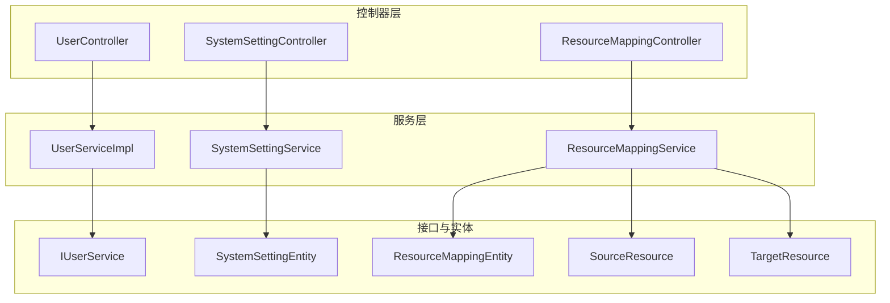
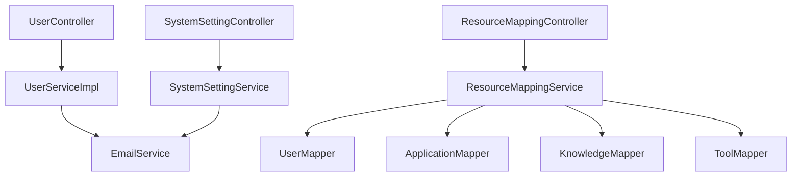
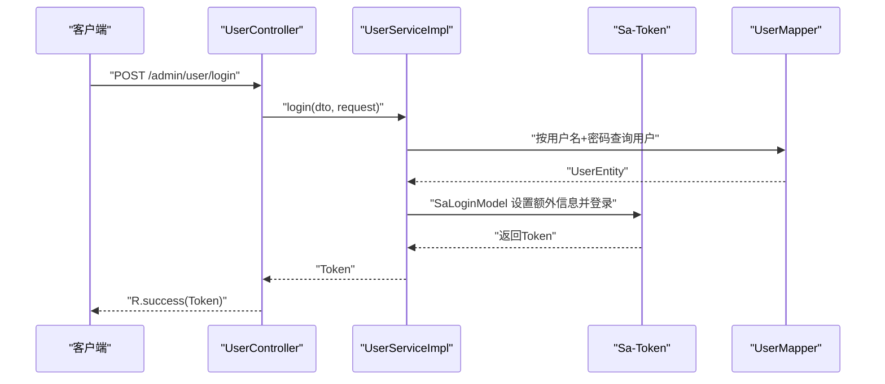
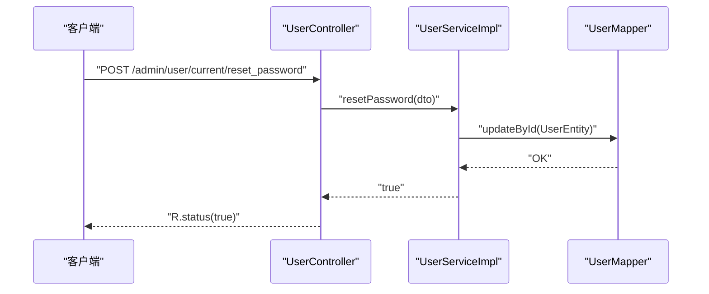
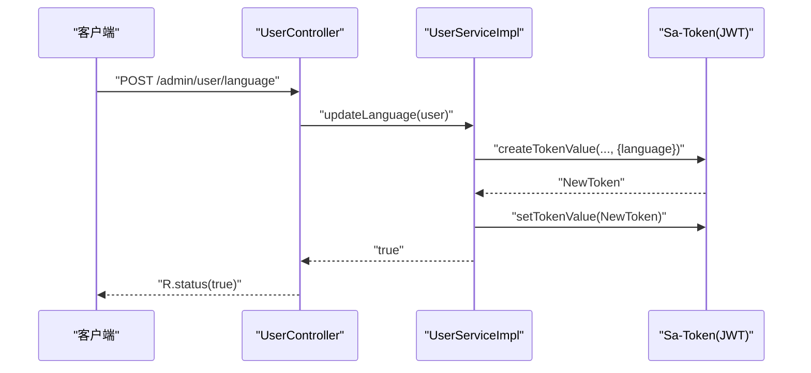
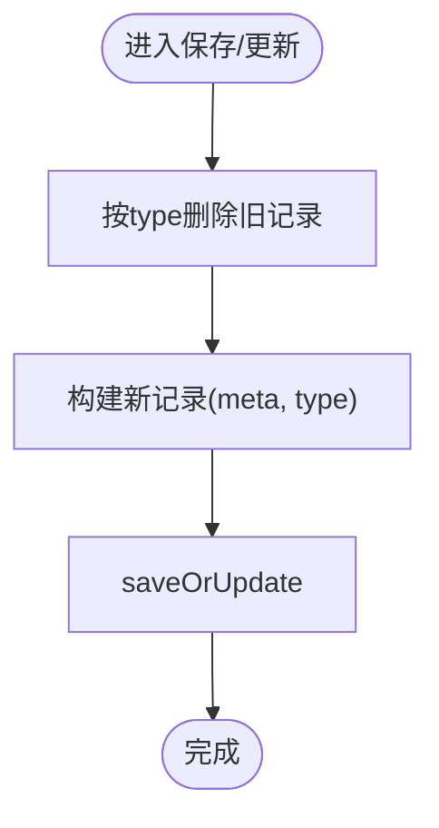
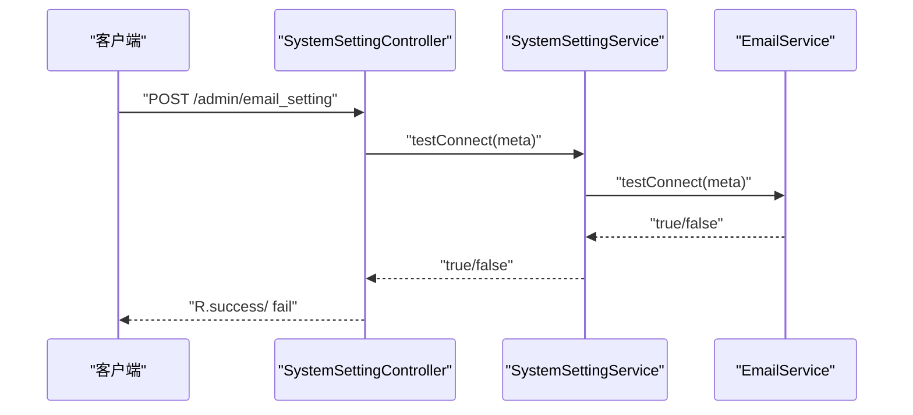
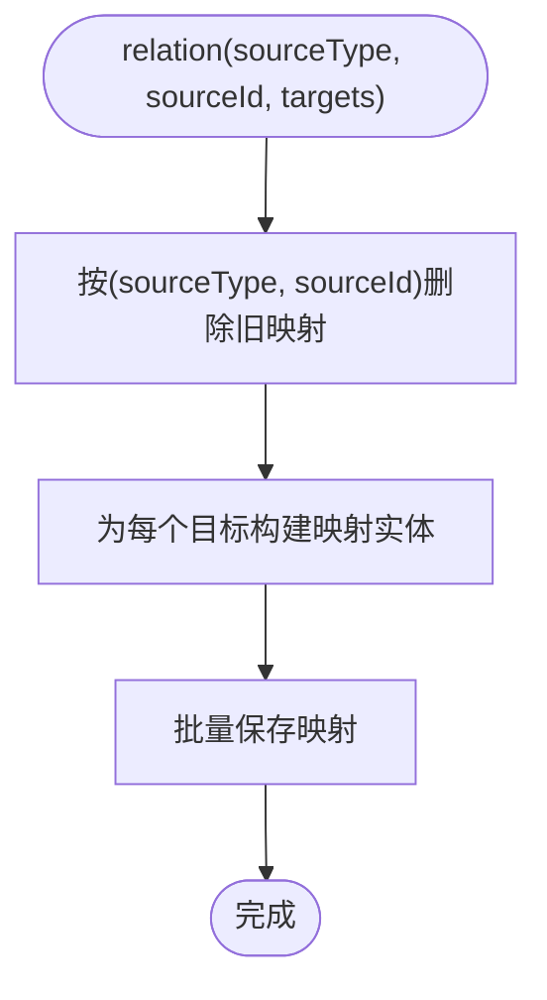
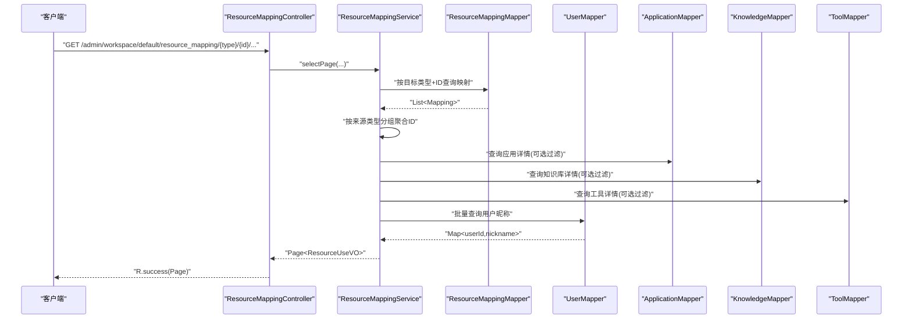
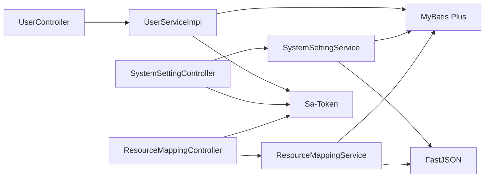

# 系统服务模块 (maxkb4j-system)

<cite>
**本文引用的文件**
- [UserService.java](file://maxkb4j-service/maxkb4j-system/src/main/java/com/maxkb4j/system/service/impl/UserServiceImpl.java)
- [UserController.java](file://maxkb4j-service/maxkb4j-system/src/main/java/com/maxkb4j/system/controller/UserController.java)
- [SystemSettingService.java](file://maxkb4j-service/maxkb4j-system/src/main/java/com/maxkb4j/system/service/SystemSettingService.java)
- [SystemSettingController.java](file://maxkb4j-service/maxkb4j-system/src/main/java/com/maxkb4j/system/controller/SystemSettingController.java)
- [ResourceMappingService.java](file://maxkb4j-service/maxkb4j-system/src/main/java/com/maxkb4j/system/service/ResourceMappingService.java)
- [ResourceMappingController.java](file://maxkb4j-service/maxkb4j-system/src/main/java/com/maxkb4j/system/controller/ResourceMappingController.java)
- [IUserService.java](file://maxkb4j-service-api/maxkb4j-user-api/src/main/java/com/maxkb4j/user/service/IUserService.java)
- [SystemSettingEntity.java](file://maxkb4j-service-api/maxkb4j-system-api/src/main/java/com/maxkb4j/system/entity/SystemSettingEntity.java)
- [ResourceMappingEntity.java](file://maxkb4j-service-api/maxkb4j-system-api/src/main/java/com/maxkb4j/system/entity/ResourceMappingEntity.java)
- [SourceResource.java](file://maxkb4j-service-api/maxkb4j-system-api/src/main/java/com/maxkb4j/system/entity/SourceResource.java)
- [TargetResource.java](file://maxkb4j-service-api/maxkb4j-system-api/src/main/java/com/maxkb4j/system/entity/TargetResource.java)
</cite>

## 目录
1. [简介](#简介)
2. [项目结构](#项目结构)
3. [核心组件](#核心组件)
4. [架构总览](#架构总览)
5. [详细组件分析](#详细组件分析)
6. [依赖分析](#依赖分析)
7. [性能考虑](#性能考虑)
8. [故障排查指南](#故障排查指南)
9. [结论](#结论)
10. [附录：使用指南](#附录使用指南)

## 简介
本文件面向系统服务模块（maxkb4j-system），聚焦三大能力域：
- 用户管理与认证授权：UserService 提供登录、角色与权限查询、密码管理、语言切换等能力，并通过 Sa-Token 实现会话与权限控制。
- 系统设置管理与动态更新：SystemSettingService 负责系统级配置（如邮件设置、展示信息）的持久化与更新，支持测试连通性与类型化存储。
- 资源映射与访问控制：ResourceMappingService 提供资源之间的多对多映射关系维护与分页查询，支撑“某目标资源被哪些来源资源引用”的审计与检索。

## 项目结构
系统服务模块采用按功能域划分的层次化组织方式：
- 控制器层：对外暴露 REST 接口，负责参数接收、鉴权注解与响应封装。
- 服务层：实现业务逻辑，包含用户管理、系统设置、资源映射等核心服务。
- 接口与实体层：位于 API 模块，定义服务接口与数据模型，确保跨模块契约稳定。

图表来源
- [UserController.java:26-96](file://maxkb4j-service/maxkb4j-system/src/main/java/com/maxkb4j/system/controller/UserController.java#L26-L96)
- [SystemSettingController.java:21-67](file://maxkb4j-service/maxkb4j-system/src/main/java/com/maxkb4j/system/controller/SystemSettingController.java#L21-L67)
- [ResourceMappingController.java:19-31](file://maxkb4j-service/maxkb4j-system/src/main/java/com/maxkb4j/system/controller/ResourceMappingController.java#L19-L31)
- [UserServiceImpl.java:49-234](file://maxkb4j-service/maxkb4j-system/src/main/java/com/maxkb4j/system/service/impl/UserServiceImpl.java#L49-L234)
- [SystemSettingService.java:15-33](file://maxkb4j-service/maxkb4j-system/src/main/java/com/maxkb4j/system/service/SystemSettingService.java#L15-L33)
- [ResourceMappingService.java:35-134](file://maxkb4j-service/maxkb4j-system/src/main/java/com/maxkb4j/system/service/ResourceMappingService.java#L35-L134)
- [IUserService.java:13-28](file://maxkb4j-service-api/maxkb4j-user-api/src/main/java/com/maxkb4j/user/service/IUserService.java#L13-L28)
- [SystemSettingEntity.java:14-27](file://maxkb4j-service-api/maxkb4j-system-api/src/main/java/com/maxkb4j/system/entity/SystemSettingEntity.java#L14-L27)
- [ResourceMappingEntity.java:12-20](file://maxkb4j-service-api/maxkb4j-system-api/src/main/java/com/maxkb4j/system/entity/ResourceMappingEntity.java#L12-L20)
- [SourceResource.java:6-15](file://maxkb4j-service-api/maxkb4j-system-api/src/main/java/com/maxkb4j/system/entity/SourceResource.java#L6-L15)
- [TargetResource.java:6-13](file://maxkb4j-service-api/maxkb4j-system-api/src/main/java/com/maxkb4j/system/entity/TargetResource.java#L6-L13)

章节来源
- [UserController.java:26-96](file://maxkb4j-service/maxkb4j-system/src/main/java/com/maxkb4j/system/controller/UserController.java#L26-L96)
- [SystemSettingController.java:21-67](file://maxkb4j-service/maxkb4j-system/src/main/java/com/maxkb4j/system/controller/SystemSettingController.java#L21-L67)
- [ResourceMappingController.java:19-31](file://maxkb4j-service/maxkb4j-system/src/main/java/com/maxkb4j/system/controller/ResourceMappingController.java#L19-L31)

## 核心组件
- 用户管理与认证授权（UserService）
  - 登录校验与会话建立：基于验证码、用户名密码校验后，使用 Sa-Token 创建登录会话并返回令牌。
  - 角色与权限查询：支持按用户 ID 查询权限列表；根据角色动态注入工作区权限占位。
  - 密码管理：支持重置当前用户密码与管理员更新指定用户密码；默认密码比对用于首次登录提示。
  - 语言切换：生成新的 JWT 令牌以携带语言信息，实现无状态会话更新。
  - 邮件验证码：发送修改密码邮件验证码并缓存，支持校验。
- 系统设置管理（SystemSettingService）
  - 类型化配置存储：以 type 字段区分不同类型的系统设置（如邮件、显示信息）。
  - 动态更新：删除旧记录后保存新配置，保证同一类型设置唯一。
  - 测试连通性：委托 EmailService 对邮件配置进行连通性测试。
- 资源映射（ResourceMappingService）
  - 关系维护：支持按来源类型与来源 ID 建立目标资源映射，先清理旧映射再批量写入。
  - 分页查询：按目标资源类型与 ID 查询映射记录，并联动查询来源资源详情（应用、知识库、工具）。
  - 过滤与聚合：支持按来源类型过滤、按来源名称与创建者昵称过滤，聚合用户昵称以丰富 VO 展示。

章节来源
- [UserServiceImpl.java:56-234](file://maxkb4j-service/maxkb4j-system/src/main/java/com/maxkb4j/system/service/impl/UserServiceImpl.java#L56-L234)
- [SystemSettingService.java:17-33](file://maxkb4j-service/maxkb4j-system/src/main/java/com/maxkb4j/system/service/SystemSettingService.java#L17-L33)
- [ResourceMappingService.java:35-134](file://maxkb4j-service/maxkb4j-system/src/main/java/com/maxkb4j/system/service/ResourceMappingService.java#L35-L134)

## 架构总览
系统服务模块遵循典型的分层架构：
- 表现层：REST 控制器负责请求接入与权限注解（如 @SaCheckRole）。
- 应用层：服务实现类承载业务规则与事务边界。
- 数据访问层：MyBatis Plus Mapper/Entity 完成数据库操作。
- 外部集成：EmailService 提供邮件发送与连通性测试能力。

图表来源
- [UserController.java:31-32](file://maxkb4j-service/maxkb4j-system/src/main/java/com/maxkb4j/system/controller/UserController.java#L31-L32)
- [SystemSettingController.java:26-26](file://maxkb4j-service/maxkb4j-system/src/main/java/com/maxkb4j/system/controller/SystemSettingController.java#L26-L26)
- [ResourceMappingController.java:24-24](file://maxkb4j-service/maxkb4j-system/src/main/java/com/maxkb4j/system/controller/ResourceMappingController.java#L24-L24)
- [UserServiceImpl.java:51-53](file://maxkb4j-service/maxkb4j-system/src/main/java/com/maxkb4j/system/service/impl/UserServiceImpl.java#L51-L53)
- [SystemSettingService.java:19-19](file://maxkb4j-service/maxkb4j-system/src/main/java/com/maxkb4j/system/service/SystemSettingService.java#L19-L19)
- [ResourceMappingService.java:38-41](file://maxkb4j-service/maxkb4j-system/src/main/java/com/maxkb4j/system/service/ResourceMappingService.java#L38-L41)

## 详细组件分析

### 用户管理与认证授权（UserService）
- 设计要点
  - 使用 Sa-Token 的 StpKit 与 StpLogic 实现无状态 JWT 登录与令牌刷新。
  - 密码采用 MD5 加盐（由框架统一处理）存储，避免明文泄露。
  - 权限体系通过 StpInterface 获取用户权限列表，结合角色动态注入工作区权限占位。
  - 语言切换通过重新签发带语言信息的 JWT，实现会话内语言生效。
- 关键流程（登录）

图表来源
- [UserController.java:34-38](file://maxkb4j-service/maxkb4j-system/src/main/java/com/maxkb4j/system/controller/UserController.java#L34-L38)
- [UserServiceImpl.java:81-111](file://maxkb4j-service/maxkb4j-system/src/main/java/com/maxkb4j/system/service/impl/UserServiceImpl.java#L81-L111)

- 关键流程（密码重置）

图表来源
- [UserController.java:89-93](file://maxkb4j-service/maxkb4j-system/src/main/java/com/maxkb4j/system/controller/UserController.java#L89-L93)
- [UserServiceImpl.java:189-197](file://maxkb4j-service/maxkb4j-system/src/main/java/com/maxkb4j/system/service/impl/UserServiceImpl.java#L189-L197)

- 关键流程（语言切换）

图表来源
- [UserController.java:41-44](file://maxkb4j-service/maxkb4j-system/src/main/java/com/maxkb4j/system/controller/UserController.java#L41-L44)
- [UserServiceImpl.java:206-213](file://maxkb4j-service/maxkb4j-system/src/main/java/com/maxkb4j/system/service/impl/UserServiceImpl.java#L206-L213)

章节来源
- [UserServiceImpl.java:81-111](file://maxkb4j-service/maxkb4j-system/src/main/java/com/maxkb4j/system/service/impl/UserServiceImpl.java#L81-L111)
- [UserServiceImpl.java:189-197](file://maxkb4j-service/maxkb4j-system/src/main/java/com/maxkb4j/system/service/impl/UserServiceImpl.java#L189-L197)
- [UserServiceImpl.java:206-213](file://maxkb4j-service/maxkb4j-system/src/main/java/com/maxkb4j/system/service/impl/UserServiceImpl.java#L206-L213)
- [UserController.java:34-38](file://maxkb4j-service/maxkb4j-system/src/main/java/com/maxkb4j/system/controller/UserController.java#L34-L38)
- [UserController.java:89-93](file://maxkb4j-service/maxkb4j-system/src/main/java/com/maxkb4j/system/controller/UserController.java#L89-L93)
- [UserController.java:41-44](file://maxkb4j-service/maxkb4j-system/src/main/java/com/maxkb4j/system/controller/UserController.java#L41-L44)

### 系统设置管理（SystemSettingService）
- 设计要点
  - 以 type 字段区分设置类型（如邮件、显示信息），每种类型仅保留一条记录。
  - 保存时先删除旧记录，再新增，确保“最新即有效”。
  - 邮件设置支持测试连通性，便于在保存前验证配置正确性。
- 关键流程（保存/更新）

图表来源
- [SystemSettingService.java:25-32](file://maxkb4j-service/maxkb4j-system/src/main/java/com/maxkb4j/system/service/SystemSettingService.java#L25-L32)

- 关键流程（测试连接）

图表来源
- [SystemSettingController.java:36-44](file://maxkb4j-service/maxkb4j-system/src/main/java/com/maxkb4j/system/controller/SystemSettingController.java#L36-L44)
- [SystemSettingService.java:21-23](file://maxkb4j-service/maxkb4j-system/src/main/java/com/maxkb4j/system/service/SystemSettingService.java#L21-L23)

章节来源
- [SystemSettingService.java:17-33](file://maxkb4j-service/maxkb4j-system/src/main/java/com/maxkb4j/system/service/SystemSettingService.java#L17-L33)
- [SystemSettingController.java:28-50](file://maxkb4j-service/maxkb4j-system/src/main/java/com/maxkb4j/system/controller/SystemSettingController.java#L28-L50)
- [SystemSettingController.java:36-44](file://maxkb4j-service/maxkb4j-system/src/main/java/com/maxkb4j/system/controller/SystemSettingController.java#L36-L44)

### 资源映射（ResourceMappingService）
- 设计要点
  - 映射表支持多来源类型（应用、知识库、工具）到单一目标资源的多对多关系。
  - 关系维护采用“先删后增”，确保映射一致性。
  - 分页查询时按来源类型分组聚合，再批量查询来源资源详情，最后合并用户昵称。
- 关键流程（关系维护）

图表来源
- [ResourceMappingService.java:22-35](file://maxkb4j-service/maxkb4j-system/src/main/java/com/maxkb4j/system/service/ResourceMappingService.java#L22-L35)

- 关键流程（分页查询与过滤）

图表来源
- [ResourceMappingController.java:26-29](file://maxkb4j-service/maxkb4j-system/src/main/java/com/maxkb4j/system/controller/ResourceMappingController.java#L26-L29)
- [ResourceMappingService.java:43-91](file://maxkb4j-service/maxkb4j-system/src/main/java/com/maxkb4j/system/service/ResourceMappingService.java#L43-L91)

章节来源
- [ResourceMappingService.java:22-35](file://maxkb4j-service/maxkb4j-system/src/main/java/com/maxkb4j/system/service/ResourceMappingService.java#L22-L35)
- [ResourceMappingService.java:43-91](file://maxkb4j-service/maxkb4j-system/src/main/java/com/maxkb4j/system/service/ResourceMappingService.java#L43-L91)
- [ResourceMappingController.java:26-29](file://maxkb4j-service/maxkb4j-system/src/main/java/com/maxkb4j/system/controller/ResourceMappingController.java#L26-L29)

## 依赖分析
- 组件耦合
  - 控制器依赖具体服务实现类，便于扩展与替换。
  - 服务层依赖 Mapper 与外部 EmailService，职责清晰。
  - 实体与接口位于 API 模块，形成稳定的契约边界。
- 外部依赖
  - Sa-Token：提供无状态 JWT 登录、权限校验与会话管理。
  - MyBatis Plus：提供通用 CRUD 与分页能力。
  - FastJSON：用于系统设置的 JSON 结构存储与解析。
- 循环依赖
  - 当前模块未见循环依赖迹象，分层清晰。

图表来源
- [UserController.java:31-32](file://maxkb4j-service/maxkb4j-system/src/main/java/com/maxkb4j/system/controller/UserController.java#L31-L32)
- [SystemSettingController.java:26-26](file://maxkb4j-service/maxkb4j-system/src/main/java/com/maxkb4j/system/controller/SystemSettingController.java#L26-L26)
- [ResourceMappingController.java:24-24](file://maxkb4j-service/maxkb4j-system/src/main/java/com/maxkb4j/system/controller/ResourceMappingController.java#L24-L24)
- [UserServiceImpl.java:49-53](file://maxkb4j-service/maxkb4j-system/src/main/java/com/maxkb4j/system/service/impl/UserServiceImpl.java#L49-L53)
- [SystemSettingService.java:19-19](file://maxkb4j-service/maxkb4j-system/src/main/java/com/maxkb4j/system/service/SystemSettingService.java#L19-L19)
- [ResourceMappingService.java:38-41](file://maxkb4j-service/maxkb4j-system/src/main/java/com/maxkb4j/system/service/ResourceMappingService.java#L38-L41)

## 性能考虑
- 分页查询
  - 资源映射分页查询中，先按目标条件筛选映射记录，再按来源类型分组聚合 ID，最后批量查询来源详情，减少多次往返。
- 批量操作
  - 关系维护采用批量保存，降低数据库往返次数。
- 缓存策略
  - 用户昵称通过一次性批量查询并缓存至内存 Map，避免 N+1 查询。
- 事务边界
  - 登录、密码更新、语言切换、关系维护均置于事务中，确保一致性。

## 故障排查指南
- 登录失败
  - 验证码过期或错误：检查会话中的验证码是否匹配。
  - 用户名或密码错误：确认用户名与密码是否正确，且用户处于激活状态。
- 密码重置失败
  - 新密码与确认密码不一致：前端需保证两次输入一致。
  - 更新失败：检查用户 ID 是否正确以及数据库连接状态。
- 邮件设置测试失败
  - 检查邮件服务器地址、端口、账号、密码等配置是否正确。
  - 确认网络可达性与防火墙策略。
- 资源映射查询为空
  - 确认目标资源类型与 ID 是否正确。
  - 检查来源类型过滤条件与名称/用户昵称过滤是否过于严格导致无结果。
- 语言切换无效
  - 确认客户端使用新返回的 Token 发起后续请求。
  - 检查 JWT 中语言字段是否正确写入。

章节来源
- [UserServiceImpl.java:86-101](file://maxkb4j-service/maxkb4j-system/src/main/java/com/maxkb4j/system/service/impl/UserServiceImpl.java#L86-L101)
- [UserController.java:74-79](file://maxkb4j-service/maxkb4j-system/src/main/java/com/maxkb4j/system/controller/UserController.java#L74-L79)
- [SystemSettingController.java:36-44](file://maxkb4j-service/maxkb4j-system/src/main/java/com/maxkb4j/system/controller/SystemSettingController.java#L36-L44)
- [ResourceMappingService.java:43-91](file://maxkb4j-service/maxkb4j-system/src/main/java/com/maxkb4j/system/service/ResourceMappingService.java#L43-L91)

## 结论
系统服务模块围绕用户、系统设置与资源映射三大领域提供了高内聚、低耦合的服务实现。通过 Sa-Token 实现了灵活的认证与权限控制，通过类型化配置与测试连通性保障了系统设置的可靠性，通过多对多映射与分页查询实现了资源关系的可视化与审计能力。整体设计具备良好的扩展性与可维护性。

## 附录：使用指南

### 用户管理与权限控制
- 登录
  - 请求路径：POST /admin/user/login
  - 参数：用户名、密码、验证码
  - 返回：Token（用于后续接口鉴权）
- 修改密码
  - 当前用户重置：POST /admin/user/current/reset_password
  - 管理员更新：PUT /admin/user_manage/{id}
- 语言切换
  - POST /admin/user/language
  - 传入包含语言字段的用户对象
- 权限与角色
  - 通过 StpInterface 获取用户权限列表
  - 角色包含 ADMIN 时自动注入工作区权限占位

章节来源
- [UserController.java:34-38](file://maxkb4j-service/maxkb4j-system/src/main/java/com/maxkb4j/system/controller/UserController.java#L34-L38)
- [UserController.java:89-93](file://maxkb4j-service/maxkb4j-system/src/main/java/com/maxkb4j/system/controller/UserController.java#L89-L93)
- [UserController.java:41-44](file://maxkb4j-service/maxkb4j-system/src/main/java/com/maxkb4j/system/controller/UserController.java#L41-L44)
- [UserServiceImpl.java:152-162](file://maxkb4j-service/maxkb4j-system/src/main/java/com/maxkb4j/system/service/impl/UserServiceImpl.java#L152-L162)

### 系统设置管理
- 邮件设置
  - 获取：GET /admin/email_setting
  - 测试：POST /admin/email_setting（传入配置 JSON）
  - 保存：PUT /admin/email_setting（传入配置 JSON）
- 展示信息
  - 更新：POST /admin/display/update（表单上传）
  - 查询：GET /admin/display/info

章节来源
- [SystemSettingController.java:28-66](file://maxkb4j-service/maxkb4j-system/src/main/java/com/maxkb4j/system/controller/SystemSettingController.java#L28-L66)
- [SystemSettingService.java:21-32](file://maxkb4j-service/maxkb4j-system/src/main/java/com/maxkb4j/system/service/SystemSettingService.java#L21-L32)

### 资源映射与访问控制
- 关系维护
  - POST /admin/workspace/default/resource_mapping/{sourceType}/{sourceId}
  - 请求体：目标资源数组（targetId, targetType）
- 映射查询
  - GET /admin/workspace/default/resource_mapping/{resourceType}/{resourceId}/{current}/{size}
  - 支持过滤参数：resourceName、userName、sourceType[]
  - 返回：分页的资源使用视图（包含来源名称、描述、图标、类型、创建者昵称）

章节来源
- [ResourceMappingService.java:22-35](file://maxkb4j-service/maxkb4j-system/src/main/java/com/maxkb4j/system/service/ResourceMappingService.java#L22-L35)
- [ResourceMappingController.java:26-29](file://maxkb4j-service/maxkb4j-system/src/main/java/com/maxkb4j/system/controller/ResourceMappingController.java#L26-L29)