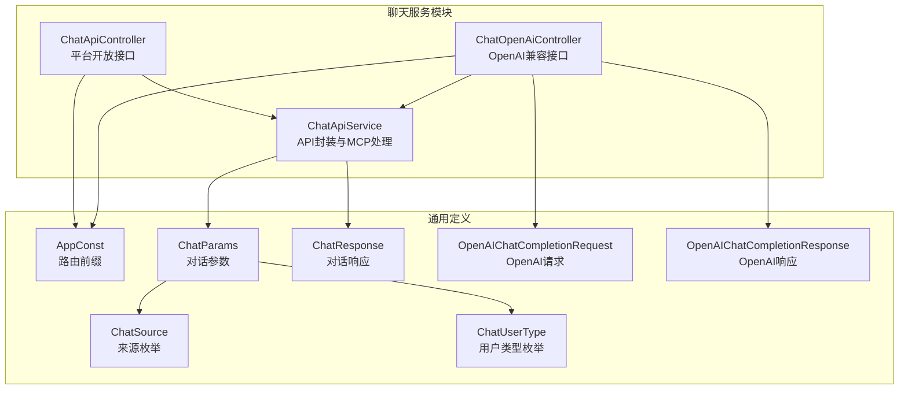
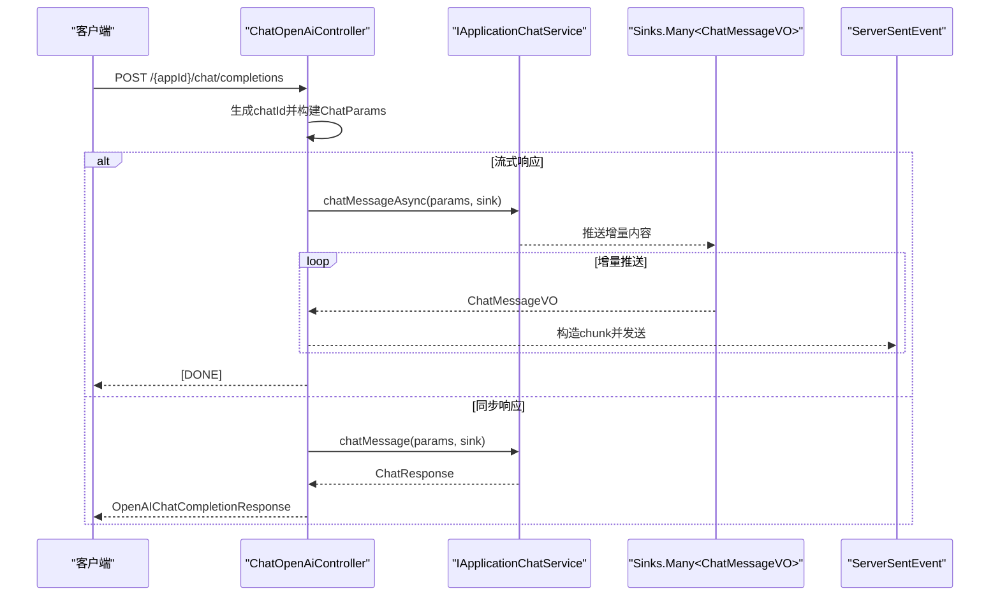
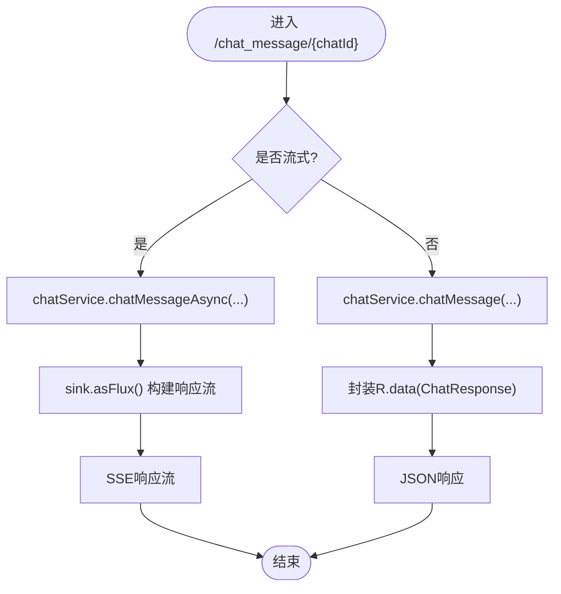
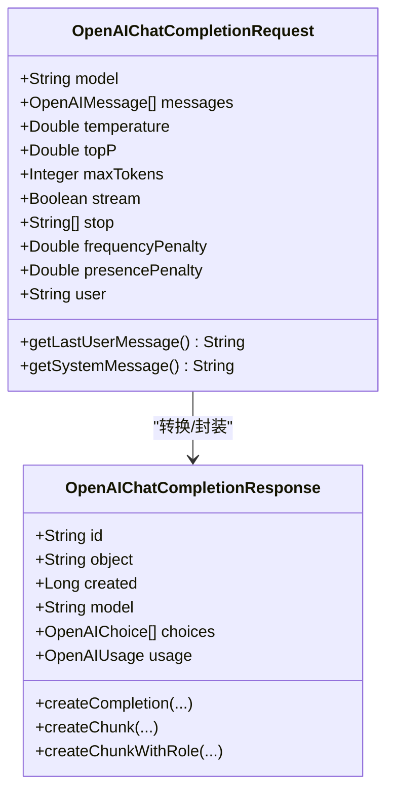
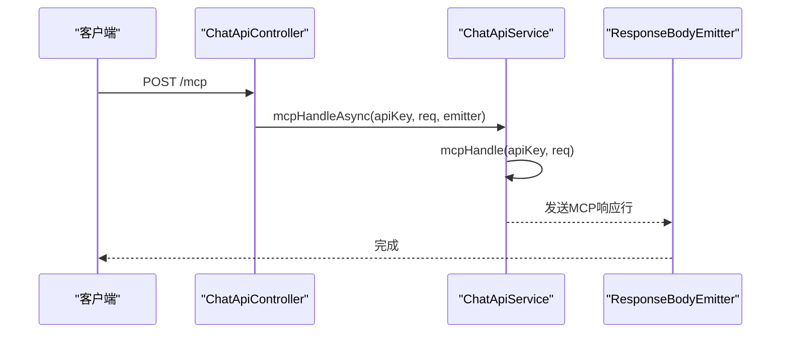
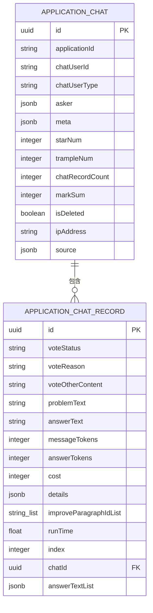
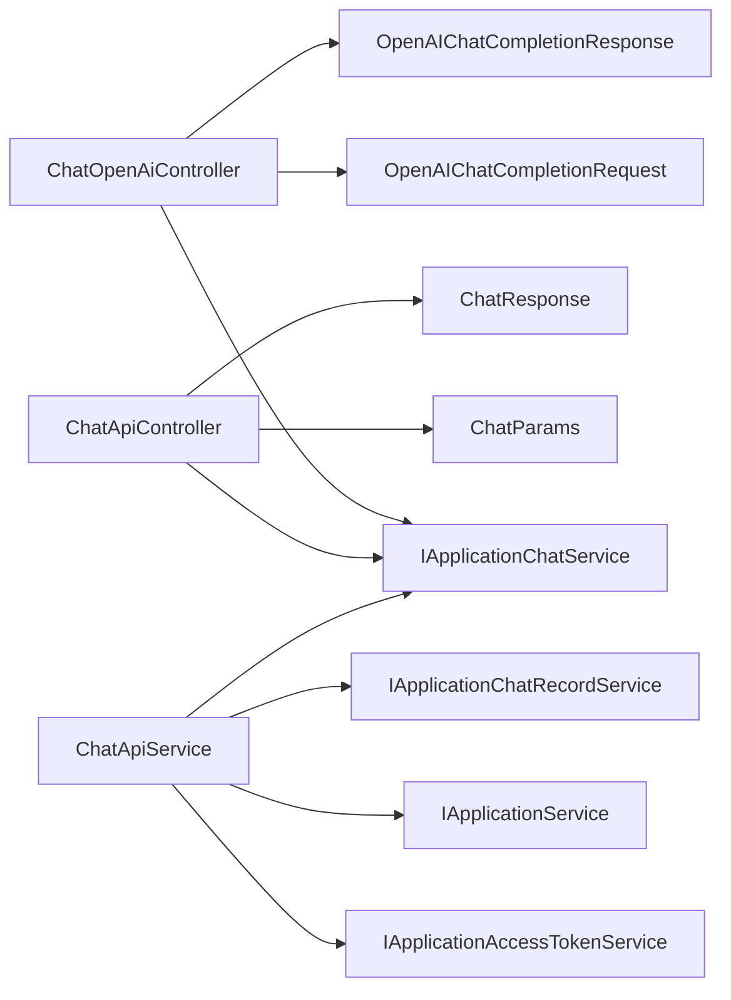

# 聊天服务模块 (maxkb4j-chat)

<cite>
**本文引用的文件**
- [ChatApiController.java](file://maxkb4j-service/maxkb4j-chat/src/main/java/com/maxkb4j/chat/controller/ChatApiController.java)
- [ChatOpenAiController.java](file://maxkb4j-service/maxkb4j-chat/src/main/java/com/maxkb4j/chat/controller/ChatOpenAiController.java)
- [ChatApiService.java](file://maxkb4j-service/maxkb4j-chat/src/main/java/com/maxkb4j/chat/service/ChatApiService.java)
- [ChatParams.java](file://maxkb4j-common/src/main/java/com/maxkb4j/common/domain/dto/ChatParams.java)
- [ChatResponse.java](file://maxkb4j-common/src/main/java/com/maxkb4j/common/domain/dto/ChatResponse.java)
- [OpenAIChatCompletionRequest.java](file://maxkb4j-common/src/main/java/com/maxkb4j/common/domain/dto/OpenAIChatCompletionRequest.java)
- [OpenAIChatCompletionResponse.java](file://maxkb4j-common/src/main/java/com/maxkb4j/common/domain/dto/OpenAIChatCompletionResponse.java)
- [AppConst.java](file://maxkb4j-common/src/main/java/com/maxkb4j/common/constant/AppConst.java)
- [ChatSource.java](file://maxkb4j-common/src/main/java/com/maxkb4j/common/enums/ChatSource.java)
- [ChatUserType.java](file://maxkb4j-common/src/main/java/com/maxkb4j/common/enums/ChatUserType.java)
- [ApplicationChatEntity.java](file://maxkb4j-service-api/maxkb4j-application-api/src/main/java/com/maxkb4j/application/entity/ApplicationChatEntity.java)
- [ApplicationChatRecordEntity.java](file://maxkb4j-service-api/maxkb4j-application-api/src/main/java/com/maxkb4j/application/entity/ApplicationChatRecordEntity.java)
- [ShareChatVO.java](file://maxkb4j-service-api/maxkb4j-application-api/src/main/java/com/maxkb4j/application/vo/ShareChatVO.java)
</cite>

## 目录
1. [简介](#简介)
2. [项目结构](#项目结构)
3. [核心组件](#核心组件)
4. [架构总览](#架构总览)
5. [详细组件分析](#详细组件分析)
6. [依赖分析](#依赖分析)
7. [性能考虑](#性能考虑)
8. [故障排查指南](#故障排查指南)
9. [结论](#结论)
10. [附录：API使用与SDK集成](#附录api使用与sdk集成)

## 简介
本技术文档聚焦于聊天服务模块（maxkb4j-chat），系统性阐述对话API的设计架构与OpenAI兼容接口的实现细节。重点解析以下方面：
- ChatApiService 的API封装与会话管理
- ChatOpenAiController 的OpenAI兼容适配与流式响应
- 实时聊天、流式响应与WebSocket/Server-Sent Events集成机制
- 认证方式、请求格式与响应结构
- 完整的API使用示例与SDK集成指南

## 项目结构
聊天服务模块位于 maxkb4j-service/maxkb4j-chat 下，包含控制器与服务层：
- 控制器层：ChatApiController（平台开放接口）、ChatOpenAiController（OpenAI兼容）
- 服务层：ChatApiService（统一API封装、MCP处理、历史会话等）

图表来源
- [ChatApiController.java:43-222](file://maxkb4j-service/maxkb4j-chat/src/main/java/com/maxkb4j/chat/controller/ChatApiController.java#L43-L222)
- [ChatOpenAiController.java:24-132](file://maxkb4j-service/maxkb4j-chat/src/main/java/com/maxkb4j/chat/controller/ChatOpenAiController.java#L24-L132)
- [ChatApiService.java:35-181](file://maxkb4j-service/maxkb4j-chat/src/main/java/com/maxkb4j/chat/service/ChatApiService.java#L35-L181)
- [AppConst.java:3-12](file://maxkb4j-common/src/main/java/com/maxkb4j/common/constant/AppConst.java#L3-L12)
- [ChatParams.java:14-65](file://maxkb4j-common/src/main/java/com/maxkb4j/common/domain/dto/ChatParams.java#L14-L65)
- [ChatResponse.java:10-64](file://maxkb4j-common/src/main/java/com/maxkb4j/common/domain/dto/ChatResponse.java#L10-L64)
- [OpenAIChatCompletionRequest.java:12-98](file://maxkb4j-common/src/main/java/com/maxkb4j/common/domain/dto/OpenAIChatCompletionRequest.java#L12-L98)
- [OpenAIChatCompletionResponse.java:15-95](file://maxkb4j-common/src/main/java/com/maxkb4j/common/domain/dto/OpenAIChatCompletionResponse.java#L15-L95)
- [ChatSource.java:3-13](file://maxkb4j-common/src/main/java/com/maxkb4j/common/enums/ChatSource.java#L3-L13)
- [ChatUserType.java:3-14](file://maxkb4j-common/src/main/java/com/maxkb4j/common/enums/ChatUserType.java#L3-L14)

章节来源
- [ChatApiController.java:43-222](file://maxkb4j-service/maxkb4j-chat/src/main/java/com/maxkb4j/chat/controller/ChatApiController.java#L43-L222)
- [ChatOpenAiController.java:24-132](file://maxkb4j-service/maxkb4j-chat/src/main/java/com/maxkb4j/chat/controller/ChatOpenAiController.java#L24-L132)
- [ChatApiService.java:35-181](file://maxkb4j-service/maxkb4j-chat/src/main/java/com/maxkb4j/chat/service/ChatApiService.java#L35-L181)
- [AppConst.java:3-12](file://maxkb4j-common/src/main/java/com/maxkb4j/common/constant/AppConst.java#L3-L12)

## 核心组件
- ChatApiController：提供平台开放接口，包括会话打开、消息发送、历史会话、投票更新、语音转写/合成、嵌入脚本、分享链接等能力；支持SSE流式响应与同步响应。
- ChatOpenAiController：提供OpenAI兼容的 /{appId}/chat/completions 接口，自动将OpenAI请求转换为内部ChatParams并返回OpenAI格式的响应（含流式chunk）。
- ChatApiService：统一的API封装层，负责认证令牌生成、应用信息查询、历史会话分页与清理、投票统计与会话更新、以及MCP（Model Context Protocol）处理。

章节来源
- [ChatApiController.java:47-222](file://maxkb4j-service/maxkb4j-chat/src/main/java/com/maxkb4j/chat/controller/ChatApiController.java#L47-L222)
- [ChatOpenAiController.java:29-132](file://maxkb4j-service/maxkb4j-chat/src/main/java/com/maxkb4j/chat/controller/ChatOpenAiController.java#L29-L132)
- [ChatApiService.java:37-181](file://maxkb4j-service/maxkb4j-chat/src/main/java/com/maxkb4j/chat/service/ChatApiService.java#L37-L181)

## 架构总览
聊天服务模块采用“控制器-服务-通用DTO/枚举”的分层设计，结合Spring MVC与Reactor响应式流，实现同步与流式两种响应模式。OpenAI兼容控制器通过请求转换与响应包装，确保与OpenAI生态的无缝对接。

图表来源
- [ChatOpenAiController.java:34-118](file://maxkb4j-service/maxkb4j-chat/src/main/java/com/maxkb4j/chat/controller/ChatOpenAiController.java#L34-L118)
- [OpenAIChatCompletionResponse.java:58-95](file://maxkb4j-common/src/main/java/com/maxkb4j/common/domain/dto/OpenAIChatCompletionResponse.java#L58-L95)

## 详细组件分析

### ChatApiController 分析
- 会话生命周期管理：提供 /open 获取会话ID，用于后续消息发送。
- 对话消息：支持同步与流式两种模式，基于SSE返回；流式模式使用Sinks与Flux进行增量推送。
- 历史会话：分页查询、按会话ID查询记录、更新/删除会话、清空历史、投票更新。
- 媒体能力：语音转文本、文本转语音（返回音频字节流）。
- 分享能力：生成分享链接与获取分享详情。
- MCP请求：通过 /mcp 接收MCP请求并异步处理，返回标准MCP响应行。

图表来源
- [ChatApiController.java:94-116](file://maxkb4j-service/maxkb4j-chat/src/main/java/com/maxkb4j/chat/controller/ChatApiController.java#L94-L116)

章节来源
- [ChatApiController.java:47-222](file://maxkb4j-service/maxkb4j-chat/src/main/java/com/maxkb4j/chat/controller/ChatApiController.java#L47-L222)

### ChatOpenAiController 分析
- 兼容性设计：接收OpenAI风格的请求，提取最后一条用户消息作为核心输入。
- 参数转换：将OpenAI请求映射到内部ChatParams，设置来源为API_CALL、匿名用户类型等。
- 响应封装：同步响应直接返回OpenAIChatCompletionResponse；流式响应通过ServerSentEvent以chunk形式推送，末尾发送[DONE]标记。
- 安全与超时：流式响应设置超时保护，异常时安全降级为[DONE]。

图表来源
- [OpenAIChatCompletionRequest.java:12-98](file://maxkb4j-common/src/main/java/com/maxkb4j/common/domain/dto/OpenAIChatCompletionRequest.java#L12-L98)
- [OpenAIChatCompletionResponse.java:15-95](file://maxkb4j-common/src/main/java/com/maxkb4j/common/domain/dto/OpenAIChatCompletionResponse.java#L15-L95)

章节来源
- [ChatOpenAiController.java:29-132](file://maxkb4j-service/maxkb4j-chat/src/main/java/com/maxkb4j/chat/controller/ChatOpenAiController.java#L29-L132)

### ChatApiService 分析
- 认证与令牌：根据accessToken生成平台令牌，注入应用上下文与用户信息，便于后续会话与权限控制。
- 应用信息：合并访问令牌中的语言、来源显示等配置到应用视图对象。
- 历史会话：基于当前登录用户与应用ID进行分页查询与清理。
- 投票统计：根据会话下所有记录的投票状态计算星数与踩数，并更新会话统计。
- MCP处理：支持 initialize/notifications/initialized/ping/tools/list/tools/call 等方法，工具调用时自动发起一次对话并返回文本内容。

图表来源
- [ChatApiController.java:118-130](file://maxkb4j-service/maxkb4j-chat/src/main/java/com/maxkb4j/chat/controller/ChatApiController.java#L118-L130)
- [ChatApiService.java:110-180](file://maxkb4j-service/maxkb4j-chat/src/main/java/com/maxkb4j/chat/service/ChatApiService.java#L110-L180)

章节来源
- [ChatApiService.java:37-181](file://maxkb4j-service/maxkb4j-chat/src/main/java/com/maxkb4j/chat/service/ChatApiService.java#L37-L181)

### 数据模型与枚举
- ChatParams：对话请求参数，包含消息、会话ID、流式标志、来源、用户标识等。
- ChatResponse：对话响应，聚合答案列表与运行详情，提供统计与拼接能力。
- OpenAIChatCompletionRequest/Response：OpenAI兼容的请求/响应模型，支持流式chunk与完整响应。
- ChatSource/ChatUserType：会话来源与用户类型的枚举，用于区分不同接入渠道与用户身份。

图表来源
- [ApplicationChatEntity.java:18-35](file://maxkb4j-service-api/maxkb4j-application-api/src/main/java/com/maxkb4j/application/entity/ApplicationChatEntity.java#L18-L35)
- [ApplicationChatRecordEntity.java:21-41](file://maxkb4j-service-api/maxkb4j-application-api/src/main/java/com/maxkb4j/application/entity/ApplicationChatRecordEntity.java#L21-L41)

章节来源
- [ChatParams.java:14-65](file://maxkb4j-common/src/main/java/com/maxkb4j/common/domain/dto/ChatParams.java#L14-L65)
- [ChatResponse.java:10-64](file://maxkb4j-common/src/main/java/com/maxkb4j/common/domain/dto/ChatResponse.java#L10-L64)
- [OpenAIChatCompletionRequest.java:12-98](file://maxkb4j-common/src/main/java/com/maxkb4j/common/domain/dto/OpenAIChatCompletionRequest.java#L12-L98)
- [OpenAIChatCompletionResponse.java:15-95](file://maxkb4j-common/src/main/java/com/maxkb4j/common/domain/dto/OpenAIChatCompletionResponse.java#L15-L95)
- [ChatSource.java:3-13](file://maxkb4j-common/src/main/java/com/maxkb4j/common/enums/ChatSource.java#L3-L13)
- [ChatUserType.java:3-14](file://maxkb4j-common/src/main/java/com/maxkb4j/common/enums/ChatUserType.java#L3-L14)
- [ApplicationChatEntity.java:18-35](file://maxkb4j-service-api/maxkb4j-application-api/src/main/java/com/maxkb4j/application/entity/ApplicationChatEntity.java#L18-L35)
- [ApplicationChatRecordEntity.java:21-41](file://maxkb4j-service-api/maxkb4j-application-api/src/main/java/com/maxkb4j/application/entity/ApplicationChatRecordEntity.java#L21-L41)

## 依赖分析
- 控制器依赖服务：ChatApiController与ChatOpenAiController均依赖IApplicationChatService进行对话处理。
- 服务层依赖：ChatApiService依赖多类服务（应用、访问令牌、会话、记录、版本等）完成统一封装。
- 响应式与SSE：控制器通过Sinks与Flux/SSE实现流式响应；OpenAI控制器通过ServerSentEvent输出chunk。
- DTO与枚举：ChatParams、ChatResponse、OpenAI兼容类贯穿请求转换与响应封装。

图表来源
- [ChatApiController.java:49-54](file://maxkb4j-service/maxkb4j-chat/src/main/java/com/maxkb4j/chat/controller/ChatApiController.java#L49-L54)
- [ChatOpenAiController.java:31-31](file://maxkb4j-service/maxkb4j-chat/src/main/java/com/maxkb4j/chat/controller/ChatOpenAiController.java#L31-L31)
- [ChatApiService.java:39-43](file://maxkb4j-service/maxkb4j-chat/src/main/java/com/maxkb4j/chat/service/ChatApiService.java#L39-L43)

章节来源
- [ChatApiController.java:49-54](file://maxkb4j-service/maxkb4j-chat/src/main/java/com/maxkb4j/chat/controller/ChatApiController.java#L49-L54)
- [ChatOpenAiController.java:31-31](file://maxkb4j-service/maxkb4j-chat/src/main/java/com/maxkb4j/chat/controller/ChatOpenAiController.java#L31-L31)
- [ChatApiService.java:39-43](file://maxkb4j-service/maxkb4j-chat/src/main/java/com/maxkb4j/chat/service/ChatApiService.java#L39-L43)

## 性能考虑
- 流式响应：使用SSE与Reactor流，避免一次性聚合大量内容，降低内存峰值与延迟。
- 超时与错误恢复：流式响应设置超时保护，异常时快速结束流，避免资源泄漏。
- 异步处理：MCP请求通过@Async异步处理，避免阻塞主线程。
- 分页查询：历史会话采用分页查询，减少数据库压力与网络传输。

## 故障排查指南
- 认证失败：检查访问令牌有效性与激活状态；确认请求头或参数传递正确。
- 流式响应中断：检查网络稳定性与超时设置；确认客户端正确处理SSE事件。
- OpenAI兼容响应异常：核对请求字段（如model、messages、stream）是否符合规范。
- MCP工具调用失败：确认工具清单与调用参数格式，查看服务端日志定位异常。

章节来源
- [ChatApiController.java:118-130](file://maxkb4j-service/maxkb4j-chat/src/main/java/com/maxkb4j/chat/controller/ChatApiController.java#L118-L130)
- [ChatOpenAiController.java:66-96](file://maxkb4j-service/maxkb4j-chat/src/main/java/com/maxkb4j/chat/controller/ChatOpenAiController.java#L66-L96)
- [ChatApiService.java:110-180](file://maxkb4j-service/maxkb4j-chat/src/main/java/com/maxkb4j/chat/service/ChatApiService.java#L110-L180)

## 结论
聊天服务模块通过清晰的分层设计与OpenAI兼容接口，实现了从平台开放API到外部生态的无缝对接。其流式响应与异步处理机制保证了实时性与可扩展性，配合完善的会话与历史管理能力，满足多样化的应用场景。

## 附录：API使用与SDK集成

### 认证方式
- 平台开放接口：通过访问令牌换取平台令牌，注入用户上下文后进行会话操作。
- OpenAI兼容接口：使用应用级API密钥进行认证，控制器内部校验密钥有效性。

章节来源
- [ChatApiController.java:57-74](file://maxkb4j-service/maxkb4j-chat/src/main/java/com/maxkb4j/chat/controller/ChatApiController.java#L57-L74)
- [ChatOpenAiController.java:34-45](file://maxkb4j-service/maxkb4j-chat/src/main/java/com/maxkb4j/chat/controller/ChatOpenAiController.java#L34-L45)
- [ChatApiService.java:46-60](file://maxkb4j-service/maxkb4j-chat/src/main/java/com/maxkb4j/chat/service/ChatApiService.java#L46-L60)

### 请求与响应结构
- 平台开放接口
  - 获取会话ID：GET /open → 返回会话ID
  - 发送消息（同步）：POST /chat_message/{chatId}（非流式）→ 返回R.data(ChatResponse)
  - 发送消息（流式）：POST /chat_message/{chatId}（流式）→ SSE增量推送
  - 历史会话：GET /historical_conversation/{current}/{size} → 分页会话列表
  - 投票更新：PUT /vote/chat/{chatId}/chat_record/{chatRecordId} → 更新投票状态并重算会话统计
  - 语音能力：POST /speech_to_text（MP3音频文件）→ 文本；POST /text_to_speech（JSON）→ MP3字节流
  - 分享能力：POST /{id}/chat/{chatId}/share_chat → 生成分享链接；GET /share/{id} → 获取分享详情
- OpenAI兼容接口
  - 兼容路径：POST /{appId}/chat/completions
  - 请求体：OpenAIChatCompletionRequest（包含model、messages、temperature、top_p、max_tokens、stream、stop、frequency_penalty、presence_penalty、user）
  - 响应体：OpenAIChatCompletionResponse（非流式）或SSE chunk（流式）

章节来源
- [ChatApiController.java:87-219](file://maxkb4j-service/maxkb4j-chat/src/main/java/com/maxkb4j/chat/controller/ChatApiController.java#L87-L219)
- [ChatOpenAiController.java:34-118](file://maxkb4j-service/maxkb4j-chat/src/main/java/com/maxkb4j/chat/controller/ChatOpenAiController.java#L34-L118)
- [OpenAIChatCompletionRequest.java:12-98](file://maxkb4j-common/src/main/java/com/maxkb4j/common/domain/dto/OpenAIChatCompletionRequest.java#L12-L98)
- [OpenAIChatCompletionResponse.java:58-95](file://maxkb4j-common/src/main/java/com/maxkb4j/common/domain/dto/OpenAIChatCompletionResponse.java#L58-L95)

### 实时聊天与流式响应
- 流式响应：控制器通过SSE向客户端推送增量内容，客户端需正确解析chunk事件并在收到[DONE]后结束连接。
- 超时与错误：流式响应设置超时保护，异常时自动发送[DONE]以确保客户端正确关闭连接。

章节来源
- [ChatApiController.java:94-116](file://maxkb4j-service/maxkb4j-chat/src/main/java/com/maxkb4j/chat/controller/ChatApiController.java#L94-L116)
- [ChatOpenAiController.java:66-96](file://maxkb4j-service/maxkb4j-chat/src/main/java/com/maxkb4j/chat/controller/ChatOpenAiController.java#L66-L96)

### WebSocket集成机制
- 当前实现采用Server-Sent Events（SSE）进行流式推送，未直接使用WebSocket。
- 若需WebSocket集成，可在现有控制器基础上增加WebSocket端点，复用ChatParams与ChatResponse的转换逻辑，将SSE事件映射为WebSocket消息帧。

章节来源
- [ChatApiController.java:94-116](file://maxkb4j-service/maxkb4j-chat/src/main/java/com/maxkb4j/chat/controller/ChatApiController.java#L94-L116)
- [ChatOpenAiController.java:66-96](file://maxkb4j-service/maxkb4j-chat/src/main/java/com/maxkb4j/chat/controller/ChatOpenAiController.java#L66-L96)

### SDK集成指南
- OpenAI兼容SDK：直接使用OpenAI SDK，将服务端地址指向 /{appId}/chat/completions，保持请求字段一致即可。
- 平台SDK：建议封装统一的HTTP客户端，自动处理访问令牌换取、会话ID获取、历史会话分页、投票更新与媒体能力调用。
- 流式处理：SDK需正确解析SSE事件，逐条拼接增量内容并在[DONE]时结束。

章节来源
- [ChatOpenAiController.java:34-118](file://maxkb4j-service/maxkb4j-chat/src/main/java/com/maxkb4j/chat/controller/ChatOpenAiController.java#L34-L118)
- [ChatApiController.java:87-219](file://maxkb4j-service/maxkb4j-chat/src/main/java/com/maxkb4j/chat/controller/ChatApiController.java#L87-L219)