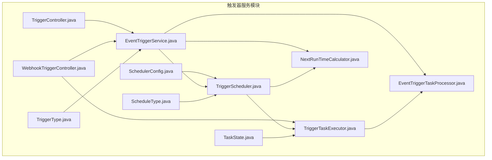
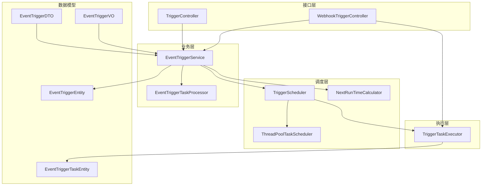
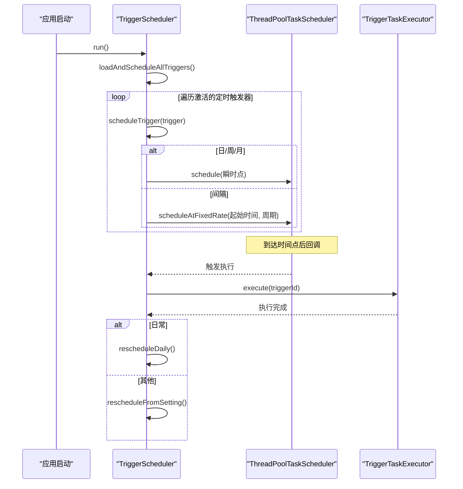
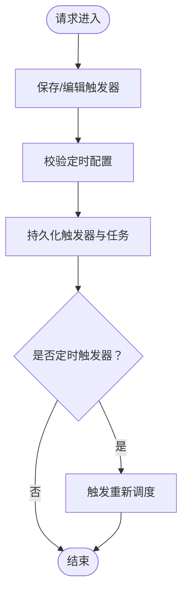
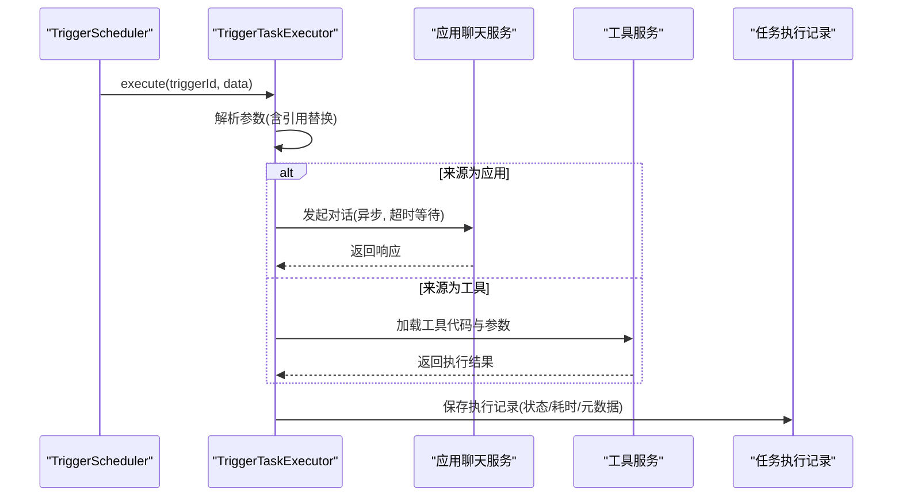
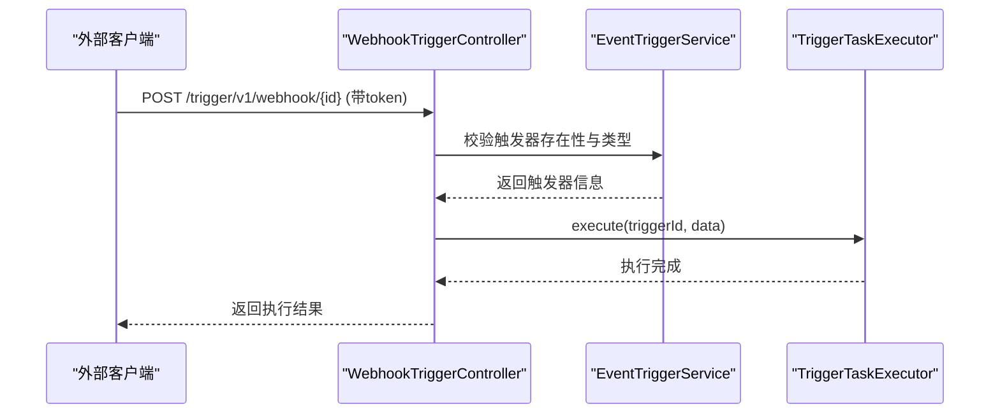
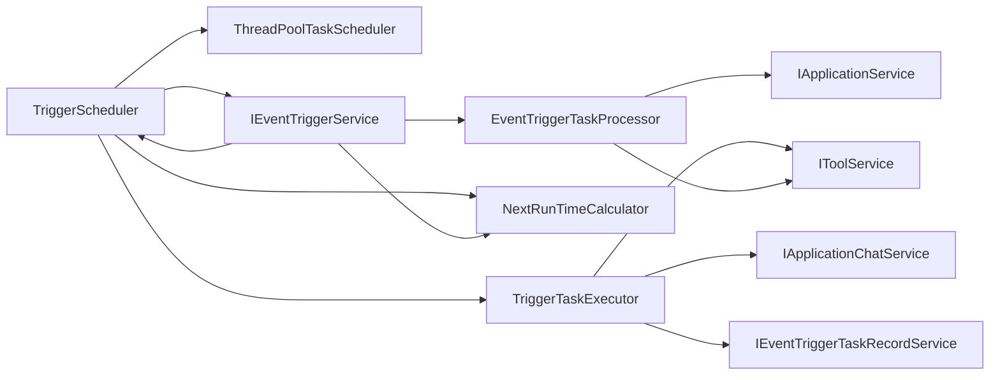
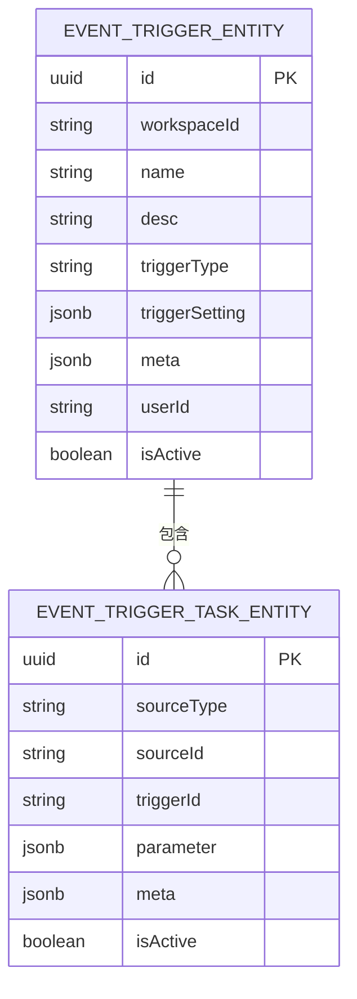

# 触发器服务模块 (maxkb4j-trigger)

<cite>
**本文引用的文件**
- [TriggerScheduler.java](file://maxkb4j-service/maxkb4j-trigger/src/main/java/com/maxkb4j/trigger/service/TriggerScheduler.java)
- [EventTriggerService.java](file://maxkb4j-service/maxkb4j-trigger/src/main/java/com/maxkb4j/trigger/service/EventTriggerService.java)
- [TriggerTaskExecutor.java](file://maxkb4j-service/maxkb4j-trigger/src/main/java/com/maxkb4j/trigger/service/TriggerTaskExecutor.java)
- [NextRunTimeCalculator.java](file://maxkb4j-service/maxkb4j-trigger/src/main/java/com/maxkb4j/trigger/service/NextRunTimeCalculator.java)
- [EventTriggerTaskProcessor.java](file://maxkb4j-service/maxkb4j-trigger/src/main/java/com/maxkb4j/trigger/service/EventTriggerTaskProcessor.java)
- [TriggerController.java](file://maxkb4j-service/maxkb4j-trigger/src/main/java/com/maxkb4j/trigger/controller/TriggerController.java)
- [WebhookTriggerController.java](file://maxkb4j-service/maxkb4j-trigger/src/main/java/com/maxkb4j/trigger/controller/WebhookTriggerController.java)
- [SchedulerConfig.java](file://maxkb4j-service/maxkb4j-trigger/src/main/java/com/maxkb4j/trigger/config/SchedulerConfig.java)
- [ScheduleType.java](file://maxkb4j-service/maxkb4j-trigger/src/main/java/com/maxkb4j/trigger/enums/ScheduleType.java)
- [TaskState.java](file://maxkb4j-service/maxkb4j-trigger/src/main/java/com/maxkb4j/trigger/enums/TaskState.java)
- [TriggerType.java](file://maxkb4j-service/maxkb4j-trigger/src/main/java/com/maxkb4j/trigger/enums/TriggerType.java)
- [EventTriggerEntity.java](file://maxkb4j-service-api/maxkb4j-trigger-api/src/main/java/com/maxkb4j/trigger/entity/EventTriggerEntity.java)
- [EventTriggerTaskEntity.java](file://maxkb4j-service-api/maxkb4j-trigger-api/src/main/java/com/maxkb4j/trigger/entity/EventTriggerTaskEntity.java)
- [EventTriggerDTO.java](file://maxkb4j-service-api/maxkb4j-trigger-api/src/main/java/com/maxkb4j/trigger/dto/EventTriggerDTO.java)
- [EventTriggerVO.java](file://maxkb4j-service-api/maxkb4j-trigger-api/src/main/java/com/maxkb4j/trigger/vo/EventTriggerVO.java)
</cite>

## 目录
1. [简介](#简介)
2. [项目结构](#项目结构)
3. [核心组件](#核心组件)
4. [架构总览](#架构总览)
5. [详细组件分析](#详细组件分析)
6. [依赖分析](#依赖分析)
7. [性能考虑](#性能考虑)
8. [故障排查指南](#故障排查指南)
9. [结论](#结论)
10. [附录](#附录)

## 简介
本技术文档聚焦于触发器服务模块（maxkb4j-trigger），系统性阐述定时任务调度与事件驱动触发器的设计与实现。重点覆盖以下方面：
- 定时任务调度系统：TriggerScheduler 的调度算法、任务队列管理与重调度机制
- 事件驱动触发器：EventTriggerService 的事件监听与处理流程
- 任务执行策略与并发控制：TriggerTaskExecutor 的执行模型与记录落盘
- 调度类型配置示例与 Webhook 集成方案

## 项目结构
触发器服务模块位于 maxkb4j-service/maxkb4j-trigger 中，采用按功能域划分的层次化组织方式：
- config：调度线程池配置
- controller：触发器管理与 Webhook 接口
- service：调度器、任务执行器、任务处理器、下次运行时间计算等核心服务
- enums：调度类型、任务状态、触发器类型等枚举

**图表来源**
- [SchedulerConfig.java:1-20](file://maxkb4j-service/maxkb4j-trigger/src/main/java/com/maxkb4j/trigger/config/SchedulerConfig.java#L1-L20)
- [TriggerController.java:1-123](file://maxkb4j-service/maxkb4j-trigger/src/main/java/com/maxkb4j/trigger/controller/TriggerController.java#L1-L123)
- [WebhookTriggerController.java:1-60](file://maxkb4j-service/maxkb4j-trigger/src/main/java/com/maxkb4j/trigger/controller/WebhookTriggerController.java#L1-L60)
- [TriggerScheduler.java:1-233](file://maxkb4j-service/maxkb4j-trigger/src/main/java/com/maxkb4j/trigger/service/TriggerScheduler.java#L1-L233)
- [EventTriggerService.java:1-248](file://maxkb4j-service/maxkb4j-trigger/src/main/java/com/maxkb4j/trigger/service/EventTriggerService.java#L1-L248)
- [TriggerTaskExecutor.java:1-185](file://maxkb4j-service/maxkb4j-trigger/src/main/java/com/maxkb4j/trigger/service/TriggerTaskExecutor.java#L1-L185)
- [NextRunTimeCalculator.java:1-83](file://maxkb4j-service/maxkb4j-trigger/src/main/java/com/maxkb4j/trigger/service/NextRunTimeCalculator.java#L1-L83)
- [EventTriggerTaskProcessor.java:1-139](file://maxkb4j-service/maxkb4j-trigger/src/main/java/com/maxkb4j/trigger/service/EventTriggerTaskProcessor.java#L1-L139)
- [ScheduleType.java:1-30](file://maxkb4j-service/maxkb4j-trigger/src/main/java/com/maxkb4j/trigger/enums/ScheduleType.java#L1-L30)
- [TaskState.java:1-9](file://maxkb4j-service/maxkb4j-trigger/src/main/java/com/maxkb4j/trigger/enums/TaskState.java#L1-L9)
- [TriggerType.java:1-7](file://maxkb4j-service/maxkb4j-trigger/src/main/java/com/maxkb4j/trigger/enums/TriggerType.java#L1-L7)

**章节来源**
- [TriggerController.java:1-123](file://maxkb4j-service/maxkb4j-trigger/src/main/java/com/maxkb4j/trigger/controller/TriggerController.java#L1-L123)
- [WebhookTriggerController.java:1-60](file://maxkb4j-service/maxkb4j-trigger/src/main/java/com/maxkb4j/trigger/controller/WebhookTriggerController.java#L1-L60)
- [SchedulerConfig.java:1-20](file://maxkb4j-service/maxkb4j-trigger/src/main/java/com/maxkb4j/trigger/config/SchedulerConfig.java#L1-L20)

## 核心组件
- TriggerScheduler：基于 Spring 线程池的定时任务调度器，负责加载、调度、取消与重调度定时触发器
- EventTriggerService：触发器业务服务，提供分页查询、新增/编辑、批量启停、删除以及按资源来源查询等能力，并协调调度器
- TriggerTaskExecutor：触发器任务执行器，负责解析任务参数、执行应用对话或工具调用、记录执行结果
- NextRunTimeCalculator：根据配置计算下一次运行时间，支持日/周/月/间隔四种调度类型
- EventTriggerTaskProcessor：对触发器任务进行页面与详情展示增强，按来源类型聚合应用与工具信息
- 控制器层：TriggerController 提供触发器管理接口；WebhookTriggerController 提供事件触发器的 Webhook 调用入口

**章节来源**
- [TriggerScheduler.java:1-233](file://maxkb4j-service/maxkb4j-trigger/src/main/java/com/maxkb4j/trigger/service/TriggerScheduler.java#L1-L233)
- [EventTriggerService.java:1-248](file://maxkb4j-service/maxkb4j-trigger/src/main/java/com/maxkb4j/trigger/service/EventTriggerService.java#L1-L248)
- [TriggerTaskExecutor.java:1-185](file://maxkb4j-service/maxkb4j-trigger/src/main/java/com/maxkb4j/trigger/service/TriggerTaskExecutor.java#L1-L185)
- [NextRunTimeCalculator.java:1-83](file://maxkb4j-service/maxkb4j-trigger/src/main/java/com/maxkb4j/trigger/service/NextRunTimeCalculator.java#L1-L83)
- [EventTriggerTaskProcessor.java:1-139](file://maxkb4j-service/maxkb4j-trigger/src/main/java/com/maxkb4j/trigger/service/EventTriggerTaskProcessor.java#L1-L139)
- [TriggerController.java:1-123](file://maxkb4j-service/maxkb4j-trigger/src/main/java/com/maxkb4j/trigger/controller/TriggerController.java#L1-L123)
- [WebhookTriggerController.java:1-60](file://maxkb4j-service/maxkb4j-trigger/src/main/java/com/maxkb4j/trigger/controller/WebhookTriggerController.java#L1-L60)

## 架构总览
触发器服务模块围绕“调度—执行—记录—展示”闭环构建，调度器负责时间点与周期的触发，执行器负责具体任务的落地执行，记录器负责执行结果的持久化，控制器负责对外暴露 REST 接口。

**图表来源**
- [TriggerScheduler.java:1-233](file://maxkb4j-service/maxkb4j-trigger/src/main/java/com/maxkb4j/trigger/service/TriggerScheduler.java#L1-L233)
- [EventTriggerService.java:1-248](file://maxkb4j-service/maxkb4j-trigger/src/main/java/com/maxkb4j/trigger/service/EventTriggerService.java#L1-L248)
- [TriggerTaskExecutor.java:1-185](file://maxkb4j-service/maxkb4j-trigger/src/main/java/com/maxkb4j/trigger/service/TriggerTaskExecutor.java#L1-L185)
- [NextRunTimeCalculator.java:1-83](file://maxkb4j-service/maxkb4j-trigger/src/main/java/com/maxkb4j/trigger/service/NextRunTimeCalculator.java#L1-L83)
- [EventTriggerTaskProcessor.java:1-139](file://maxkb4j-service/maxkb4j-trigger/src/main/java/com/maxkb4j/trigger/service/EventTriggerTaskProcessor.java#L1-L139)
- [TriggerController.java:1-123](file://maxkb4j-service/maxkb4j-trigger/src/main/java/com/maxkb4j/trigger/controller/TriggerController.java#L1-L123)
- [WebhookTriggerController.java:1-60](file://maxkb4j-service/maxkb4j-trigger/src/main/java/com/maxkb4j/trigger/controller/WebhookTriggerController.java#L1-L60)
- [EventTriggerEntity.java:1-28](file://maxkb4j-service-api/maxkb4j-trigger-api/src/main/java/com/maxkb4j/trigger/entity/EventTriggerEntity.java#L1-L28)
- [EventTriggerTaskEntity.java:1-25](file://maxkb4j-service-api/maxkb4j-trigger-api/src/main/java/com/maxkb4j/trigger/entity/EventTriggerTaskEntity.java#L1-L25)
- [EventTriggerDTO.java:1-16](file://maxkb4j-service-api/maxkb4j-trigger-api/src/main/java/com/maxkb4j/trigger/dto/EventTriggerDTO.java#L1-L16)
- [EventTriggerVO.java:1-19](file://maxkb4j-service-api/maxkb4j-trigger-api/src/main/java/com/maxkb4j/trigger/vo/EventTriggerVO.java#L1-L19)

## 详细组件分析

### TriggerScheduler：调度算法与任务队列管理
- 启动加载：应用启动时扫描激活的定时触发器并一次性调度
- 调度类型：
  - 日常（DAILY）：按指定时间点每日执行，完成后自动重调度到次日同一时刻
  - 每周（WEEKLY）：按指定星期与时间点每周执行
  - 每月（MONTHLY）：按指定日期与时间点每月执行
  - 间隔（INTERVAL）：从起始时间开始按分钟/小时为单位固定频率执行
- 任务队列：使用并发安全的映射表维护触发器ID到 ScheduledFuture 的映射，便于取消与重调度
- 重调度：根据触发器是否仍处于激活状态决定是否继续重调度；若被禁用则取消任务
- 并发与优雅停机：线程池在关闭时等待任务完成，避免任务被强制中断

**图表来源**
- [TriggerScheduler.java:39-233](file://maxkb4j-service/maxkb4j-trigger/src/main/java/com/maxkb4j/trigger/service/TriggerScheduler.java#L39-L233)
- [NextRunTimeCalculator.java:20-83](file://maxkb4j-service/maxkb4j-trigger/src/main/java/com/maxkb4j/trigger/service/NextRunTimeCalculator.java#L20-L83)
- [TriggerTaskExecutor.java:43-86](file://maxkb4j-service/maxkb4j-trigger/src/main/java/com/maxkb4j/trigger/service/TriggerTaskExecutor.java#L43-L86)

**章节来源**
- [TriggerScheduler.java:44-233](file://maxkb4j-service/maxkb4j-trigger/src/main/java/com/maxkb4j/trigger/service/TriggerScheduler.java#L44-L233)
- [NextRunTimeCalculator.java:20-83](file://maxkb4j-service/maxkb4j-trigger/src/main/java/com/maxkb4j/trigger/service/NextRunTimeCalculator.java#L20-L83)
- [SchedulerConfig.java:10-19](file://maxkb4j-service/maxkb4j-trigger/src/main/java/com/maxkb4j/trigger/config/SchedulerConfig.java#L10-L19)

### EventTriggerService：事件监听与处理流程
- 分页查询：支持按条件分页查询触发器，同时预计算下一次运行时间并聚合关联任务
- 新增/编辑：校验定时触发器的调度类型配置，保存触发器与任务，必要时触发重新调度
- 批量启停：原子更新触发器与关联任务状态，并同步调度器中的任务
- 删除：取消调度并删除关联任务
- 按资源来源查询：根据应用或工具ID反向查询绑定的触发器集合
- 详情增强：通过任务处理器聚合应用与工具的图标与名称，提升前端展示体验

**图表来源**
- [EventTriggerService.java:85-139](file://maxkb4j-service/maxkb4j-trigger/src/main/java/com/maxkb4j/trigger/service/EventTriggerService.java#L85-L139)
- [TriggerScheduler.java:201-210](file://maxkb4j-service/maxkb4j-trigger/src/main/java/com/maxkb4j/trigger/service/TriggerScheduler.java#L201-L210)

**章节来源**
- [EventTriggerService.java:50-248](file://maxkb4j-service/maxkb4j-trigger/src/main/java/com/maxkb4j/trigger/service/EventTriggerService.java#L50-L248)
- [EventTriggerTaskProcessor.java:31-139](file://maxkb4j-service/maxkb4j-trigger/src/main/java/com/maxkb4j/trigger/service/EventTriggerTaskProcessor.java#L31-L139)

### TriggerTaskExecutor：任务执行策略与并发控制
- 参数解析：支持从传入数据中进行参数引用替换，实现动态参数注入
- 应用任务：通过应用聊天服务发起一次非流式对话，等待超时时间内完成，记录成功/失败与运行时长
- 工具任务：基于工具代码与初始化参数构建脚本执行器，执行后记录状态与返回结果
- 记录落盘：统一记录执行状态、耗时与元数据，异常时也写入错误信息
- 并发控制：由调度器线程池提供并发能力，单个触发器内的多个任务串行执行，避免资源竞争

**图表来源**
- [TriggerTaskExecutor.java:43-185](file://maxkb4j-service/maxkb4j-trigger/src/main/java/com/maxkb4j/trigger/service/TriggerTaskExecutor.java#L43-L185)

**章节来源**
- [TriggerTaskExecutor.java:43-185](file://maxkb4j-service/maxkb4j-trigger/src/main/java/com/maxkb4j/trigger/service/TriggerTaskExecutor.java#L43-L185)

### NextRunTimeCalculator：下次运行时间计算
- 支持类型：DAILY/WEEKLY/MONTHLY/INTERVAL
- 计算逻辑：
  - DAILY/WEEKLY/MONTHLY：从配置的时间点与周期中计算下一次运行时间
  - INTERVAL：从起始时间按分钟/小时为单位推导下一次运行时间
- 字符串输出：可直接输出 ISO 时间字符串用于前端展示

**章节来源**
- [NextRunTimeCalculator.java:20-83](file://maxkb4j-service/maxkb4j-trigger/src/main/java/com/maxkb4j/trigger/service/NextRunTimeCalculator.java#L20-L83)
- [ScheduleType.java:6-29](file://maxkb4j-service/maxkb4j-trigger/src/main/java/com/maxkb4j/trigger/enums/ScheduleType.java#L6-L29)

### EventTriggerTaskProcessor：任务展示增强
- 页面聚合：按来源类型批量查询应用与工具的轻量映射，填充任务的图标与名称
- 详情增强：将任务与应用/工具实体合并，返回三类数据（任务列表、应用列表、工具列表）
- 性能优化：避免 N+1 查询，先提取ID再批量查询

**章节来源**
- [EventTriggerTaskProcessor.java:31-139](file://maxkb4j-service/maxkb4j-trigger/src/main/java/com/maxkb4j/trigger/service/EventTriggerTaskProcessor.java#L31-L139)

### 控制器层：REST 接口与 Webhook
- 触发器管理接口：分页查询、新增、编辑、删除、批量启停、按资源来源查询
- Webhook 触发器：基于令牌鉴权，接收外部事件后执行对应触发器任务

**图表来源**
- [WebhookTriggerController.java:32-56](file://maxkb4j-service/maxkb4j-trigger/src/main/java/com/maxkb4j/trigger/controller/WebhookTriggerController.java#L32-L56)
- [EventTriggerService.java:194-230](file://maxkb4j-service/maxkb4j-trigger/src/main/java/com/maxkb4j/trigger/service/EventTriggerService.java#L194-L230)
- [TriggerTaskExecutor.java:43-86](file://maxkb4j-service/maxkb4j-trigger/src/main/java/com/maxkb4j/trigger/service/TriggerTaskExecutor.java#L43-L86)

**章节来源**
- [TriggerController.java:35-121](file://maxkb4j-service/maxkb4j-trigger/src/main/java/com/maxkb4j/trigger/controller/TriggerController.java#L35-L121)
- [WebhookTriggerController.java:32-56](file://maxkb4j-service/maxkb4j-trigger/src/main/java/com/maxkb4j/trigger/controller/WebhookTriggerController.java#L32-L56)

## 依赖分析
- 组件耦合
  - TriggerScheduler 依赖 ThreadPoolTaskScheduler、IEventTriggerService、TriggerTaskExecutor、NextRunTimeCalculator
  - EventTriggerService 依赖 IEventTriggerTaskService、IUserService、IApplicationService、IToolService、NextRunTimeCalculator、EventTriggerTaskProcessor、ObjectProvider<TriggerScheduler>
  - TriggerTaskExecutor 依赖 IEventTriggerTaskService、IEventTriggerTaskRecordService、IApplicationChatService、IToolService
  - NextRunTimeCalculator 依赖 DateTimeUtil 与 ScheduleType
  - EventTriggerTaskProcessor 依赖 IApplicationService、IToolService
- 外部依赖
  - Spring TaskScheduler 提供调度能力
  - MyBatis-Plus 提供数据访问
  - FastJSON 用于 JSON 结构处理
  - Reactor Sink 用于流式消息处理

**图表来源**
- [TriggerScheduler.java:31-34](file://maxkb4j-service/maxkb4j-trigger/src/main/java/com/maxkb4j/trigger/service/TriggerScheduler.java#L31-L34)
- [EventTriggerService.java:42-48](file://maxkb4j-service/maxkb4j-trigger/src/main/java/com/maxkb4j/trigger/service/EventTriggerService.java#L42-L48)
- [TriggerTaskExecutor.java:35-38](file://maxkb4j-service/maxkb4j-trigger/src/main/java/com/maxkb4j/trigger/service/TriggerTaskExecutor.java#L35-L38)
- [EventTriggerTaskProcessor.java:28-29](file://maxkb4j-service/maxkb4j-trigger/src/main/java/com/maxkb4j/trigger/service/EventTriggerTaskProcessor.java#L28-L29)

**章节来源**
- [TriggerScheduler.java:31-34](file://maxkb4j-service/maxkb4j-trigger/src/main/java/com/maxkb4j/trigger/service/TriggerScheduler.java#L31-L34)
- [EventTriggerService.java:42-48](file://maxkb4j-service/maxkb4j-trigger/src/main/java/com/maxkb4j/trigger/service/EventTriggerService.java#L42-L48)
- [TriggerTaskExecutor.java:35-38](file://maxkb4j-service/maxkb4j-trigger/src/main/java/com/maxkb4j/trigger/service/TriggerTaskExecutor.java#L35-L38)
- [EventTriggerTaskProcessor.java:28-29](file://maxkb4j-service/maxkb4j-trigger/src/main/java/com/maxkb4j/trigger/service/EventTriggerTaskProcessor.java#L28-L29)

## 性能考虑
- 线程池规模：默认池大小为 5，建议根据定时触发器数量与任务执行时长进行评估与调整
- 任务执行超时：应用任务采用超时等待，避免长时间阻塞线程
- 批量查询：任务处理器对应用与工具进行批量查询，降低数据库压力
- 重调度策略：仅在触发器仍处于激活状态时继续重调度，减少无效任务占用

[本节为通用性能建议，不直接分析具体文件]

## 故障排查指南
- 调度未生效
  - 检查触发器是否为定时类型且处于激活状态
  - 查看调度器日志确认是否成功调度
  - 若配置缺失或非法，调度器会记录警告并跳过
- 任务执行失败
  - 查看任务执行记录中的元数据与错误信息
  - 确认应用对话服务可用与工具代码正确
- Webhook 调用失败
  - 确认触发器类型为事件型且已启用
  - 校验请求头中的令牌与触发器设置一致

**章节来源**
- [TriggerScheduler.java:54-61](file://maxkb4j-service/maxkb4j-trigger/src/main/java/com/maxkb4j/trigger/service/TriggerScheduler.java#L54-L61)
- [TriggerTaskExecutor.java:80-85](file://maxkb4j-service/maxkb4j-trigger/src/main/java/com/maxkb4j/trigger/service/TriggerTaskExecutor.java#L80-L85)
- [WebhookTriggerController.java:34-56](file://maxkb4j-service/maxkb4j-trigger/src/main/java/com/maxkb4j/trigger/controller/WebhookTriggerController.java#L34-L56)

## 结论
触发器服务模块通过清晰的职责分离与稳定的调度机制，实现了定时与事件驱动两类触发器的统一管理与高效执行。调度层、业务层、执行层与接口层协同工作，既保证了系统的可扩展性，也为后续接入更多触发源与任务类型提供了良好基础。

## 附录

### 调度类型配置示例
- 日常（DAILY）
  - 配置包含 scheduleType=daily 与 time 列表（格式为 ["HH:mm"]）
  - 下次运行时间按“当日 HH:mm”计算，次日同一时刻重调度
- 每周（WEEKLY）
  - 配置包含 scheduleType=weekly、time 列表与 days（星期几，数字 0-6）
  - 下次运行时间为“本周内最近的指定星期 HH:mm”，下一周同一时刻重调度
- 每月（MONTHLY）
  - 配置包含 scheduleType=monthly、time 列表与 days（日期，1-31）
  - 下次运行时间为“本月内最近的指定日期 HH:mm”，下月同一日期重调度
- 间隔（INTERVAL）
  - 配置包含 scheduleType=interval、intervalValue（数值）、intervalUnit（minutes/hours）
  - 从起始时间按分钟/小时为单位固定频率执行

**章节来源**
- [NextRunTimeCalculator.java:20-83](file://maxkb4j-service/maxkb4j-trigger/src/main/java/com/maxkb4j/trigger/service/NextRunTimeCalculator.java#L20-L83)
- [ScheduleType.java:6-10](file://maxkb4j-service/maxkb4j-trigger/src/main/java/com/maxkb4j/trigger/enums/ScheduleType.java#L6-L10)

### Webhook 集成方案
- 触发器类型选择：事件型（EVENT）
- 令牌鉴权：在触发器设置中配置 token，Webhook 请求需携带相同 token
- 请求路径：POST /trigger/v1/webhook/{triggerId}
- 数据传递：请求体为 JSON，可在执行时通过参数引用机制注入到任务参数中

**章节来源**
- [WebhookTriggerController.java:32-56](file://maxkb4j-service/maxkb4j-trigger/src/main/java/com/maxkb4j/trigger/controller/WebhookTriggerController.java#L32-L56)
- [TriggerType.java:3-6](file://maxkb4j-service/maxkb4j-trigger/src/main/java/com/maxkb4j/trigger/enums/TriggerType.java#L3-L6)

### 数据模型概览

**图表来源**
- [EventTriggerEntity.java:14-27](file://maxkb4j-service-api/maxkb4j-trigger-api/src/main/java/com/maxkb4j/trigger/entity/EventTriggerEntity.java#L14-L27)
- [EventTriggerTaskEntity.java:14-24](file://maxkb4j-service-api/maxkb4j-trigger-api/src/main/java/com/maxkb4j/trigger/entity/EventTriggerTaskEntity.java#L14-L24)