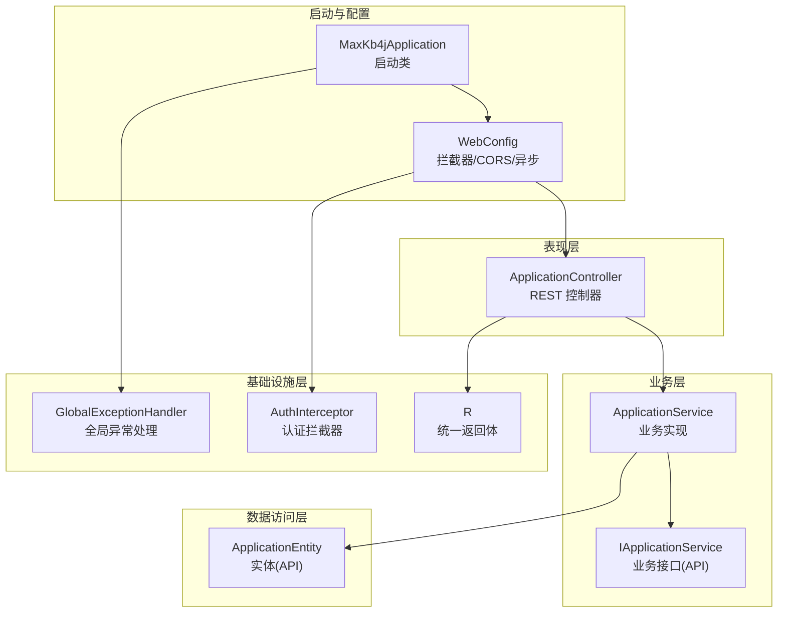
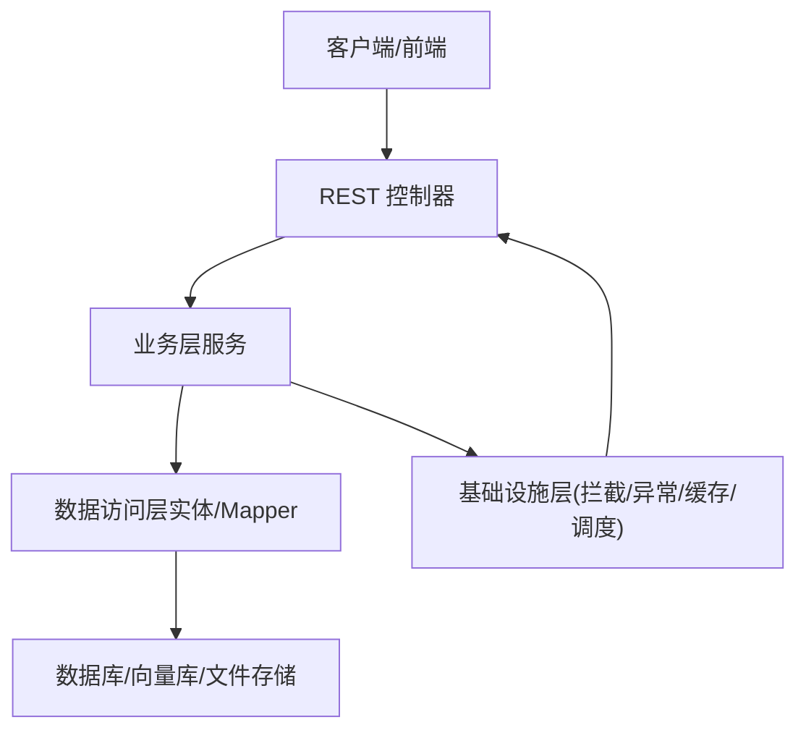
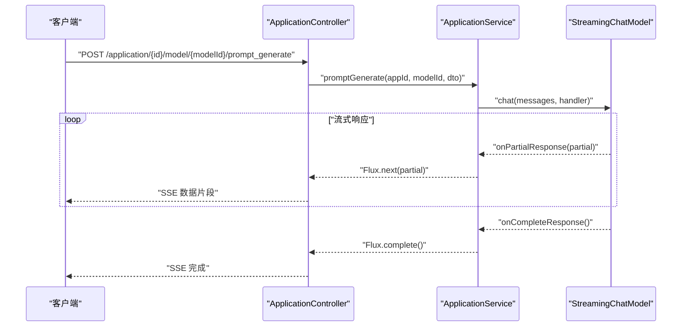
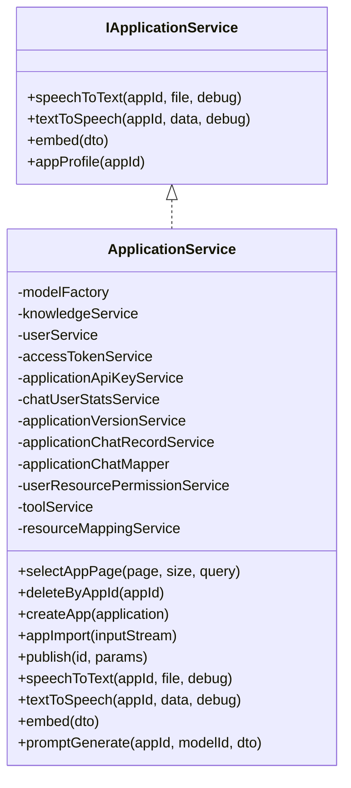
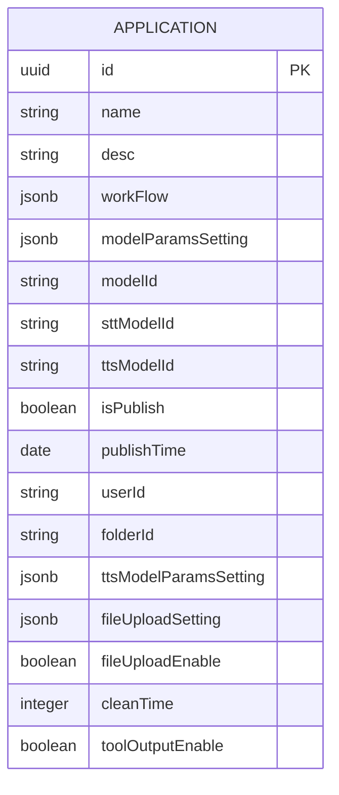
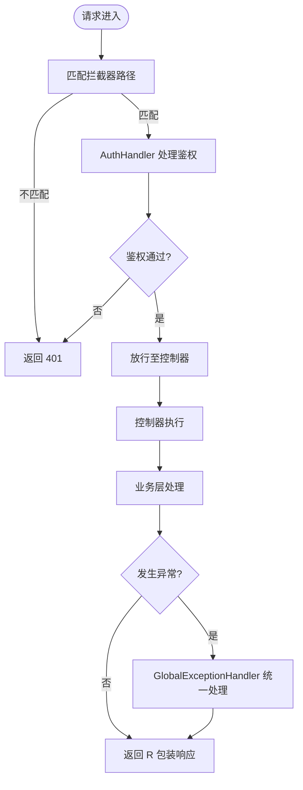
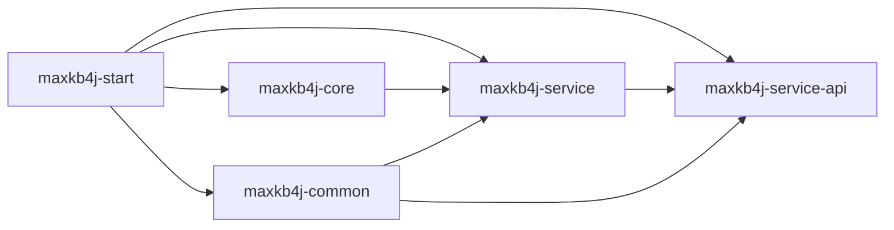

# 分层架构设计

<cite>
**本文引用的文件**   
- [README_CN.md](file://README_CN.md)
- [pom.xml](file://pom.xml)
- [MaxKb4jApplication.java](file://maxkb4j-start/src/main/java/com/maxkb4j/start/MaxKb4jApplication.java)
- [WebConfig.java](file://maxkb4j-start/src/main/java/com/maxkb4j/start/config/WebConfig.java)
- [AuthInterceptor.java](file://maxkb4j-core/src/main/java/com/maxkb4j/core/interceptor/AuthInterceptor.java)
- [GlobalExceptionHandler.java](file://maxkb4j-common/src/main/java/com/maxkb4j/common/handler/GlobalExceptionHandler.java)
- [R.java](file://maxkb4j-common/src/main/java/com/maxkb4j/common/api/R.java)
- [ApplicationController.java](file://maxkb4j-service/maxkb4j-application/src/main/java/com/maxkb4j/application/controller/ApplicationController.java)
- [ApplicationService.java](file://maxkb4j-service/maxkb4j-application/src/main/java/com/maxkb4j/application/service/ApplicationService.java)
- [IApplicationService.java](file://maxkb4j-service-api/maxkb4j-application-api/src/main/java/com/maxkb4j/application/service/IApplicationService.java)
- [ApplicationEntity.java](file://maxkb4j-service-api/maxkb4j-application-api/src/main/java/com/maxkb4j/application/entity/ApplicationEntity.java)
</cite>

## 目录
1. [引言](#引言)
2. [项目结构](#项目结构)
3. [核心组件](#核心组件)
4. [架构总览](#架构总览)
5. [详细组件分析](#详细组件分析)
6. [依赖分析](#依赖分析)
7. [性能考虑](#性能考虑)
8. [故障排查指南](#故障排查指南)
9. [结论](#结论)
10. [附录](#附录)

## 引言
本设计文档围绕 MaxKB4j 的四层架构展开，明确表现层、业务层、数据访问层与基础设施层的职责边界、数据流向与调用关系，并结合项目实际代码文件进行说明。系统通过 RESTful API 提供对外服务，同时在聊天相关接口中采用流式传输（SSE）与 WebSocket（通过控制器返回 Flux）实现近实时交互；业务层封装核心领域逻辑与工作流编排；数据访问层基于 MyBatis-Plus 实现实体持久化；基础设施层提供统一异常处理、认证拦截、缓存与调度等通用能力。

## 项目结构
MaxKB4j 采用 Maven 多模块聚合结构，核心模块包括：
- maxkb4j-common：通用工具、异常处理、统一返回体、缓存与常量等
- maxkb4j-core：核心能力（拦截器、事件、监听器、LangChain4j 集成等）
- maxkb4j-service：业务服务模块（应用、聊天、知识库、模型、系统、工具、触发器、工作流等）
- maxkb4j-service-api：各业务领域的 API 接口与实体定义（Mapper、Service 接口、VO/DTO、枚举等）
- maxkb4j-start：启动入口与 Web 配置（拦截器注册、跨域、异步线程池）

图表来源
- [MaxKb4jApplication.java:1-23](file://maxkb4j-start/src/main/java/com/maxkb4j/start/MaxKb4jApplication.java#L1-L23)
- [WebConfig.java:1-86](file://maxkb4j-start/src/main/java/com/maxkb4j/start/config/WebConfig.java#L1-L86)
- [AuthInterceptor.java:1-44](file://maxkb4j-core/src/main/java/com/maxkb4j/core/interceptor/AuthInterceptor.java#L1-L44)
- [GlobalExceptionHandler.java:1-168](file://maxkb4j-common/src/main/java/com/maxkb4j/common/handler/GlobalExceptionHandler.java#L1-L168)
- [R.java:1-150](file://maxkb4j-common/src/main/java/com/maxkb4j/common/api/R.java#L1-L150)
- [ApplicationController.java:1-187](file://maxkb4j-service/maxkb4j-application/src/main/java/com/maxkb4j/application/controller/ApplicationController.java#L1-L187)
- [ApplicationService.java:1-564](file://maxkb4j-service/maxkb4j-application/src/main/java/com/maxkb4j/application/service/ApplicationService.java#L1-L564)
- [IApplicationService.java:1-19](file://maxkb4j-service-api/maxkb4j-application-api/src/main/java/com/maxkb4j/application/service/IApplicationService.java#L1-L19)
- [ApplicationEntity.java:1-104](file://maxkb4j-service-api/maxkb4j-application-api/src/main/java/com/maxkb4j/application/entity/ApplicationEntity.java#L1-L104)

章节来源
- [pom.xml:57-62](file://pom.xml#L57-L62)
- [README_CN.md:102-112](file://README_CN.md#L102-L112)

## 核心组件
- 启动类与配置
  - 启动类启用缓存与调度，扫描 com.maxkb4j 包路径，设置默认 dev 环境
  - WebConfig 注册异步线程池、认证拦截器与跨域策略
- 表现层
  - REST 控制器集中暴露业务接口，使用统一返回体 R，部分接口返回 Flux 实现流式输出
- 业务层
  - 业务实现类封装复杂流程（分页查询、导入导出、发布版本、TTS/STT、提示词生成等）
  - 通过注入的服务组合完成领域任务
- 数据访问层
  - 实体类定义表结构与类型处理器，配合 Mapper 实现 CRUD
- 基础设施层
  - 全局异常处理集中捕获各类异常并返回标准响应
  - 认证拦截器按路径匹配进行鉴权

章节来源
- [MaxKb4jApplication.java:10-20](file://maxkb4j-start/src/main/java/com/maxkb4j/start/MaxKb4jApplication.java#L10-L20)
- [WebConfig.java:17-40](file://maxkb4j-start/src/main/java/com/maxkb4j/start/config/WebConfig.java#L17-L40)
- [ApplicationController.java:42-186](file://maxkb4j-service/maxkb4j-application/src/main/java/com/maxkb4j/application/controller/ApplicationController.java#L42-L186)
- [ApplicationService.java:66-68](file://maxkb4j-service/maxkb4j-application/src/main/java/com/maxkb4j/application/service/ApplicationService.java#L66-L68)
- [ApplicationEntity.java:23-103](file://maxkb4j-service-api/maxkb4j-application-api/src/main/java/com/maxkb4j/application/entity/ApplicationEntity.java#L23-L103)
- [GlobalExceptionHandler.java:31-166](file://maxkb4j-common/src/main/java/com/maxkb4j/common/handler/GlobalExceptionHandler.java#L31-L166)
- [AuthInterceptor.java:18-43](file://maxkb4j-core/src/main/java/com/maxkb4j/core/interceptor/AuthInterceptor.java#L18-L43)

## 架构总览
MaxKB4j 采用典型的四层架构：
- 表现层：REST 控制器负责接收请求、参数校验、调用业务层并返回统一结果
- 业务层：封装核心业务逻辑，协调多个子服务与领域模型
- 数据访问层：MyBatis-Plus 实体与 Mapper 实现数据持久化
- 基础设施层：拦截器、异常处理、缓存与调度等横切关注点

图表来源
- [ApplicationController.java:42-186](file://maxkb4j-service/maxkb4j-application/src/main/java/com/maxkb4j/application/controller/ApplicationController.java#L42-L186)
- [ApplicationService.java:66-68](file://maxkb4j-service/maxkb4j-application/src/main/java/com/maxkb4j/application/service/ApplicationService.java#L66-L68)
- [ApplicationEntity.java:23-103](file://maxkb4j-service-api/maxkb4j-application-api/src/main/java/com/maxkb4j/application/entity/ApplicationEntity.java#L23-L103)
- [WebConfig.java:17-40](file://maxkb4j-start/src/main/java/com/maxkb4j/start/config/WebConfig.java#L17-L40)
- [GlobalExceptionHandler.java:31-166](file://maxkb4j-common/src/main/java/com/maxkb4j/common/handler/GlobalExceptionHandler.java#L31-L166)

## 详细组件分析

### 表现层（REST 与流式输出）
- REST 控制器
  - 使用注解定义接口路径与权限校验，返回统一包装体 R
  - 部分接口返回 Flux，用于流式输出（如提示词生成）
- 流式输出序列
  - 控制器方法返回 Flux
  - 业务层构建流式响应处理器，逐片推送内容
  - 客户端通过 SSE 接收增量数据

图表来源
- [ApplicationController.java:154-158](file://maxkb4j-service/maxkb4j-application/src/main/java/com/maxkb4j/application/controller/ApplicationController.java#L154-L158)
- [ApplicationService.java:483-525](file://maxkb4j-service/maxkb4j-application/src/main/java/com/maxkb4j/application/service/ApplicationService.java#L483-L525)

章节来源
- [ApplicationController.java:42-186](file://maxkb4j-service/maxkb4j-application/src/main/java/com/maxkb4j/application/controller/ApplicationController.java#L42-L186)
- [ApplicationService.java:483-525](file://maxkb4j-service/maxkb4j-application/src/main/java/com/maxkb4j/application/service/ApplicationService.java#L483-L525)

### 业务层（核心逻辑封装）
- 业务实现类承担复杂流程编排，包括：
  - 分页查询与权限过滤
  - 导入导出与资源映射
  - 发布版本与历史快照
  - TTS/STT 语音能力
  - 提示词生成与流式推送
- 业务接口与实现分离，便于替换与测试

图表来源
- [IApplicationService.java:12-18](file://maxkb4j-service-api/maxkb4j-application-api/src/main/java/com/maxkb4j/application/service/IApplicationService.java#L12-L18)
- [ApplicationService.java:66-68](file://maxkb4j-service/maxkb4j-application/src/main/java/com/maxkb4j/application/service/ApplicationService.java#L66-L68)

章节来源
- [ApplicationService.java:83-144](file://maxkb4j-service/maxkb4j-application/src/main/java/com/maxkb4j/application/service/ApplicationService.java#L83-L144)
- [ApplicationService.java:208-255](file://maxkb4j-service/maxkb4j-application/src/main/java/com/maxkb4j/application/service/ApplicationService.java#L208-L255)
- [ApplicationService.java:396-420](file://maxkb4j-service/maxkb4j-application/src/main/java/com/maxkb4j/application/service/ApplicationService.java#L396-L420)
- [ApplicationService.java:483-525](file://maxkb4j-service/maxkb4j-application/src/main/java/com/maxkb4j/application/service/ApplicationService.java#L483-L525)

### 数据访问层（实体与持久化）
- 实体类定义字段、表名与类型处理器，映射数据库结构
- 通过 MyBatis-Plus 的 ServiceImpl 与 Mapper 实现通用 CRUD
- 复杂查询通过 LambdaQueryWrapper 与分页 Page 实现

图表来源
- [ApplicationEntity.java:23-103](file://maxkb4j-service-api/maxkb4j-application-api/src/main/java/com/maxkb4j/application/entity/ApplicationEntity.java#L23-L103)

章节来源
- [ApplicationEntity.java:23-103](file://maxkb4j-service-api/maxkb4j-application-api/src/main/java/com/maxkb4j/application/entity/ApplicationEntity.java#L23-L103)
- [ApplicationService.java:83-126](file://maxkb4j-service/maxkb4j-application/src/main/java/com/maxkb4j/application/service/ApplicationService.java#L83-L126)

### 基础设施层（拦截与异常）
- 认证拦截器
  - 按路径匹配选择具体 AuthHandler，未匹配返回 401
- 全局异常处理
  - 统一捕获未登录、权限不足、业务异常、速率限制等，返回标准 R 结构
- 统一返回体
  - R 封装 code、data、message，提供静态工厂方法

图表来源
- [WebConfig.java:33-40](file://maxkb4j-start/src/main/java/com/maxkb4j/start/config/WebConfig.java#L33-L40)
- [AuthInterceptor.java:22-30](file://maxkb4j-core/src/main/java/com/maxkb4j/core/interceptor/AuthInterceptor.java#L22-L30)
- [GlobalExceptionHandler.java:35-163](file://maxkb4j-common/src/main/java/com/maxkb4j/common/handler/GlobalExceptionHandler.java#L35-L163)
- [R.java:26-104](file://maxkb4j-common/src/main/java/com/maxkb4j/common/api/R.java#L26-L104)

章节来源
- [AuthInterceptor.java:18-43](file://maxkb4j-core/src/main/java/com/maxkb4j/core/interceptor/AuthInterceptor.java#L18-L43)
- [GlobalExceptionHandler.java:31-166](file://maxkb4j-common/src/main/java/com/maxkb4j/common/handler/GlobalExceptionHandler.java#L31-L166)
- [R.java:16-149](file://maxkb4j-common/src/main/java/com/maxkb4j/common/api/R.java#L16-L149)

## 依赖分析
- 模块依赖
  - 启动模块依赖其他模块，形成清晰的层次化组织
- 技术栈
  - Spring Boot 3、MyBatis-Plus、LangChain4j、Sa-Token、Caffeine、OpenAPI 文档等

图表来源
- [pom.xml:57-62](file://pom.xml#L57-L62)

章节来源
- [pom.xml:64-492](file://pom.xml#L64-L492)

## 性能考虑
- 异步与并发
  - WebConfig 配置异步线程池，提升高并发下的吞吐
- 流式响应
  - 提示词生成使用 Flux，降低首字节延迟，改善用户体验
- 缓存与调度
  - 启动类启用缓存与调度，结合 Caffeine 与定时任务优化性能

章节来源
- [WebConfig.java:18-27](file://maxkb4j-start/src/main/java/com/maxkb4j/start/config/WebConfig.java#L18-L27)
- [ApplicationController.java:155-158](file://maxkb4j-service/maxkb4j-application/src/main/java/com/maxkb4j/application/controller/ApplicationController.java#L155-L158)
- [MaxKb4jApplication.java:10-11](file://maxkb4j-start/src/main/java/com/maxkb4j/start/MaxKb4jApplication.java#L10-L11)

## 故障排查指南
- 未登录/权限不足
  - 全局异常处理返回 401/403，检查 Sa-Token 配置与权限注解
- 业务异常
  - ApiException 等统一包装，查看 message 获取具体原因
- 速率限制
  - RateLimitException 统一处理，检查外部模型服务配额
- 客户端断开
  - AsyncRequestNotUsableException 静默处理，避免影响其他流程

章节来源
- [GlobalExceptionHandler.java:35-163](file://maxkb4j-common/src/main/java/com/maxkb4j/common/handler/GlobalExceptionHandler.java#L35-L163)

## 结论
MaxKB4j 的四层架构清晰划分了职责边界：表现层专注接口与流式输出，业务层封装复杂流程，数据访问层聚焦持久化，基础设施层提供横切能力。该设计提升了代码的可维护性与可测试性，便于后续扩展与演进。

## 附录
- 统一返回体 R
  - 字段：code、data、message
  - 方法：success/fail/data/status 等静态工厂方法
- 配置与拦截器
  - WebConfig 注册拦截器、CORS 与异步线程池
  - AuthInterceptor 按路径匹配鉴权处理器

章节来源
- [R.java:16-149](file://maxkb4j-common/src/main/java/com/maxkb4j/common/api/R.java#L16-L149)
- [WebConfig.java:17-85](file://maxkb4j-start/src/main/java/com/maxkb4j/start/config/WebConfig.java#L17-L85)
- [AuthInterceptor.java:18-43](file://maxkb4j-core/src/main/java/com/maxkb4j/core/interceptor/AuthInterceptor.java#L18-L43)