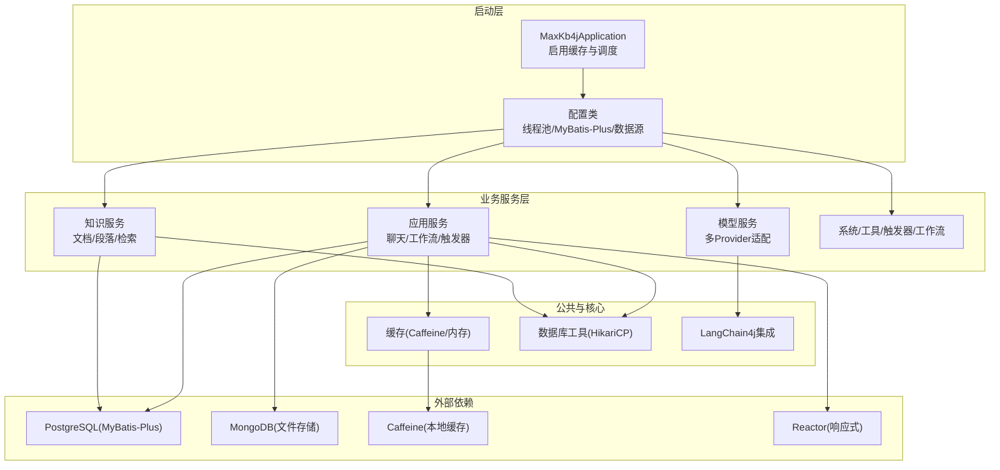
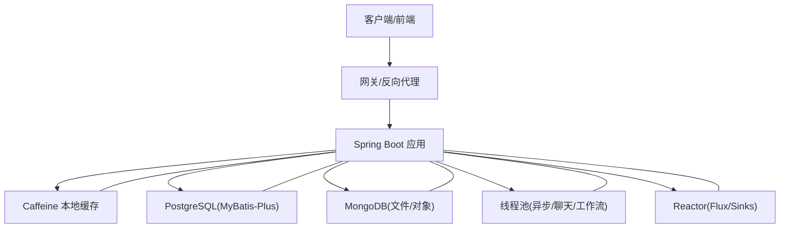
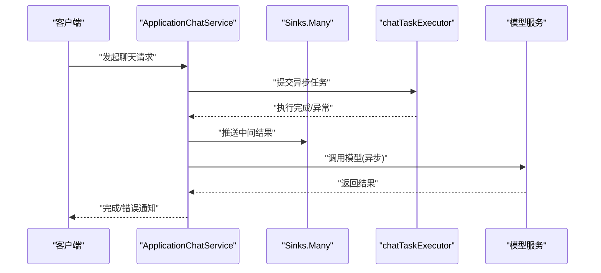
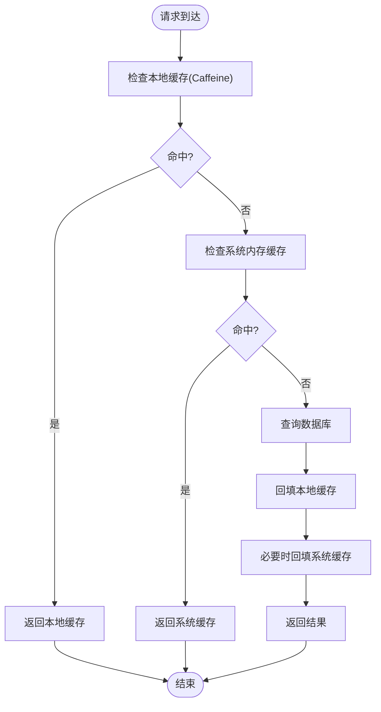
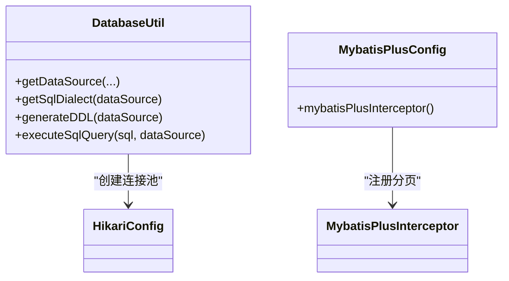
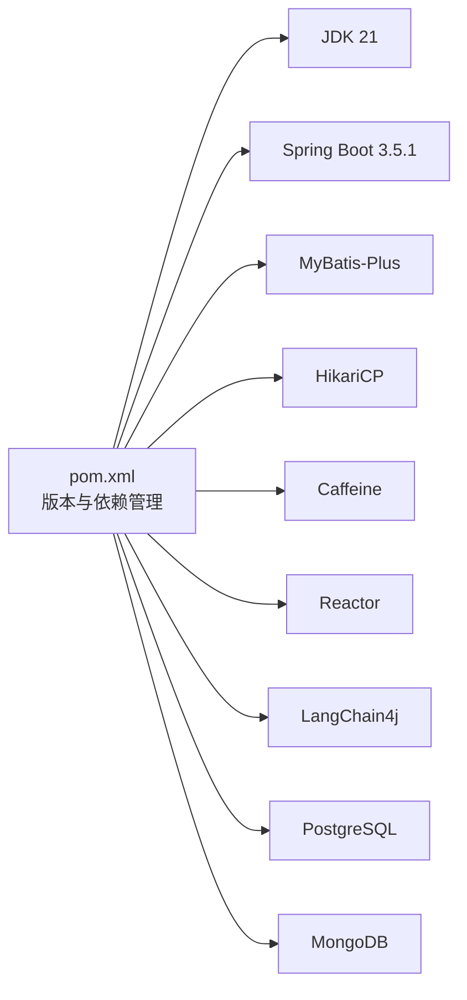

# 性能架构设计

<cite>
**本文引用的文件**
- [pom.xml](file://pom.xml)
- [application.yml](file://maxkb4j-start/src/main/resources/application.yml)
- [application-dev.yml](file://maxkb4j-start/src/main/resources/application-dev.yml)
- [application-prod.yml](file://maxkb4j-start/src/main/resources/application-prod.yml)
- [MaxKb4jApplication.java](file://maxkb4j-start/src/main/java/com/maxkb4j/start/MaxKb4jApplication.java)
- [ThreadPoolConfig.java](file://maxkb4j-start/src/main/java/com/maxkb4j/start/config/ThreadPoolConfig.java)
- [MybatisPlusConfig.java](file://maxkb4j-start/src/main/java/com/maxkb4j/start/config/MybatisPlusConfig.java)
- [DatabaseUtil.java](file://maxkb4j-core/src/main/java/com/maxkb4j/core/util/DatabaseUtil.java)
- [AuthCodeCache.java](file://maxkb4j-common/src/main/java/com/maxkb4j/common/cache/AuthCodeCache.java)
- [ChatCache.java](file://maxkb4j-common/src/main/java/com/maxkb4j/common/cache/ChatCache.java)
- [SystemCache.java](file://maxkb4j-common/src/main/java/com/maxkb4j/common/cache/SystemCache.java)
- [ApplicationChatService.java](file://maxkb4j-service/maxkb4j-application/src/main/java/com/maxkb4j/application/service/ApplicationChatService.java)
- [ApplicationService.java](file://maxkb4j-service/maxkb4j-application/src/main/java/com/maxkb4j/application/service/ApplicationService.java)
- [maxkb4j-application-api/pom.xml](file://maxkb4j-service-api/maxkb4j-application-api/pom.xml)
</cite>

## 目录
1. [简介](#简介)
2. [项目结构](#项目结构)
3. [核心组件](#核心组件)
4. [架构总览](#架构总览)
5. [详细组件分析](#详细组件分析)
6. [依赖关系分析](#依赖关系分析)
7. [性能考量与优化建议](#性能考量与优化建议)
8. [故障排查指南](#故障排查指南)
9. [结论](#结论)
10. [附录](#附录)

## 简介
本设计文档聚焦于MaxKB4j的高性能架构设计与实现，围绕以下主题展开：
- 虚拟线程与并发模型：基于Java 21的虚拟线程潜力与现有线程池配置的关系，以及如何在系统中逐步引入虚拟线程。
- 响应式编程：Reactor框架在流式处理中的应用，非阻塞I/O与背压控制。
- 多级缓存策略：本地缓存（Caffeine）、系统内存缓存与潜在的分布式缓存场景。
- 数据库连接池与查询优化：HikariCP连接池配置、MyBatis-Plus分页与拦截器、SQL解析与安全限制。
- 负载均衡与水平扩展：部署与容器编排思路、服务拆分与网关策略。
- 监控指标与基准测试：建议的观测维度与优化方向。

## 项目结构
MaxKB4j采用多模块Maven结构，核心模块包括公共工具(common)、核心能力(core)、业务服务(service)、API定义(service-api)、启动入口(start)。系统以Spring Boot 3.5.1为基础，JDK版本为21，启用Caffeine缓存、Flyway迁移、Sa-Token鉴权、LangChain4j集成等特性。

图示来源
- [MaxKb4jApplication.java:10-12](file://maxkb4j-start/src/main/java/com/maxkb4j/start/MaxKb4jApplication.java#L10-L12)
- [ThreadPoolConfig.java:10-45](file://maxkb4j-start/src/main/java/com/maxkb4j/start/config/ThreadPoolConfig.java#L10-L45)
- [MybatisPlusConfig.java:17-31](file://maxkb4j-start/src/main/java/com/maxkb4j/start/config/MybatisPlusConfig.java#L17-L31)
- [DatabaseUtil.java:18-31](file://maxkb4j-core/src/main/java/com/maxkb4j/core/util/DatabaseUtil.java#L18-L31)
- [AuthCodeCache.java:10-18](file://maxkb4j-common/src/main/java/com/maxkb4j/common/cache/AuthCodeCache.java#L10-L18)
- [ChatCache.java:12-16](file://maxkb4j-common/src/main/java/com/maxkb4j/common/cache/ChatCache.java#L12-L16)
- [SystemCache.java:10-10](file://maxkb4j-common/src/main/java/com/maxkb4j/common/cache/SystemCache.java#L10-L10)

章节来源
- [pom.xml:19-22](file://pom.xml#L19-L22)
- [application.yml:1-69](file://maxkb4j-start/src/main/resources/application.yml#L1-L69)
- [application-dev.yml:1-11](file://maxkb4j-start/src/main/resources/application-dev.yml#L1-L11)
- [application-prod.yml:1-9](file://maxkb4j-start/src/main/resources/application-prod.yml#L1-L9)

## 核心组件
- 应用启动与缓存：通过@EnableCaching与@EnableScheduling启用缓存与定时任务；默认使用Caffeine作为本地缓存。
- 线程池与异步：提供通用任务执行器与聊天专用执行器，支持异步任务与优雅关闭。
- ORM与分页：MyBatis-Plus分页插件与Mapper扫描，统一配置与拦截器。
- 数据库连接池：HikariCP连接池封装，支持最大连接数、空闲超时、生命周期与连接超时等参数。
- 缓存策略：Caffeine本地缓存（验证码、会话信息）、系统内存缓存（密钥对等）。
- 响应式与非阻塞：引入Reactor依赖，业务侧使用Flux/Sinks进行流式响应与事件推送。

章节来源
- [MaxKb4jApplication.java:10-12](file://maxkb4j-start/src/main/java/com/maxkb4j/start/MaxKb4jApplication.java#L10-L12)
- [ThreadPoolConfig.java:10-45](file://maxkb4j-start/src/main/java/com/maxkb4j/start/config/ThreadPoolConfig.java#L10-L45)
- [MybatisPlusConfig.java:17-31](file://maxkb4j-start/src/main/java/com/maxkb4j/start/config/MybatisPlusConfig.java#L17-L31)
- [DatabaseUtil.java:18-31](file://maxkb4j-core/src/main/java/com/maxkb4j/core/util/DatabaseUtil.java#L18-L31)
- [AuthCodeCache.java:10-18](file://maxkb4j-common/src/main/java/com/maxkb4j/common/cache/AuthCodeCache.java#L10-L18)
- [ChatCache.java:12-16](file://maxkb4j-common/src/main/java/com/maxkb4j/common/cache/ChatCache.java#L12-L16)
- [SystemCache.java:10-10](file://maxkb4j-common/src/main/java/com/maxkb4j/common/cache/SystemCache.java#L10-L10)
- [maxkb4j-application-api/pom.xml:42-46](file://maxkb4j-service-api/maxkb4j-application-api/pom.xml#L42-L46)

## 架构总览
系统采用“启动配置 + 业务服务 + 公共与核心”三层结构，结合本地缓存、连接池与响应式流处理，形成高并发、低延迟的服务体系。数据库访问通过MyBatis-Plus与HikariCP保障稳定性与性能；缓存覆盖高频读取路径；异步线程池隔离不同业务域；Reactor用于实时流式交互。

图示来源
- [application.yml:19-25](file://maxkb4j-start/src/main/resources/application.yml#L19-L25)
- [MybatisPlusConfig.java:17-31](file://maxkb4j-start/src/main/java/com/maxkb4j/start/config/MybatisPlusConfig.java#L17-L31)
- [ThreadPoolConfig.java:10-45](file://maxkb4j-start/src/main/java/com/maxkb4j/start/config/ThreadPoolConfig.java#L10-L45)
- [DatabaseUtil.java:18-31](file://maxkb4j-core/src/main/java/com/maxkb4j/core/util/DatabaseUtil.java#L18-L31)
- [maxkb4j-application-api/pom.xml:42-46](file://maxkb4j-service-api/maxkb4j-application-api/pom.xml#L42-L46)

## 详细组件分析

### 虚拟线程与并发模型
- 当前实现：系统基于JDK 21构建，但未显式使用虚拟线程；现有并发由线程池配置与异步注解驱动。
- 引入建议：在不影响兼容性的前提下，优先在I/O密集型路径（如网络请求、文件读写）尝试虚拟线程；对于CPU密集型任务保持平台线程，避免过度切换。
- 隔离策略：沿用现有线程池划分（通用/聊天/工作流），在虚拟线程上叠加队列与拒绝策略，确保突发流量下的稳定性。

章节来源
- [pom.xml:21-21](file://pom.xml#L21-L21)
- [ThreadPoolConfig.java:10-45](file://maxkb4j-start/src/main/java/com/maxkb4j/start/config/ThreadPoolConfig.java#L10-L45)

### 响应式编程与非阻塞I/O
- 依赖引入：在应用API模块引入Reactor核心依赖，为响应式流提供基础。
- 业务实践：聊天服务通过Sinks.Many与Flux实现增量消息推送，结合CompletableFuture实现异步计算与异常处理。
- 非阻塞要点：避免在主线程执行阻塞操作；对外部调用采用异步回调或背压策略；合理设置缓冲区与超时。

图示来源
- [ApplicationChatService.java:139-147](file://maxkb4j-service/maxkb4j-application/src/main/java/com/maxkb4j/application/service/ApplicationChatService.java#L139-L147)
- [ThreadPoolConfig.java:23-33](file://maxkb4j-start/src/main/java/com/maxkb4j/start/config/ThreadPoolConfig.java#L23-L33)
- [maxkb4j-application-api/pom.xml:42-46](file://maxkb4j-service-api/maxkb4j-application-api/pom.xml#L42-L46)

章节来源
- [ApplicationChatService.java:126-147](file://maxkb4j-service/maxkb4j-application/src/main/java/com/maxkb4j/application/service/ApplicationChatService.java#L126-L147)
- [ApplicationService.java:50-59](file://maxkb4j-service/maxkb4j-application/src/main/java/com/maxkb4j/application/service/ApplicationService.java#L50-L59)
- [maxkb4j-application-api/pom.xml:42-46](file://maxkb4j-service-api/maxkb4j-application-api/pom.xml#L42-L46)

### 多级缓存策略
- 本地缓存（Caffeine）
  - 验证码缓存：短时过期（写入/访问均过期），适合高频校验场景。
  - 聊天上下文缓存：设定容量与过期时间，降低重复加载成本。
- 系统内存缓存：存放敏感配置（如密钥对），减少数据库访问。
- 分布式缓存建议：针对跨节点共享状态（如用户会话、热点配置）引入Redis；缓存失效采用“写后失效”策略，配合读写锁或分布式锁保证一致性。

图示来源
- [AuthCodeCache.java:10-18](file://maxkb4j-common/src/main/java/com/maxkb4j/common/cache/AuthCodeCache.java#L10-L18)
- [ChatCache.java:12-16](file://maxkb4j-common/src/main/java/com/maxkb4j/common/cache/ChatCache.java#L12-L16)
- [SystemCache.java:10-10](file://maxkb4j-common/src/main/java/com/maxkb4j/common/cache/SystemCache.java#L10-L10)

章节来源
- [AuthCodeCache.java:10-18](file://maxkb4j-common/src/main/java/com/maxkb4j/common/cache/AuthCodeCache.java#L10-L18)
- [ChatCache.java:12-16](file://maxkb4j-common/src/main/java/com/maxkb4j/common/cache/ChatCache.java#L12-L16)
- [SystemCache.java:10-10](file://maxkb4j-common/src/main/java/com/maxkb4j/common/cache/SystemCache.java#L10-L10)

### 数据库连接池与查询优化
- 连接池配置：HikariCP封装提供最大连接数、最小空闲、空闲超时、最大生存时间与连接超时等参数，满足高并发下的资源管理需求。
- ORM与分页：MyBatis-Plus分页插件与Mapper扫描集中配置，统一拦截器链路，便于扩展与维护。
- SQL安全：工具类限制仅允许SELECT查询，防止DDL/DML误执行；建议在生产环境进一步加固SQL白名单与参数化查询。

图示来源
- [DatabaseUtil.java:18-31](file://maxkb4j-core/src/main/java/com/maxkb4j/core/util/DatabaseUtil.java#L18-L31)
- [MybatisPlusConfig.java:24-30](file://maxkb4j-start/src/main/java/com/maxkb4j/start/config/MybatisPlusConfig.java#L24-L30)

章节来源
- [DatabaseUtil.java:18-31](file://maxkb4j-core/src/main/java/com/maxkb4j/core/util/DatabaseUtil.java#L18-L31)
- [MybatisPlusConfig.java:17-31](file://maxkb4j-start/src/main/java/com/maxkb4j/start/config/MybatisPlusConfig.java#L17-L31)

### 负载均衡与水平扩展
- 部署建议：通过容器编排（Compose/Docker/K8s）实现多副本部署；使用反向代理或Ingress做流量分发。
- 服务拆分：按功能域拆分为独立服务（应用/知识/模型/系统），结合API网关统一接入。
- 状态与会话：将用户会话与状态迁移到分布式缓存（Redis），避免粘性会话带来的扩缩容复杂度。

[本节为概念性内容，无需文件引用]

### 监控指标与基准测试
- 指标建议：QPS/响应时间/错误率、线程池队列长度/拒绝次数、数据库连接池活跃/空闲/等待时间、缓存命中率、Reactor背压与背压事件数。
- 基准方法：使用JMH或Gatling进行接口压力测试；对比不同线程模型（平台线程 vs 虚拟线程）、缓存策略与连接池参数对吞吐与延迟的影响。
- 优化闭环：基于指标定位瓶颈（CPU/IO/锁/GC），迭代调整线程池大小、缓存窗口与连接池参数。

[本节为通用指导，无需文件引用]

## 依赖关系分析
- 语言与框架：JDK 21、Spring Boot 3.5.1、MyBatis-Plus、HikariCP、Caffeine、Reactor、LangChain4j。
- 数据源：PostgreSQL（MyBatis-Plus）、MongoDB（文件存储）。
- 鉴权与文档：Sa-Token、Knife4j/SpringDoc OpenAPI。

图示来源
- [pom.xml:64-492](file://pom.xml#L64-L492)

章节来源
- [pom.xml:64-492](file://pom.xml#L64-L492)

## 性能考量与优化建议
- 虚拟线程：优先在I/O密集路径引入虚拟线程，结合线程池隔离与背压控制，避免与CPU密集任务混用。
- 缓存优化：扩大热点键的本地缓存容量与过期策略；对写多读少场景采用“写后失效”；对跨节点共享状态引入分布式缓存。
- 连接池：根据峰值QPS与平均响应时间动态调整最大连接数与队列长度；开启连接泄漏检测与慢查询日志。
- ORM与SQL：启用分页与索引优化；避免N+1查询；对大表建立复合索引与分区策略。
- 响应式：合理设置缓冲区与背压策略；避免在Flux中执行阻塞操作；对长耗时任务使用异步线程池。
- 监控与基准：建立端到端指标体系，定期进行压力测试与回归测试，持续优化参数与代码路径。

[本节为通用指导，无需文件引用]

## 故障排查指南
- 缓存问题：检查Caffeine容量与过期策略是否合理；确认缓存键命名规范与序列化方式。
- 数据库连接：观察连接池等待时间与拒绝次数；核对SQL执行计划与索引使用情况。
- 响应式流：排查背压导致的消息堆积；确认Sinks的发射与完成时机。
- 异步任务：关注线程池饱和与异常传播；确保异常被捕获并上报。

章节来源
- [AuthCodeCache.java:10-18](file://maxkb4j-common/src/main/java/com/maxkb4j/common/cache/AuthCodeCache.java#L10-L18)
- [ChatCache.java:12-16](file://maxkb4j-common/src/main/java/com/maxkb4j/common/cache/ChatCache.java#L12-L16)
- [SystemCache.java:10-10](file://maxkb4j-common/src/main/java/com/maxkb4j/common/cache/SystemCache.java#L10-L10)
- [DatabaseUtil.java:18-31](file://maxkb4j-core/src/main/java/com/maxkb4j/core/util/DatabaseUtil.java#L18-L31)
- [ApplicationChatService.java:139-147](file://maxkb4j-service/maxkb4j-application/src/main/java/com/maxkb4j/application/service/ApplicationChatService.java#L139-L147)

## 结论
MaxKB4j已具备高性能的基础条件：JDK 21、Caffeine本地缓存、HikariCP连接池、MyBatis-Plus分页与响应式依赖。后续可在虚拟线程、分布式缓存、连接池与SQL优化、响应式背压等方面持续演进，结合监控与基准测试形成闭环优化，最终实现高并发、低延迟与高可用的系统目标。

[本节为总结性内容，无需文件引用]

## 附录
- 配置文件位置与用途
  - application.yml：应用基础配置（缓存、Flyway、Sa-Token、日志格式等）
  - application-dev.yml / application-prod.yml：开发/生产数据源与MongoDB配置
- 关键配置要点
  - 缓存类型：Caffeine
  - 数据源：PostgreSQL
  - 定时与缓存：启用调度与缓存
  - 线程池：通用/聊天/工作流三套执行器

章节来源
- [application.yml:1-69](file://maxkb4j-start/src/main/resources/application.yml#L1-L69)
- [application-dev.yml:1-11](file://maxkb4j-start/src/main/resources/application-dev.yml#L1-L11)
- [application-prod.yml:1-9](file://maxkb4j-start/src/main/resources/application-prod.yml#L1-L9)
- [MaxKb4jApplication.java:10-12](file://maxkb4j-start/src/main/java/com/maxkb4j/start/MaxKb4jApplication.java#L10-L12)
- [ThreadPoolConfig.java:10-45](file://maxkb4j-start/src/main/java/com/maxkb4j/start/config/ThreadPoolConfig.java#L10-L45)