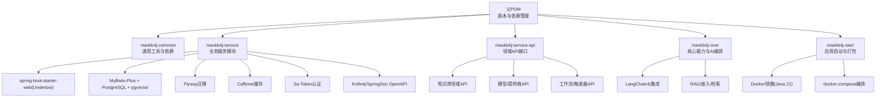
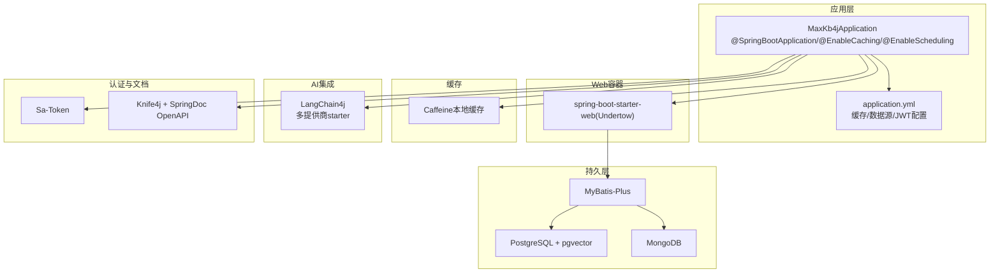
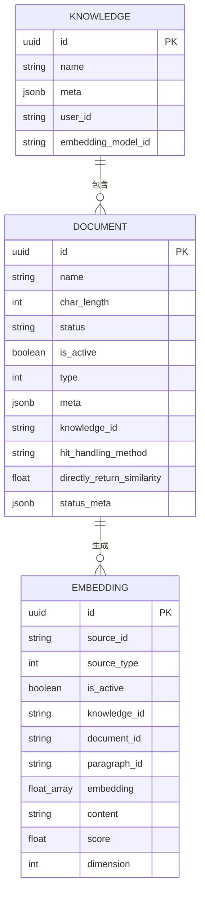
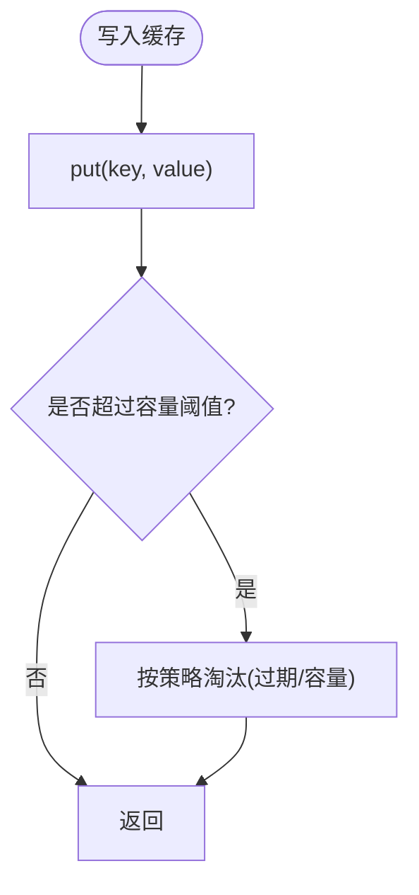
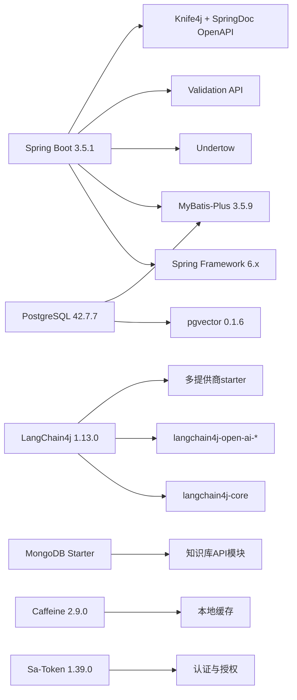

# 技术栈选型

<cite>
**本文引用的文件**
- [pom.xml](file://pom.xml)
- [maxkb4j-start/pom.xml](file://maxkb4j-start/pom.xml)
- [maxkb4j-common/pom.xml](file://maxkb4j-common/pom.xml)
- [application.yml](file://maxkb4j-start/src/main/resources/application.yml)
- [application-dev.yml](file://maxkb4j-start/src/main/resources/application-dev.yml)
- [application-prod.yml](file://maxkb4j-start/src/main/resources/application-prod.yml)
- [MaxKb4jApplication.java](file://maxkb4j-start/src/main/java/com/maxkb4j/start/MaxKb4jApplication.java)
- [Dockerfile](file://maxkb4j-start/Dockerfile)
- [docker-compose.dev.yml](file://docker-compose.dev.yml)
- [docker-compose.yml](file://docker-compose.yml)
- [AuthCodeCache.java](file://maxkb4j-common/src/main/java/com/maxkb4j/common/cache/AuthCodeCache.java)
- [ChatCache.java](file://maxkb4j-common/src/main/java/com/maxkb4j/common/cache/ChatCache.java)
- [SystemCache.java](file://maxkb4j-common/src/main/java/com/maxkb4j/common/cache/SystemCache.java)
- [EmbeddingEntity.java](file://maxkb4j-service-api/maxkb4j-knowledge-api/src/main/java/com/maxkb4j/knowledge/entity/EmbeddingEntity.java)
- [KnowledgeEntity.java](file://maxkb4j-service-api/maxkb4j-knowledge-api/src/main/java/com/maxkb4j/knowledge/entity/KnowledgeEntity.java)
- [DocFileVO.java](file://maxkb4j-service-api/maxkb4j-knowledge-api/src/main/java/com/maxkb4j/knowledge/vo/DocFileVO.java)
</cite>

## 目录
1. [引言](#引言)
2. [项目结构](#项目结构)
3. [核心组件](#核心组件)
4. [架构总览](#架构总览)
5. [详细组件分析](#详细组件分析)
6. [依赖分析](#依赖分析)
7. [性能考量](#性能考量)
8. [故障排查指南](#故障排查指南)
9. [结论](#结论)
10. [附录](#附录)

## 引言
本技术栈选型文档面向MaxKB4j项目，系统阐述其核心技术与框架的选型依据与实践价值，重点覆盖以下方面：
- Spring Boot 3.x选型优势：对Java 21的支持、现代化特性与性能改进
- LangChain4j作为AI模型集成框架的优势：多提供商支持、统一接口设计与易扩展性
- 数据库技术选择：PostgreSQL+pgvector用于向量数据存储与相似度检索，MongoDB用于文档与文件管理
- 缓存策略：Caffeine本地缓存的性能与适用场景
- 权限认证：Sa-Token的简洁与强大能力
- API文档：Knife4j与SpringDoc OpenAPI的组合方案
- 版本兼容性、性能考量与社区支持情况

## 项目结构
MaxKB4j采用多模块Maven聚合工程组织，核心模块围绕“公共能力”“服务层”“服务API”“核心能力”“启动器”展开，并通过统一的父POM进行版本与依赖管理。

图表来源
- [pom.xml](file://pom.xml)
- [maxkb4j-start/pom.xml](file://maxkb4j-start/pom.xml)
- [maxkb4j-common/pom.xml](file://maxkb4j-common/pom.xml)

章节来源
- [pom.xml](file://pom.xml)
- [maxkb4j-start/pom.xml](file://maxkb4j-start/pom.xml)
- [maxkb4j-common/pom.xml](file://maxkb4j-common/pom.xml)

## 核心组件
本节从技术栈层面总结各组件的选型理由与实现要点：

- Spring Boot 3.x + Java 21
  - 选型理由：拥抱最新语言特性与JVM性能优化；与Spring Framework 6.x生态深度契合；提供现代化开发体验与更好的启动性能。
  - 实践体现：父POM统一声明Java 21；Dockerfile基于Amazon Corretto 21；启动类启用缓存与定时任务注解。
  
- LangChain4j
  - 选型理由：统一的Java AI集成抽象，支持多家大模型提供商；模块化starter便于按需引入；适合构建RAG、工具调用、对话记忆等场景。
  - 实践体现：多模块引入langchain4j核心与多个提供商starter；知识库模块实体同时标注MyBatis与Mongo注解，支撑向量化与全文检索双轨存储。
  
- 数据库与向量检索
  - PostgreSQL + pgvector：向量相似度检索与SQL一致性查询结合，适配RAG召回与二次筛选。
  - MongoDB：文档与文件元数据存储，配合全文索引与二进制内容管理。
  - 实践体现：知识库实体同时映射至PostgreSQL表与Mongo集合；EmbeddingEntity使用JSONB与自定义类型处理器存储向量数组。
  
- 缓存策略：Caffeine
  - 选型理由：高性能本地缓存，近似LRU淘汰策略，支持多种过期策略；适用于会话、验证码、聊天上下文等高频读取场景。
  - 实践体现：独立缓存类封装不同业务域缓存策略。
  
- 权限认证：Sa-Token
  - 选型理由：轻量、易用、功能完备；支持注解鉴权、JWT整合、多端登录控制等；与Spring AOP无缝集成。
  - 实践体现：配置文件开启JWT密钥、Token名称、超时策略等；注解切面在公共模块启用。
  
- API文档：Knife4j + SpringDoc OpenAPI
  - 选型理由：Knife4j提供更友好的前端UI与分组能力；SpringDoc OpenAPI保证规范性与兼容性；组合满足开发与运维需求。
  - 实践体现：依赖管理中明确版本并排除冲突依赖。

章节来源
- [pom.xml](file://pom.xml)
- [maxkb4j-common/pom.xml](file://maxkb4j-common/pom.xml)
- [application.yml](file://maxkb4j-start/src/main/resources/application.yml)
- [MaxKb4jApplication.java](file://maxkb4j-start/src/main/java/com/maxkb4j/start/MaxKb4jApplication.java)
- [Dockerfile](file://maxkb4j-start/Dockerfile)

## 架构总览
下图展示应用启动、依赖注入、缓存与数据库交互的整体视图，以及AI模型集成的外部交互路径。

图表来源
- [MaxKb4jApplication.java](file://maxkb4j-start/src/main/java/com/maxkb4j/start/MaxKb4jApplication.java)
- [application.yml](file://maxkb4j-start/src/main/resources/application.yml)
- [pom.xml](file://pom.xml)
- [maxkb4j-common/pom.xml](file://maxkb4j-common/pom.xml)

## 详细组件分析

### Spring Boot 3.x 与 Java 21 选型
- 版本与兼容性
  - 父POM使用Spring Boot 3.5.1，配套Spring Framework 6.x生态；Java版本固定为21，确保与Undertow、MyBatis-Plus等依赖兼容。
  - Dockerfile基于amazoncorretto:21，保证容器内运行环境一致。
- 性能与特性
  - 启动更快、内存占用更低；对Jakarta EE命名空间与Servlet 6支持良好；Undertow作为Web容器具备高并发优势。
- 运维与部署
  - 启动类自动设置dev环境；application.yml集中管理缓存、Flyway迁移与Sa-Token参数；docker-compose提供一键编排。

章节来源
- [pom.xml](file://pom.xml)
- [Dockerfile](file://maxkb4j-start/Dockerfile)
- [MaxKb4jApplication.java](file://maxkb4j-start/src/main/java/com/maxkb4j/start/MaxKb4jApplication.java)
- [application.yml](file://maxkb4j-start/src/main/resources/application.yml)

### LangChain4j 选型与扩展性
- 统一接口与多提供商
  - 通过langchain4j-spring-boot-starter与各提供商starter（OpenAI、Azure、Gemini、Anthropic、本地Ollama等）实现统一抽象与灵活切换。
- 易扩展性
  - 支持自定义模型、工具、记忆体与检索器；模块化依赖便于按需引入，降低整体体积。
- 实践映射
  - 知识库实体同时标注MyBatis与Mongo注解，LangChain4j负责嵌入生成与检索流程编排，最终落库或落库+落文档存储。

章节来源
- [pom.xml](file://pom.xml)
- [maxkb4j-common/pom.xml](file://maxkb4j-common/pom.xml)
- [EmbeddingEntity.java](file://maxkb4j-service-api/maxkb4j-knowledge-api/src/main/java/com/maxkb4j/knowledge/entity/EmbeddingEntity.java)

### 数据库与向量检索：PostgreSQL + pgvector + MongoDB
- 存储策略
  - PostgreSQL：结构化知识库、文档元信息、向量维度与状态元数据；pgvector提供高效相似度检索。
  - MongoDB：文档与文件元数据、全文索引、二进制内容管理；与向量实体形成互补。
- 实体映射
  - EmbeddingEntity同时标注MyBatis与Mongo注解，体现“向量存PostgreSQL、文本存Mongo”的混合存储策略。
  - KnowledgeEntity使用JSONB字段保存复杂元数据，提升灵活性。
- 文件管理
  - DocFileVO承载文件名、字节数组与MIME类型，配合MongoDB进行文件元数据与内容管理。

图表来源
- [KnowledgeEntity.java](file://maxkb4j-service-api/maxkb4j-knowledge-api/src/main/java/com/maxkb4j/knowledge/entity/KnowledgeEntity.java)
- [EmbeddingEntity.java](file://maxkb4j-service-api/maxkb4j-knowledge-api/src/main/java/com/maxkb4j/knowledge/entity/EmbeddingEntity.java)

章节来源
- [maxkb4j-common/pom.xml](file://maxkb4j-common/pom.xml)
- [maxkb4j-service-api/maxkb4j-knowledge-api/pom.xml](file://maxkb4j-service-api/maxkb4j-knowledge-api/pom.xml)
- [EmbeddingEntity.java](file://maxkb4j-service-api/maxkb4j-knowledge-api/src/main/java/com/maxkb4j/knowledge/entity/EmbeddingEntity.java)
- [KnowledgeEntity.java](file://maxkb4j-service-api/maxkb4j-knowledge-api/src/main/java/com/maxkb4j/knowledge/entity/KnowledgeEntity.java)
- [DocFileVO.java](file://maxkb4j-service-api/maxkb4j-knowledge-api/src/main/java/com/maxkb4j/knowledge/vo/DocFileVO.java)

### 缓存策略：Caffeine
- 设计目标
  - 高吞吐、低延迟；针对验证码、会话、聊天上下文等高频读取场景提供近似LRU淘汰与多种过期策略。
- 典型用法
  - AuthCodeCache：验证码缓存，写后/访问后1分钟过期，上限10万条。
  - ChatCache：会话缓存，最大容量9999，写后30分钟过期。
  - SystemCache：系统级配置缓存，基于HashMap的简单缓存容器。

图表来源
- [AuthCodeCache.java](file://maxkb4j-common/src/main/java/com/maxkb4j/common/cache/AuthCodeCache.java)
- [ChatCache.java](file://maxkb4j-common/src/main/java/com/maxkb4j/common/cache/ChatCache.java)
- [SystemCache.java](file://maxkb4j-common/src/main/java/com/maxkb4j/common/cache/SystemCache.java)

章节来源
- [AuthCodeCache.java](file://maxkb4j-common/src/main/java/com/maxkb4j/common/cache/AuthCodeCache.java)
- [ChatCache.java](file://maxkb4j-common/src/main/java/com/maxkb4j/common/cache/ChatCache.java)
- [SystemCache.java](file://maxkb4j-common/src/main/java/com/maxkb4j/common/cache/SystemCache.java)

### 权限认证：Sa-Token
- 选型理由
  - 注解鉴权、JWT整合、多端登录控制、会话共享等能力完备；与Spring AOP天然契合，上手成本低。
- 配置要点
  - application.yml中配置JWT密钥、Token名称、超时与并发策略；注解切面在公共模块启用。
- 实践建议
  - 结合业务角色与资源权限，使用注解快速保护接口；生产环境务必使用强密钥与HTTPS。

章节来源
- [maxkb4j-common/pom.xml](file://maxkb4j-common/pom.xml)
- [application.yml](file://maxkb4j-start/src/main/resources/application.yml)

### API文档：Knife4j + SpringDoc OpenAPI
- 选型理由
  - Knife4j提供更友好UI与分组能力；SpringDoc OpenAPI保证规范性与兼容性；组合满足开发与运维需求。
- 版本与兼容
  - 父POM中明确版本并排除潜在冲突依赖，确保与Spring Framework 6.x兼容。

章节来源
- [pom.xml](file://pom.xml)

## 依赖分析
下图展示父POM中的关键依赖与版本管理，突出Spring Boot 3.x、LangChain4j、数据库与文档工具链的协同关系。

图表来源
- [pom.xml](file://pom.xml)
- [maxkb4j-common/pom.xml](file://maxkb4j-common/pom.xml)
- [maxkb4j-service-api/maxkb4j-knowledge-api/pom.xml](file://maxkb4j-service-api/maxkb4j-knowledge-api/pom.xml)

章节来源
- [pom.xml](file://pom.xml)
- [maxkb4j-common/pom.xml](file://maxkb4j-common/pom.xml)
- [maxkb4j-service-api/maxkb4j-knowledge-api/pom.xml](file://maxkb4j-service-api/maxkb4j-knowledge-api/pom.xml)

## 性能考量
- JVM与容器
  - 基于Java 21与Amazon Corretto，获得更好的GC与启动性能；容器内设置时区与编码，避免运行时异常。
- Web容器
  - Undertow具备更高的并发与更低的内存占用，适合高QPS的AI问答与知识检索场景。
- 缓存
  - Caffeine本地缓存减少数据库压力；合理设置容量与过期策略，避免内存膨胀。
- 数据库
  - PostgreSQL + pgvector适合向量相似度检索；MongoDB承担文档与文件元数据，二者职责分离，降低耦合。
- AI集成
  - LangChain4j模块化引入，按需加载提供商starter，避免不必要的网络开销与依赖体积。

章节来源
- [Dockerfile](file://maxkb4j-start/Dockerfile)
- [maxkb4j-start/pom.xml](file://maxkb4j-start/pom.xml)
- [maxkb4j-common/pom.xml](file://maxkb4j-common/pom.xml)
- [pom.xml](file://pom.xml)

## 故障排查指南
- 启动与环境
  - 若未设置active profile，启动类会默认使用dev；检查application-dev.yml中的数据源与MongoDB连接串。
- 数据库迁移
  - Flyway已启用，检查迁移脚本位置与数据库权限；如迁移失败，查看日志并确认PostgreSQL与pgvector扩展可用。
- 缓存问题
  - 验证码/会话缓存过期或容量溢出：调整过期时间与最大容量；核对业务侧是否正确调用缓存API。
- 认证问题
  - JWT密钥不一致或过期：核对application.yml中的jwt-secret-key与客户端保持一致；检查Token超时配置。
- 文档与API
  - Knife4j/SpringDoc UI无法访问：确认依赖版本与排除冲突；检查Web容器与端口映射。

章节来源
- [MaxKb4jApplication.java](file://maxkb4j-start/src/main/java/com/maxkb4j/start/MaxKb4jApplication.java)
- [application.yml](file://maxkb4j-start/src/main/resources/application.yml)
- [application-dev.yml](file://maxkb4j-start/src/main/resources/application-dev.yml)
- [docker-compose.yml](file://docker-compose.yml)

## 结论
MaxKB4j的技术栈以Spring Boot 3.x为核心，结合Java 21的现代化特性与高性能Web容器，构建了面向AI增强的知识管理与问答平台。LangChain4j提供了统一且可扩展的AI模型集成能力；PostgreSQL+pgvector与MongoDB的混合存储策略兼顾了结构化与非结构化数据的处理需求；Caffeine本地缓存、Sa-Token认证与Knife4j/SpringDoc OpenAPI共同提升了开发效率与运维体验。整体选型在版本兼容性、性能与社区支持方面均具备良好基础，适合持续演进与规模化部署。

## 附录
- 开发与部署
  - 使用docker-compose.dev.yml快速搭建开发环境；生产环境使用docker-compose.yml进行编排。
- 版本与依赖
  - 父POM统一管理版本与依赖范围；模块间通过dependencyManagement实现一致性。

章节来源
- [docker-compose.dev.yml](file://docker-compose.dev.yml)
- [docker-compose.yml](file://docker-compose.yml)
- [pom.xml](file://pom.xml)