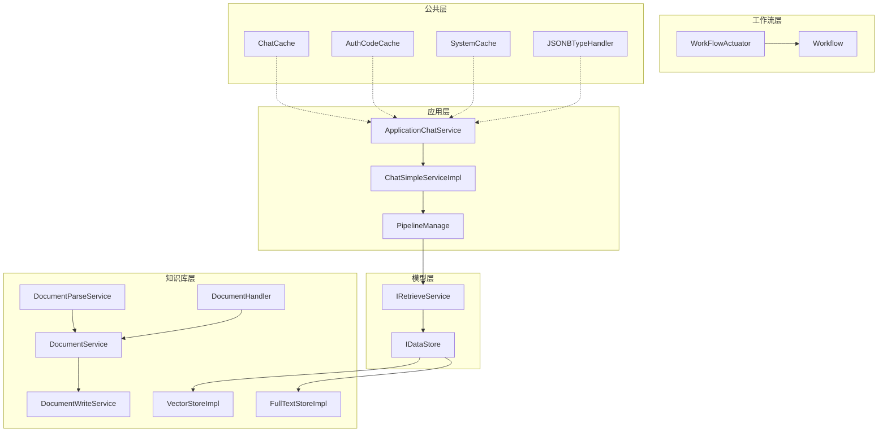
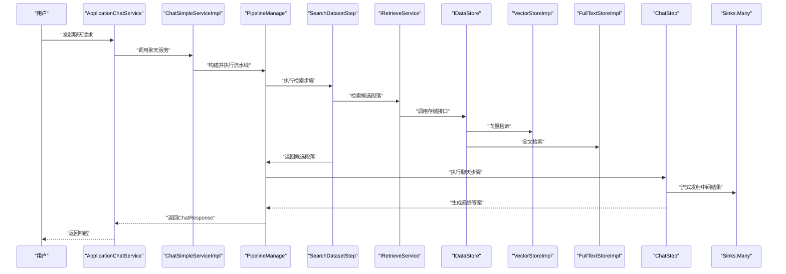
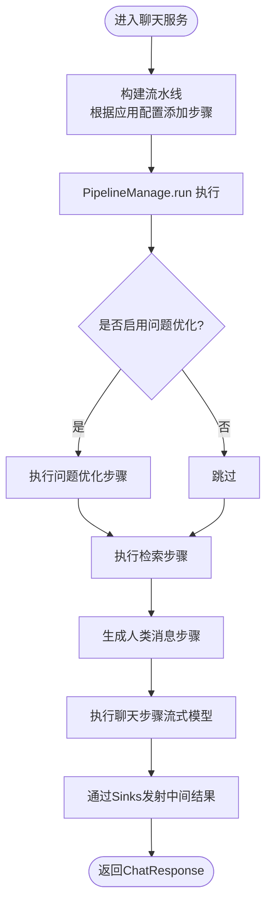
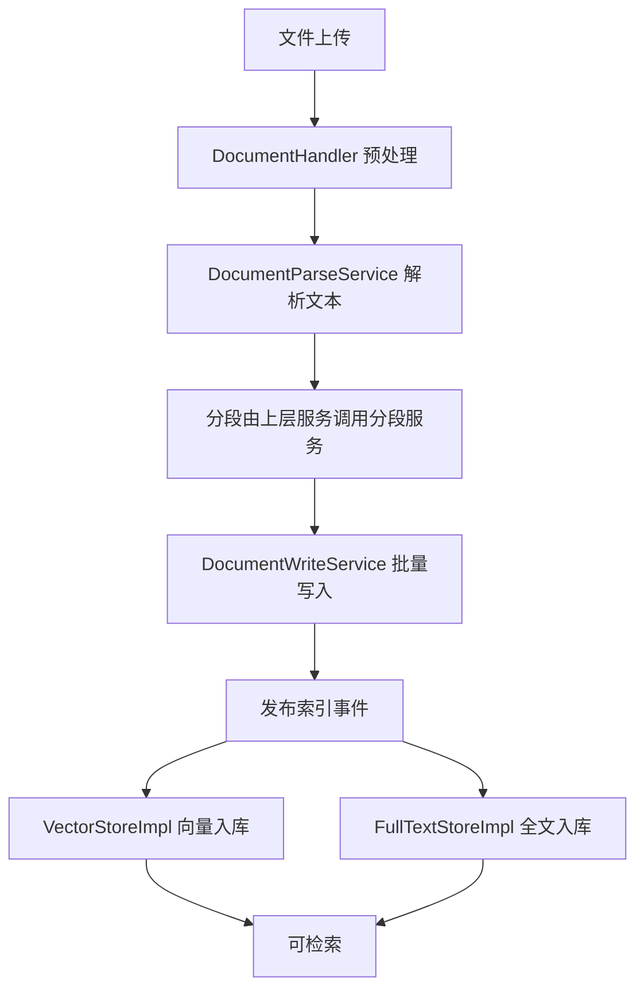
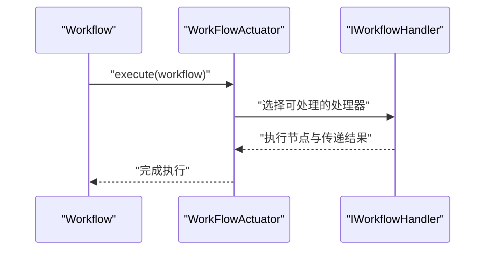
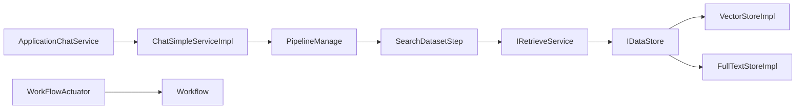

# 数据流设计

<cite>
**本文引用的文件**
- [README_CN.md](file://README_CN.md)
- [ChatSimpleServiceImpl.java](file://maxkb4j-service/maxkb4j-application/src/main/java/com/maxkb4j/application/service/impl/ChatSimpleServiceImpl.java)
- [PipelineManage.java](file://maxkb4j-service/maxkb4j-application/src/main/java/com/maxkb4j/application/pipeline/PipelineManage.java)
- [AbsStep.java](file://maxkb4j-service/maxkb4j-application/src/main/java/com/maxkb4j/application/pipeline/AbsStep.java)
- [SearchDatasetStep.java](file://maxkb4j-service/maxkb4j-application/src/main/java/com/maxkb4j/application/pipeline/step/searchdatasetstep/impl/SearchDatasetStep.java)
- [AbsSearchDatasetStep.java](file://maxkb4j-service/maxkb4j-application/src/main/java/com/maxkb4j/application/pipeline/step/searchdatasetstep/AbsSearchDatasetStep.java)
- [AbsGenerateHumanMessageStep.java](file://maxkb4j-service/maxkb4j-application/src/main/java/com/maxkb4j/application/pipeline/step/generatehumanmessagestep/AbsGenerateHumanMessageStep.java)
- [AbsChatStep.java](file://maxkb4j-service/maxkb4j-application/src/main/java/com/maxkb4j/application/pipeline/step/chatstep/AbsChatStep.java)
- [ChatStep.java](file://maxkb4j-service/maxkb4j-application/src/main/java/com/maxkb4j/application/pipeline/step/chatstep/impl/ChatStep.java)
- [ApplicationChatService.java](file://maxkb4j-service/maxkb4j-application/src/main/java/com/maxkb4j/application/service/ApplicationChatService.java)
- [DocumentParseService.java](file://maxkb4j-service/maxkb4j-knowledge/src/main/java/com/maxkb4j/knowledge/service/DocumentParseService.java)
- [DocumentService.java](file://maxkb4j-service/maxkb4j-knowledge/src/main/java/com/maxkb4j/knowledge/service/DocumentService.java)
- [DocumentWriteService.java](file://maxkb4j-service/maxkb4j-knowledge/src/main/java/com/maxkb4j/knowledge/service/DocumentWriteService.java)
- [DocumentHandler.java](file://maxkb4j-service/maxkb4j-knowledge/src/main/java/com/maxkb4j/knowledge/handler/DocumentHandler.java)
- [VectorStoreImpl.java](file://maxkb4j-service/maxkb4j-knowledge/src/main/java/com/maxkb4j/knowledge/store/VectorStoreImpl.java)
- [FullTextStoreImpl.java](file://maxkb4j-service/maxkb4j-knowledge/src/main/java/com/maxkb4j/knowledge/store/FullTextStoreImpl.java)
- [IRetrieveService.java](file://maxkb4j-service-api/maxkb4j-knowledge-api/src/main/java/com/maxkb4j/knowledge/service/IRetrieveService.java)
- [IDataStore.java](file://maxkb4j-service-api/maxkb4j-knowledge-api/src/main/java/com/maxkb4j/knowledge/store/IDataStore.java)
- [WorkFlowActuator.java](file://maxkb4j-service/maxkb4j-workflow/src/main/java/com/maxkb4j/workflow/service/WorkFlowActuator.java)
- [IWorkflowHandler.java](file://maxkb4j-service-api/maxkb4j-workflow-api/src/main/java/com/maxkb4j/workflow/service/IWorkflowHandler.java)
- [Workflow.java](file://maxkb4j-service-api/maxkb4j-workflow-api/src/main/java/com/maxkb4j/workflow/model/Workflow.java)
- [ChatCache.java](file://maxkb4j-common/src/main/java/com/maxkb4j/common/cache/ChatCache.java)
- [AuthCodeCache.java](file://maxkb4j-common/src/main/java/com/maxkb4j/common/cache/AuthCodeCache.java)
- [SystemCache.java](file://maxkb4j-common/src/main/java/com/maxkb4j/common/cache/SystemCache.java)
- [JSONBTypeHandler.java](file://maxkb4j-common/src/main/java/com/maxkb4j/common/typehandler/JSONBTypeHandler.java)
- [DatasetSettingTypeHandler.java](file://maxkb4j-common/src/main/java/com/maxkb4j/common/typehandler/DatasetSettingTypeHandler.java)
- [LlmModelSettingTypeHandler.java](file://maxkb4j-common/src/main/java/com/maxkb4j/common/typehandler/LlmModelSettingTypeHandler.java)
- [ApiException.java](file://maxkb4j-common/src/main/java/com/maxkb4j/common/exception/ApiException.java)
- [PostResponseHandler.java](file://maxkb4j-service/maxkb4j-application/src/main/java/com/maxkb4j/application/handler/PostResponseHandler.java)
</cite>

## 目录
1. [简介](#简介)
2. [项目结构](#项目结构)
3. [核心组件](#核心组件)
4. [架构总览](#架构总览)
5. [详细组件分析](#详细组件分析)
6. [依赖分析](#依赖分析)
7. [性能考虑](#性能考虑)
8. [故障排查指南](#故障排查指南)
9. [结论](#结论)
10. [附录](#附录)

## 简介
本文件面向MaxKB4j系统的数据流设计，聚焦三大主线数据流：
- 聊天请求数据流：用户输入 → 聊天服务 → 知识库检索 → 模型生成 → 响应返回
- 文档处理数据流：文件上传 → 解析器 → 分段 → 向量化 → 存储
- 工作流执行数据流：节点触发 → 处理器执行 → 结果传递 → 下一节点

文档还解释了数据在不同模块间的传递方式、数据格式转换、异步处理机制，并给出数据缓存策略、数据一致性保证与错误处理机制，辅以数据流图与关键处理节点的详细说明。

## 项目结构
MaxKB4j采用多模块分层架构，核心模块包括：
- 应用层：对外提供聊天、应用管理、访问控制等接口与服务
- 知识库层：文档解析、分段、向量化、存储、检索
- 模型层：模型提供商抽象与具体实现
- 工作流层：工作流编排与执行
- 公共层：缓存、类型处理器、异常与工具类

图表来源
- [ApplicationChatService.java:126-147](file://maxkb4j-service/maxkb4j-application/src/main/java/com/maxkb4j/application/service/ApplicationChatService.java#L126-L147)
- [ChatSimpleServiceImpl.java:33-50](file://maxkb4j-service/maxkb4j-application/src/main/java/com/maxkb4j/application/service/impl/ChatSimpleServiceImpl.java#L33-L50)
- [PipelineManage.java:39-61](file://maxkb4j-service/maxkb4j-application/src/main/java/com/maxkb4j/application/pipeline/PipelineManage.java#L39-L61)
- [DocumentParseService.java:18-25](file://maxkb4j-service/maxkb4j-knowledge/src/main/java/com/maxkb4j/knowledge/service/DocumentParseService.java#L18-L25)
- [DocumentService.java:80-92](file://maxkb4j-service/maxkb4j-knowledge/src/main/java/com/maxkb4j/knowledge/service/DocumentService.java#L80-L92)
- [DocumentWriteService.java:41-108](file://maxkb4j-service/maxkb4j-knowledge/src/main/java/com/maxkb4j/knowledge/service/DocumentWriteService.java#L41-L108)
- [DocumentHandler.java:99-121](file://maxkb4j-service/maxkb4j-knowledge/src/main/java/com/maxkb4j/knowledge/handler/DocumentHandler.java#L99-L121)
- [VectorStoreImpl.java:49-91](file://maxkb4j-service/maxkb4j-knowledge/src/main/java/com/maxkb4j/knowledge/store/VectorStoreImpl.java#L49-L91)
- [FullTextStoreImpl.java:36-45](file://maxkb4j-service/maxkb4j-knowledge/src/main/java/com/maxkb4j/knowledge/store/FullTextStoreImpl.java#L36-L45)
- [IRetrieveService.java](file://maxkb4j-service-api/maxkb4j-knowledge-api/src/main/java/com/maxkb4j/knowledge/service/IRetrieveService.java)
- [IDataStore.java](file://maxkb4j-service-api/maxkb4j-knowledge-api/src/main/java/com/maxkb4j/knowledge/store/IDataStore.java)
- [WorkFlowActuator.java:22-34](file://maxkb4j-service/maxkb4j-workflow/src/main/java/com/maxkb4j/workflow/service/WorkFlowActuator.java#L22-L34)
- [Workflow.java](file://maxkb4j-service-api/maxkb4j-workflow-api/src/main/java/com/maxkb4j/workflow/model/Workflow.java)
- [ChatCache.java:10-29](file://maxkb4j-common/src/main/java/com/maxkb4j/common/cache/ChatCache.java#L10-L29)
- [AuthCodeCache.java:8-27](file://maxkb4j-common/src/main/java/com/maxkb4j/common/cache/AuthCodeCache.java#L8-L27)
- [SystemCache.java:8-35](file://maxkb4j-common/src/main/java/com/maxkb4j/common/cache/SystemCache.java#L8-L35)
- [JSONBTypeHandler.java:15-59](file://maxkb4j-common/src/main/java/com/maxkb4j/common/typehandler/JSONBTypeHandler.java#L15-L59)

章节来源
- [README_CN.md:31-44](file://README_CN.md#L31-L44)

## 核心组件
- 聊天流水线与步骤
  - PipelineManage：负责顺序执行各步骤，维护上下文与细节统计，统一异常处理并通过Sinks发射实时消息
  - AbsStep：所有步骤基类，定义run与getDetails契约
  - AbsSearchDatasetStep/AbsGenerateHumanMessageStep/AbsChatStep：分别对应检索、构造人类消息、调用模型的步骤
  - ChatStep：封装LangChain4j流式调用，实时发射思考与回答片段
- 知识库处理
  - DocumentParseService：按文件名匹配解析器，抽取文本
  - DocumentService：事务性协调解析、分段、写入、事件发布
  - DocumentWriteService：批量写入段落、问题与关联关系，发布索引事件
  - DocumentHandler：针对特定格式（如CSV）的预处理与段落化
  - VectorStoreImpl/FullTextStoreImpl：向量存储与全文存储，支持批量、重试、删除、更新状态与检索
- 工作流执行
  - WorkFlowActuator：根据工作流类型选择处理器执行
  - Workflow：工作流模型（节点、边、变量等）

章节来源
- [PipelineManage.java:24-120](file://maxkb4j-service/maxkb4j-application/src/main/java/com/maxkb4j/application/pipeline/PipelineManage.java#L24-L120)
- [AbsStep.java](file://maxkb4j-service/maxkb4j-application/src/main/java/com/maxkb4j/application/pipeline/AbsStep.java)
- [AbsSearchDatasetStep.java](file://maxkb4j-service/maxkb4j-application/src/main/java/com/maxkb4j/application/pipeline/step/searchdatasetstep/AbsSearchDatasetStep.java)
- [AbsGenerateHumanMessageStep.java](file://maxkb4j-service/maxkb4j-application/src/main/java/com/maxkb4j/application/pipeline/step/generatehumanmessagestep/AbsGenerateHumanMessageStep.java)
- [AbsChatStep.java](file://maxkb4j-service/maxkb4j-application/src/main/java/com/maxkb4j/application/pipeline/step/chatstep/AbsChatStep.java)
- [ChatStep.java:55-78](file://maxkb4j-service/maxkb4j-application/src/main/java/com/maxkb4j/application/pipeline/step/chatstep/impl/ChatStep.java#L55-L78)
- [DocumentParseService.java:14-27](file://maxkb4j-service/maxkb4j-knowledge/src/main/java/com/maxkb4j/knowledge/service/DocumentParseService.java#L14-L27)
- [DocumentService.java:61-92](file://maxkb4j-service/maxkb4j-knowledge/src/main/java/com/maxkb4j/knowledge/service/DocumentService.java#L61-L92)
- [DocumentWriteService.java:30-120](file://maxkb4j-service/maxkb4j-knowledge/src/main/java/com/maxkb4j/knowledge/service/DocumentWriteService.java#L30-L120)
- [DocumentHandler.java:99-121](file://maxkb4j-service/maxkb4j-knowledge/src/main/java/com/maxkb4j/knowledge/handler/DocumentHandler.java#L99-L121)
- [VectorStoreImpl.java:31-288](file://maxkb4j-service/maxkb4j-knowledge/src/main/java/com/maxkb4j/knowledge/store/VectorStoreImpl.java#L31-L288)
- [FullTextStoreImpl.java:25-170](file://maxkb4j-service/maxkb4j-knowledge/src/main/java/com/maxkb4j/knowledge/store/FullTextStoreImpl.java#L25-L170)
- [WorkFlowActuator.java:16-36](file://maxkb4j-service/maxkb4j-workflow/src/main/java/com/maxkb4j/workflow/service/WorkFlowActuator.java#L16-L36)
- [Workflow.java](file://maxkb4j-service-api/maxkb4j-workflow-api/src/main/java/com/maxkb4j/workflow/model/Workflow.java)

## 架构总览
下图展示三条核心数据流的端到端路径与关键节点：

图表来源
- [ApplicationChatService.java:126-147](file://maxkb4j-service/maxkb4j-application/src/main/java/com/maxkb4j/application/service/ApplicationChatService.java#L126-L147)
- [ChatSimpleServiceImpl.java:33-50](file://maxkb4j-service/maxkb4j-application/src/main/java/com/maxkb4j/application/service/impl/ChatSimpleServiceImpl.java#L33-L50)
- [PipelineManage.java:39-61](file://maxkb4j-service/maxkb4j-application/src/main/java/com/maxkb4j/application/pipeline/PipelineManage.java#L39-L61)
- [SearchDatasetStep.java:36-52](file://maxkb4j-service/maxkb4j-application/src/main/java/com/maxkb4j/application/pipeline/step/searchdatasetstep/impl/SearchDatasetStep.java#L36-L52)
- [IRetrieveService.java](file://maxkb4j-service-api/maxkb4j-knowledge-api/src/main/java/com/maxkb4j/knowledge/service/IRetrieveService.java)
- [IDataStore.java](file://maxkb4j-service-api/maxkb4j-knowledge-api/src/main/java/com/maxkb4j/knowledge/store/IDataStore.java)
- [VectorStoreImpl.java:214-278](file://maxkb4j-service/maxkb4j-knowledge/src/main/java/com/maxkb4j/knowledge/store/VectorStoreImpl.java#L214-L278)
- [FullTextStoreImpl.java:100-168](file://maxkb4j-service/maxkb4j-knowledge/src/main/java/com/maxkb4j/knowledge/store/FullTextStoreImpl.java#L100-L168)
- [ChatStep.java:55-78](file://maxkb4j-service/maxkb4j-application/src/main/java/com/maxkb4j/application/pipeline/step/chatstep/impl/ChatStep.java#L55-L78)

## 详细组件分析

### 聊天请求数据流
- 输入：用户消息、历史对话、应用配置、知识库ID列表
- 步骤：
  - 问题优化（可选）→ 检索候选段落 → 构造人类消息 → 调用模型生成
- 关键点：
  - PipelineManage顺序执行步骤，异常通过Sinks发射错误
  - ChatStep使用LangChain4j流式模型，实时发射思考内容与回答片段
  - 历史消息截断由PipelineManage提供
  - 详情统计通过每个步骤的getDetails聚合

图表来源
- [ChatSimpleServiceImpl.java:33-50](file://maxkb4j-service/maxkb4j-application/src/main/java/com/maxkb4j/application/service/impl/ChatSimpleServiceImpl.java#L33-L50)
- [PipelineManage.java:39-61](file://maxkb4j-service/maxkb4j-application/src/main/java/com/maxkb4j/application/pipeline/PipelineManage.java#L39-L61)
- [AbsSearchDatasetStep.java](file://maxkb4j-service/maxkb4j-application/src/main/java/com/maxkb4j/application/pipeline/step/searchdatasetstep/AbsSearchDatasetStep.java)
- [AbsGenerateHumanMessageStep.java](file://maxkb4j-service/maxkb4j-application/src/main/java/com/maxkb4j/application/pipeline/step/generatehumanmessagestep/AbsGenerateHumanMessageStep.java)
- [AbsChatStep.java](file://maxkb4j-service/maxkb4j-application/src/main/java/com/maxkb4j/application/pipeline/step/chatstep/AbsChatStep.java)
- [ChatStep.java:55-78](file://maxkb4j-service/maxkb4j-application/src/main/java/com/maxkb4j/application/pipeline/step/chatstep/impl/ChatStep.java#L55-L78)

章节来源
- [ApplicationChatService.java:126-147](file://maxkb4j-service/maxkb4j-application/src/main/java/com/maxkb4j/application/service/ApplicationChatService.java#L126-L147)
- [ChatSimpleServiceImpl.java:33-50](file://maxkb4j-service/maxkb4j-application/src/main/java/com/maxkb4j/application/service/impl/ChatSimpleServiceImpl.java#L33-L50)
- [PipelineManage.java:39-61](file://maxkb4j-service/maxkb4j-application/src/main/java/com/maxkb4j/application/pipeline/PipelineManage.java#L39-L61)
- [ChatStep.java:55-78](file://maxkb4j-service/maxkb4j-application/src/main/java/com/maxkb4j/application/pipeline/step/chatstep/impl/ChatStep.java#L55-L78)

### 文档处理数据流
- 输入：上传文件（含文件名与流）
- 处理链：
  - DocumentHandler：预处理（如CSV编码检测与解析）
  - DocumentParseService：按文件名匹配解析器抽取文本
  - DocumentService：事务性协调解析、分段、写入、事件发布
  - DocumentWriteService：批量写入段落、问题与关联关系，发布索引事件
  - 存储：VectorStoreImpl（pgvector）与FullTextStoreImpl（MongoDB）双存储
- 关键点：
  - 批量写入与事件发布分离，降低事务压力
  - 向量存储支持批处理与重试，失败实体可后续重试
  - 全文存储支持全文检索与去重聚合

图表来源
- [DocumentHandler.java:99-121](file://maxkb4j-service/maxkb4j-knowledge/src/main/java/com/maxkb4j/knowledge/handler/DocumentHandler.java#L99-L121)
- [DocumentParseService.java:18-25](file://maxkb4j-service/maxkb4j-knowledge/src/main/java/com/maxkb4j/knowledge/service/DocumentParseService.java#L18-L25)
- [DocumentService.java:80-92](file://maxkb4j-service/maxkb4j-knowledge/src/main/java/com/maxkb4j/knowledge/service/DocumentService.java#L80-L92)
- [DocumentWriteService.java:41-108](file://maxkb4j-service/maxkb4j-knowledge/src/main/java/com/maxkb4j/knowledge/service/DocumentWriteService.java#L41-L108)
- [VectorStoreImpl.java:49-91](file://maxkb4j-service/maxkb4j-knowledge/src/main/java/com/maxkb4j/knowledge/store/VectorStoreImpl.java#L49-L91)
- [FullTextStoreImpl.java:36-45](file://maxkb4j-service/maxkb4j-knowledge/src/main/java/com/maxkb4j/knowledge/store/FullTextStoreImpl.java#L36-L45)

章节来源
- [DocumentHandler.java:99-121](file://maxkb4j-service/maxkb4j-knowledge/src/main/java/com/maxkb4j/knowledge/handler/DocumentHandler.java#L99-L121)
- [DocumentParseService.java:14-27](file://maxkb4j-service/maxkb4j-knowledge/src/main/java/com/maxkb4j/knowledge/service/DocumentParseService.java#L14-L27)
- [DocumentService.java:61-92](file://maxkb4j-service/maxkb4j-knowledge/src/main/java/com/maxkb4j/knowledge/service/DocumentService.java#L61-L92)
- [DocumentWriteService.java:30-120](file://maxkb4j-service/maxkb4j-knowledge/src/main/java/com/maxkb4j/knowledge/service/DocumentWriteService.java#L30-L120)
- [VectorStoreImpl.java:31-288](file://maxkb4j-service/maxkb4j-knowledge/src/main/java/com/maxkb4j/knowledge/store/VectorStoreImpl.java#L31-L288)
- [FullTextStoreImpl.java:25-170](file://maxkb4j-service/maxkb4j-knowledge/src/main/java/com/maxkb4j/knowledge/store/FullTextStoreImpl.java#L25-L170)

### 工作流执行数据流
- 输入：工作流对象（包含节点、边、变量）
- 执行：
  - WorkFlowActuator根据类型选择处理器
  - 处理器执行节点，节点间通过变量与输出管理器传递结果
- 关键点：
  - 策略模式选择处理器，避免硬编码分支
  - 节点类型与处理器注册由自动注册器管理

图表来源
- [WorkFlowActuator.java:22-34](file://maxkb4j-service/maxkb4j-workflow/src/main/java/com/maxkb4j/workflow/service/WorkFlowActuator.java#L22-L34)
- [IWorkflowHandler.java](file://maxkb4j-service-api/maxkb4j-workflow-api/src/main/java/com/maxkb4j/workflow/service/IWorkflowHandler.java)
- [Workflow.java](file://maxkb4j-service-api/maxkb4j-workflow-api/src/main/java/com/maxkb4j/workflow/model/Workflow.java)

章节来源
- [WorkFlowActuator.java:16-36](file://maxkb4j-service/maxkb4j-workflow/src/main/java/com/maxkb4j/workflow/service/WorkFlowActuator.java#L16-L36)
- [IWorkflowHandler.java](file://maxkb4j-service-api/maxkb4j-workflow-api/src/main/java/com/maxkb4j/workflow/service/IWorkflowHandler.java)
- [Workflow.java](file://maxkb4j-service-api/maxkb4j-workflow-api/src/main/java/com/maxkb4j/workflow/model/Workflow.java)

## 依赖分析
- 模块耦合
  - 应用层依赖知识库层的检索接口与存储接口，通过接口隔离具体实现
  - 知识库层依赖向量与全文存储实现，二者通过统一接口解耦
  - 工作流层通过处理器接口与具体工作流模型解耦
- 外部依赖
  - 向量数据库：PostgreSQL + pgvector
  - 全文检索：MongoDB
  - 缓存：Caffeine
  - 类型映射：MyBatis JSONB类型处理器

图表来源
- [ApplicationChatService.java:126-147](file://maxkb4j-service/maxkb4j-application/src/main/java/com/maxkb4j/application/service/ApplicationChatService.java#L126-L147)
- [ChatSimpleServiceImpl.java:33-50](file://maxkb4j-service/maxkb4j-application/src/main/java/com/maxkb4j/application/service/impl/ChatSimpleServiceImpl.java#L33-L50)
- [PipelineManage.java:39-61](file://maxkb4j-service/maxkb4j-application/src/main/java/com/maxkb4j/application/pipeline/PipelineManage.java#L39-L61)
- [SearchDatasetStep.java:36-52](file://maxkb4j-service/maxkb4j-application/src/main/java/com/maxkb4j/application/pipeline/step/searchdatasetstep/impl/SearchDatasetStep.java#L36-L52)
- [IRetrieveService.java](file://maxkb4j-service-api/maxkb4j-knowledge-api/src/main/java/com/maxkb4j/knowledge/service/IRetrieveService.java)
- [IDataStore.java](file://maxkb4j-service-api/maxkb4j-knowledge-api/src/main/java/com/maxkb4j/knowledge/store/IDataStore.java)
- [VectorStoreImpl.java:31-288](file://maxkb4j-service/maxkb4j-knowledge/src/main/java/com/maxkb4j/knowledge/store/VectorStoreImpl.java#L31-L288)
- [FullTextStoreImpl.java:25-170](file://maxkb4j-service/maxkb4j-knowledge/src/main/java/com/maxkb4j/knowledge/store/FullTextStoreImpl.java#L25-L170)
- [WorkFlowActuator.java:22-34](file://maxkb4j-service/maxkb4j-workflow/src/main/java/com/maxkb4j/workflow/service/WorkFlowActuator.java#L22-L34)
- [Workflow.java](file://maxkb4j-service-api/maxkb4j-workflow-api/src/main/java/com/maxkb4j/workflow/model/Workflow.java)

## 性能考虑
- 异步与流式
  - 聊天步骤采用LangChain4j流式模型，边生成边发射，降低首字节延迟
  - 应用层支持异步聊天调用，使用线程池执行，异常统一处理
- 批处理与重试
  - 向量存储支持批处理与多次重试，失败实体可后续重试
  - 全文存储采用聚合与去重，减少重复扫描
- 缓存
  - ChatCache、AuthCodeCache、SystemCache提供多级缓存，降低热点数据访问延迟
- 数据库与索引
  - 向量检索与全文检索分别走pgvector与MongoDB全文索引，避免全表扫描

章节来源
- [ChatStep.java:55-78](file://maxkb4j-service/maxkb4j-application/src/main/java/com/maxkb4j/application/pipeline/step/chatstep/impl/ChatStep.java#L55-L78)
- [ApplicationChatService.java:139-147](file://maxkb4j-service/maxkb4j-application/src/main/java/com/maxkb4j/application/service/ApplicationChatService.java#L139-L147)
- [VectorStoreImpl.java:67-91](file://maxkb4j-service/maxkb4j-knowledge/src/main/java/com/maxkb4j/knowledge/store/VectorStoreImpl.java#L67-L91)
- [FullTextStoreImpl.java:100-168](file://maxkb4j-service/maxkb4j-knowledge/src/main/java/com/maxkb4j/knowledge/store/FullTextStoreImpl.java#L100-L168)
- [ChatCache.java:10-29](file://maxkb4j-common/src/main/java/com/maxkb4j/common/cache/ChatCache.java#L10-L29)
- [AuthCodeCache.java:8-27](file://maxkb4j-common/src/main/java/com/maxkb4j/common/cache/AuthCodeCache.java#L8-L27)
- [SystemCache.java:8-35](file://maxkb4j-common/src/main/java/com/maxkb4j/common/cache/SystemCache.java#L8-L35)

## 故障排查指南
- 错误传播
  - PipelineManage在步骤执行异常时通过Sinks发射错误并抛出运行时异常
  - ChatStep对ApiException进行特殊处理，直接通过Sinks发射错误
- 常见问题定位
  - 向量存储：检查批大小、重试次数与延迟配置，关注插入失败日志
  - 全文存储：确认MongoDB全文索引与聚合管道参数
  - 缓存：核对容量与过期策略，避免缓存穿透
- 数据一致性
  - 事务性写入：DocumentWriteService在单事务内写入文档、段落、问题与关联
  - 事件驱动：索引事件发布后由存储实现处理，保证最终一致

章节来源
- [PipelineManage.java:50-57](file://maxkb4j-service/maxkb4j-application/src/main/java/com/maxkb4j/application/pipeline/PipelineManage.java#L50-L57)
- [ChatStep.java:55-57](file://maxkb4j-service/maxkb4j-application/src/main/java/com/maxkb4j/application/pipeline/step/chatstep/impl/ChatStep.java#L55-L57)
- [ApiException.java:11-26](file://maxkb4j-common/src/main/java/com/maxkb4j/common/exception/ApiException.java#L11-L26)
- [VectorStoreImpl.java:76-91](file://maxkb4j-service/maxkb4j-knowledge/src/main/java/com/maxkb4j/knowledge/store/VectorStoreImpl.java#L76-L91)
- [FullTextStoreImpl.java:144-168](file://maxkb4j-service/maxkb4j-knowledge/src/main/java/com/maxkb4j/knowledge/store/FullTextStoreImpl.java#L144-L168)
- [DocumentWriteService.java:41-108](file://maxkb4j-service/maxkb4j-knowledge/src/main/java/com/maxkb4j/knowledge/service/DocumentWriteService.java#L41-L108)

## 结论
MaxKB4j通过清晰的模块边界与接口抽象，实现了高内聚、低耦合的数据流设计。聊天请求采用流水线与流式模型，兼顾实时性与可扩展性；文档处理采用双存储与批处理重试，保障吞吐与可靠性；工作流执行通过策略模式与处理器解耦，便于扩展。配合多级缓存与事件驱动，系统在高并发场景下具备良好的性能与稳定性。

## 附录
- 数据格式与序列化
  - JSONB字段通过MyBatis类型处理器映射，确保数据库与对象之间的正确转换
- 异步处理
  - 应用层提供异步聊天方法，异常统一记录并可向客户端回传

章节来源
- [JSONBTypeHandler.java:15-59](file://maxkb4j-common/src/main/java/com/maxkb4j/common/typehandler/JSONBTypeHandler.java#L15-L59)
- [DatasetSettingTypeHandler.java:15-39](file://maxkb4j-common/src/main/java/com/maxkb4j/common/typehandler/DatasetSettingTypeHandler.java#L15-L39)
- [LlmModelSettingTypeHandler.java:15-39](file://maxkb4j-common/src/main/java/com/maxkb4j/common/typehandler/LlmModelSettingTypeHandler.java#L15-L39)
- [ApplicationChatService.java:139-147](file://maxkb4j-service/maxkb4j-application/src/main/java/com/maxkb4j/application/service/ApplicationChatService.java#L139-L147)