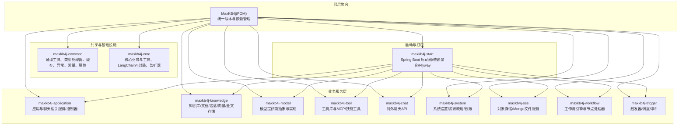
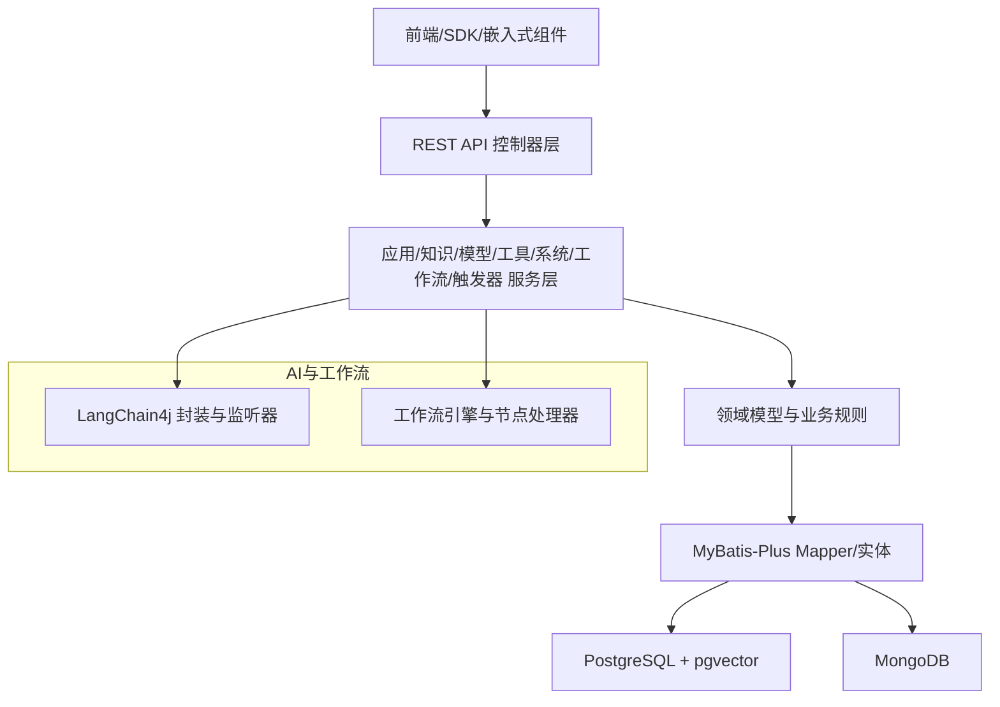
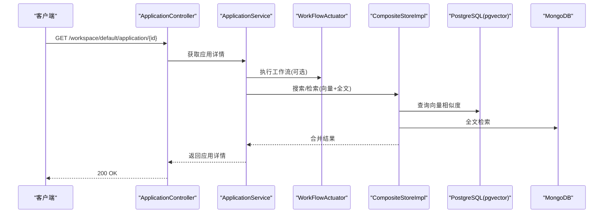
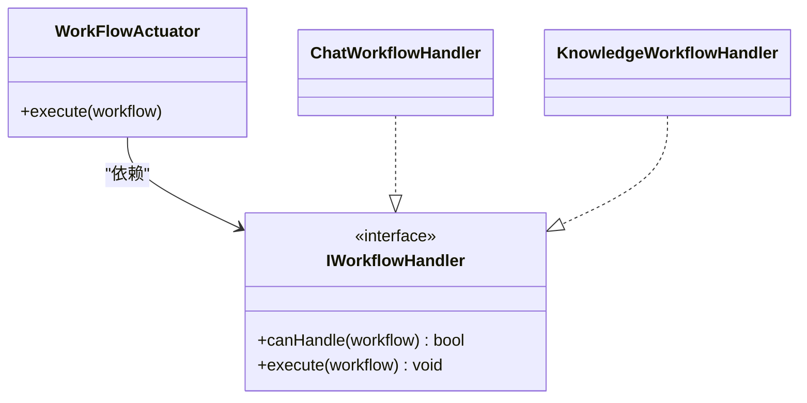
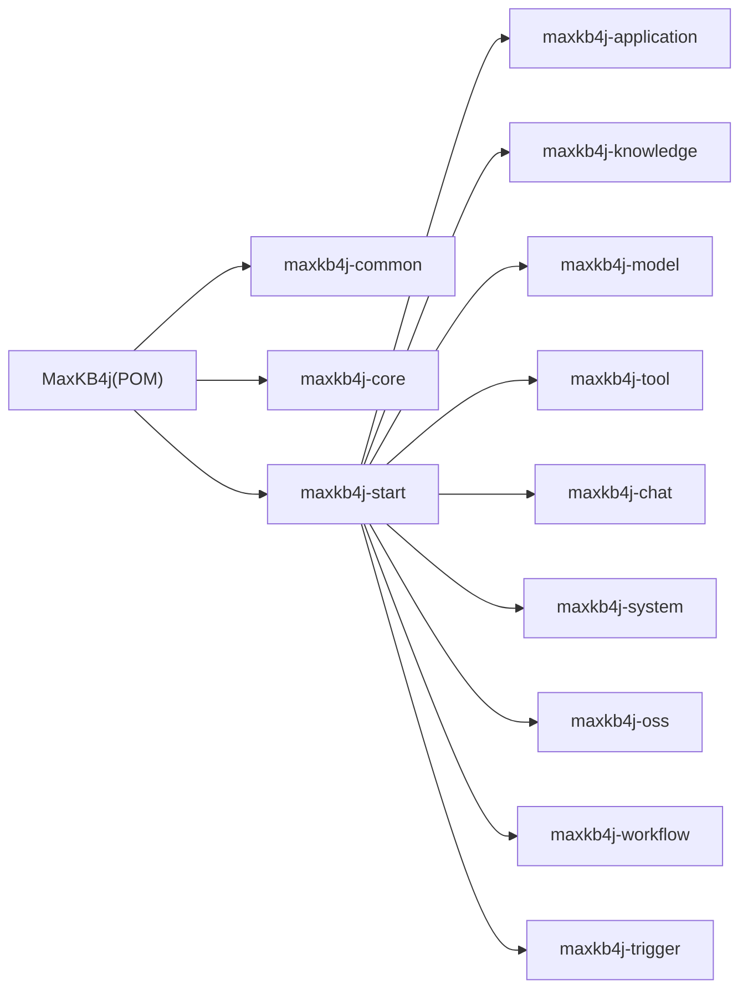

# 整体架构概览

<cite>
**本文引用的文件**
- [README_CN.md](file://README_CN.md)
- [pom.xml](file://pom.xml)
- [maxkb4j-start/pom.xml](file://maxkb4j-start/pom.xml)
- [maxkb4j-start/src/main/java/com/maxkb4j/start/MaxKb4jApplication.java](file://maxkb4j-start/src/main/java/com/maxkb4j/start/MaxKb4jApplication.java)
- [maxkb4j-start/src/main/resources/application.yml](file://maxkb4j-start/src/main/resources/application.yml)
- [maxkb4j-common/pom.xml](file://maxkb4j-common/pom.xml)
- [maxkb4j-core/pom.xml](file://maxkb4j-core/pom.xml)
- [maxkb4j-common/src/main/java/com/maxkb4j/common/util/SpringUtil.java](file://maxkb4j-common/src/main/java/com/maxkb4j/common/util/SpringUtil.java)
- [maxkb4j-core/src/main/java/com/maxkb4j/core/langchain4j/AssistantServices.java](file://maxkb4j-core/src/main/java/com/maxkb4j/core/langchain4j/AssistantServices.java)
- [maxkb4j-service/maxkb4j-application/src/main/java/com/maxkb4j/application/service/ApplicationService.java](file://maxkb4j-service/maxkb4j-application/src/main/java/com/maxkb4j/application/service/ApplicationService.java)
- [maxkb4j-service/maxkb4j-application/src/main/java/com/maxkb4j/application/controller/ApplicationController.java](file://maxkb4j-service/maxkb4j-application/src/main/java/com/maxkb4j/application/controller/ApplicationController.java)
- [maxkb4j-service/maxkb4j-knowledge/src/main/java/com/maxkb4j/knowledge/store/CompositeStoreImpl.java](file://maxkb4j-service/maxkb4j-knowledge/src/main/java/com/maxkb4j/knowledge/store/CompositeStoreImpl.java)
- [maxkb4j-service/maxkb4j-model/src/main/java/com/maxkb4j/model/provider/AbsModelProvider.java](file://maxkb4j-service/maxkb4j-model/src/main/java/com/maxkb4j/model/provider/AbsModelProvider.java)
- [maxkb4j-service/maxkb4j-system/src/main/java/com/maxkb4j/system/service/SystemSettingService.java](file://maxkb4j-service/maxkb4j-system/src/main/java/com/maxkb4j/system/service/SystemSettingService.java)
- [maxkb4j-service/maxkb4j-workflow/src/main/java/com/maxkb4j/workflow/service/WorkFlowActuator.java](file://maxkb4j-service/maxkb4j-workflow/src/main/java/com/maxkb4j/workflow/service/WorkFlowActuator.java)
</cite>

## 目录
1. [引言](#引言)
2. [项目结构](#项目结构)
3. [核心组件](#核心组件)
4. [架构总览](#架构总览)
5. [详细组件分析](#详细组件分析)
6. [依赖分析](#依赖分析)
7. [性能考虑](#性能考虑)
8. [故障排查指南](#故障排查指南)
9. [结论](#结论)
10. [附录](#附录)

## 引言
MaxKB4j 是一个面向企业级的智能问答系统，采用“检索增强生成（RAG）+ LLM 工作流引擎”的一体化设计，目标是在不改变既有系统的情况下，快速赋予应用“理解、推理、执行”的AI能力。系统强调模块化、分层清晰、可扩展与高并发，技术栈覆盖Java 21、Spring Boot 3、LangChain4j、PostgreSQL+pgvector、MongoDB、Caffeine缓存、Sa-Token鉴权与Flyway迁移等。

## 项目结构
MaxKB4j 采用 Maven 多模块聚合结构，顶层 POM 定义了统一的版本与依赖管理，子模块按领域与层次划分，形成清晰的职责边界与复用路径。

图表来源
- [pom.xml:57-62](file://pom.xml#L57-L62)
- [maxkb4j-start/pom.xml:15-60](file://maxkb4j-start/pom.xml#L15-L60)

章节来源
- [pom.xml:57-62](file://pom.xml#L57-L62)
- [maxkb4j-start/pom.xml:15-60](file://maxkb4j-start/pom.xml#L15-L60)

## 核心组件
- maxkb4j-common：提供通用工具、类型处理器、缓存、异常体系、常量、属性与MyBatis-Plus配置，是所有模块的基础依赖。
- maxkb4j-core：封装LangChain4j的AiServices监听器注册、消息工具、分词与切片工具，以及数据库工具等，为上层服务提供核心能力。
- maxkb4j-service：按业务域拆分的模块，覆盖应用/聊天、知识库、模型、工具、系统、对象存储、工作流、触发器等。
- maxkb4j-service-api：与服务层对应的API模块，定义实体、Mapper、服务接口与VO，实现业务与数据契约分离。
- maxkb4j-start：Spring Boot 启动器，聚合各业务模块，启用缓存与调度，集成Flyway数据库迁移。

章节来源
- [maxkb4j-common/pom.xml:14-88](file://maxkb4j-common/pom.xml#L14-L88)
- [maxkb4j-core/pom.xml:19-38](file://maxkb4j-core/pom.xml#L19-L38)
- [maxkb4j-start/pom.xml:15-60](file://maxkb4j-start/pom.xml#L15-L60)

## 架构总览
系统采用分层架构，自上而下为表现层（REST 控制器）、应用层（服务）、领域层（业务逻辑）、数据访问层（Mapper/Repository），配合LangChain4j工作流与多存储（PostgreSQL+pgvector、MongoDB）实现RAG与多Agent协作。

图表来源
- [maxkb4j-service/maxkb4j-application/src/main/java/com/maxkb4j/application/controller/ApplicationController.java:41-44](file://maxkb4j-service/maxkb4j-application/src/main/java/com/maxkb4j/application/controller/ApplicationController.java#L41-L44)
- [maxkb4j-service/maxkb4j-application/src/main/java/com/maxkb4j/application/service/ApplicationService.java:66-81](file://maxkb4j-service/maxkb4j-application/src/main/java/com/maxkb4j/application/service/ApplicationService.java#L66-L81)
- [maxkb4j-service/maxkb4j-knowledge/src/main/java/com/maxkb4j/knowledge/store/CompositeStoreImpl.java:21-43](file://maxkb4j-service/maxkb4j-knowledge/src/main/java/com/maxkb4j/knowledge/store/CompositeStoreImpl.java#L21-L43)
- [maxkb4j-core/src/main/java/com/maxkb4j/core/langchain4j/AssistantServices.java:13-24](file://maxkb4j-core/src/main/java/com/maxkb4j/core/langchain4j/AssistantServices.java#L13-L24)

章节来源
- [maxkb4j-service/maxkb4j-application/src/main/java/com/maxkb4j/application/controller/ApplicationController.java:41-44](file://maxkb4j-service/maxkb4j-application/src/main/java/com/maxkb4j/application/controller/ApplicationController.java#L41-L44)
- [maxkb4j-service/maxkb4j-application/src/main/java/com/maxkb4j/application/service/ApplicationService.java:66-81](file://maxkb4j-service/maxkb4j-application/src/main/java/com/maxkb4j/application/service/ApplicationService.java#L66-L81)
- [maxkb4j-service/maxkb4j-knowledge/src/main/java/com/maxkb4j/knowledge/store/CompositeStoreImpl.java:21-43](file://maxkb4j-service/maxkb4j-knowledge/src/main/java/com/maxkb4j/knowledge/store/CompositeStoreImpl.java#L21-L43)
- [maxkb4j-core/src/main/java/com/maxkb4j/core/langchain4j/AssistantServices.java:13-24](file://maxkb4j-core/src/main/java/com/maxkb4j/core/langchain4j/AssistantServices.java#L13-L24)

## 详细组件分析

### 模块职责划分
- maxkb4j-common：提供跨模块的通用能力（类型处理器、缓存、异常、工具类、MyBatis-Plus配置），统一依赖版本与引入LangChain4j、Sa-Token、Caffeine、Knife4j等。
- maxkb4j-core：封装LangChain4j AiServices监听器注册、消息工具、分词与切片工具，以及数据库工具，为上层服务提供核心能力。
- maxkb4j-application：应用与聊天相关服务与控制器，负责应用生命周期、访问令牌、统计、导出、TTS/STT、Prompt生成等。
- maxkb4j-knowledge：知识库全链路能力，包括文档解析/分段/写入/检索，向量与全文双写存储，复合检索融合排序。
- maxkb4j-model：模型提供商抽象与多厂商实现（OpenAI、Azure、Gemini、Anthropic、本地/私有模型等），统一参数表单与能力开关。
- maxkb4j-tool：工具库与MCP/技能工具接入，提供工具连接、导入导出与校验。
- maxkb4j-chat：对外聊天API，兼容OpenAI风格接口。
- maxkb4j-system：系统设置、资源映射、权限与审计。
- maxkb4j-oss：对象存储与Mongo文件服务。
- maxkb4j-workflow：工作流引擎，策略模式选择处理器，支持条件分支、函数调用、多轮对话记忆。
- maxkb4j-trigger：触发器/调度/事件，支持Cron与Webhook。
- maxkb4j-start：聚合各模块依赖，启用缓存与调度，集成Flyway迁移。

章节来源
- [maxkb4j-common/pom.xml:14-88](file://maxkb4j-common/pom.xml#L14-L88)
- [maxkb4j-core/pom.xml:19-38](file://maxkb4j-core/pom.xml#L19-L38)
- [maxkb4j-start/pom.xml:15-60](file://maxkb4j-start/pom.xml#L15-L60)

### 分层架构设计
- 表现层：REST 控制器（如应用控制器）接收请求，进行鉴权与参数校验，调用服务层。
- 应用层：服务类（如应用服务）编排业务流程，协调模型、知识库、工具与系统设置。
- 领域层：实体与业务规则，通过Mapper/Service实现MyBatis-Plus访问。
- 数据层：PostgreSQL（含pgvector）用于结构化数据与向量检索，MongoDB用于全文检索与对象存储。

图表来源
- [maxkb4j-service/maxkb4j-application/src/main/java/com/maxkb4j/application/controller/ApplicationController.java:94-96](file://maxkb4j-service/maxkb4j-application/src/main/java/com/maxkb4j/application/controller/ApplicationController.java#L94-L96)
- [maxkb4j-service/maxkb4j-application/src/main/java/com/maxkb4j/application/service/ApplicationService.java:257-288](file://maxkb4j-service/maxkb4j-application/src/main/java/com/maxkb4j/application/service/ApplicationService.java#L257-L288)
- [maxkb4j-service/maxkb4j-workflow/src/main/java/com/maxkb4j/workflow/service/WorkFlowActuator.java:18-34](file://maxkb4j-service/maxkb4j-workflow/src/main/java/com/maxkb4j/workflow/service/WorkFlowActuator.java#L18-L34)
- [maxkb4j-service/maxkb4j-knowledge/src/main/java/com/maxkb4j/knowledge/store/CompositeStoreImpl.java:118-140](file://maxkb4j-service/maxkb4j-knowledge/src/main/java/com/maxkb4j/knowledge/store/CompositeStoreImpl.java#L118-L140)

章节来源
- [maxkb4j-service/maxkb4j-application/src/main/java/com/maxkb4j/application/controller/ApplicationController.java:94-96](file://maxkb4j-service/maxkb4j-application/src/main/java/com/maxkb4j/application/controller/ApplicationController.java#L94-L96)
- [maxkb4j-service/maxkb4j-application/src/main/java/com/maxkb4j/application/service/ApplicationService.java:257-288](file://maxkb4j-service/maxkb4j-application/src/main/java/com/maxkb4j/application/service/ApplicationService.java#L257-L288)
- [maxkb4j-service/maxkb4j-workflow/src/main/java/com/maxkb4j/workflow/service/WorkFlowActuator.java:18-34](file://maxkb4j-service/maxkb4j-workflow/src/main/java/com/maxkb4j/workflow/service/WorkFlowActuator.java#L18-L34)
- [maxkb4j-service/maxkb4j-knowledge/src/main/java/com/maxkb4j/knowledge/store/CompositeStoreImpl.java:118-140](file://maxkb4j-service/maxkb4j-knowledge/src/main/java/com/maxkb4j/knowledge/store/CompositeStoreImpl.java#L118-L140)

### 微服务化与松耦合设计
- 模块间通过API模块（maxkb4j-service-api）定义契约，服务层通过接口与依赖注入解耦。
- 工作流Actuator采用策略模式，按工作流类型选择对应处理器，避免硬编码分支。
- LangChain4j通过统一的AiServices封装与监听器注册，屏蔽底层模型差异。
- SpringUtil提供静态获取Bean的能力，便于跨模块使用Spring上下文。

图表来源
- [maxkb4j-service/maxkb4j-workflow/src/main/java/com/maxkb4j/workflow/service/WorkFlowActuator.java:18-34](file://maxkb4j-service/maxkb4j-workflow/src/main/java/com/maxkb4j/workflow/service/WorkFlowActuator.java#L18-L34)

章节来源
- [maxkb4j-service/maxkb4j-workflow/src/main/java/com/maxkb4j/workflow/service/WorkFlowActuator.java:18-34](file://maxkb4j-service/maxkb4j-workflow/src/main/java/com/maxkb4j/workflow/service/WorkFlowActuator.java#L18-L34)
- [maxkb4j-common/src/main/java/com/maxkb4j/common/util/SpringUtil.java:18-72](file://maxkb4j-common/src/main/java/com/maxkb4j/common/util/SpringUtil.java#L18-L72)
- [maxkb4j-core/src/main/java/com/maxkb4j/core/langchain4j/AssistantServices.java:13-24](file://maxkb4j-core/src/main/java/com/maxkb4j/core/langchain4j/AssistantServices.java#L13-L24)

### 技术栈选择理由与性能考量
- Spring Boot 3.x：现代化框架，配合Java 21与虚拟线程，具备更好的并发与响应性能；内置监控与可观测性生态完善。
- LangChain4j：提供统一的AI服务抽象与监听器机制，简化多模型接入与工作流编排；支持多种提供商与本地/私有模型。
- PostgreSQL + pgvector：结构化数据与向量检索一体化，降低运维复杂度；向量索引支持高效相似度计算。
- MongoDB：用于全文检索与对象存储，与向量库互补，提升检索召回与灵活性。
- Caffeine：多级缓存（应用层/业务层）降低数据库压力，提升热点数据访问性能。
- Sa-Token：轻量级鉴权，支持JWT与注解鉴权，满足RBAC权限控制。
- Flyway：数据库迁移自动化，保证版本演进与一致性。

章节来源
- [README_CN.md:102-111](file://README_CN.md#L102-L111)
- [maxkb4j-start/src/main/resources/application.yml:19-25](file://maxkb4j-start/src/main/resources/application.yml#L19-L25)
- [maxkb4j-common/pom.xml:51-58](file://maxkb4j-common/pom.xml#L51-L58)

### 可扩展性设计
- 模块化：各业务域独立模块，便于团队并行开发与独立发布。
- 插件化：工具与模型提供商采用抽象与工厂模式，新增提供商只需实现接口。
- 工作流：节点处理器注册中心与比较器自动注册，支持低代码扩展。
- 存储：复合存储实现双写与融合检索，未来可扩展更多存储后端。

章节来源
- [maxkb4j-service/maxkb4j-model/src/main/java/com/maxkb4j/model/provider/AbsModelProvider.java:36-152](file://maxkb4j-service/maxkb4j-model/src/main/java/com/maxkb4j/model/provider/AbsModelProvider.java#L36-L152)
- [maxkb4j-service/maxkb4j-workflow/src/main/java/com/maxkb4j/workflow/service/WorkFlowActuator.java:18-34](file://maxkb4j-service/maxkb4j-workflow/src/main/java/com/maxkb4j/workflow/service/WorkFlowActuator.java#L18-L34)
- [maxkb4j-service/maxkb4j-knowledge/src/main/java/com/maxkb4j/knowledge/store/CompositeStoreImpl.java:21-43](file://maxkb4j-service/maxkb4j-knowledge/src/main/java/com/maxkb4j/knowledge/store/CompositeStoreImpl.java#L21-L43)

## 依赖分析
- 顶层POM集中管理版本与依赖，子模块按需引入；common与core提供基础能力，start聚合业务模块。
- 启动器启用缓存与调度，集成Flyway迁移；应用层服务通过依赖注入组合，避免紧耦合。

图表来源
- [pom.xml:57-62](file://pom.xml#L57-L62)
- [maxkb4j-start/pom.xml:15-60](file://maxkb4j-start/pom.xml#L15-L60)

章节来源
- [pom.xml:57-62](file://pom.xml#L57-L62)
- [maxkb4j-start/pom.xml:15-60](file://maxkb4j-start/pom.xml#L15-L60)

## 性能考虑
- 并发与响应：基于Java 21 + Spring Boot 3 + 虚拟线程，结合响应式与异步I/O，提升吞吐与低延迟。
- 缓存策略：多级缓存（Caffeine）加速热点数据访问，减少数据库与模型调用压力。
- 检索融合：向量与全文双写+融合排序，兼顾精度与召回，降低重复与抖动。
- 数据库：PostgreSQL + pgvector 与 MongoDB 双存储，按场景优化查询路径。

章节来源
- [README_CN.md:37-44](file://README_CN.md#L37-L44)
- [maxkb4j-start/src/main/resources/application.yml:19-20](file://maxkb4j-start/src/main/resources/application.yml#L19-L20)
- [maxkb4j-service/maxkb4j-knowledge/src/main/java/com/maxkb4j/knowledge/store/CompositeStoreImpl.java:118-140](file://maxkb4j-service/maxkb4j-knowledge/src/main/java/com/maxkb4j/knowledge/store/CompositeStoreImpl.java#L118-L140)

## 故障排查指南
- 启动与配置
  - 若未设置激活profile，默认使用dev；检查JWT密钥、数据库与MongoDB连接。
  - Flyway迁移开启，确保数据库版本一致。
- 权限与鉴权
  - Sa-Token配置项需正确设置，检查token名称、超时与共享策略。
- 服务调用
  - 应用服务中的提示词生成与TTS/STT调用，确认模型提供商可用与参数正确。
- 存储一致性
  - 复合存储双写失败时，关注向量库与全文库的一致性与回滚策略。
- 工作流执行
  - 无匹配处理器时抛出异常，检查工作流类型与处理器注册。

章节来源
- [maxkb4j-start/src/main/java/com/maxkb4j/start/MaxKb4jApplication.java:10-20](file://maxkb4j-start/src/main/java/com/maxkb4j/start/MaxKb4jApplication.java#L10-L20)
- [maxkb4j-start/src/main/resources/application.yml:38-57](file://maxkb4j-start/src/main/resources/application.yml#L38-L57)
- [maxkb4j-service/maxkb4j-application/src/main/java/com/maxkb4j/application/service/ApplicationService.java:483-525](file://maxkb4j-service/maxkb4j-application/src/main/java/com/maxkb4j/application/service/ApplicationService.java#L483-L525)
- [maxkb4j-service/maxkb4j-knowledge/src/main/java/com/maxkb4j/knowledge/store/CompositeStoreImpl.java:33-42](file://maxkb4j-service/maxkb4j-knowledge/src/main/java/com/maxkb4j/knowledge/store/CompositeStoreImpl.java#L33-L42)
- [maxkb4j-service/maxkb4j-workflow/src/main/java/com/maxkb4j/workflow/service/WorkFlowActuator.java:29-33](file://maxkb4j-service/maxkb4j-workflow/src/main/java/com/maxkb4j/workflow/service/WorkFlowActuator.java#L29-L33)

## 结论
MaxKB4j 通过模块化与分层架构，结合LangChain4j与多存储方案，实现了企业级智能问答与工作流编排的高并发、可扩展与易维护。Spring Boot 3.x与Java 21的现代化技术栈提供了优秀的性能与可观测性基础；PgVector与MongoDB的双存储设计兼顾了精确检索与全文搜索；工作流与工具体系为复杂业务场景提供了强大的编排与扩展能力。

## 附录
- 快速启动与部署参考：见项目根目录README与部署说明。
- 系统默认账户与访问地址：见项目根目录README与启动器配置。

章节来源
- [README_CN.md:50-98](file://README_CN.md#L50-L98)
- [maxkb4j-start/src/main/resources/application.yml:67-69](file://maxkb4j-start/src/main/resources/application.yml#L67-L69)