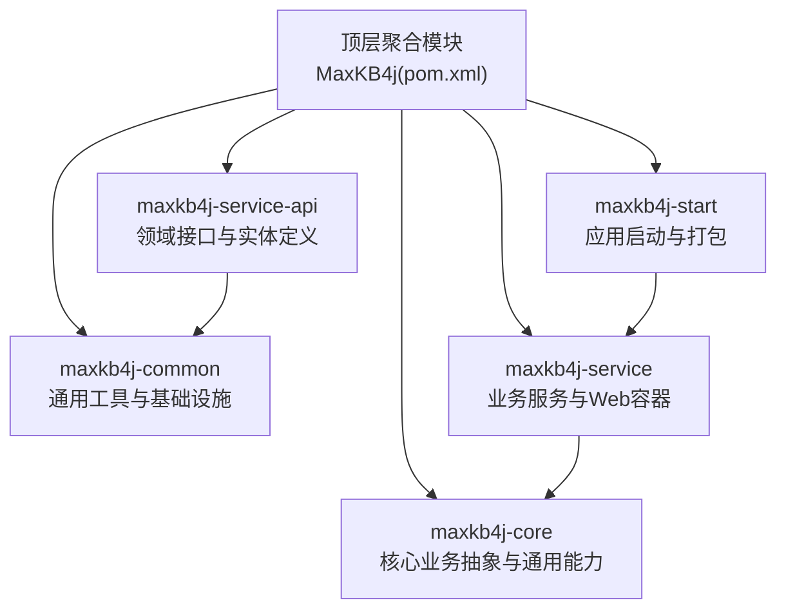
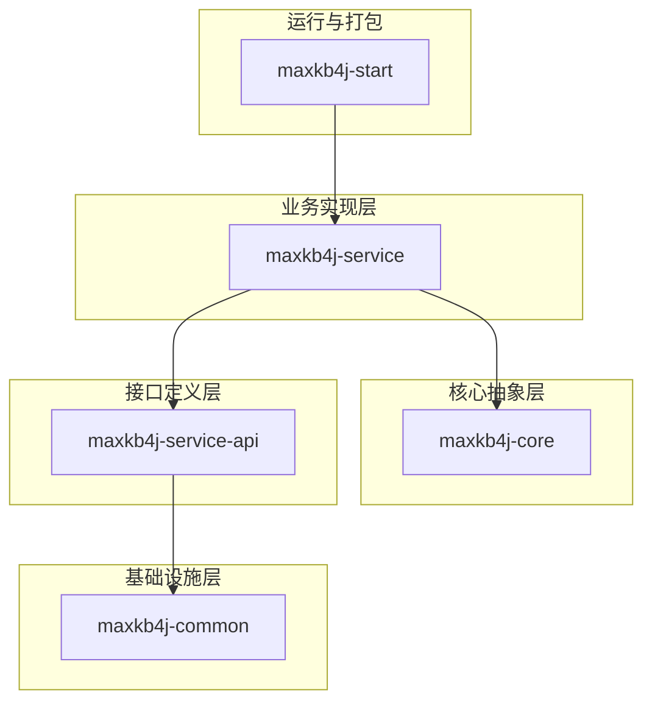
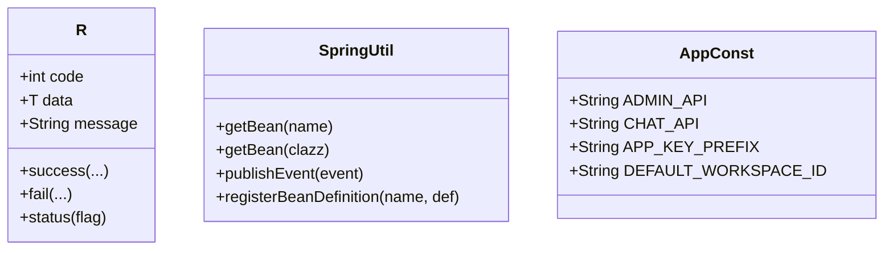
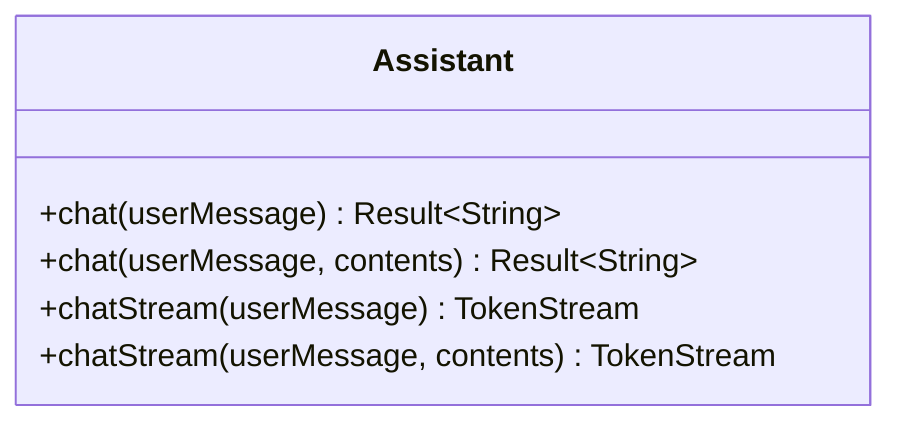
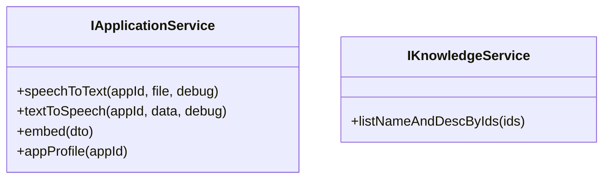
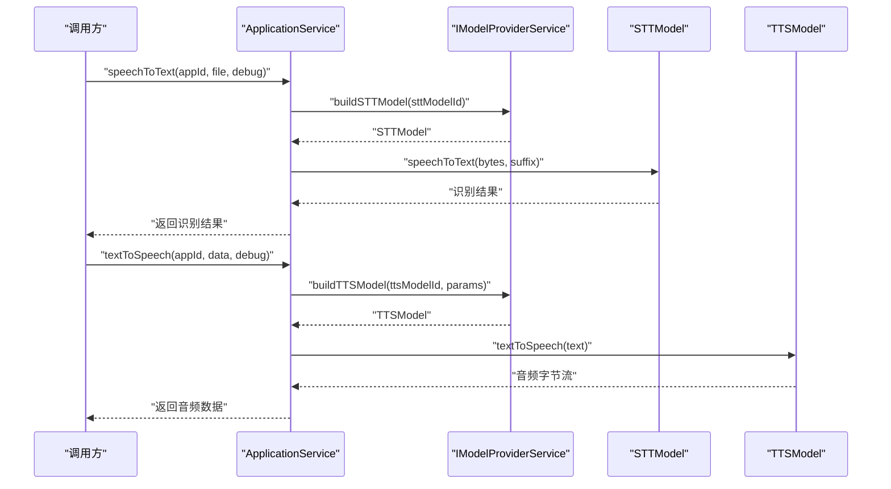
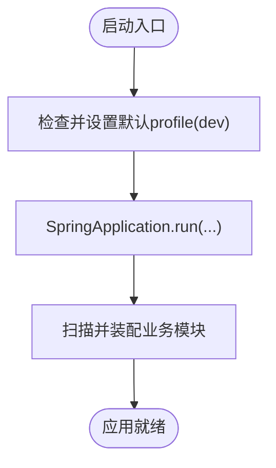
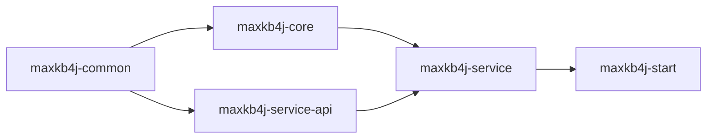

# 模块化设计

<cite>
**本文引用的文件**
- [pom.xml](file://pom.xml)
- [maxkb4j-common/pom.xml](file://maxkb4j-common/pom.xml)
- [maxkb4j-core/pom.xml](file://maxkb4j-core/pom.xml)
- [maxkb4j-service/pom.xml](file://maxkb4j-service/pom.xml)
- [maxkb4j-service-api/pom.xml](file://maxkb4j-service-api/pom.xml)
- [maxkb4j-start/pom.xml](file://maxkb4j-start/pom.xml)
- [maxkb4j-common/src/main/java/com/maxkb4j/common/util/SpringUtil.java](file://maxkb4j-common/src/main/java/com/maxkb4j/common/util/SpringUtil.java)
- [maxkb4j-common/src/main/java/com/maxkb4j/common/api/R.java](file://maxkb4j-common/src/main/java/com/maxkb4j/common/api/R.java)
- [maxkb4j-common/src/main/java/com/maxkb4j/common/constant/AppConst.java](file://maxkb4j-common/src/main/java/com/maxkb4j/common/constant/AppConst.java)
- [maxkb4j-core/src/main/java/com/maxkb4j/core/assistant/Assistant.java](file://maxkb4j-core/src/main/java/com/maxkb4j/core/assistant/Assistant.java)
- [maxkb4j-service-api/maxkb4j-application-api/src/main/java/com/maxkb4j/application/service/IApplicationService.java](file://maxkb4j-service-api/maxkb4j-application-api/src/main/java/com/maxkb4j/application/service/IApplicationService.java)
- [maxkb4j-service/maxkb4j-application/src/main/java/com/maxkb4j/application/service/ApplicationService.java](file://maxkb4j-service/maxkb4j-application/src/main/java/com/maxkb4j/application/service/ApplicationService.java)
- [maxkb4j-service-api/maxkb4j-knowledge-api/src/main/java/com/maxkb4j/knowledge/service/IKnowledgeService.java](file://maxkb4j-service-api/maxkb4j-knowledge-api/src/main/java/com/maxkb4j/knowledge/service/IKnowledgeService.java)
- [maxkb4j-service/maxkb4j-knowledge/src/main/java/com/maxkb4j/knowledge/service/KnowledgeService.java](file://maxkb4j-service/maxkb4j-knowledge/src/main/java/com/maxkb4j/knowledge/service/KnowledgeService.java)
- [maxkb4j-start/src/main/java/com/maxkb4j/start/MaxKb4jApplication.java](file://maxkb4j-start/src/main/java/com/maxkb4j/start/MaxKb4jApplication.java)
</cite>

## 目录
1. [引言](#引言)
2. [项目结构](#项目结构)
3. [核心组件](#核心组件)
4. [架构总览](#架构总览)
5. [详细组件分析](#详细组件分析)
6. [依赖分析](#依赖分析)
7. [性能考虑](#性能考虑)
8. [故障排查指南](#故障排查指南)
9. [结论](#结论)
10. [附录](#附录)

## 引言
本文件系统性阐述 MaxKB4j 的模块化设计与实现，明确各模块的职责边界、接口契约与依赖关系，并解释模块化如何支撑关注点分离、代码复用、独立部署与团队协作，以及如何促进系统的演进与扩展。通过分层与领域拆分，MaxKB4j 将通用能力下沉到公共模块，将核心能力抽象为接口并由服务模块实现，最终由启动模块聚合运行。

## 项目结构
MaxKB4j 采用 Maven 多模块聚合结构，顶层 POM 定义了核心模块与子模块的组织关系。模块按“基础设施-核心-接口-服务-启动”的层次进行划分，形成清晰的依赖链路与职责边界。

**图表来源**
- [pom.xml:57-62](file://pom.xml#L57-L62)
- [maxkb4j-service/pom.xml:15-25](file://maxkb4j-service/pom.xml#L15-L25)
- [maxkb4j-service-api/pom.xml:15-25](file://maxkb4j-service-api/pom.xml#L15-L25)

**章节来源**
- [pom.xml:57-62](file://pom.xml#L57-L62)

## 核心组件
- maxkb4j-common：提供通用工具、基础设施、统一响应体、常量、缓存、异常、类型处理器、工具类等，为其他模块提供横切能力与通用设施。
- maxkb4j-core：提供核心抽象接口（如 Assistant）、事件模型、拦截器、监听器、LangChain4j集成适配、文本处理工具等，作为服务层的抽象基座。
- maxkb4j-service-api：定义各业务领域的接口契约（IService 子接口）与实体/VO/Mapper，强调“只暴露契约”，避免对实现细节的耦合。
- maxkb4j-service：实现具体业务逻辑，引入Web容器、数据库、SQL监控、API文档等运行时依赖，承载各业务域的服务实现。
- maxkb4j-start：聚合所有业务模块，提供启动入口与配置，负责打包与运行时装配。

**章节来源**
- [maxkb4j-common/pom.xml:14-89](file://maxkb4j-common/pom.xml#L14-L89)
- [maxkb4j-core/pom.xml:19-39](file://maxkb4j-core/pom.xml#L19-L39)
- [maxkb4j-service-api/pom.xml:28-35](file://maxkb4j-service-api/pom.xml#L28-L35)
- [maxkb4j-service/pom.xml:27-82](file://maxkb4j-service/pom.xml#L27-L82)
- [maxkb4j-start/pom.xml:15-73](file://maxkb4j-start/pom.xml#L15-L73)

## 架构总览
模块化架构以“接口契约 + 实现分离”为核心，通过以下方式实现关注点分离与复用：
- 通用能力下沉：将权限、缓存、JSON、MyBatis Plus、数据库驱动、LangChain4j 等通用能力集中在 common 模块，避免重复引入与版本漂移。
- 抽象先行：core 模块定义核心接口与事件模型，服务实现基于接口编程，降低耦合度。
- 领域隔离：service-api 定义领域接口与实体，service 实现具体业务，二者通过接口契约解耦。
- 启动聚合：start 模块聚合所有业务模块，统一打包与运行。

**图表来源**
- [maxkb4j-common/pom.xml:14-89](file://maxkb4j-common/pom.xml#L14-L89)
- [maxkb4j-core/pom.xml:19-39](file://maxkb4j-core/pom.xml#L19-L39)
- [maxkb4j-service/pom.xml:27-82](file://maxkb4j-service/pom.xml#L27-L82)
- [maxkb4j-service-api/pom.xml:28-35](file://maxkb4j-service-api/pom.xml#L28-L35)
- [maxkb4j-start/pom.xml:15-73](file://maxkb4j-start/pom.xml#L15-L73)

## 详细组件分析

### 通用模块（maxkb4j-common）
- 职责边界
  - 统一响应体与结果码：提供通用返回包装与状态码定义，保证接口一致性。
  - 常量与枚举：集中管理 API 前缀、默认工作空间等常量。
  - 工具类：Spring 上下文工具、对象/IO/日期/加密/Web 辅助工具等。
  - 类型处理器与 MyBatis Plus：针对复杂字段的类型映射与通用 Mapper 基类。
  - 缓存与异常：统一异常体系与缓存封装。
- 关键接口与类
  - 统一响应体：R
  - 结果码：IResultCode/ResultCode
  - Spring 工具：SpringUtil
  - 常量：AppConst
- 设计要点
  - 低耦合：仅依赖必要的第三方库，避免对业务实现产生侵入。
  - 可复用：为 core 与 service 提供横切能力，减少重复代码。

**图表来源**
- [maxkb4j-common/src/main/java/com/maxkb4j/common/api/R.java:16-149](file://maxkb4j-common/src/main/java/com/maxkb4j/common/api/R.java#L16-L149)
- [maxkb4j-common/src/main/java/com/maxkb4j/common/util/SpringUtil.java:19-72](file://maxkb4j-common/src/main/java/com/maxkb4j/common/util/SpringUtil.java#L19-L72)
- [maxkb4j-common/src/main/java/com/maxkb4j/common/constant/AppConst.java:3-12](file://maxkb4j-common/src/main/java/com/maxkb4j/common/constant/AppConst.java#L3-L12)

**章节来源**
- [maxkb4j-common/pom.xml:14-89](file://maxkb4j-common/pom.xml#L14-L89)
- [maxkb4j-common/src/main/java/com/maxkb4j/common/api/R.java:16-149](file://maxkb4j-common/src/main/java/com/maxkb4j/common/api/R.java#L16-L149)
- [maxkb4j-common/src/main/java/com/maxkb4j/common/util/SpringUtil.java:19-72](file://maxkb4j-common/src/main/java/com/maxkb4j/common/util/SpringUtil.java#L19-L72)
- [maxkb4j-common/src/main/java/com/maxkb4j/common/constant/AppConst.java:3-12](file://maxkb4j-common/src/main/java/com/maxkb4j/common/constant/AppConst.java#L3-L12)

### 核心模块（maxkb4j-core）
- 职责边界
  - 定义核心抽象接口（如 Assistant），用于统一聊天/流式对话等能力。
  - 事件模型、拦截器、监听器、LangChain4j 集成适配、文本处理工具等。
- 关键接口与类
  - Assistant：定义聊天与流式聊天接口，屏蔽底层模型细节。
- 设计要点
  - 接口优先：通过接口约束实现，便于替换与扩展不同模型提供商。
  - 事件驱动：结合事件发布/订阅机制，实现异步处理与解耦。

**图表来源**
- [maxkb4j-core/src/main/java/com/maxkb4j/core/assistant/Assistant.java:11-21](file://maxkb4j-core/src/main/java/com/maxkb4j/core/assistant/Assistant.java#L11-L21)

**章节来源**
- [maxkb4j-core/pom.xml:19-39](file://maxkb4j-core/pom.xml#L19-L39)
- [maxkb4j-core/src/main/java/com/maxkb4j/core/assistant/Assistant.java:11-21](file://maxkb4j-core/src/main/java/com/maxkb4j/core/assistant/Assistant.java#L11-L21)

### 接口定义层（maxkb4j-service-api）
- 职责边界
  - 定义各业务领域的接口契约（IService 子接口），如 IApplicationService、IKnowledgeService。
  - 定义实体、Mapper、VO、查询参数等，但不包含实现细节。
- 关键接口与类
  - IApplicationService：应用相关接口（STT/TTS、嵌入、应用画像等）。
  - IKnowledgeService：知识库相关接口（分页、导出、版本发布等）。
- 设计要点
  - 明确的领域边界：每个领域一个接口包，避免交叉耦合。
  - 与实现解耦：接口仅暴露必要方法，隐藏实现细节。

**图表来源**
- [maxkb4j-service-api/maxkb4j-application-api/src/main/java/com/maxkb4j/application/service/IApplicationService.java:12-18](file://maxkb4j-service-api/maxkb4j-application-api/src/main/java/com/maxkb4j/application/service/IApplicationService.java#L12-L18)
- [maxkb4j-service-api/maxkb4j-knowledge-api/src/main/java/com/maxkb4j/knowledge/service/IKnowledgeService.java:8-11](file://maxkb4j-service-api/maxkb4j-knowledge-api/src/main/java/com/maxkb4j/knowledge/service/IKnowledgeService.java#L8-L11)

**章节来源**
- [maxkb4j-service-api/pom.xml:28-35](file://maxkb4j-service-api/pom.xml#L28-L35)
- [maxkb4j-service-api/maxkb4j-application-api/src/main/java/com/maxkb4j/application/service/IApplicationService.java:12-18](file://maxkb4j-service-api/maxkb4j-application-api/src/main/java/com/maxkb4j/application/service/IApplicationService.java#L12-L18)
- [maxkb4j-service-api/maxkb4j-knowledge-api/src/main/java/com/maxkb4j/knowledge/service/IKnowledgeService.java:8-11](file://maxkb4j-service-api/maxkb4j-knowledge-api/src/main/java/com/maxkb4j/knowledge/service/IKnowledgeService.java#L8-L11)

### 业务实现层（maxkb4j-service）
- 职责边界
  - 实现 service-api 中定义的接口，引入 Web 容器、数据库、SQL 监控、API 文档等运行时依赖。
  - 每个业务域一个子模块（如 application、knowledge、model、tool 等），职责清晰。
- 关键实现与流程
  - ApplicationService：实现应用的分页查询、导入导出、发布、TTS/STT、嵌入等。
  - KnowledgeService：实现知识库的分页、导出、版本发布、工作流执行、资源映射等。
- 设计要点
  - 依赖注入与事务控制：通过构造器注入与事务注解保证一致性。
  - 事件驱动：通过 ApplicationEventPublisher 发布事件，实现异步处理。
  - 资源映射：统一维护应用/知识库/工具/模型之间的关联关系。

**图表来源**
- [maxkb4j-service/maxkb4j-application/src/main/java/com/maxkb4j/application/service/ApplicationService.java:415-420](file://maxkb4j-service/maxkb4j-application/src/main/java/com/maxkb4j/application/service/ApplicationService.java#L415-L420)
- [maxkb4j-service/maxkb4j-application/src/main/java/com/maxkb4j/application/service/ApplicationService.java:327-344](file://maxkb4j-service/maxkb4j-application/src/main/java/com/maxkb4j/application/service/ApplicationService.java#L327-L344)

**章节来源**
- [maxkb4j-service/pom.xml:27-82](file://maxkb4j-service/pom.xml#L27-L82)
- [maxkb4j-service/maxkb4j-application/src/main/java/com/maxkb4j/application/service/ApplicationService.java:415-420](file://maxkb4j-service/maxkb4j-application/src/main/java/com/maxkb4j/application/service/ApplicationService.java#L415-L420)
- [maxkb4j-service/maxkb4j-application/src/main/java/com/maxkb4j/application/service/ApplicationService.java:327-344](file://maxkb4j-service/maxkb4j-application/src/main/java/com/maxkb4j/application/service/ApplicationService.java#L327-L344)
- [maxkb4j-service/maxkb4j-knowledge/src/main/java/com/maxkb4j/knowledge/service/KnowledgeService.java:180-190](file://maxkb4j-service/maxkb4j-knowledge/src/main/java/com/maxkb4j/knowledge/service/KnowledgeService.java#L180-L190)
- [maxkb4j-service/maxkb4j-knowledge/src/main/java/com/maxkb4j/knowledge/service/KnowledgeService.java:271-294](file://maxkb4j-service/maxkb4j-knowledge/src/main/java/com/maxkb4j/knowledge/service/KnowledgeService.java#L271-L294)

### 启动模块（maxkb4j-start）
- 职责边界
  - 聚合所有业务模块，提供 Spring Boot 启动入口与配置。
  - 默认激活开发环境，集成缓存与调度能力。
- 关键类
  - MaxKb4jApplication：SpringBootApplication 入口，自动装配与扫描配置。

**图表来源**
- [maxkb4j-start/src/main/java/com/maxkb4j/start/MaxKb4jApplication.java:14-20](file://maxkb4j-start/src/main/java/com/maxkb4j/start/MaxKb4jApplication.java#L14-L20)

**章节来源**
- [maxkb4j-start/pom.xml:15-73](file://maxkb4j-start/pom.xml#L15-L73)
- [maxkb4j-start/src/main/java/com/maxkb4j/start/MaxKb4jApplication.java:14-20](file://maxkb4j-start/src/main/java/com/maxkb4j/start/MaxKb4jApplication.java#L14-L20)

## 依赖分析
模块间依赖遵循“自顶向下、单向依赖”的原则，避免循环依赖，提升内聚与解耦。

**图表来源**
- [pom.xml:57-62](file://pom.xml#L57-L62)
- [maxkb4j-core/pom.xml:27-29](file://maxkb4j-core/pom.xml#L27-L29)
- [maxkb4j-service/pom.xml:29-33](file://maxkb4j-service/pom.xml#L29-L33)
- [maxkb4j-service-api/pom.xml:30-34](file://maxkb4j-service-api/pom.xml#L30-L34)
- [maxkb4j-start/pom.xml:18-60](file://maxkb4j-start/pom.xml#L18-L60)

**章节来源**
- [pom.xml:57-62](file://pom.xml#L57-L62)
- [maxkb4j-core/pom.xml:27-29](file://maxkb4j-core/pom.xml#L27-L29)
- [maxkb4j-service/pom.xml:29-33](file://maxkb4j-service/pom.xml#L29-L33)
- [maxkb4j-service-api/pom.xml:30-34](file://maxkb4j-service-api/pom.xml#L30-L34)
- [maxkb4j-start/pom.xml:18-60](file://maxkb4j-start/pom.xml#L18-L60)

## 性能考虑
- 通用能力复用：common 模块集中提供缓存、JSON、工具类等，减少重复开销。
- 接口抽象：core 模块的接口设计降低实现差异带来的性能波动，便于替换与优化。
- 事件驱动：service 层通过事件发布实现异步处理，避免阻塞主线程。
- 数据访问：service-api 与 service 引入 MyBatis Plus 与 SQL 解析器，配合分页与索引提升查询效率。
- 运行时优化：start 模块启用缓存与调度，结合数据库驱动与 SQL 监控，便于性能观测与调优。

## 故障排查指南
- 统一响应与异常
  - 使用 R 统一返回结构，便于前端与调用方统一处理。
  - 常见异常类型（如访问异常、登录异常、文件限制异常等）在 common 模块中集中定义，便于快速定位问题。
- 日志与上下文
  - SpringUtil 提供事件发布与 Bean 获取能力，可用于调试与诊断。
- 数据一致性
  - 事务注解与依赖注入确保业务流程的一致性；若出现异常，优先检查 service 层的事务边界与异常捕获。

**章节来源**
- [maxkb4j-common/src/main/java/com/maxkb4j/common/api/R.java:48-108](file://maxkb4j-common/src/main/java/com/maxkb4j/common/api/R.java#L48-L108)
- [maxkb4j-common/src/main/java/com/maxkb4j/common/util/SpringUtil.java:52-62](file://maxkb4j-common/src/main/java/com/maxkb4j/common/util/SpringUtil.java#L52-L62)

## 结论
MaxKB4j 的模块化设计通过“通用下沉、抽象先行、接口隔离、实现聚合”的策略，实现了关注点分离与代码复用，提升了系统的可维护性、可扩展性与可演进性。模块化不仅支持独立部署与团队协作，也为未来引入新模型、新工具与新业务场景提供了清晰的扩展路径。

## 附录
- 模块化带来的好处
  - 独立部署：各模块可按需打包与部署，start 模块聚合运行。
  - 团队协作：接口定义与实现分离，不同团队可并行开发。
  - 演进与扩展：新增领域或替换实现只需对接口契约，降低变更成本。
- 最佳实践
  - 保持接口契约稳定，避免频繁破坏性变更。
  - 在 service-api 中严格定义输入输出，确保跨模块交互清晰。
  - 利用事件与监听器实现异步与解耦处理。
  - 通过 common 模块沉淀通用能力，减少重复实现。