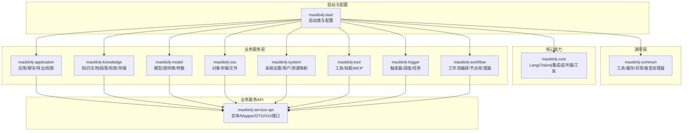
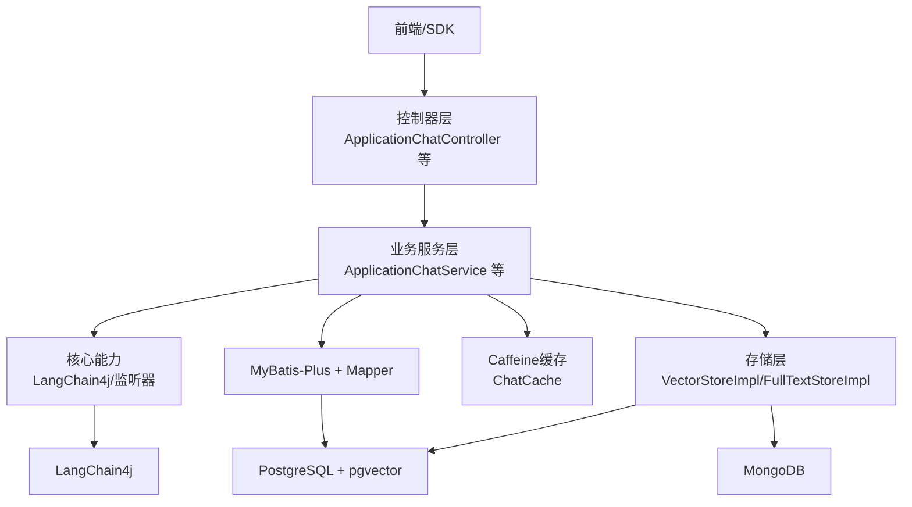
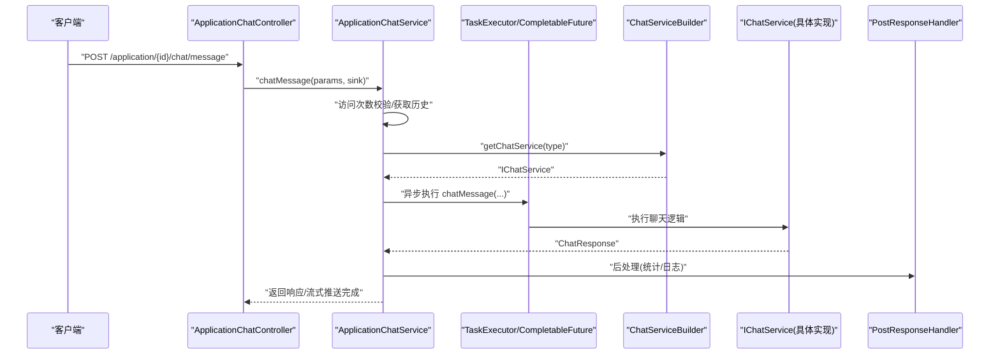
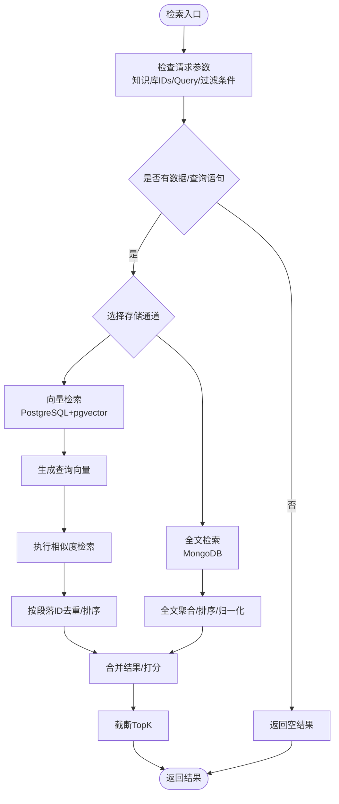
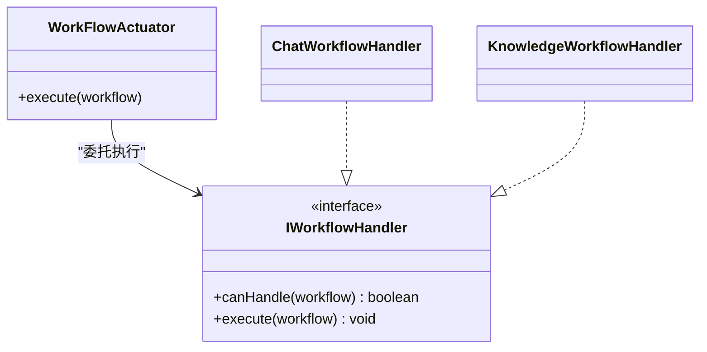
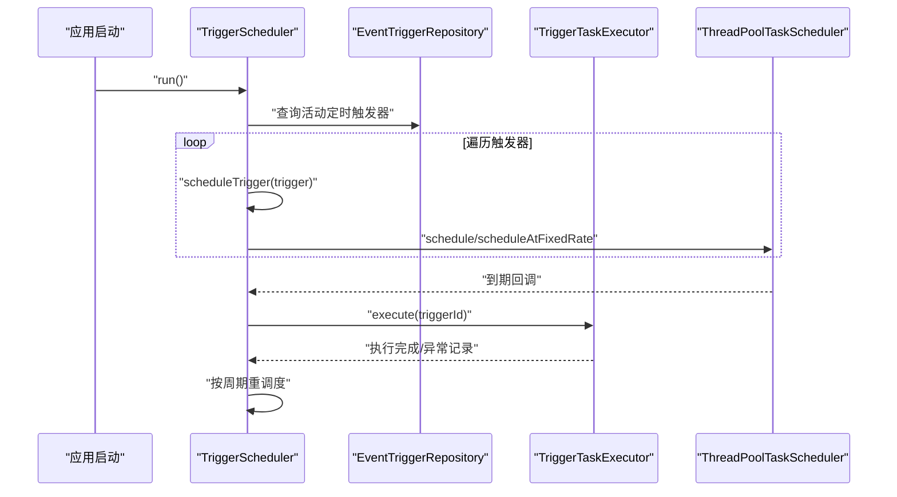
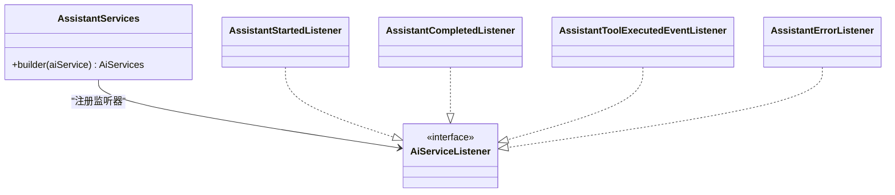
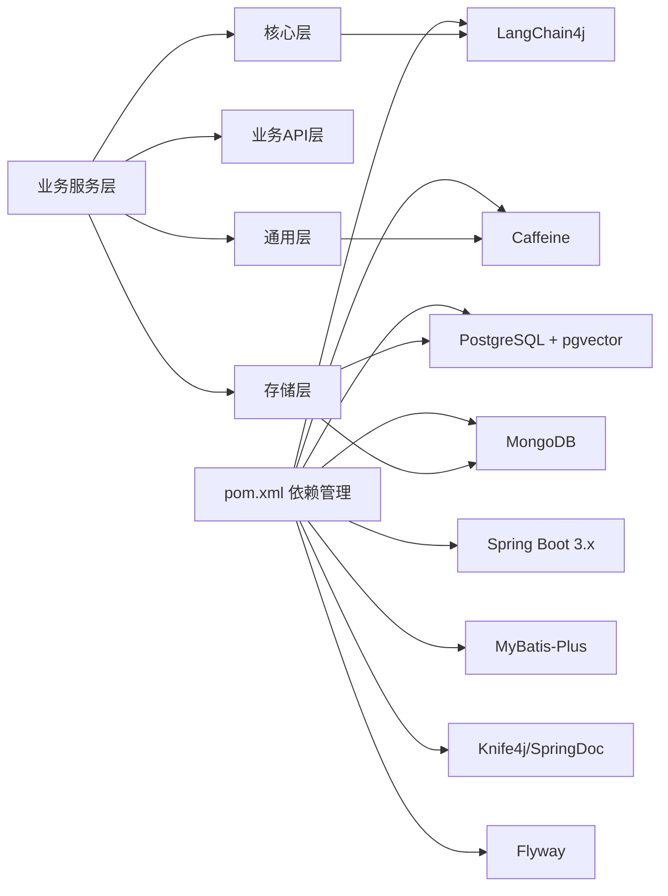

# 系统架构设计

<cite>
**本文引用的文件**
- [README_CN.md](file://README_CN.md)
- [pom.xml](file://pom.xml)
- [MaxKb4jApplication.java](file://maxkb4j-start/src/main/java/com/maxkb4j/start/MaxKb4jApplication.java)
- [application.yml](file://maxkb4j-start/src/main/resources/application.yml)
- [AssistantServices.java](file://maxkb4j-core/src/main/java/com/maxkb4j/core/langchain4j/AssistantServices.java)
- [ApplicationChatService.java](file://maxkb4j-service/maxkb4j-application/src/main/java/com/maxkb4j/application/service/ApplicationChatService.java)
- [ChatServiceBuilder.java](file://maxkb4j-service/maxkb4j-application/src/main/java/com/maxkb4j/application/builder/ChatServiceBuilder.java)
- [VectorStoreImpl.java](file://maxkb4j-service/maxkb4j-knowledge/src/main/java/com/maxkb4j/knowledge/store/VectorStoreImpl.java)
- [FullTextStoreImpl.java](file://maxkb4j-service/maxkb4j-knowledge/src/main/java/com/maxkb4j/knowledge/store/FullTextStoreImpl.java)
- [WorkFlowActuator.java](file://maxkb4j-service/maxkb4j-workflow/src/main/java/com/maxkb4j/workflow/service/WorkFlowActuator.java)
- [TriggerScheduler.java](file://maxkb4j-service/maxkb4j-trigger/src/main/java/com/maxkb4j/trigger/service/TriggerScheduler.java)
- [ChatCache.java](file://maxkb4j-common/src/main/java/com/maxkb4j/common/cache/ChatCache.java)
- [AssistantStartedListener.java](file://maxkb4j-core/src/main/java/com/maxkb4j/core/listener/AssistantStartedListener.java)
- [ApplicationChatController.java](file://maxkb4j-service/maxkb4j-application/src/main/java/com/maxkb4j/application/controller/ApplicationChatController.java)
</cite>

## 目录
1. [引言](#引言)
2. [项目结构](#项目结构)
3. [核心组件](#核心组件)
4. [架构总览](#架构总览)
5. [详细组件分析](#详细组件分析)
6. [依赖关系分析](#依赖关系分析)
7. [性能与高并发设计](#性能与高并发设计)
8. [故障排查指南](#故障排查指南)
9. [结论](#结论)
10. [附录](#附录)

## 引言
本设计文档面向MaxKB4j系统，围绕其“RAG + LLM工作流引擎”的定位，系统化阐述整体架构理念、分层设计、模块化组织、技术选型、高并发与性能优化策略、数据与业务流程、以及扩展性与可维护性设计。目标是帮助不同背景的读者快速理解系统如何在Spring Boot 3.x之上，借助LangChain4j、PostgreSQL+pgvector、MongoDB等技术栈，实现高并发、可扩展的企业级智能问答与工作流编排。

## 项目结构
MaxKB4j采用多模块Maven聚合工程，按领域与层次划分清晰：
- maxkb4j-common：通用工具、常量、枚举、缓存、异常、类型处理器、工具类等
- maxkb4j-core：核心能力封装（LangChain4j集成、监听器、工具）
- maxkb4j-service：业务服务层，进一步细分为应用、聊天、知识库、模型、对象存储、系统、工具、触发器、工作流等子模块
- maxkb4j-service-api：各业务模块的实体、Mapper、DTO、VO、服务接口
- maxkb4j-start：启动入口、配置、静态资源、迁移脚本

图表来源
- [pom.xml:57-62](file://pom.xml#L57-L62)
- [MaxKb4jApplication.java:10-12](file://maxkb4j-start/src/main/java/com/maxkb4j/start/MaxKb4jApplication.java#L10-L12)

章节来源
- [pom.xml:57-62](file://pom.xml#L57-L62)
- [README_CN.md:102-112](file://README_CN.md#L102-L112)

## 核心组件
- 启动与配置
  - 启动类启用缓存与调度，并扫描com.maxkb4j包，排除Thymeleaf
  - 默认激活dev环境，配置Caffeine缓存、MyBatis-Plus、Flyway迁移、Sa-Token等
- 核心能力
  - LangChain4j集成：统一注册监听器，便于观测与日志
  - 监听器：记录AI服务开始、完成、工具执行、错误等事件
- 业务服务
  - 应用聊天服务：负责聊天生命周期、并发执行、访问次数校验、导出、分享链接等
  - 知识库检索：向量存储（PostgreSQL+pgvector）与全文存储（MongoDB）双通道
  - 工作流编排：策略模式选择处理器，执行复杂业务流程
  - 触发器调度：支持多种周期与固定速率，动态启停与重调度
- 通用组件
  - Caffeine本地缓存：会话缓存、多级缓存策略
  - MyBatis-Plus + Mapper XML：数据持久化
  - Flyway：数据库迁移

章节来源
- [MaxKb4jApplication.java:10-12](file://maxkb4j-start/src/main/java/com/maxkb4j/start/MaxKb4jApplication.java#L10-L12)
- [application.yml:19-69](file://maxkb4j-start/src/main/resources/application.yml#L19-L69)
- [AssistantServices.java:13-26](file://maxkb4j-core/src/main/java/com/maxkb4j/core/langchain4j/AssistantServices.java#L13-L26)
- [AssistantStartedListener.java:12-20](file://maxkb4j-core/src/main/java/com/maxkb4j/core/listener/AssistantStartedListener.java#L12-L20)
- [ApplicationChatService.java:50-150](file://maxkb4j-service/maxkb4j-application/src/main/java/com/maxkb4j/application/service/ApplicationChatService.java#L50-L150)
- [VectorStoreImpl.java:34-91](file://maxkb4j-service/maxkb4j-knowledge/src/main/java/com/maxkb4j/knowledge/store/VectorStoreImpl.java#L34-L91)
- [FullTextStoreImpl.java:31-45](file://maxkb4j-service/maxkb4j-knowledge/src/main/java/com/maxkb4j/knowledge/store/FullTextStoreImpl.java#L31-L45)
- [WorkFlowActuator.java:18-36](file://maxkb4j-service/maxkb4j-workflow/src/main/java/com/maxkb4j/workflow/service/WorkFlowActuator.java#L18-L36)
- [TriggerScheduler.java:29-90](file://maxkb4j-service/maxkb4j-trigger/src/main/java/com/maxkb4j/trigger/service/TriggerScheduler.java#L29-L90)
- [ChatCache.java:10-30](file://maxkb4j-common/src/main/java/com/maxkb4j/common/cache/ChatCache.java#L10-L30)

## 架构总览
系统采用分层架构：
- 表现层：REST控制器（Spring MVC），提供应用、聊天、知识库、模型、系统、工具、触发器、工作流等接口
- 业务层：应用服务、知识服务、模型服务、工具服务、触发器服务、工作流编排服务
- 数据层：PostgreSQL（主库+pgvector）、MongoDB（全文检索）、Caffeine本地缓存、MyBatis-Plus Mapper
- 观测与集成：LangChain4j监听器、Sa-Token鉴权、Knife4j/SpringDoc文档、P6Spy日志

图表来源
- [ApplicationChatController.java:31-63](file://maxkb4j-service/maxkb4j-application/src/main/java/com/maxkb4j/application/controller/ApplicationChatController.java#L31-L63)
- [ApplicationChatService.java:50-150](file://maxkb4j-service/maxkb4j-application/src/main/java/com/maxkb4j/application/service/ApplicationChatService.java#L50-L150)
- [VectorStoreImpl.java:34-91](file://maxkb4j-service/maxkb4j-knowledge/src/main/java/com/maxkb4j/knowledge/store/VectorStoreImpl.java#L34-L91)
- [FullTextStoreImpl.java:31-45](file://maxkb4j-service/maxkb4j-knowledge/src/main/java/com/maxkb4j/knowledge/store/FullTextStoreImpl.java#L31-L45)
- [ChatCache.java:10-30](file://maxkb4j-common/src/main/java/com/maxkb4j/common/cache/ChatCache.java#L10-L30)
- [AssistantServices.java:13-26](file://maxkb4j-core/src/main/java/com/maxkb4j/core/langchain4j/AssistantServices.java#L13-L26)

## 详细组件分析

### 组件A：聊天服务与异步执行
- 职责：会话管理、历史记录、并发执行、访问次数校验、导出、分享链接
- 关键点：
  - 使用Sinks.Many进行响应式流推送
  - 使用TaskExecutor与CompletableFuture实现异步执行
  - 访问次数校验与令牌限制
  - ChatCache本地缓存会话信息

图表来源
- [ApplicationChatController.java:31-63](file://maxkb4j-service/maxkb4j-application/src/main/java/com/maxkb4j/application/controller/ApplicationChatController.java#L31-L63)
- [ApplicationChatService.java:115-150](file://maxkb4j-service/maxkb4j-application/src/main/java/com/maxkb4j/application/service/ApplicationChatService.java#L115-L150)
- [ChatServiceBuilder.java:14-37](file://maxkb4j-service/maxkb4j-application/src/main/java/com/maxkb4j/application/builder/ChatServiceBuilder.java#L14-L37)

章节来源
- [ApplicationChatService.java:50-221](file://maxkb4j-service/maxkb4j-application/src/main/java/com/maxkb4j/application/service/ApplicationChatService.java#L50-L221)
- [ChatServiceBuilder.java:14-37](file://maxkb4j-service/maxkb4j-application/src/main/java/com/maxkb4j/application/builder/ChatServiceBuilder.java#L14-L37)

### 组件B：知识库检索与存储
- 向量存储（PostgreSQL+pgvector）
  - 批量处理、重试、维度与分词
  - 支持按知识库、段落、文档删除/更新状态
  - 向量相似度搜索，去重与排序
- 全文存储（MongoDB）
  - 文本分词后插入，全文检索聚合管道
  - 基于textScore归一化与过滤

图表来源
- [VectorStoreImpl.java:214-278](file://maxkb4j-service/maxkb4j-knowledge/src/main/java/com/maxkb4j/knowledge/store/VectorStoreImpl.java#L214-L278)
- [FullTextStoreImpl.java:100-168](file://maxkb4j-service/maxkb4j-knowledge/src/main/java/com/maxkb4j/knowledge/store/FullTextStoreImpl.java#L100-L168)

章节来源
- [VectorStoreImpl.java:34-288](file://maxkb4j-service/maxkb4j-knowledge/src/main/java/com/maxkb4j/knowledge/store/VectorStoreImpl.java#L34-L288)
- [FullTextStoreImpl.java:31-170](file://maxkb4j-service/maxkb4j-knowledge/src/main/java/com/maxkb4j/knowledge/store/FullTextStoreImpl.java#L31-L170)

### 组件C：工作流编排与执行
- 采用策略模式，根据工作流类型选择对应处理器
- 通过IWorkflowHandler接口扩展节点与动作

图表来源
- [WorkFlowActuator.java:18-36](file://maxkb4j-service/maxkb4j-workflow/src/main/java/com/maxkb4j/workflow/service/WorkFlowActuator.java#L18-L36)

章节来源
- [WorkFlowActuator.java:1-37](file://maxkb4j-service/maxkb4j-workflow/src/main/java/com/maxkb4j/workflow/service/WorkFlowActuator.java#L1-L37)

### 组件D：触发器与调度
- 支持每日/每周/每月/间隔等多种调度类型
- 启动时加载并调度活动触发器，支持取消与重调度
- 执行失败记录日志并继续维持调度

图表来源
- [TriggerScheduler.java:39-233](file://maxkb4j-service/maxkb4j-trigger/src/main/java/com/maxkb4j/trigger/service/TriggerScheduler.java#L39-L233)

章节来源
- [TriggerScheduler.java:1-233](file://maxkb4j-service/maxkb4j-trigger/src/main/java/com/maxkb4j/trigger/service/TriggerScheduler.java#L1-L233)

### 组件E：LangChain4j监听与可观测
- 统一注册监听器，记录AI服务开始、完成、工具执行、错误事件
- 便于追踪与调试

图表来源
- [AssistantServices.java:13-26](file://maxkb4j-core/src/main/java/com/maxkb4j/core/langchain4j/AssistantServices.java#L13-L26)
- [AssistantStartedListener.java:12-20](file://maxkb4j-core/src/main/java/com/maxkb4j/core/listener/AssistantStartedListener.java#L12-L20)

章节来源
- [AssistantServices.java:1-27](file://maxkb4j-core/src/main/java/com/maxkb4j/core/langchain4j/AssistantServices.java#L1-L27)
- [AssistantStartedListener.java:1-21](file://maxkb4j-core/src/main/java/com/maxkb4j/core/listener/AssistantStartedListener.java#L1-L21)

## 依赖关系分析
- 技术栈与版本
  - Java 21、Spring Boot 3.x、MyBatis-Plus、Sa-Token、LangChain4j、PostgreSQL+pgvector、MongoDB、Caffeine、Knife4j/SpringDoc、Flyway
- 模块耦合
  - 业务服务层对通用层与核心层存在依赖，对API层通过接口与实体交互
  - 知识库模块对向量与全文存储抽象解耦，便于替换实现
  - 触发器与工作流模块相对独立，通过调度器与处理器接口解耦

图表来源
- [pom.xml:64-493](file://pom.xml#L64-L493)
- [application.yml:19-69](file://maxkb4j-start/src/main/resources/application.yml#L19-L69)

章节来源
- [pom.xml:64-493](file://pom.xml#L64-L493)
- [application.yml:19-69](file://maxkb4j-start/src/main/resources/application.yml#L19-L69)

## 性能与高并发设计
- 虚拟线程与响应式
  - 基于Java 21 + Spring Boot 3 + 虚拟线程（Project Loom）的并发模型，结合响应式编程与异步非阻塞I/O，降低资源占用、提升吞吐
- 异步执行与线程池
  - 聊天消息通过CompletableFuture与TaskExecutor异步执行，避免阻塞主线程
- 多级缓存
  - Caffeine本地缓存用于会话与热点数据，降低数据库与模型调用压力
- 批量与重试
  - 向量入库采用批量与重试策略，提升稳定性与吞吐
- 数据库与索引
  - PostgreSQL启用pgvector扩展，MongoDB使用全文索引与聚合管道，优化检索性能

章节来源
- [README_CN.md:28-44](file://README_CN.md#L28-L44)
- [ApplicationChatService.java:139-150](file://maxkb4j-service/maxkb4j-application/src/main/java/com/maxkb4j/application/service/ApplicationChatService.java#L139-L150)
- [VectorStoreImpl.java:66-91](file://maxkb4j-service/maxkb4j-knowledge/src/main/java/com/maxkb4j/knowledge/store/VectorStoreImpl.java#L66-L91)
- [ChatCache.java:10-30](file://maxkb4j-common/src/main/java/com/maxkb4j/common/cache/ChatCache.java#L10-L30)

## 故障排查指南
- 启动与配置
  - 未设置active profile时默认使用dev；确认JWT密钥、数据库与MongoDB连接、缓存类型等配置
- 聊天与并发
  - 若出现访问次数限制异常，检查令牌访问数与用户当日访问数统计
  - 异步执行失败会在日志中记录，注意查看异常堆栈
- 检索与存储
  - 向量检索失败或无结果：确认Embedding模型可用、查询向量生成成功、pgvector维度一致
  - 全文检索无结果：确认MongoDB中文本分词与索引、textScore归一化逻辑
- 触发器
  - 触发器未执行或重复：检查调度类型配置、下次运行时间计算、是否被取消或重调度

章节来源
- [application.yml:19-69](file://maxkb4j-start/src/main/resources/application.yml#L19-L69)
- [ApplicationChatService.java:152-174](file://maxkb4j-service/maxkb4j-application/src/main/java/com/maxkb4j/application/service/ApplicationChatService.java#L152-L174)
- [VectorStoreImpl.java:214-278](file://maxkb4j-service/maxkb4j-knowledge/src/main/java/com/maxkb4j/knowledge/store/VectorStoreImpl.java#L214-L278)
- [FullTextStoreImpl.java:100-168](file://maxkb4j-service/maxkb4j-knowledge/src/main/java/com/maxkb4j/knowledge/store/FullTextStoreImpl.java#L100-L168)
- [TriggerScheduler.java:162-169](file://maxkb4j-service/maxkb4j-trigger/src/main/java/com/maxkb4j/trigger/service/TriggerScheduler.java#L162-L169)

## 结论
MaxKB4j以Spring Boot 3.x为基座，结合LangChain4j实现RAG与LLM工作流，采用PostgreSQL+pgvector与MongoDB双存储满足向量检索与全文检索需求，配合Caffeine多级缓存、异步执行与调度机制，形成高并发、可扩展、可观测的企业级智能问答与工作流平台。模块化设计与接口抽象保证了良好的可维护性与演进空间。

## 附录
- 快速开始与部署参考：环境要求（Java 21+、PostgreSQL 12+、MongoDB 6.0+）、Docker与Docker Compose部署、默认账号密码
- 技术栈清单：后端（Java 21、Spring Boot 3、Sa-Token）、AI框架（LangChain4j）、向量数据库（PostgreSQL 15 + pgvector）、全文检索（MongoDB 5.0+）、缓存（Caffeine）、前端（Vue 3、Node.js v20.16.0）

章节来源
- [README_CN.md:50-98](file://README_CN.md#L50-L98)
- [README_CN.md:102-112](file://README_CN.md#L102-L112)