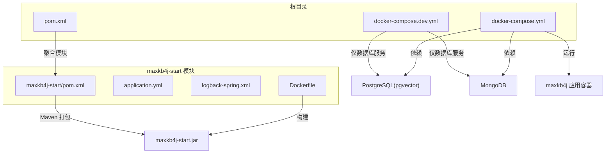
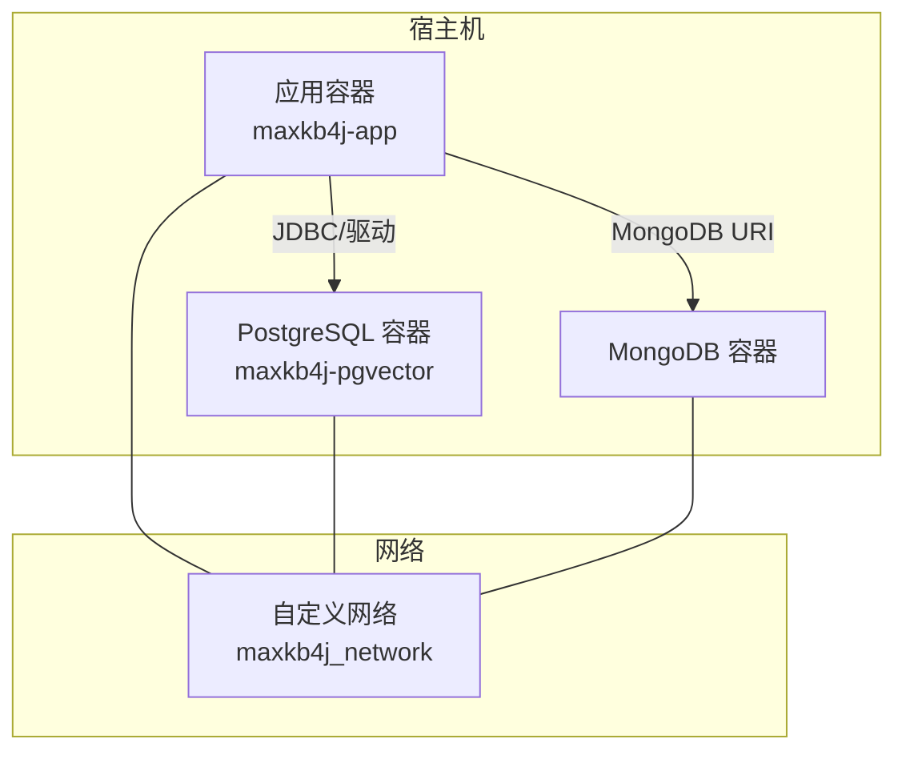
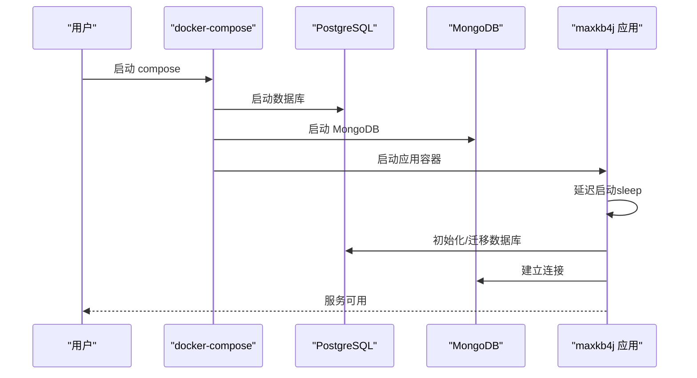

# Docker部署

<cite>
**本文引用的文件**
- [docker-compose.yml](file://docker-compose.yml)
- [docker-compose.dev.yml](file://docker-compose.dev.yml)
- [Dockerfile](file://maxkb4j-start/Dockerfile)
- [application.yml](file://maxkb4j-start/src/main/resources/application.yml)
- [application-prod.yml](file://maxkb4j-start/src/main/resources/application-prod.yml)
- [application-dev.yml](file://maxkb4j-start/src/main/resources/application-dev.yml)
- [logback-spring.xml](file://maxkb4j-start/src/main/resources/logback-spring.xml)
- [pom.xml](file://pom.xml)
- [maxkb4j-start/pom.xml](file://maxkb4j-start/pom.xml)
- [README.md](file://README.md)
</cite>

## 目录
1. [简介](#简介)
2. [项目结构](#项目结构)
3. [核心组件](#核心组件)
4. [架构总览](#架构总览)
5. [详细组件分析](#详细组件分析)
6. [依赖关系分析](#依赖关系分析)
7. [性能与资源规划](#性能与资源规划)
8. [故障排查指南](#故障排查指南)
9. [结论](#结论)
10. [附录](#附录)

## 简介
本指南面向希望在生产或开发环境中使用Docker部署 MaxKB4j 的工程师与运维人员。内容覆盖：
- Docker镜像构建流程与优化建议
- docker-compose.yml 与 docker-compose.dev.yml 的完整配置说明
- 开发与生产环境的差异化配置方案
- 容器间依赖关系、启动顺序与健康检查策略
- 数据持久化、日志管理、端口映射与证书挂载
- 容器监控、资源限制与重启策略
- 常见部署问题排查与解决思路

## 项目结构
MaxKB4j 采用多模块 Maven 构建，Docker 部署主要围绕 maxkb4j-start 模块生成可执行 JAR 并打包为 Docker 镜像。根目录提供 docker-compose.yml 与 docker-compose.dev.yml，分别用于生产与开发环境。

图表来源
- [docker-compose.yml:1-58](file://docker-compose.yml#L1-L58)
- [docker-compose.dev.yml:1-28](file://docker-compose.dev.yml#L1-L28)
- [Dockerfile:1-27](file://maxkb4j-start/Dockerfile#L1-L27)
- [application.yml:1-69](file://maxkb4j-start/src/main/resources/application.yml#L1-L69)
- [logback-spring.xml:1-157](file://maxkb4j-start/src/main/resources/logback-spring.xml#L1-L157)
- [pom.xml:1-200](file://pom.xml#L1-L200)
- [maxkb4j-start/pom.xml:1-85](file://maxkb4j-start/pom.xml#L1-L85)

章节来源
- [docker-compose.yml:1-58](file://docker-compose.yml#L1-L58)
- [docker-compose.dev.yml:1-28](file://docker-compose.dev.yml#L1-L28)
- [Dockerfile:1-27](file://maxkb4j-start/Dockerfile#L1-L27)
- [application.yml:1-69](file://maxkb4j-start/src/main/resources/application.yml#L1-L69)
- [logback-spring.xml:1-157](file://maxkb4j-start/src/main/resources/logback-spring.xml#L1-L157)
- [pom.xml:1-200](file://pom.xml#L1-L200)
- [maxkb4j-start/pom.xml:1-85](file://maxkb4j-start/pom.xml#L1-L85)

## 核心组件
- 应用容器（maxkb4j）
  - 基于 Amazon Corretto 21 的轻量镜像
  - 对外暴露 8080 端口
  - 启动前延迟以等待数据库初始化
  - 支持挂载证书与日志目录
- 数据库服务
  - PostgreSQL + pgvector（向量扩展）
  - MongoDB（全文检索与对象存储）
- 网络与卷
  - 统一自定义网络，便于服务发现
  - 卷挂载实现数据持久化与日志落盘

章节来源
- [docker-compose.yml:27-56](file://docker-compose.yml#L27-L56)
- [docker-compose.dev.yml:2-26](file://docker-compose.dev.yml#L2-L26)
- [Dockerfile:3-25](file://maxkb4j-start/Dockerfile#L3-L25)

## 架构总览
下图展示生产环境 compose 的典型拓扑与交互：

图表来源
- [docker-compose.yml:1-58](file://docker-compose.yml#L1-L58)

## 详细组件分析

### Dockerfile 构建与镜像优化
- 基础镜像与时区
  - 使用 Amazon Corretto 21，设置 Asia/Shanghai 时区
- 多阶段构建建议
  - 当前为单阶段构建，建议引入多阶段构建以减小最终镜像体积：
    - 使用 maven 编译阶段产出可执行 JAR
    - 使用最小运行时镜像（如 alpine 或 distroless）复制 JAR 并运行
- 入口命令
  - CMD 直接启动 JAR，支持 UTF-8 文件编码参数
- 端口与工作目录
  - EXPOSE 8080；WORKDIR 设为 /opt/running

章节来源
- [Dockerfile:1-27](file://maxkb4j-start/Dockerfile#L1-L27)

### docker-compose.yml（生产环境）
- 服务定义
  - postgres：pgvector 镜像，持久化数据目录，设置数据库名与凭据
  - mongo：MongoDB 8.0，持久化 data 与 configdb，设置 root 用户凭据
  - maxkb4j：应用容器，映射 8080:8080，依赖数据库服务，设置环境变量（数据库与 MongoDB 连接串、用户名密码）
- 网络与重启策略
  - 自定义网络 maxkb4j_network
  - 所有服务均设置 restart: always
- 日志与证书
  - 挂载 ./logs 至容器 /logs
  - 挂载 server.crt 至 /tmp/certs/server.crt（用于 HTTPS 场景）
- 启动顺序
  - depends_on: postgres/mongo 已满足“服务已启动”条件，结合应用侧延迟启动可进一步增强稳定性

章节来源
- [docker-compose.yml:1-58](file://docker-compose.yml#L1-L58)

### docker-compose.dev.yml（开发环境）
- 仅包含数据库服务，便于本地快速启动与联调
- 适合前端联调或后端开发测试

章节来源
- [docker-compose.dev.yml:1-28](file://docker-compose.dev.yml#L1-L28)

### 应用配置与环境变量
- application.yml
  - 服务器端口 8080
  - Jackson 时区与日期格式
  - Flyway 数据库迁移启用
  - Sa-Token JWT 密钥可通过环境变量注入
  - 默认管理员账户密码可通过环境变量覆盖
- application-prod.yml 与 application-dev.yml
  - 提供生产/开发环境的数据库与 MongoDB 连接示例
- 环境变量注入点
  - SPRING_DATASOURCE_URL/USERNAME/PASSWORD
  - SPRING_DATA_MONGODB_URI
  - SA_TOKEN_JWT_SECRET_KEY
  - SYSTEM_DEFAULT_PASSWORD

章节来源
- [application.yml:1-69](file://maxkb4j-start/src/main/resources/application.yml#L1-L69)
- [application-prod.yml:1-9](file://maxkb4j-start/src/main/resources/application-prod.yml#L1-L9)
- [application-dev.yml:1-11](file://maxkb4j-start/src/main/resources/application-dev.yml#L1-L11)

### 日志管理与持久化
- 日志配置（Logback）
  - 输出至 logs/maxkb4j 目录，按日期与大小滚动
  - INFO/WARN/ERROR 分别落盘，异步写入提升性能
  - 控制台与文件双通道，生产环境同样输出控制台
- 持久化卷
  - PostgreSQL：./postgres/data -> /var/lib/postgresql/data
  - MongoDB：./mongo/data 与 ./mongo/configdb -> /data/db 与 /data/configdb
  - 应用日志：./logs -> /logs

章节来源
- [logback-spring.xml:1-157](file://maxkb4j-start/src/main/resources/logback-spring.xml#L1-L157)
- [docker-compose.yml:12-13](file://docker-compose.yml#L12-L13)
- [docker-compose.yml:24-26](file://docker-compose.yml#L24-L26)
- [docker-compose.yml:49-50](file://docker-compose.yml#L49-L50)

### 端口映射与证书挂载
- 端口映射
  - 8080:8080（宿主:容器）
- 证书挂载
  - 将宿主 server.crt 挂载至 /tmp/certs/server.crt，便于 HTTPS 场景加载

章节来源
- [docker-compose.yml:30-31](file://docker-compose.yml#L30-L31)
- [docker-compose.yml:51](file://docker-compose.yml#L51)

### 健康检查与启动顺序
- 当前 compose 未显式配置 healthcheck
- 建议在生产中增加健康检查（例如 HTTP GET /actuator/health），并结合 restart 策略与 depends_on 条件确保数据库就绪后再启动应用

章节来源
- [docker-compose.yml:34-38](file://docker-compose.yml#L34-L38)

## 依赖关系分析
- 组件耦合
  - 应用容器强依赖数据库（PostgreSQL/MongoDB）
  - 通过环境变量与服务名进行连接
- 启动顺序
  - compose 层面通过 depends_on: service_started 实现粗粒度顺序
  - 应用层通过启动前延迟进一步降低“假阳性”启动失败概率

图表来源
- [docker-compose.yml:34-38](file://docker-compose.yml#L34-L38)
- [docker-compose.yml:52-56](file://docker-compose.yml#L52-L56)

## 性能与资源规划
- 镜像体积优化
  - 引入多阶段构建，仅保留运行时所需文件
  - 清理构建缓存与无关依赖
- JVM 参数与线程模型
  - 应用基于 Java 21 + Spring Boot 3 + 虚拟线程，建议在容器中合理设置堆内存上限与 GC 参数
- 数据库连接池
  - HikariCP 默认配置适用于中小规模场景，高并发建议结合数据库规格与连接池参数调优
- 日志与磁盘
  - 控制日志滚动大小与保留天数，避免磁盘占满
  - 将日志与数据卷挂载到高性能磁盘

[本节为通用指导，不直接分析具体文件]

## 故障排查指南
- 数据库无法连接
  - 检查环境变量中的 JDBC/MongoDB URI、用户名与密码
  - 确认数据库容器已完全启动且端口可达
- 应用启动后立即退出
  - 查看容器日志，确认数据库迁移是否成功
  - 检查启动前延迟是否足够，必要时延长睡眠时间
- 端口占用
  - 确认宿主机 8080 端口未被占用
- 日志为空或过大
  - 检查日志卷挂载路径与权限
  - 调整 Logback 滚动策略与队列大小
- 证书加载失败
  - 确认 server.crt 文件存在且挂载路径正确

章节来源
- [docker-compose.yml:44-48](file://docker-compose.yml#L44-L48)
- [docker-compose.yml:50-51](file://docker-compose.yml#L50-L51)
- [logback-spring.xml:24-85](file://maxkb4j-start/src/main/resources/logback-spring.xml#L24-L85)

## 结论
通过 docker-compose.yml 与 Dockerfile 的组合，MaxKB4j 可在开发与生产环境中快速部署。建议在生产中补充健康检查、资源限制与更严格的日志策略，并采用多阶段构建优化镜像体积。配合合理的数据库与存储卷配置，可获得稳定、可观测、易维护的容器化部署体验。

[本节为总结性内容，不直接分析具体文件]

## 附录

### A. 构建与运行步骤（基于现有配置）
- 构建镜像
  - 在根目录执行镜像构建命令（参考 Dockerfile 注释行）
- 运行生产环境
  - 使用 docker-compose.yml 启动：docker-compose -f docker-compose.yml up -d
- 运行开发环境
  - 使用 docker-compose.dev.yml 启动：docker-compose -f docker-compose.dev.yml up -d
- 访问应用
  - 浏览器打开 http://localhost:8080/admin/login
  - 默认管理员账户可在应用配置中通过环境变量覆盖

章节来源
- [Dockerfile:1](file://maxkb4j-start/Dockerfile#L1)
- [docker-compose.yml:72-76](file://README.md#L72-L76)
- [docker-compose.yml:93-95](file://README.md#L93-L95)

### B. 关键配置清单
- 环境变量
  - SPRING_DATASOURCE_URL/USERNAME/PASSWORD
  - SPRING_DATA_MONGODB_URI
  - SA_TOKEN_JWT_SECRET_KEY
  - SYSTEM_DEFAULT_PASSWORD
- 端口映射
  - 8080:8080
- 卷挂载
  - PostgreSQL: ./postgres/data -> /var/lib/postgresql/data
  - MongoDB: ./mongo/data 与 ./mongo/configdb -> /data/db 与 /data/configdb
  - 应用日志: ./logs -> /logs
  - 证书: ./server.crt -> /tmp/certs/server.crt

章节来源
- [docker-compose.yml:44-51](file://docker-compose.yml#L44-L51)
- [application.yml:38-40](file://maxkb4j-start/src/main/resources/application.yml#L38-L40)
- [application.yml:67-69](file://maxkb4j-start/src/main/resources/application.yml#L67-L69)