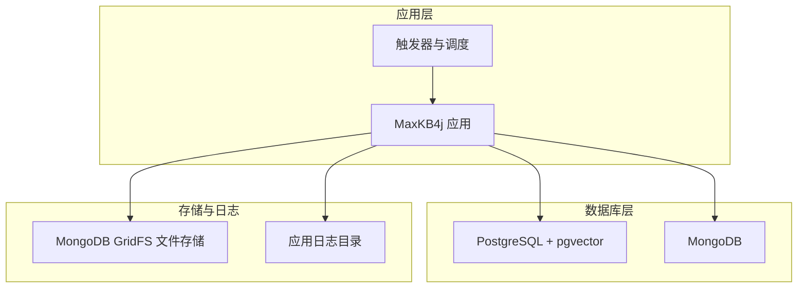
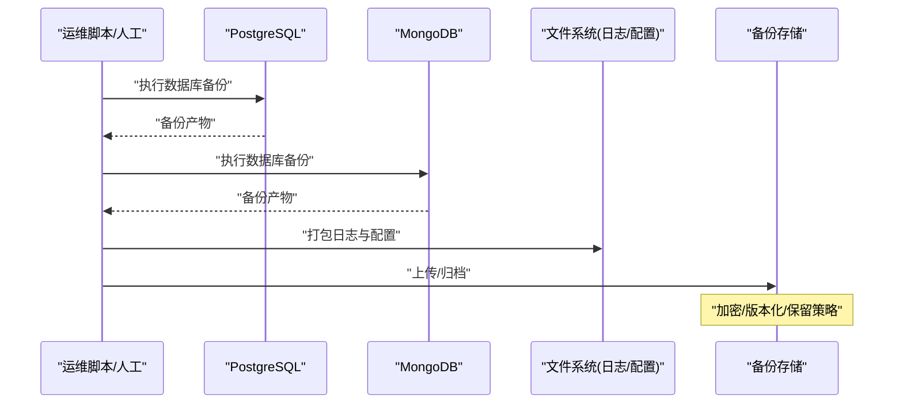
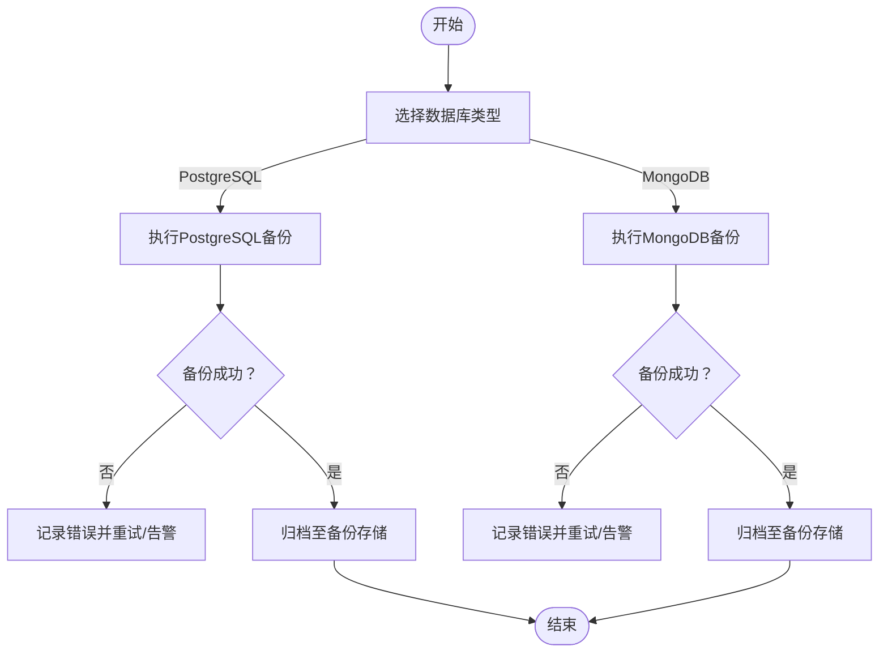
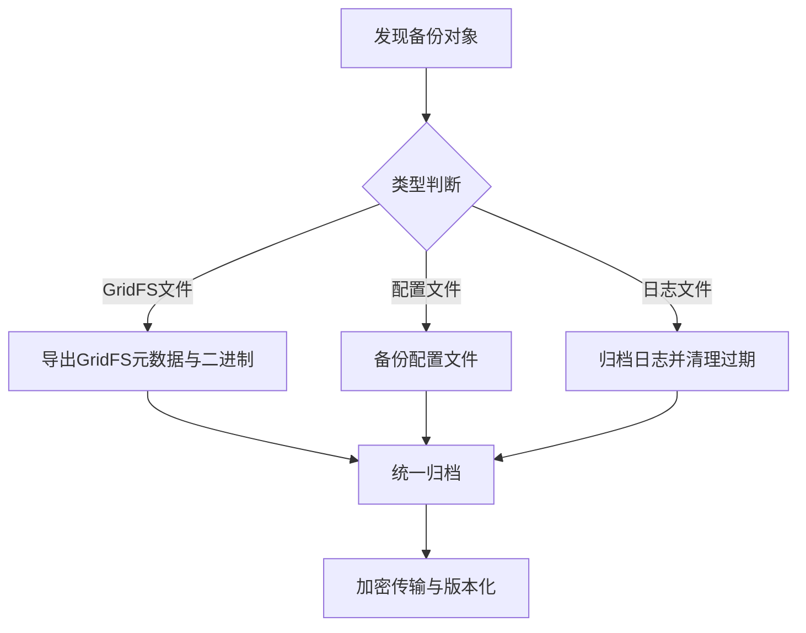
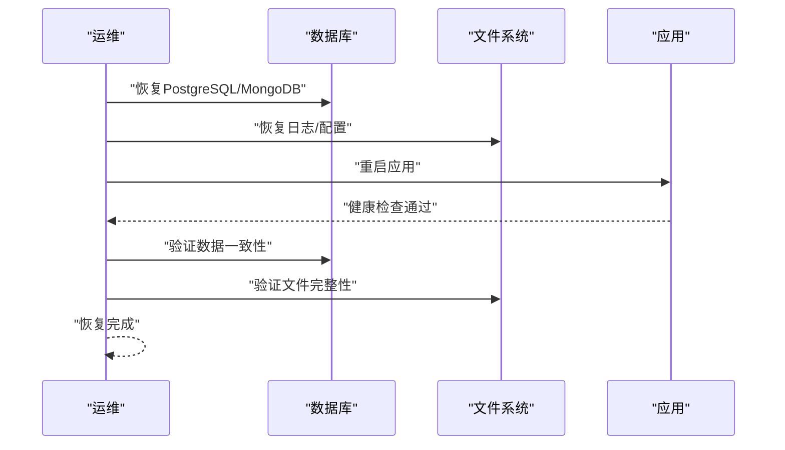
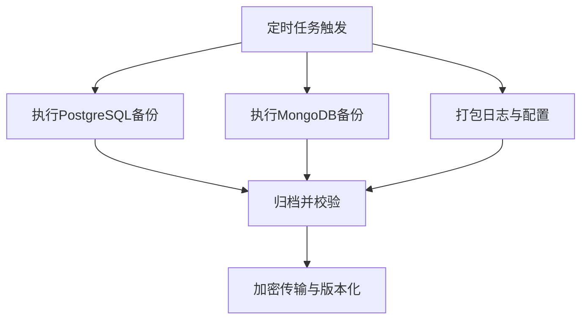
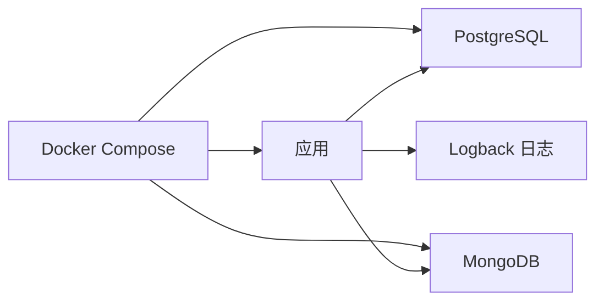

# 备份与恢复

<cite>
**本文引用的文件**
- [application.yml](file://maxkb4j-start/src/main/resources/application.yml)
- [application-prod.yml](file://maxkb4j-start/src/main/resources/application-prod.yml)
- [docker-compose.yml](file://docker-compose.yml)
- [docker-compose.dev.yml](file://docker-compose.dev.yml)
- [logback-spring.xml](file://maxkb4j-start/src/main/resources/logback-spring.xml)
- [.gitignore](file://.gitignore)
- [MongoFileService.java](file://maxkb4j-service/maxkb4j-oss/src/main/java/com/maxkb4j/oss/service/MongoFileService.java)
- [SystemSettingService.java](file://maxkb4j-service/maxkb4j-system/src/main/java/com/maxkb4j/system/service/SystemSettingService.java)
- [SystemSettingController.java](file://maxkb4j-service/maxkb4j-system/src/main/java/com/maxkb4j/system/controller/SystemSettingController.java)
- [SchedulerConfig.java](file://maxkb4j-service/maxkb4j-trigger/src/main/java/com/maxkb4j/trigger/config/SchedulerConfig.java)
- [README_CN.md](file://README_CN.md)
</cite>

## 目录
1. [简介](#简介)
2. [项目结构](#项目结构)
3. [核心组件](#核心组件)
4. [架构总览](#架构总览)
5. [详细组件分析](#详细组件分析)
6. [依赖分析](#依赖分析)
7. [性能考虑](#性能考虑)
8. [故障排查指南](#故障排查指南)
9. [结论](#结论)
10. [附录](#附录)

## 简介
本指南面向MaxKB4j运维与平台工程团队，提供一套完整的备份与恢复操作手册，覆盖数据库（PostgreSQL、MongoDB）与文件系统的备份策略、存储位置与安全加固、灾难恢复流程、自动化脚本与定时任务配置，以及备份验证与恢复测试的质量保障措施。文档结合仓库中的配置与实现，给出可落地的操作步骤与可视化图示。

## 项目结构
MaxKB4j采用Spring Boot应用配合PostgreSQL（含pgvector扩展）与MongoDB的双数据库架构，并通过Docker Compose进行编排。应用日志由Logback集中管理，文件存储使用MongoDB GridFS。

图表来源
- [docker-compose.yml:1-58](file://docker-compose.yml#L1-L58)
- [application.yml:1-69](file://maxkb4j-start/src/main/resources/application.yml#L1-L69)
- [application-prod.yml:1-9](file://maxkb4j-start/src/main/resources/application-prod.yml#L1-L9)
- [logback-spring.xml:1-157](file://maxkb4j-start/src/main/resources/logback-spring.xml#L1-L157)

章节来源
- [docker-compose.yml:1-58](file://docker-compose.yml#L1-L58)
- [application.yml:1-69](file://maxkb4j-start/src/main/resources/application.yml#L1-L69)
- [application-prod.yml:1-9](file://maxkb4j-start/src/main/resources/application-prod.yml#L1-L9)
- [logback-spring.xml:1-157](file://maxkb4j-start/src/main/resources/logback-spring.xml#L1-L157)

## 核心组件
- 数据库连接与配置
  - PostgreSQL连接参数与Flyway迁移配置位于应用配置中，生产环境连接信息在独立配置文件中。
  - MongoDB连接URI在应用配置与Docker环境变量中均有体现。
- 文件存储
  - 应用通过MongoDB GridFS进行文件上传、下载与列表管理，文件内容持久化在MongoDB。
- 日志管理
  - 应用日志按级别滚动落盘，容器内挂载日志目录，便于备份与归档。
- 触发器与调度
  - 应用内置线程池任务调度器，可用于执行周期性备份任务或健康检查。

章节来源
- [application.yml:1-69](file://maxkb4j-start/src/main/resources/application.yml#L1-L69)
- [application-prod.yml:1-9](file://maxkb4j-start/src/main/resources/application-prod.yml#L1-L9)
- [docker-compose.yml:1-58](file://docker-compose.yml#L1-L58)
- [logback-spring.xml:1-157](file://maxkb4j-start/src/main/resources/logback-spring.xml#L1-L157)
- [MongoFileService.java:1-178](file://maxkb4j-service/maxkb4j-oss/src/main/java/com/maxkb4j/oss/service/MongoFileService.java#L1-L178)
- [SchedulerConfig.java:1-20](file://maxkb4j-service/maxkb4j-trigger/src/main/java/com/maxkb4j/trigger/config/SchedulerConfig.java#L1-L20)

## 架构总览
下图展示备份与恢复涉及的关键组件与数据流向：

图表来源
- [docker-compose.yml:1-58](file://docker-compose.yml#L1-L58)
- [application-prod.yml:1-9](file://maxkb4j-start/src/main/resources/application-prod.yml#L1-L9)
- [logback-spring.xml:1-157](file://maxkb4j-start/src/main/resources/logback-spring.xml#L1-L157)

## 详细组件分析

### 数据库备份策略（PostgreSQL + MongoDB）

- PostgreSQL（全量/增量）
  - 全量备份
    - 使用容器内PostgreSQL客户端工具执行逻辑导出或物理备份；结合Docker卷映射路径进行归档。
    - 参考容器卷映射与环境变量定位数据库实例与数据目录。
  - 增量备份
    - 建议开启WAL归档并结合时间点恢复（PITR）策略；在容器环境中需确保WAL目录可持久化。
  - 配置要点
    - 连接参数与驱动在应用配置中声明，生产环境连接信息在独立配置文件中。
    - Flyway迁移配置用于数据库结构演进，备份前建议暂停迁移或在维护窗口执行。
- MongoDB（全量/增量）
  - 全量备份
    - 使用mongodump导出集合与GridFS元数据；结合容器卷映射路径进行归档。
  - 增量备份
    - 建议基于oplog的增量策略；在容器环境中需确保oplog可用且数据目录持久化。
  - 配置要点
    - 连接URI在应用配置与Docker环境变量中均可见，确保备份工具使用相同认证与数据库。

图表来源
- [docker-compose.yml:1-58](file://docker-compose.yml#L1-L58)
- [application-prod.yml:1-9](file://maxkb4j-start/src/main/resources/application-prod.yml#L1-L9)

章节来源
- [docker-compose.yml:1-58](file://docker-compose.yml#L1-L58)
- [application-prod.yml:1-9](file://maxkb4j-start/src/main/resources/application-prod.yml#L1-L9)
- [application.yml:21-25](file://maxkb4j-start/src/main/resources/application.yml#L21-L25)

### 文件系统备份方案（知识库文件、配置文件、日志文件）

- 知识库文件
  - 应用通过MongoDB GridFS存储上传的文档与附件，备份策略建议：
    - 对GridFS元数据与二进制内容分别备份，确保一致性校验。
    - 结合MongoDB备份策略，统一进行全量与增量备份。
- 配置文件
  - 应用配置文件位于资源目录，建议纳入版本化管理或单独备份。
  - Docker Compose中定义了日志目录挂载，配置文件若放置于容器外，需单独备份。
- 日志文件
  - 应用日志由Logback按大小与时间滚动，容器内挂载/logs目录。
  - 建议定期归档并清理过期日志，避免磁盘压力。

图表来源
- [logback-spring.xml:1-157](file://maxkb4j-start/src/main/resources/logback-spring.xml#L1-L157)
- [docker-compose.yml:49-51](file://docker-compose.yml#L49-L51)
- [MongoFileService.java:1-178](file://maxkb4j-service/maxkb4j-oss/src/main/java/com/maxkb4j/oss/service/MongoFileService.java#L1-L178)

章节来源
- [logback-spring.xml:1-157](file://maxkb4j-start/src/main/resources/logback-spring.xml#L1-L157)
- [docker-compose.yml:49-51](file://docker-compose.yml#L49-L51)
- [MongoFileService.java:1-178](file://maxkb4j-service/maxkb4j-oss/src/main/java/com/maxkb4j/oss/service/MongoFileService.java#L1-L178)

### 备份数据的存储位置、加密传输、版本管理与安全加固

- 存储位置
  - PostgreSQL与MongoDB数据目录通过Docker卷映射到宿主机，备份时应指向这些持久化目录。
  - 日志目录通过容器卷映射，备份时应包含该目录。
- 加密传输
  - 建议在备份产物上传到远端存储时启用TLS/加密通道；对敏感配置与日志进行压缩加密后再传输。
- 版本管理
  - 采用带日期与批次号的命名规则，保留最近N个版本，定期清理过期备份。
- 安全加固
  - 备份脚本与凭据使用最小权限原则；对备份介质实施访问控制与审计。

章节来源
- [docker-compose.yml:12-13](file://docker-compose.yml#L12-L13)
- [docker-compose.yml:24-26](file://docker-compose.yml#L24-L26)
- [docker-compose.yml:49-51](file://docker-compose.yml#L49-L51)

### 灾难恢复流程（数据恢复、服务重启、一致性验证）

- 恢复步骤
  - PostgreSQL：停止应用，恢复数据库，启动数据库，再启动应用；必要时回放WAL或执行迁移。
  - MongoDB：停止应用，恢复数据库，启动数据库，再启动应用；验证GridFS元数据与二进制一致性。
  - 文件系统：恢复日志与配置目录，确认权限与挂载点正确。
- 服务重启
  - 优先重启应用容器，观察日志与健康状态；如异常，回滚到上一版本镜像。
- 一致性验证
  - 校验关键表与集合数量、文件数量与哈希；运行基础功能回归用例（如上传、检索、对话）。

图表来源
- [docker-compose.yml:27-56](file://docker-compose.yml#L27-L56)
- [logback-spring.xml:1-157](file://maxkb4j-start/src/main/resources/logback-spring.xml#L1-L157)

章节来源
- [docker-compose.yml:27-56](file://docker-compose.yml#L27-L56)
- [logback-spring.xml:1-157](file://maxkb4j-start/src/main/resources/logback-spring.xml#L1-L157)

### 自动化脚本与定时任务配置

- 备份脚本建议
  - PostgreSQL：使用pg_dump或物理备份工具，输出到指定目录并进行压缩与校验。
  - MongoDB：使用mongodump导出集合与GridFS元数据，结合备份工具进行归档。
  - 文件系统：打包日志与配置目录，进行压缩与签名。
- 定时任务
  - 使用系统crontab或容器内调度器（如应用内置调度器）定期执行备份脚本。
  - 应用已提供线程池任务调度器配置，可作为触发器或健康检查的基础设施。

图表来源
- [SchedulerConfig.java:1-20](file://maxkb4j-service/maxkb4j-trigger/src/main/java/com/maxkb4j/trigger/config/SchedulerConfig.java#L1-L20)
- [application.yml:1-69](file://maxkb4j-start/src/main/resources/application.yml#L1-L69)

章节来源
- [SchedulerConfig.java:1-20](file://maxkb4j-service/maxkb4j-trigger/src/main/java/com/maxkb4j/trigger/config/SchedulerConfig.java#L1-L20)
- [application.yml:1-69](file://maxkb4j-start/src/main/resources/application.yml#L1-L69)

### 备份验证、恢复测试与故障演练

- 备份验证
  - 校验备份文件完整性与可读性；对关键集合/表进行抽样查询。
- 恢复测试
  - 在隔离环境执行恢复流程，验证应用可用性与数据一致性。
- 故障演练
  - 定期进行“部分组件故障”演练（如数据库不可用、文件系统损坏），评估恢复时间与影响范围。

章节来源
- [README_CN.md:46-98](file://README_CN.md#L46-L98)

## 依赖分析
- 组件耦合
  - 应用通过配置文件与Docker环境变量连接数据库与文件存储，耦合度较低，便于独立备份。
- 外部依赖
  - PostgreSQL驱动与pgvector扩展、MongoDB驱动、Logback日志框架、Docker Compose编排。
- 潜在风险
  - 若未持久化数据目录与日志目录，容器重建会导致数据丢失；需确保卷映射与备份策略一致。

图表来源
- [docker-compose.yml:1-58](file://docker-compose.yml#L1-L58)
- [application.yml:1-69](file://maxkb4j-start/src/main/resources/application.yml#L1-L69)

章节来源
- [docker-compose.yml:1-58](file://docker-compose.yml#L1-L58)
- [application.yml:1-69](file://maxkb4j-start/src/main/resources/application.yml#L1-L69)

## 性能考虑
- 备份窗口
  - 将全量备份安排在业务低峰时段；增量备份尽量异步执行，避免影响在线服务。
- I/O与网络
  - 备份过程中关注磁盘I/O与网络带宽，必要时限速与分批传输。
- 日志与监控
  - 备份任务应具备日志与告警，及时发现异常并自动重试。

## 故障排查指南
- 数据库连接失败
  - 检查应用配置与Docker环境变量中的连接参数；确认容器网络与端口可达。
- 文件无法读写
  - 检查GridFS元数据与二进制存储状态；确认容器卷挂载与权限。
- 日志缺失
  - 检查Logback配置与容器日志目录挂载；确认滚动策略与保留策略。

章节来源
- [application-prod.yml:1-9](file://maxkb4j-start/src/main/resources/application-prod.yml#L1-L9)
- [docker-compose.yml:49-51](file://docker-compose.yml#L49-L51)
- [logback-spring.xml:1-157](file://maxkb4j-start/src/main/resources/logback-spring.xml#L1-L157)
- [MongoFileService.java:1-178](file://maxkb4j-service/maxkb4j-oss/src/main/java/com/maxkb4j/oss/service/MongoFileService.java#L1-L178)

## 结论
通过明确的备份策略（全量/增量）、清晰的存储位置与安全加固、完善的灾难恢复流程与自动化脚本，结合定期的备份验证与恢复测试，MaxKB4j可在生产环境中实现高可靠的数据保护与快速恢复能力。建议将上述流程纳入SOP并持续优化。

## 附录
- 关键配置与挂载点
  - PostgreSQL数据目录：容器卷映射路径
  - MongoDB数据与配置目录：容器卷映射路径
  - 日志目录：容器卷映射路径
- 参考部署与访问
  - 参考项目文档中的部署与访问说明，确保备份与恢复操作在正确的环境与版本下执行。

章节来源
- [docker-compose.yml:12-13](file://docker-compose.yml#L12-L13)
- [docker-compose.yml:24-26](file://docker-compose.yml#L24-L26)
- [docker-compose.yml:49-51](file://docker-compose.yml#L49-L51)
- [README_CN.md:46-98](file://README_CN.md#L46-L98)