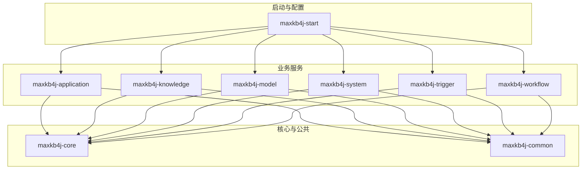
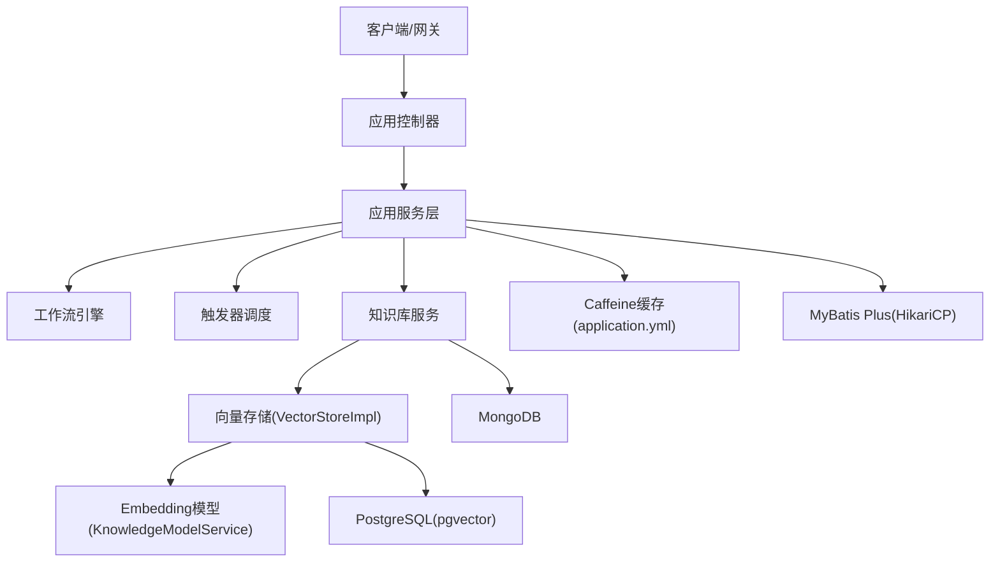
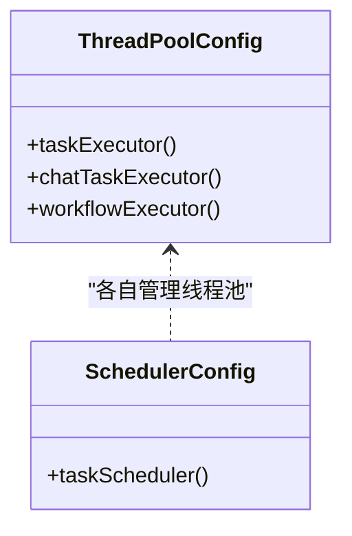
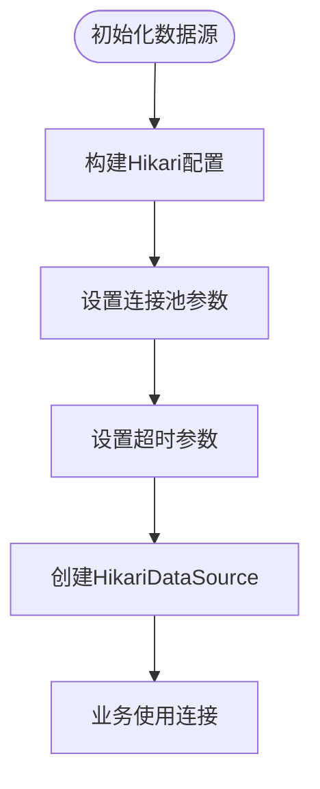
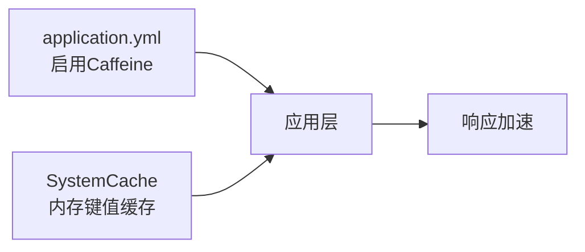
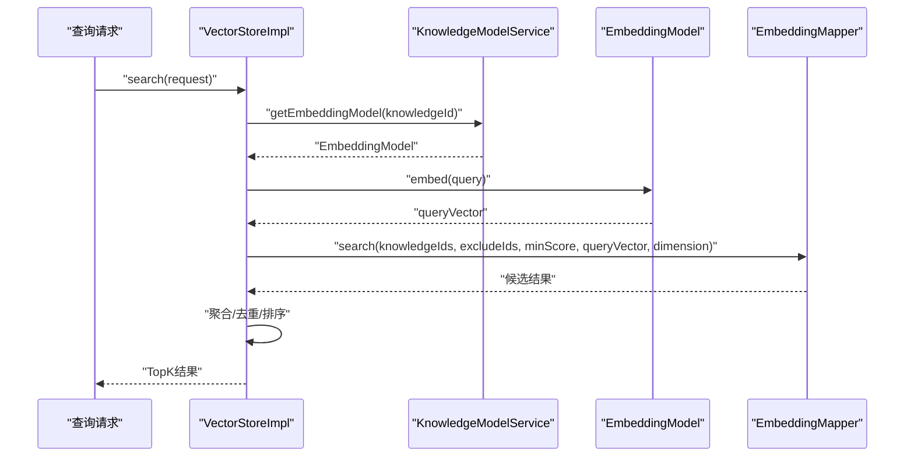
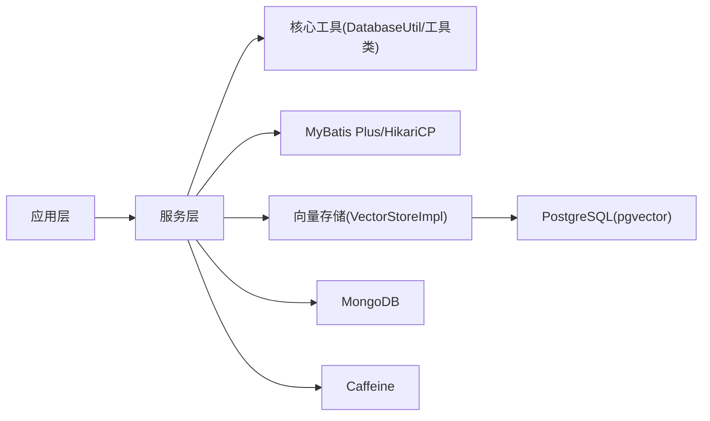

# 性能调优

<cite>
**本文引用的文件**   
- [application.yml](file://maxkb4j-start/src/main/resources/application.yml)
- [application-prod.yml](file://maxkb4j-start/src/main/resources/application-prod.yml)
- [Dockerfile](file://maxkb4j-start/Dockerfile)
- [ThreadPoolConfig.java](file://maxkb4j-start/src/main/java/com/maxkb4j/start/config/ThreadPoolConfig.java)
- [MybatisPlusConfig.java](file://maxkb4j-start/src/main/java/com/maxkb4j/start/config/MybatisPlusConfig.java)
- [MongoConfig.java](file://maxkb4j-start/src/main/java/com/maxkb4j/start/config/MongoConfig.java)
- [SystemCache.java](file://maxkb4j-common/src/main/java/com/maxkb4j/common/cache/SystemCache.java)
- [VectorStoreImpl.java](file://maxkb4j-service/maxkb4j-knowledge/src/main/java/com/maxkb4j/knowledge/store/VectorStoreImpl.java)
- [KnowledgeModelService.java](file://maxkb4j-service/maxkb4j-knowledge/src/main/java/com/maxkb4j/knowledge/service/KnowledgeModelService.java)
- [ChatServiceBuilder.java](file://maxkb4j-service/maxkb4j-application/src/main/java/com/maxkb4j/application/builder/ChatServiceBuilder.java)
- [WorkflowConfig.java](file://maxkb4j-service/maxkb4j-workflow/src/main/java/com/maxkb4j/workflow/config/WorkflowConfig.java)
- [SchedulerConfig.java](file://maxkb4j-service/maxkb4j-trigger/src/main/java/com/maxkb4j/trigger/config/SchedulerConfig.java)
- [DatabaseUtil.java](file://maxkb4j-core/src/main/java/com/maxkb4j/core/util/DatabaseUtil.java)
</cite>

## 目录
1. [简介](#简介)
2. [项目结构](#项目结构)
3. [核心组件](#核心组件)
4. [架构总览](#架构总览)
5. [详细组件分析](#详细组件分析)
6. [依赖分析](#依赖分析)
7. [性能考虑与调优建议](#性能考虑与调优建议)
8. [故障排查指南](#故障排查指南)
9. [结论](#结论)
10. [附录](#附录)

## 简介
本指南面向MaxKB4j在生产环境的性能调优需求，围绕JVM参数、数据库连接池与查询、线程池与异步、缓存策略、向量化检索（Embedding与相似度搜索）、以及性能基准测试与监控指标进行系统化梳理，并给出可落地的优化建议与排障路径。

## 项目结构
MaxKB4j采用多模块Maven工程组织，核心模块包括：
- 公共组件与工具：maxkb4j-common
- 核心能力封装：maxkb4j-core
- 业务服务层：maxkb4j-service（含应用、知识库、模型、系统、触发器、工作流等子模块）
- 启动与配置：maxkb4j-start（Spring Boot启动器、配置、Docker打包）

## 核心组件
- 线程池与异步执行：通过ThreadPoolConfig定义通用任务线程池、聊天专用线程池、工作流线程池；SchedulerConfig定义调度线程池。
- 数据库访问：MybatisPlusConfig启用分页插件；DatabaseUtil使用HikariCP作为连接池实现。
- 缓存：application.yml启用Caffeine本地缓存；SystemCache提供基于内存的键值缓存。
- 向量化检索：VectorStoreImpl负责Embedding生成、入库、删除与向量检索；KnowledgeModelService按知识库选择Embedding模型。
- MongoDB索引：MongoConfig为EmbeddingEntity创建文本索引。
- 运行环境：Dockerfile基于Java 21镜像，容器内以jar方式运行。

章节来源
- [ThreadPoolConfig.java:1-48](file://maxkb4j-start/src/main/java/com/maxkb4j/start/config/ThreadPoolConfig.java#L1-L48)
- [SchedulerConfig.java:1-20](file://maxkb4j-service/maxkb4j-trigger/src/main/java/com/maxkb4j/trigger/config/SchedulerConfig.java#L1-L20)
- [MybatisPlusConfig.java:1-32](file://maxkb4j-start/src/main/java/com/maxkb4j/start/config/MybatisPlusConfig.java#L1-L32)
- [DatabaseUtil.java:1-36](file://maxkb4j-core/src/main/java/com/maxkb4j/core/util/DatabaseUtil.java#L1-L36)
- [application.yml:19-20](file://maxkb4j-start/src/main/resources/application.yml#L19-L20)
- [SystemCache.java:1-36](file://maxkb4j-common/src/main/java/com/maxkb4j/common/cache/SystemCache.java#L1-L36)
- [VectorStoreImpl.java:1-288](file://maxkb4j-service/maxkb4j-knowledge/src/main/java/com/maxkb4j/knowledge/store/VectorStoreImpl.java#L1-L288)
- [KnowledgeModelService.java:1-30](file://maxkb4j-service/maxkb4j-knowledge/src/main/java/com/maxkb4j/knowledge/service/KnowledgeModelService.java#L1-L30)
- [MongoConfig.java:1-23](file://maxkb4j-start/src/main/java/com/maxkb4j/start/config/MongoConfig.java#L1-L23)
- [Dockerfile:1-27](file://maxkb4j-start/Dockerfile#L1-L27)

## 架构总览
MaxKB4j整体由Spring Boot承载，业务请求经控制器进入应用层，再通过服务层调用核心能力（如向量化检索、工作流、触发器等）。数据访问通过MyBatis Plus与HikariCP连接池，缓存采用Caffeine，向量存储与检索结合PostgreSQL/pgvector与LangChain4j EmbeddingModel。

图表来源
- [application.yml:19-20](file://maxkb4j-start/src/main/resources/application.yml#L19-L20)
- [MybatisPlusConfig.java:17-32](file://maxkb4j-start/src/main/java/com/maxkb4j/start/config/MybatisPlusConfig.java#L17-L32)
- [DatabaseUtil.java:18-31](file://maxkb4j-core/src/main/java/com/maxkb4j/core/util/DatabaseUtil.java#L18-L31)
- [VectorStoreImpl.java:34-288](file://maxkb4j-service/maxkb4j-knowledge/src/main/java/com/maxkb4j/knowledge/store/VectorStoreImpl.java#L34-L288)
- [KnowledgeModelService.java:14-30](file://maxkb4j-service/maxkb4j-knowledge/src/main/java/com/maxkb4j/knowledge/service/KnowledgeModelService.java#L14-L30)
- [MongoConfig.java:10-23](file://maxkb4j-start/src/main/java/com/maxkb4j/start/config/MongoConfig.java#L10-L23)

## 详细组件分析

### 线程池与异步执行
- 通用任务线程池：核心线程、最大线程、队列容量、名称前缀、优雅关闭策略均在ThreadPoolConfig中集中配置。
- 聊天专用线程池：独立线程池，便于隔离聊天场景的并发与资源占用。
- 工作流线程池：用于流程节点执行，具备优雅关闭。
- 触发器调度线程池：ThreadPoolTaskScheduler，支持等待任务完成与超时控制。

图表来源
- [ThreadPoolConfig.java:10-48](file://maxkb4j-start/src/main/java/com/maxkb4j/start/config/ThreadPoolConfig.java#L10-L48)
- [SchedulerConfig.java:8-20](file://maxkb4j-service/maxkb4j-trigger/src/main/java/com/maxkb4j/trigger/config/SchedulerConfig.java#L8-L20)

章节来源
- [ThreadPoolConfig.java:10-48](file://maxkb4j-start/src/main/java/com/maxkb4j/start/config/ThreadPoolConfig.java#L10-L48)
- [SchedulerConfig.java:8-20](file://maxkb4j-service/maxkb4j-trigger/src/main/java/com/maxkb4j/trigger/config/SchedulerConfig.java#L8-L20)

### 数据库访问与连接池
- MyBatis Plus分页插件：在MybatisPlusConfig中启用，确保分页查询性能与一致性。
- HikariCP连接池：DatabaseUtil中显式配置最大池大小、最小空闲、空闲超时、最大生存时间、连接超时等参数，适合高并发场景。

图表来源
- [DatabaseUtil.java:18-31](file://maxkb4j-core/src/main/java/com/maxkb4j/core/util/DatabaseUtil.java#L18-L31)
- [MybatisPlusConfig.java:24-30](file://maxkb4j-start/src/main/java/com/maxkb4j/start/config/MybatisPlusConfig.java#L24-L30)

章节来源
- [MybatisPlusConfig.java:17-32](file://maxkb4j-start/src/main/java/com/maxkb4j/start/config/MybatisPlusConfig.java#L17-L32)
- [DatabaseUtil.java:16-36](file://maxkb4j-core/src/main/java/com/maxkb4j/core/util/DatabaseUtil.java#L16-L36)

### 缓存策略
- Caffeine本地缓存：application.yml启用，适用于热点数据快速访问。
- 内存缓存：SystemCache提供简单键值缓存，适合短期驻留的配置或密钥等。

图表来源
- [application.yml:19-20](file://maxkb4j-start/src/main/resources/application.yml#L19-L20)
- [SystemCache.java:8-36](file://maxkb4j-common/src/main/java/com/maxkb4j/common/cache/SystemCache.java#L8-L36)

章节来源
- [application.yml:19-20](file://maxkb4j-start/src/main/resources/application.yml#L19-L20)
- [SystemCache.java:8-36](file://maxkb4j-common/src/main/java/com/maxkb4j/common/cache/SystemCache.java#L8-L36)

### 向量化检索（Embedding与相似度搜索）
- 批量处理与重试：VectorStoreImpl对Embedding生成采用批量与重试机制，降低失败率与提升吞吐。
- 检索流程：根据知识库选择Embedding模型，生成查询向量，调用Mapper执行向量检索，聚合与去重后返回TopK。
- 模型选择：KnowledgeModelService依据知识库ID从模型工厂获取对应EmbeddingModel。

图表来源
- [VectorStoreImpl.java:214-278](file://maxkb4j-service/maxkb4j-knowledge/src/main/java/com/maxkb4j/knowledge/store/VectorStoreImpl.java#L214-L278)
- [KnowledgeModelService.java:19-28](file://maxkb4j-service/maxkb4j-knowledge/src/main/java/com/maxkb4j/knowledge/service/KnowledgeModelService.java#L19-L28)

章节来源
- [VectorStoreImpl.java:34-288](file://maxkb4j-service/maxkb4j-knowledge/src/main/java/com/maxkb4j/knowledge/store/VectorStoreImpl.java#L34-L288)
- [KnowledgeModelService.java:14-30](file://maxkb4j-service/maxkb4j-knowledge/src/main/java/com/maxkb4j/knowledge/service/KnowledgeModelService.java#L14-L30)

### MongoDB索引
- 文本索引：MongoConfig为EmbeddingEntity的content字段建立文本索引，有利于全文检索场景下的内容匹配。

章节来源
- [MongoConfig.java:10-23](file://maxkb4j-start/src/main/java/com/maxkb4j/start/config/MongoConfig.java#L10-L23)

### 应用类型与聊天服务
- ChatServiceBuilder：通过AppType选择不同聊天实现（简单/工作流），减少耦合，便于扩展。

章节来源
- [ChatServiceBuilder.java:14-38](file://maxkb4j-service/maxkb4j-application/src/main/java/com/maxkb4j/application/builder/ChatServiceBuilder.java#L14-L38)

## 依赖分析
- 组件内聚与解耦：各模块职责清晰，服务间通过接口与Spring Bean交互，避免强耦合。
- 外部依赖：PostgreSQL/pgvector、MongoDB、HikariCP、Caffeine、LangChain4j EmbeddingModel等。
- 关键依赖链：应用层 -> 服务层 -> 核心工具/数据访问 -> 外部存储。

图表来源
- [DatabaseUtil.java:18-31](file://maxkb4j-core/src/main/java/com/maxkb4j/core/util/DatabaseUtil.java#L18-L31)
- [MybatisPlusConfig.java:24-30](file://maxkb4j-start/src/main/java/com/maxkb4j/start/config/MybatisPlusConfig.java#L24-L30)
- [VectorStoreImpl.java:36-37](file://maxkb4j-service/maxkb4j-knowledge/src/main/java/com/maxkb4j/knowledge/store/VectorStoreImpl.java#L36-L37)
- [application.yml:19-20](file://maxkb4j-start/src/main/resources/application.yml#L19-L20)

## 性能考虑与调优建议

### JVM参数调优
- 基础镜像与运行参数：当前容器使用Java 21镜像，启动参数仅包含编码设置。建议在生产环境增加以下JVM参数以优化性能与稳定性：
  - 堆内存设置：根据峰值内存占用与GC行为，合理设置初始堆与最大堆大小，避免频繁Full GC。
  - 垃圾回收器选择：优先选用G1或ZGC（取决于JDK版本与硬件），平衡停顿与吞吐。
  - GC参数：开启并行GC日志，记录GC停顿、晋升失败、老年代回收情况，辅助定位GC问题。
  - 其他：开启逃逸分析、偏向锁、JIT优化等，结合实际负载验证收益。
- 参数示例（说明性，非代码片段）：
  - 初始堆与最大堆：-Xms与-Xmx设置为物理内存的20%-30%
  - G1参数：-XX:+UseG1GC -XX:MaxGCPauseMillis=200 -XX:G1HeapRegionSize=16m
  - GC日志：-Xlog:gc*:file=/var/log/app/gc.log:time,tags:filecount=10,filesize=10485760
  - 其他：-XX:+UseStringDeduplication -XX:+OptimizeStringConcat

章节来源
- [Dockerfile:25](file://maxkb4j-start/Dockerfile#L25)

### 数据库性能优化
- 连接池配置：
  - HikariCP参数：参考DatabaseUtil中的参数设计，结合业务并发与平均事务时长，动态调整最大池大小、最小空闲、连接超时与生命周期。
  - 连接泄漏防护：开启连接泄漏检测，定期巡检未释放连接。
- 索引优化：
  - PostgreSQL：为高频查询字段建立合适索引（如知识库ID、段落ID、文档ID等），避免全表扫描。
  - MongoDB：除文本索引外，针对查询条件建立复合索引，减少检索成本。
- 查询优化：
  - 分页与LIMIT：MyBatis Plus分页插件已启用，确保大结果集场景使用分页。
  - SQL解析与校验：DatabaseUtil中使用SQL解析工具进行基础校验，避免慢查询。
  - 读写分离与只读事务：对只读查询启用只读事务，降低主库压力。

章节来源
- [DatabaseUtil.java:18-31](file://maxkb4j-core/src/main/java/com/maxkb4j/core/util/DatabaseUtil.java#L18-L31)
- [MybatisPlusConfig.java:24-30](file://maxkb4j-start/src/main/java/com/maxkb4j/start/config/MybatisPlusConfig.java#L24-L30)
- [MongoConfig.java:15-20](file://maxkb4j-start/src/main/java/com/maxkb4j/start/config/MongoConfig.java#L15-L20)

### 应用层面性能优化
- 线程池配置：
  - 通用任务线程池：根据CPU核数与I/O占比，调整核心/最大线程与队列容量，避免任务堆积或线程过多导致上下文切换开销。
  - 聊天与工作流线程池：独立隔离，防止相互影响；设置优雅关闭与超时，保障平滑下线。
  - 触发器调度线程池：合理设置池大小与等待策略，避免定时任务积压。
- 缓存策略：
  - Caffeine：结合LRU与TTL策略，设置合理的容量上限与过期时间，降低数据库压力。
  - 内存缓存：SystemCache适用于短生命周期配置，避免长期驻留造成内存膨胀。
- 异步处理：
  - 对耗时操作（如Embedding生成、文件上传、外部API调用）采用异步线程池执行，提高响应性。

章节来源
- [ThreadPoolConfig.java:12-45](file://maxkb4j-start/src/main/java/com/maxkb4j/start/config/ThreadPoolConfig.java#L12-L45)
- [SchedulerConfig.java:10-19](file://maxkb4j-service/maxkb4j-trigger/src/main/java/com/maxkb4j/trigger/config/SchedulerConfig.java#L10-L19)
- [application.yml:19-20](file://maxkb4j-start/src/main/resources/application.yml#L19-L20)
- [SystemCache.java:8-36](file://maxkb4j-common/src/main/java/com/maxkb4j/common/cache/SystemCache.java#L8-L36)

### 向量化检索性能优化
- Embedding模型选择：
  - 尺寸与精度：维度越高表达能力越强但存储与计算成本更高；根据业务召回质量与性能目标折中。
  - 供应商与部署：可选择本地模型或云端服务，结合延迟与成本评估。
- 向量索引配置：
  - PostgreSQL pgvector：确保维度一致、索引建立完善；对高维向量可考虑IVFFlat或HNSW索引策略（需结合数据库版本与扩展支持）。
  - 向量相似度：选择合适的距离度量（余弦/内积/欧氏），并在查询时统一归一化。
- 相似度计算优化：
  - 批量嵌入：VectorStoreImpl已支持批量与重试，建议根据GPU/CPU能力与延迟目标调整批次大小与重试次数。
  - 结果聚合：先按段落ID去重，再按分数聚合排序，减少重复与冗余结果。

章节来源
- [VectorStoreImpl.java:39-46](file://maxkb4j-service/maxkb4j-knowledge/src/main/java/com/maxkb4j/knowledge/store/VectorStoreImpl.java#L39-L46)
- [VectorStoreImpl.java:214-278](file://maxkb4j-service/maxkb4j-knowledge/src/main/java/com/maxkb4j/knowledge/store/VectorStoreImpl.java#L214-L278)
- [KnowledgeModelService.java:19-28](file://maxkb4j-service/maxkb4j-knowledge/src/main/java/com/maxkb4j/knowledge/service/KnowledgeModelService.java#L19-L28)

### 性能基准测试与监控
- 基准测试方法：
  - 接口级压测：对聊天、检索、文档解析等关键接口进行RPS与P95/P99延迟测试。
  - 场景化压测：模拟真实用户行为（多轮对话、并发检索、批量导入）。
- 压力测试工具：
  - JMeter/Grinder/Locust等，结合容器化压测环境。
- 监控指标：
  - JVM：堆内存、GC停顿、线程数、类加载数。
  - 数据库：连接池活跃数、排队时长、慢查询、锁等待。
  - 应用：线程池拒绝数、队列长度、异常率、响应时间分布。
  - 向量化：Embedding生成耗时、向量插入/查询延迟、索引命中率。

[本节为通用指导，无需列出章节来源]

### 常见性能问题诊断与解决
- 内存泄漏：
  - 现象：堆内存持续上涨、GC频繁且效果差。
  - 排查：检查线程池未正确关闭、静态集合未清理、缓存未设置上限。
  - 解决：规范线程池生命周期、限制缓存容量、定期巡检大对象。
- 数据库锁等待：
  - 现象：查询/更新长时间阻塞。
  - 排查：慢查询日志、锁等待监控、事务粒度过大。
  - 解决：拆分大事务、加索引、优化SQL、必要时引入只读副本。
- 网络延迟：
  - 现象：外部模型服务/对象存储响应慢。
  - 排查：DNS解析、TLS握手、带宽与丢包。
  - 解决：连接复用、超时与重试策略、就近部署与CDN。

[本节为通用指导，无需列出章节来源]

## 故障排查指南
- 线程池相关问题
  - 现象：任务堆积、拒绝异常、线程数飙升。
  - 排查：查看线程池队列长度与拒绝策略；核对核心/最大线程与负载匹配度。
  - 解决：扩容线程池或优化任务拆分；引入限流与熔断。
- 数据库连接问题
  - 现象：连接池耗尽、超时异常。
  - 排查：连接池参数、慢查询、连接泄漏。
  - 解决：调整池大小与超时；优化SQL与索引；修复泄漏。
- 向量检索异常
  - 现象：Embedding生成失败、向量查询慢或无结果。
  - 排查：模型可用性、批次大小与重试、索引状态。
  - 解决：切换模型或调整批次；重建索引；优化查询过滤条件。

章节来源
- [ThreadPoolConfig.java:12-45](file://maxkb4j-start/src/main/java/com/maxkb4j/start/config/ThreadPoolConfig.java#L12-L45)
- [DatabaseUtil.java:18-31](file://maxkb4j-core/src/main/java/com/maxkb4j/core/util/DatabaseUtil.java#L18-L31)
- [VectorStoreImpl.java:49-91](file://maxkb4j-service/maxkb4j-knowledge/src/main/java/com/maxkb4j/knowledge/store/VectorStoreImpl.java#L49-L91)

## 结论
MaxKB4j在架构上已具备良好的模块化与可扩展性，结合合理的JVM参数、连接池与索引优化、线程池与缓存策略、以及向量化检索的批处理与重试机制，可在生产环境中获得稳定且高效的性能表现。建议以监控指标为依据持续迭代调优，并通过基准测试验证各项优化的效果。

## 附录
- 配置文件要点
  - application.yml：启用Caffeine缓存、Sa-Token配置、Flyway迁移等。
  - application-prod.yml：生产数据库与MongoDB连接信息。
  - Dockerfile：Java 21运行环境与JAR启动命令。

章节来源
- [application.yml:19-69](file://maxkb4j-start/src/main/resources/application.yml#L19-L69)
- [application-prod.yml:1-9](file://maxkb4j-start/src/main/resources/application-prod.yml#L1-L9)
- [Dockerfile:1-27](file://maxkb4j-start/Dockerfile#L1-L27)