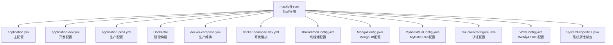
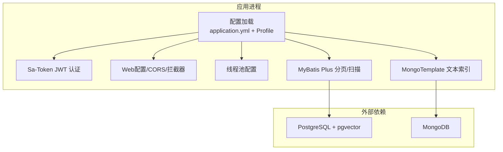
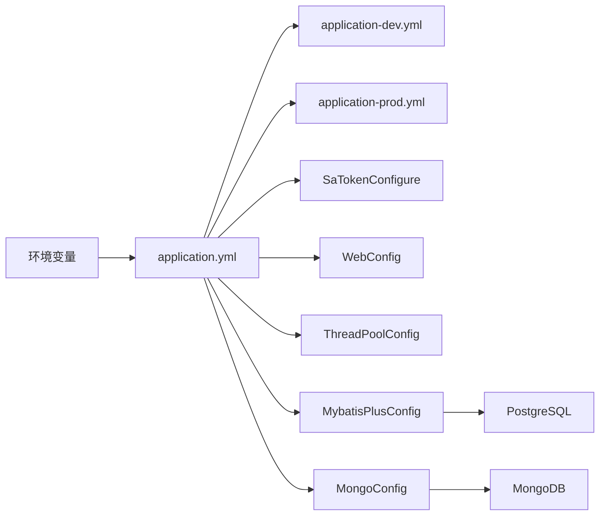
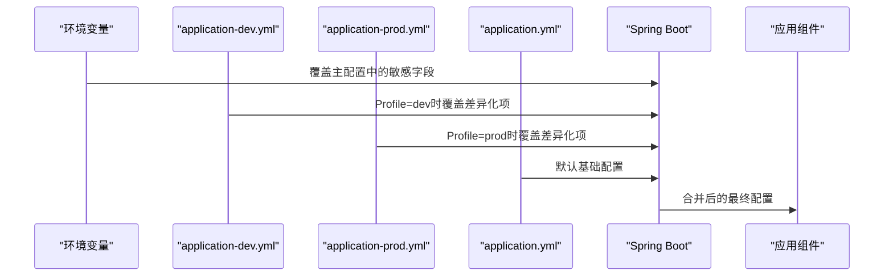

# 环境准备

<cite>
**本文引用的文件**
- [application.yml](file://maxkb4j-start/src/main/resources/application.yml)
- [application-dev.yml](file://maxkb4j-start/src/main/resources/application-dev.yml)
- [application-prod.yml](file://maxkb4j-start/src/main/resources/application-prod.yml)
- [docker-compose.yml](file://docker-compose.yml)
- [docker-compose.dev.yml](file://docker-compose.dev.yml)
- [Dockerfile](file://maxkb4j-start/Dockerfile)
- [SystemProperties.java](file://maxkb4j-common/src/main/java/com/maxkb4j/common/props/SystemProperties.java)
- [ThreadPoolConfig.java](file://maxkb4j-start/src/main/java/com/maxkb4j/start/config/ThreadPoolConfig.java)
- [MongoConfig.java](file://maxkb4j-start/src/main/java/com/maxkb4j/start/config/MongoConfig.java)
- [MybatisPlusConfig.java](file://maxkb4j-start/src/main/java/com/maxkb4j/start/config/MybatisPlusConfig.java)
- [SaTokenConfigure.java](file://maxkb4j-start/src/main/java/com/maxkb4j/start/config/SaTokenConfigure.java)
- [WebConfig.java](file://maxkb4j-start/src/main/java/com/maxkb4j/start/config/WebConfig.java)
</cite>

## 目录
1. [简介](#简介)
2. [项目结构](#项目结构)
3. [核心组件](#核心组件)
4. [架构总览](#架构总览)
5. [详细组件分析](#详细组件分析)
6. [依赖分析](#依赖分析)
7. [性能考虑](#性能考虑)
8. [故障排查指南](#故障排查指南)
9. [结论](#结论)
10. [附录](#附录)

## 简介
本指南面向MaxKB4j的运维与开发团队，提供从开发到生产的一体化环境准备与配置方法。内容涵盖：
- 开发、测试、生产三类环境的配置差异与最佳实践
- application.yml关键参数详解（数据库、缓存、文件上传、安全等）
- 不同部署场景的配置模板与示例（本地、Docker Compose、容器镜像）
- 环境变量使用与Spring Profile优先级规则
- JVM参数、线程池、连接池等性能相关配置
- 配置验证方法与常见错误排查

## 项目结构
MaxKB4j采用多模块Maven工程，核心启动模块位于maxkb4j-start，资源文件集中于其resources目录；数据库与对象存储分别对接PostgreSQL+pgvector与MongoDB；服务端以 Undertow 作为Web容器。

图表来源
- [application.yml:1-69](file://maxkb4j-start/src/main/resources/application.yml#L1-L69)
- [application-dev.yml:1-11](file://maxkb4j-start/src/main/resources/application-dev.yml#L1-L11)
- [application-prod.yml:1-9](file://maxkb4j-start/src/main/resources/application-prod.yml#L1-L9)
- [docker-compose.yml:1-58](file://docker-compose.yml#L1-L58)
- [docker-compose.dev.yml:1-28](file://docker-compose.dev.yml#L1-L28)
- [Dockerfile:1-27](file://maxkb4j-start/Dockerfile#L1-L27)
- [ThreadPoolConfig.java:1-48](file://maxkb4j-start/src/main/java/com/maxkb4j/start/config/ThreadPoolConfig.java#L1-L48)
- [MongoConfig.java:1-23](file://maxkb4j-start/src/main/java/com/maxkb4j/start/config/MongoConfig.java#L1-L23)
- [MybatisPlusConfig.java:1-32](file://maxkb4j-start/src/main/java/com/maxkb4j/start/config/MybatisPlusConfig.java#L1-L32)
- [SaTokenConfigure.java:1-21](file://maxkb4j-start/src/main/java/com/maxkb4j/start/config/SaTokenConfigure.java#L1-L21)
- [WebConfig.java:1-86](file://maxkb4j-start/src/main/java/com/maxkb4j/start/config/WebConfig.java#L1-L86)
- [SystemProperties.java:1-18](file://maxkb4j-common/src/main/java/com/maxkb4j/common/props/SystemProperties.java#L1-L18)

章节来源
- [application.yml:1-69](file://maxkb4j-start/src/main/resources/application.yml#L1-L69)
- [application-dev.yml:1-11](file://maxkb4j-start/src/main/resources/application-dev.yml#L1-L11)
- [application-prod.yml:1-9](file://maxkb4j-start/src/main/resources/application-prod.yml#L1-L9)
- [docker-compose.yml:1-58](file://docker-compose.yml#L1-L58)
- [docker-compose.dev.yml:1-28](file://docker-compose.dev.yml#L1-L28)
- [Dockerfile:1-27](file://maxkb4j-start/Dockerfile#L1-L27)

## 核心组件
- 应用配置中心：application.yml为主配置，application-dev.yml与application-prod.yml为环境差异化配置，通过Spring Profile激活。
- 安全与认证：基于Sa-Token的JWT无状态认证，统一拦截器校验。
- 数据访问：MyBatis Plus分页插件与Mapper扫描；MongoDB用于向量与全文索引。
- Web容器：Undertow替代Tomcat，提升并发能力。
- 线程池：异步任务、聊天任务、工作流三套线程池，支持优雅关闭。
- 部署与编排：Dockerfile定义镜像与JVM参数；docker-compose提供数据库与应用编排。

章节来源
- [application.yml:1-69](file://maxkb4j-start/src/main/resources/application.yml#L1-L69)
- [SaTokenConfigure.java:1-21](file://maxkb4j-start/src/main/java/com/maxkb4j/start/config/SaTokenConfigure.java#L1-L21)
- [WebConfig.java:1-86](file://maxkb4j-start/src/main/java/com/maxkb4j/start/config/WebConfig.java#L1-L86)
- [MybatisPlusConfig.java:1-32](file://maxkb4j-start/src/main/java/com/maxkb4j/start/config/MybatisPlusConfig.java#L1-L32)
- [MongoConfig.java:1-23](file://maxkb4j-start/src/main/java/com/maxkb4j/start/config/MongoConfig.java#L1-L23)
- [ThreadPoolConfig.java:1-48](file://maxkb4j-start/src/main/java/com/maxkb4j/start/config/ThreadPoolConfig.java#L1-L48)

## 架构总览
下图展示应用启动后，配置加载、线程池、数据库与对象存储交互关系。

图表来源
- [application.yml:1-69](file://maxkb4j-start/src/main/resources/application.yml#L1-L69)
- [SaTokenConfigure.java:1-21](file://maxkb4j-start/src/main/java/com/maxkb4j/start/config/SaTokenConfigure.java#L1-L21)
- [WebConfig.java:1-86](file://maxkb4j-start/src/main/java/com/maxkb4j/start/config/WebConfig.java#L1-L86)
- [ThreadPoolConfig.java:1-48](file://maxkb4j-start/src/main/java/com/maxkb4j/start/config/ThreadPoolConfig.java#L1-L48)
- [MybatisPlusConfig.java:1-32](file://maxkb4j-start/src/main/java/com/maxkb4j/start/config/MybatisPlusConfig.java#L1-L32)
- [MongoConfig.java:1-23](file://maxkb4j-start/src/main/java/com/maxkb4j/start/config/MongoConfig.java#L1-L23)

## 详细组件分析

### 配置文件与环境变量
- 主配置文件：application.yml
  - 服务器端口、错误页、multipart大小限制、Jackson时区与日期格式、Caffeine缓存类型、Flyway迁移策略、MyBatis Plus全局配置、Sa-Token JWT密钥与会话策略、P6SPY日志开关、系统默认账户与密码占位。
- 环境配置：
  - application-dev.yml：开发环境数据库与MongoDB连接串。
  - application-prod.yml：生产环境数据库与MongoDB连接串。
- 环境变量：
  - SA_TOKEN_JWT_SECRET_KEY：用于覆盖Sa-Token JWT密钥。
  - SYSTEM_DEFAULT_PASSWORD：用于覆盖系统默认密码。
- Profile优先级与激活：
  - Spring Boot按以下顺序合并配置：全局默认、application.yml、application-{profile}.yml、命令行参数、环境变量。可通过spring.profiles.active或-Dspring.profiles.active指定激活的Profile。

章节来源
- [application.yml:1-69](file://maxkb4j-start/src/main/resources/application.yml#L1-L69)
- [application-dev.yml:1-11](file://maxkb4j-start/src/main/resources/application-dev.yml#L1-L11)
- [application-prod.yml:1-9](file://maxkb4j-start/src/main/resources/application-prod.yml#L1-L9)
- [SystemProperties.java:1-18](file://maxkb4j-common/src/main/java/com/maxkb4j/common/props/SystemProperties.java#L1-L18)

### 数据库与对象存储配置
- PostgreSQL（MyBatis Plus）
  - 连接串、用户名、密码、驱动类名在各环境配置中定义。
  - 分页插件针对PostgreSQL配置，Mapper扫描路径与类型别名包已设定。
- MongoDB（向量与全文）
  - 通过MongoConfig为EmbeddingEntity建立文本索引，满足RAG检索需求。
  - docker-compose提供MongoDB服务与初始化凭据。

章节来源
- [application-dev.yml:1-11](file://maxkb4j-start/src/main/resources/application-dev.yml#L1-L11)
- [application-prod.yml:1-9](file://maxkb4j-start/src/main/resources/application-prod.yml#L1-L9)
- [MybatisPlusConfig.java:1-32](file://maxkb4j-start/src/main/java/com/maxkb4j/start/config/MybatisPlusConfig.java#L1-L32)
- [MongoConfig.java:1-23](file://maxkb4j-start/src/main/java/com/maxkb4j/start/config/MongoConfig.java#L1-L23)
- [docker-compose.yml:1-58](file://docker-compose.yml#L1-L58)

### 安全与认证配置
- Sa-Token
  - 使用JWT无状态逻辑实现，token名称、超时、并发策略、Cookie读写等均在主配置中定义。
  - 通过拦截器对聊天相关接口进行统一鉴权。
- 系统默认账户
  - system.default-username与system.default-password通过SystemProperties绑定，支持环境变量覆盖。

章节来源
- [application.yml:37-69](file://maxkb4j-start/src/main/resources/application.yml#L37-L69)
- [SaTokenConfigure.java:1-21](file://maxkb4j-start/src/main/java/com/maxkb4j/start/config/SaTokenConfigure.java#L1-L21)
- [WebConfig.java:1-86](file://maxkb4j-start/src/main/java/com/maxkb4j/start/config/WebConfig.java#L1-L86)
- [SystemProperties.java:1-18](file://maxkb4j-common/src/main/java/com/maxkb4j/common/props/SystemProperties.java#L1-L18)

### Web与CORS配置
- 异步支持：自定义线程池执行器，设置核心/最大线程数、队列容量与关闭等待策略。
- 拦截器：对聊天相关路径进行鉴权拦截。
- CORS：允许任意来源、凭证、方法与头部，并暴露必要响应头。

章节来源
- [WebConfig.java:1-86](file://maxkb4j-start/src/main/java/com/maxkb4j/start/config/WebConfig.java#L1-L86)

### 线程池配置
- 通用异步任务：taskExecutor
- 聊天任务：chatTaskExecutor（带优雅关闭）
- 工作流任务：workflowExecutor（带优雅关闭）
- 建议：根据CPU核数与业务峰值QPS调整核心/最大线程数与队列容量；开启优雅关闭避免任务丢失。

章节来源
- [ThreadPoolConfig.java:1-48](file://maxkb4j-start/src/main/java/com/maxkb4j/start/config/ThreadPoolConfig.java#L1-L48)

### 部署与编排
- Dockerfile
  - 基于Amazon Corretto 21；设置时区；暴露8080端口；以jar包方式启动。
  - JVM参数可在CMD中追加（如内存、GC、编码等），建议结合实际负载调优。
- docker-compose.yml（生产）
  - 提供PostgreSQL与MongoDB服务；应用服务依赖数据库启动；通过环境变量注入连接串与凭据；挂载日志与证书目录。
- docker-compose.dev.yml（开发）
  - 仅提供数据库服务，便于快速启动开发环境。

章节来源
- [Dockerfile:1-27](file://maxkb4j-start/Dockerfile#L1-L27)
- [docker-compose.yml:1-58](file://docker-compose.yml#L1-L58)
- [docker-compose.dev.yml:1-28](file://docker-compose.dev.yml#L1-L28)

## 依赖分析
- 配置依赖
  - application.yml是基础，application-dev.yml与application-prod.yml通过Profile覆盖差异化项。
  - 环境变量优先于Profile文件，可用于敏感信息与运行时切换。
- 组件耦合
  - Sa-Token与WebConfig强关联（拦截器生效）。
  - MyBatis Plus与MongoConfig分别作用于关系型与非关系型数据源。
  - ThreadPoolConfig为多处异步任务提供统一执行器。

图表来源
- [application.yml:1-69](file://maxkb4j-start/src/main/resources/application.yml#L1-L69)
- [application-dev.yml:1-11](file://maxkb4j-start/src/main/resources/application-dev.yml#L1-L11)
- [application-prod.yml:1-9](file://maxkb4j-start/src/main/resources/application-prod.yml#L1-L9)
- [SaTokenConfigure.java:1-21](file://maxkb4j-start/src/main/java/com/maxkb4j/start/config/SaTokenConfigure.java#L1-L21)
- [WebConfig.java:1-86](file://maxkb4j-start/src/main/java/com/maxkb4j/start/config/WebConfig.java#L1-L86)
- [ThreadPoolConfig.java:1-48](file://maxkb4j-start/src/main/java/com/maxkb4j/start/config/ThreadPoolConfig.java#L1-L48)
- [MybatisPlusConfig.java:1-32](file://maxkb4j-start/src/main/java/com/maxkb4j/start/config/MybatisPlusConfig.java#L1-L32)
- [MongoConfig.java:1-23](file://maxkb4j-start/src/main/java/com/maxkb4j/start/config/MongoConfig.java#L1-L23)

## 性能考虑
- JVM参数调优（建议在Dockerfile CMD中追加）
  - 堆大小：-Xms/-Xmx（建议与容器内存限制一致）
  - 垃圾回收：-XX:+UseG1GC 或 -XX:+UseZGC（按延迟目标选择）
  - 编码：-Dfile.encoding=UTF-8（已内置）
  - 其他：-XX:MaxDirectMemorySize、-XX:+UseStringDeduplication 等
- 线程池
  - 通用异步：taskExecutor，核心/最大/队列容量按任务类型与CPU核数调优。
  - 聊天任务：chatTaskExecutor，建议与业务峰值QPS匹配，开启优雅关闭。
  - 工作流：workflowExecutor，队列容量适配流程复杂度。
- 连接池与数据库
  - PostgreSQL连接池：建议在数据源URL或连接池配置中设置连接数、空闲超时、查询超时等参数（需在数据源配置中补充）。
  - MongoDB连接池：通过URI参数控制连接数与超时（需在数据源配置中补充）。
- 缓存
  - Caffeine缓存：适用于热点数据与短期缓存，注意容量与淘汰策略。

章节来源
- [Dockerfile:1-27](file://maxkb4j-start/Dockerfile#L1-L27)
- [ThreadPoolConfig.java:1-48](file://maxkb4j-start/src/main/java/com/maxkb4j/start/config/ThreadPoolConfig.java#L1-L48)
- [application.yml:1-69](file://maxkb4j-start/src/main/resources/application.yml#L1-L69)

## 故障排查指南
- 配置未生效
  - 检查spring.profiles.active是否正确；确认环境变量覆盖顺序高于Profile文件。
  - 确认application-dev.yml与application-prod.yml路径与命名符合约定。
- 数据库连接失败
  - 校验spring.datasource.url/username/password与驱动类名；检查PostgreSQL服务可达性与pgvector扩展。
- 对象存储连接失败
  - 校验spring.data.mongodb.uri与MongoDB服务可达性；确认初始化凭据。
- 认证失败或跨域异常
  - 检查Sa-Token JWT密钥是否一致；确认拦截器路径与CORS配置范围。
- 线程池堆积或OOM
  - 调整线程池核心/最大/队列容量；增加JVM堆或优化GC策略；检查任务耗时与阻塞点。
- Docker部署问题
  - 查看容器日志与卷挂载；确认网络连通与环境变量注入；检查入口命令与延迟启动逻辑。

章节来源
- [application.yml:1-69](file://maxkb4j-start/src/main/resources/application.yml#L1-L69)
- [application-dev.yml:1-11](file://maxkb4j-start/src/main/resources/application-dev.yml#L1-L11)
- [application-prod.yml:1-9](file://maxkb4j-start/src/main/resources/application-prod.yml#L1-L9)
- [docker-compose.yml:1-58](file://docker-compose.yml#L1-L58)
- [WebConfig.java:1-86](file://maxkb4j-start/src/main/java/com/maxkb4j/start/config/WebConfig.java#L1-L86)
- [ThreadPoolConfig.java:1-48](file://maxkb4j-start/src/main/java/com/maxkb4j/start/config/ThreadPoolConfig.java#L1-L48)

## 结论
通过明确的环境划分、规范的配置文件与环境变量管理、完善的线程池与数据库连接池配置，以及容器化编排，MaxKB4j能够在开发、测试与生产环境中稳定运行。建议在上线前完成配置验证与压测，确保JVM参数、线程池与连接池参数与业务规模匹配。

## 附录

### 环境配置模板与示例
- 开发环境（application-dev.yml）
  - 数据库：PostgreSQL连接串、用户名、密码、驱动类名
  - MongoDB：连接串
- 生产环境（application-prod.yml）
  - 数据库：PostgreSQL连接串、用户名、密码、驱动类名
  - MongoDB：连接串
- 环境变量
  - SA_TOKEN_JWT_SECRET_KEY：JWT密钥
  - SYSTEM_DEFAULT_PASSWORD：系统默认密码

章节来源
- [application-dev.yml:1-11](file://maxkb4j-start/src/main/resources/application-dev.yml#L1-L11)
- [application-prod.yml:1-9](file://maxkb4j-start/src/main/resources/application-prod.yml#L1-L9)
- [application.yml:37-69](file://maxkb4j-start/src/main/resources/application.yml#L37-L69)

### 配置验证清单
- 启动日志：确认Profile激活、数据源与MongoDB连接成功、CORS与拦截器生效
- 接口测试：鉴权接口返回正常；聊天接口可访问；Swagger/Knife4j文档可用
- 性能指标：线程池队列长度、数据库连接数、GC行为与堆使用率

### 关键流程示意：配置加载与生效

图表来源
- [application.yml:1-69](file://maxkb4j-start/src/main/resources/application.yml#L1-L69)
- [application-dev.yml:1-11](file://maxkb4j-start/src/main/resources/application-dev.yml#L1-L11)
- [application-prod.yml:1-9](file://maxkb4j-start/src/main/resources/application-prod.yml#L1-L9)