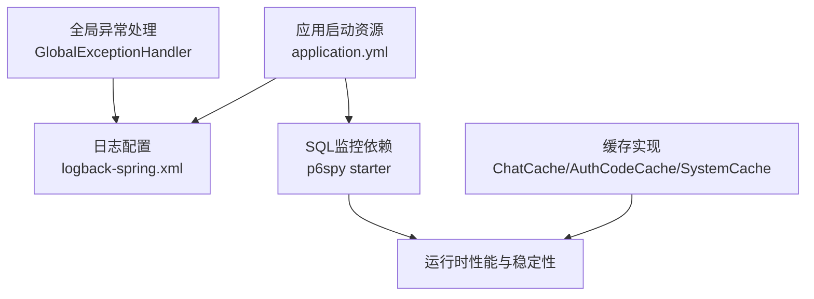
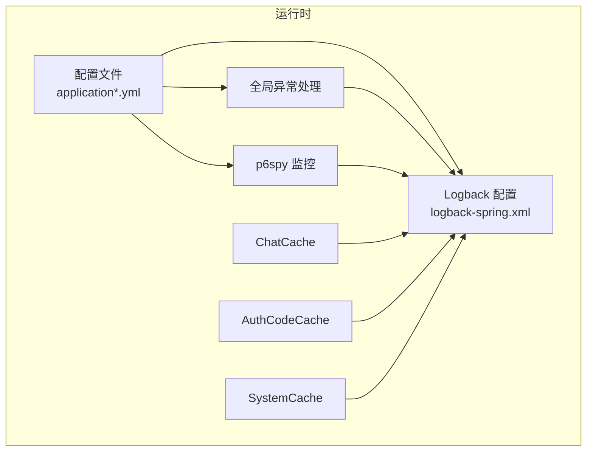
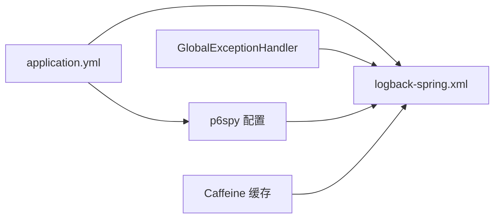

# 监控与日志

<cite>
**本文引用的文件**
- [logback-spring.xml](file://maxkb4j-start/src/main/resources/logback-spring.xml)
- [application.yml](file://maxkb4j-start/src/main/resources/application.yml)
- [application-dev.yml](file://maxkb4j-start/src/main/resources/application-dev.yml)
- [application-prod.yml](file://maxkb4j-start/src/main/resources/application-prod.yml)
- [GlobalExceptionHandler.java](file://maxkb4j-common/src/main/java/com/maxkb4j/common/handler/GlobalExceptionHandler.java)
- [p6spy 依赖声明（聚合根 pom.xml）](file://pom.xml)
- [p6spy 依赖声明（service 层 pom.xml）](file://maxkb4j-service/pom.xml)
- [Caffeine 缓存配置（ChatCache）](file://maxkb4j-common/src/main/java/com/maxkb4j/common/cache/ChatCache.java)
- [Caffeine 缓存配置（AuthCodeCache）](file://maxkb4j-common/src/main/java/com/maxkb4j/common/cache/AuthCodeCache.java)
- [系统缓存（SystemCache）](file://maxkb4j-common/src/main/java/com/maxkb4j/common/cache/SystemCache.java)
</cite>

## 目录
1. [简介](#简介)
2. [项目结构](#项目结构)
3. [核心组件](#核心组件)
4. [架构总览](#架构总览)
5. [组件详解](#组件详解)
6. [依赖关系分析](#依赖关系分析)
7. [性能考量](#性能考量)
8. [故障排查指南](#故障排查指南)
9. [结论](#结论)
10. [附录](#附录)

## 简介
本指南面向 MaxKB4j 的运维与开发团队，聚焦于应用日志配置、性能监控指标、健康检查与告警、日志分析与轮转、以及常见问题诊断与性能瓶颈定位。内容基于仓库中现有的日志配置、SQL 监控依赖、全局异常处理与缓存实现，帮助快速搭建稳定可靠的监控与日志体系。

## 项目结构
围绕监控与日志的关键位置如下：
- 日志配置：maxkb4j-start 模块下的 logback-spring.xml
- 应用配置：application.yml、application-dev.yml、application-prod.yml
- 全局异常处理：maxkb4j-common 下的 GlobalExceptionHandler
- SQL 监控：pom.xml 中引入的 p6spy starter
- 缓存与性能：maxkb4j-common 下的 Caffeine 缓存实现

图表来源
- [application.yml:1-69](file://maxkb4j-start/src/main/resources/application.yml#L1-L69)
- [logback-spring.xml:1-157](file://maxkb4j-start/src/main/resources/logback-spring.xml#L1-L157)
- [p6spy 依赖声明（聚合根 pom.xml）:164-169](file://pom.xml#L164-L169)
- [GlobalExceptionHandler.java:1-168](file://maxkb4j-common/src/main/java/com/maxkb4j/common/handler/GlobalExceptionHandler.java#L1-L168)
- [Caffeine 缓存配置（ChatCache）:1-30](file://maxkb4j-common/src/main/java/com/maxkb4j/common/cache/ChatCache.java#L1-L30)
- [Caffeine 缓存配置（AuthCodeCache）:1-27](file://maxkb4j-common/src/main/java/com/maxkb4j/common/cache/AuthCodeCache.java#L1-L27)
- [系统缓存（SystemCache）:1-35](file://maxkb4j-common/src/main/java/com/maxkb4j/common/cache/SystemCache.java#L1-L35)

章节来源
- [application.yml:1-69](file://maxkb4j-start/src/main/resources/application.yml#L1-L69)
- [logback-spring.xml:1-157](file://maxkb4j-start/src/main/resources/logback-spring.xml#L1-L157)
- [p6spy 依赖声明（聚合根 pom.xml）:164-169](file://pom.xml#L164-L169)
- [GlobalExceptionHandler.java:1-168](file://maxkb4j-common/src/main/java/com/maxkb4j/common/handler/GlobalExceptionHandler.java#L1-L168)
- [Caffeine 缓存配置（ChatCache）:1-30](file://maxkb4j-common/src/main/java/com/maxkb4j/common/cache/ChatCache.java#L1-L30)
- [Caffeine 缓存配置（AuthCodeCache）:1-27](file://maxkb4j-common/src/main/java/com/maxkb4j/common/cache/AuthCodeCache.java#L1-L27)
- [系统缓存（SystemCache）:1-35](file://maxkb4j-common/src/main/java/com/maxkb4j/common/cache/SystemCache.java#L1-L35)

## 核心组件
- 日志系统：基于 Logback 的多 appender 配置，支持按级别分文件输出、异步落盘、控制台彩色输出、按日期与大小滚动、阈值过滤与排除标记。
- SQL 监控：集成 p6spy，可输出 SQL 与执行耗时，便于数据库性能分析与慢查询定位。
- 全局异常处理：集中捕获各类异常，统一返回与日志记录，减少业务侧重复处理。
- 缓存层：采用 Caffeine 实现高频数据缓存，降低数据库压力，提升响应速度。
- 配置文件：application.yml 提供基础运行参数；application-dev.yml 与 application-prod.yml 提供不同环境的数据源与 MongoDB 连接配置。

章节来源
- [logback-spring.xml:1-157](file://maxkb4j-start/src/main/resources/logback-spring.xml#L1-L157)
- [application.yml:1-69](file://maxkb4j-start/src/main/resources/application.yml#L1-L69)
- [application-dev.yml:1-11](file://maxkb4j-start/src/main/resources/application-dev.yml#L1-L11)
- [application-prod.yml:1-9](file://maxkb4j-start/src/main/resources/application-prod.yml#L1-L9)
- [p6spy 依赖声明（聚合根 pom.xml）:164-169](file://pom.xml#L164-L169)
- [p6spy 依赖声明（service 层 pom.xml）:68-71](file://maxkb4j-service/pom.xml#L68-L71)
- [GlobalExceptionHandler.java:1-168](file://maxkb4j-common/src/main/java/com/maxkb4j/common/handler/GlobalExceptionHandler.java#L1-L168)
- [Caffeine 缓存配置（ChatCache）:1-30](file://maxkb4j-common/src/main/java/com/maxkb4j/common/cache/ChatCache.java#L1-L30)
- [Caffeine 缓存配置（AuthCodeCache）:1-27](file://maxkb4j-common/src/main/java/com/maxkb4j/common/cache/AuthCodeCache.java#L1-L27)
- [系统缓存（SystemCache）:1-35](file://maxkb4j-common/src/main/java/com/maxkb4j/common/cache/SystemCache.java#L1-L35)

## 架构总览
下图展示了日志、SQL 监控、异常处理与缓存之间的交互关系，以及配置文件对运行时行为的影响。

图表来源
- [application.yml:1-69](file://maxkb4j-start/src/main/resources/application.yml#L1-L69)
- [application-dev.yml:1-11](file://maxkb4j-start/src/main/resources/application-dev.yml#L1-L11)
- [application-prod.yml:1-9](file://maxkb4j-start/src/main/resources/application-prod.yml#L1-L9)
- [logback-spring.xml:1-157](file://maxkb4j-start/src/main/resources/logback-spring.xml#L1-L157)
- [p6spy 依赖声明（聚合根 pom.xml）:164-169](file://pom.xml#L164-L169)
- [GlobalExceptionHandler.java:1-168](file://maxkb4j-common/src/main/java/com/maxkb4j/common/handler/GlobalExceptionHandler.java#L1-L168)
- [Caffeine 缓存配置（ChatCache）:1-30](file://maxkb4j-common/src/main/java/com/maxkb4j/common/cache/ChatCache.java#L1-L30)
- [Caffeine 缓存配置（AuthCodeCache）:1-27](file://maxkb4j-common/src/main/java/com/maxkb4j/common/cache/AuthCodeCache.java#L1-L27)
- [系统缓存（SystemCache）:1-35](file://maxkb4j-common/src/main/java/com/maxkb4j/common/cache/SystemCache.java#L1-L35)

## 组件详解

### 日志配置与输出策略
- 日志路径与应用名：通过属性统一管理日志目录与应用标识，便于容器化部署与日志聚合。
- 输出格式：定义了控制台彩色输出与文件统一格式，包含时间戳、线程、TraceId、Logger 名称、日志级别与消息。
- Appender 分级：
  - 控制台：彩色输出，便于本地开发调试。
  - 文件：按 INFO/WARN/ERROR 分别输出到独立文件，避免交叉污染。
  - 异步：INFO/WARN/ERROR 各自独立 AsyncAppender，队列大小与丢弃阈值可调，兼顾吞吐与可靠性。
- 过滤策略：
  - INFO 级别使用 ThresholdFilter 并通过 EvaluatorFilter 排除特定标记日志，避免重复或噪音落入 info 文件。
  - WARN/ERROR 使用 LevelFilter 精准拦截，确保告警类日志不被遗漏。
- Profile 化配置：dev/prod 默认 root 级别为 INFO，并同时输出到控制台与异步文件，便于容器环境查看与持久化存储。

建议实践
- 在生产环境开启容器标准输出重定向至 stdout/stderr，结合异步文件 Appender，实现“控制台+文件”双通道。
- 为关键业务模块增加 Marker 或 Logger 级别微调，配合 EvaluatorFilter 实现精细化分流。

章节来源
- [logback-spring.xml:1-157](file://maxkb4j-start/src/main/resources/logback-spring.xml#L1-L157)

### SQL 监控与数据库性能
- 依赖引入：在聚合根与 service 层的 pom.xml 中引入 p6spy starter，启用 SQL 与执行耗时的输出能力。
- 配置开关：application.yml 中提供 decorator.datasource.p6spy.enable-logging 与 log-format 字段，可按需开启与调整输出格式。
- 使用建议：
  - 开发/测试环境建议开启，定位慢查询与异常 SQL。
  - 生产环境谨慎开启，避免过多日志影响性能；可通过日志级别与过滤器限制输出范围。

章节来源
- [p6spy 依赖声明（聚合根 pom.xml）:164-169](file://pom.xml#L164-L169)
- [p6spy 依赖声明（service 层 pom.xml）:68-71](file://maxkb4j-service/pom.xml#L68-L71)
- [application.yml:60-66](file://maxkb4j-start/src/main/resources/application.yml#L60-L66)

### 全局异常处理与可观测性
- 统一异常捕获：覆盖认证、鉴权、参数、业务规则、速率限制、文件上传限制等常见异常类型，统一返回结构与日志记录。
- HTTP 状态码映射：针对不同异常设置合理状态码，便于前端与网关层识别与处理。
- 客户端断连处理：对异步请求不可用异常进行静默记录，避免干扰业务链路。
- 建议：
  - 结合 TraceId 与全局异常处理，形成端到端调用链日志，便于问题复盘。
  - 对外部服务异常（如 RateLimitException）进行分类统计，辅助限流策略优化。

章节来源
- [GlobalExceptionHandler.java:1-168](file://maxkb4j-common/src/main/java/com/maxkb4j/common/handler/GlobalExceptionHandler.java#L1-L168)

### 缓存与性能基线
- ChatCache：对话上下文缓存，设置较大容量与较长过期时间，降低检索与构造成本。
- AuthCodeCache：验证码缓存，短 TTL，防止滥用与资源浪费。
- SystemCache：系统级配置缓存，按类型索引，减少频繁读取配置带来的开销。
- 建议：
  - 结合缓存命中率与失效策略，持续评估容量与过期时间。
  - 对热点数据可考虑本地缓存与分布式缓存双写，提升可用性。

章节来源
- [Caffeine 缓存配置（ChatCache）:1-30](file://maxkb4j-common/src/main/java/com/maxkb4j/common/cache/ChatCache.java#L1-L30)
- [Caffeine 缓存配置（AuthCodeCache）:1-27](file://maxkb4j-common/src/main/java/com/maxkb4j/common/cache/AuthCodeCache.java#L1-L27)
- [系统缓存（SystemCache）:1-35](file://maxkb4j-common/src/main/java/com/maxkb4j/common/cache/SystemCache.java#L1-L35)

### 健康检查接口与可用性度量
- 当前仓库未发现显式的健康检查端点或 Actuator 暴露配置。建议在生产环境中补充：
  - 健康检查：/actuator/health（依赖 spring-boot-starter-actuator）
  - 度量指标：/actuator/metrics（Prometheus 导出）
  - 日志采集：stdout + 文件双通道，结合外部日志平台（如 ELK、Loki）进行聚合与告警。
- 配置要点：
  - 仅暴露内网地址或受保护路径，避免泄露敏感信息。
  - 将健康检查与数据库、缓存、外部依赖的探针组合，形成多维可用性视图。

[本节为概念性建议，不直接分析具体文件，故不附“章节来源”]

## 依赖关系分析
- 日志与配置：application.yml 决定运行参数，logback-spring.xml 决定日志输出与滚动策略。
- SQL 监控：p6spy 作为数据源增强，与日志系统协同输出 SQL 与耗时。
- 异常处理：全局异常处理器贯穿各层，统一错误语义与日志记录。
- 缓存：多处缓存组件降低数据库与外部服务压力，提升整体吞吐。

图表来源
- [application.yml:1-69](file://maxkb4j-start/src/main/resources/application.yml#L1-L69)
- [logback-spring.xml:1-157](file://maxkb4j-start/src/main/resources/logback-spring.xml#L1-L157)
- [p6spy 依赖声明（聚合根 pom.xml）:164-169](file://pom.xml#L164-L169)
- [GlobalExceptionHandler.java:1-168](file://maxkb4j-common/src/main/java/com/maxkb4j/common/handler/GlobalExceptionHandler.java#L1-L168)
- [Caffeine 缓存配置（ChatCache）:1-30](file://maxkb4j-common/src/main/java/com/maxkb4j/common/cache/ChatCache.java#L1-L30)

章节来源
- [application.yml:1-69](file://maxkb4j-start/src/main/resources/application.yml#L1-L69)
- [logback-spring.xml:1-157](file://maxkb4j-start/src/main/resources/logback-spring.xml#L1-L157)
- [p6spy 依赖声明（聚合根 pom.xml）:164-169](file://pom.xml#L164-L169)
- [GlobalExceptionHandler.java:1-168](file://maxkb4j-common/src/main/java/com/maxkb4j/common/handler/GlobalExceptionHandler.java#L1-L168)
- [Caffeine 缓存配置（ChatCache）:1-30](file://maxkb4j-common/src/main/java/com/maxkb4j/common/cache/ChatCache.java#L1-L30)

## 性能考量
- 日志性能
  - 异步 Appender：INFO/WARN/ERROR 分别异步落盘，降低同步阻塞风险。
  - 队列与丢弃：根据峰值流量调整 queueSize 与 discardingThreshold，避免内存暴涨。
  - 过滤与排除：通过 ThresholdFilter 与 EvaluatorFilter 减少无关日志进入文件。
- SQL 性能
  - p6spy 输出 SQL 与执行时间，结合慢查询日志定位热点与异常 SQL。
  - 建议对高频查询建立索引、拆分复杂查询、使用连接池参数优化并发。
- 缓存策略
  - Caffeine 容量与过期时间应结合业务峰值与数据生命周期动态调整。
  - 对热点数据可考虑本地缓存与分布式缓存双写，提升可用性与一致性。

[本节提供通用指导，不直接分析具体文件，故不附“章节来源”]

## 故障排查指南
- 常见问题定位思路
  - 日志缺失：确认 profile 是否正确加载、root 级别是否为 INFO、异步 Appender 是否启用。
  - SQL 性能异常：开启 p6spy 输出，筛选高耗时 SQL，结合数据库执行计划分析。
  - 异常风暴：检查 GlobalExceptionHandler 返回码与日志级别，定位高频异常类型并优化上游。
  - 缓存抖动：观察缓存命中率与失效分布，调整容量与过期策略。
- 快速验证清单
  - 确认 application.yml 中 p6spy 配置项存在且未被覆盖。
  - 检查 logback-spring.xml 中 appender 与 logger 级别配置。
  - 观察 INFO/WARN/ERROR 文件是否存在滚动与大小限制。
  - 对关键接口发起压测，观察日志与 SQL 输出是否符合预期。

章节来源
- [logback-spring.xml:1-157](file://maxkb4j-start/src/main/resources/logback-spring.xml#L1-L157)
- [application.yml:60-66](file://maxkb4j-start/src/main/resources/application.yml#L60-L66)
- [GlobalExceptionHandler.java:1-168](file://maxkb4j-common/src/main/java/com/maxkb4j/common/handler/GlobalExceptionHandler.java#L1-L168)
- [Caffeine 缓存配置（ChatCache）:1-30](file://maxkb4j-common/src/main/java/com/maxkb4j/common/cache/ChatCache.java#L1-L30)
- [Caffeine 缓存配置（AuthCodeCache）:1-27](file://maxkb4j-common/src/main/java/com/maxkb4j/common/cache/AuthCodeCache.java#L1-L27)

## 结论
MaxKB4j 已具备完善的日志与 SQL 监控基础：Logback 多通道输出、异步落盘、分级过滤；p6spy 数据源增强；全局异常处理统一出口；多级缓存降低延迟。建议在生产环境补充健康检查与指标导出、完善日志聚合与告警策略，并持续以日志与 SQL 输出为依据迭代性能与稳定性。

[本节为总结性内容，不直接分析具体文件，故不附“章节来源”]

## 附录

### 日志配置要点速查
- 日志路径与应用名：通过属性集中管理，便于容器化与日志聚合。
- 输出格式：包含时间、线程、TraceId、Logger、级别与消息。
- Appender：控制台彩色输出 + INFO/WARN/ERROR 分文件 + 异步落盘。
- 过滤：ThresholdFilter + EvaluatorFilter 排除噪音；LevelFilter 精准拦截。
- Profile：dev/prod 默认 INFO，同时输出控制台与异步文件。

章节来源
- [logback-spring.xml:1-157](file://maxkb4j-start/src/main/resources/logback-spring.xml#L1-L157)

### SQL 监控启用步骤
- 在聚合根或 service 层的 pom.xml 中引入 p6spy starter。
- 在 application.yml 中配置 decorator.datasource.p6spy.enable-logging 与 log-format。
- 开发/测试环境建议开启，生产环境谨慎开启并限制输出范围。

章节来源
- [p6spy 依赖声明（聚合根 pom.xml）:164-169](file://pom.xml#L164-L169)
- [p6spy 依赖声明（service 层 pom.xml）:68-71](file://maxkb4j-service/pom.xml#L68-L71)
- [application.yml:60-66](file://maxkb4j-start/src/main/resources/application.yml#L60-L66)

### 健康检查与指标导出（建议）
- 引入 spring-boot-starter-actuator，暴露 /actuator/health 与 /actuator/metrics。
- 结合 Prometheus/Grafana 或云监控平台进行可视化与告警。
- 仅暴露内网地址或受保护路径，避免泄露。

[本节为概念性建议，不直接分析具体文件，故不附“章节来源”]

### 日志轮转与聚合建议
- 轮转策略：按日期与文件大小滚动，设置合理的保留天数与总量上限。
- 聚合方案：容器环境输出到 stdout/stderr，结合外部日志平台（ELK/Loki/Promtail）统一采集与检索。
- 告警规则：基于 ERROR/WARN 文件与 SQL 输出建立阈值告警，结合 TraceId 关联全链路日志。

[本节为概念性建议，不直接分析具体文件，故不附“章节来源”]