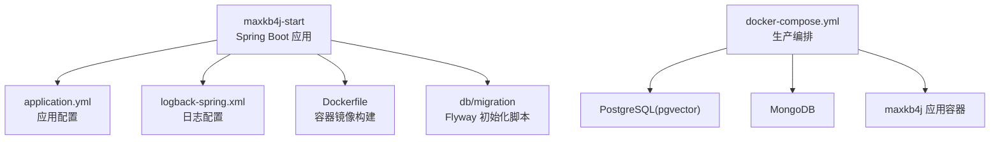
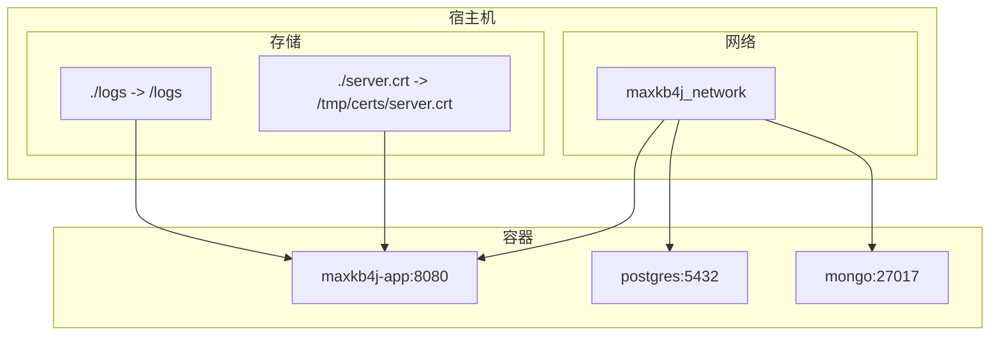
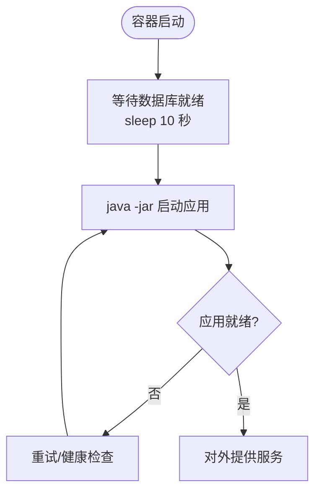
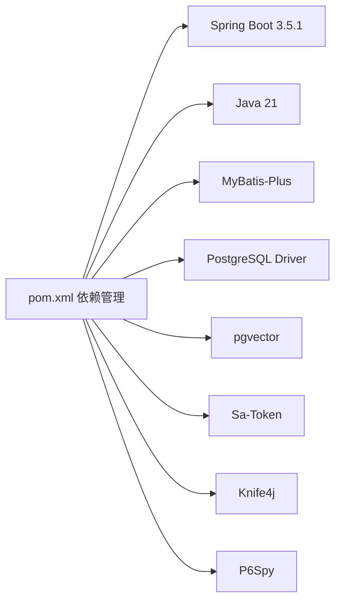

# 部署与运维

<cite>
**本文引用的文件**
- [README_CN.md](file://README_CN.md)
- [README.md](file://README.md)
- [docker-compose.yml](file://docker-compose.yml)
- [docker-compose.dev.yml](file://docker-compose.dev.yml)
- [Dockerfile](file://maxkb4j-start/Dockerfile)
- [application.yml](file://maxkb4j-start/src/main/resources/application.yml)
- [application-dev.yml](file://maxkb4j-start/src/main/resources/application-dev.yml)
- [application-prod.yml](file://maxkb4j-start/src/main/resources/application-prod.yml)
- [logback-spring.xml](file://maxkb4j-start/src/main/resources/logback-spring.xml)
- [MaxKb4jApplication.java](file://maxkb4j-start/src/main/java/com/maxkb4j/start/MaxKb4jApplication.java)
- [pom.xml](file://pom.xml)
- [V1__init_tables.sql](file://maxkb4j-start/src/main/resources/db/migration/V1__init_tables.sql)
- [V2__add_table.sql](file://maxkb4j-start/src/main/resources/db/migration/V2__add_table.sql)
- [V3__add_trigger.sql](file://maxkb4j-start/src/main/resources/db/migration/V3__add_trigger.sql)
- [V4__update_table.sql](file://maxkb4j-start/src/main/resources/db/migration/V4__update_table.sql)
- [V5__add_table.sql](file://maxkb4j-start/src/main/resources/db/migration/V5__add_table.sql)
</cite>

## 目录
1. [简介](#简介)
2. [项目结构](#项目结构)
3. [核心组件](#核心组件)
4. [架构总览](#架构总览)
5. [详细组件分析](#详细组件分析)
6. [依赖分析](#依赖分析)
7. [性能考量](#性能考量)
8. [故障排查指南](#故障排查指南)
9. [结论](#结论)
10. [附录](#附录)

## 简介
本指南面向运维团队，提供从单机部署到生产环境的完整解决方案，覆盖Docker部署最佳实践、容器编排、网络与存储配置、Kubernetes与云平台部署思路、性能监控与日志采集、健康检查与故障恢复、数据库备份与版本升级、容量规划、安全加固与性能调优等。文档以仓库中的配置与脚本为依据，确保可落地、可验证。

## 项目结构
MaxKB4j采用多模块Maven工程组织，核心启动模块位于maxkb4j-start，包含Spring Boot应用入口、配置文件、日志配置以及Dockerfile。数据库迁移脚本位于resources/db/migration目录，配合Flyway自动初始化与演进。

图表来源
- [application.yml:1-69](file://maxkb4j-start/src/main/resources/application.yml#L1-L69)
- [logback-spring.xml:1-157](file://maxkb4j-start/src/main/resources/logback-spring.xml#L1-L157)
- [Dockerfile:1-27](file://maxkb4j-start/Dockerfile#L1-L27)
- [docker-compose.yml:1-58](file://docker-compose.yml#L1-L58)
- [V1__init_tables.sql](file://maxkb4j-start/src/main/resources/db/migration/V1__init_tables.sql)

章节来源
- [README_CN.md:50-98](file://README_CN.md#L50-L98)
- [docker-compose.yml:1-58](file://docker-compose.yml#L1-L58)
- [maxkb4j-start/Dockerfile:1-27](file://maxkb4j-start/Dockerfile#L1-L27)
- [application.yml:1-69](file://maxkb4j-start/src/main/resources/application.yml#L1-L69)
- [logback-spring.xml:1-157](file://maxkb4j-start/src/main/resources/logback-spring.xml#L1-L157)

## 核心组件
- 应用容器与镜像
  - 基础镜像为Amazon Corretto 21，暴露8080端口，使用UTF-8编码，ENTRYPOINT通过sh -c延时启动以等待数据库就绪。
- 配置体系
  - application.yml提供默认配置（端口、缓存、Flyway、Sa-Token、multipart大小、系统默认账户等）。
  - application-dev.yml与application-prod.yml分别提供开发与生产环境的数据库连接URI。
  - MaxKb4jApplication在未显式激活profile时默认使用dev。
- 日志系统
  - logback-spring.xml支持控制台与异步滚动文件输出，按INFO/WARN/ERROR分级落盘，并对关键包设置日志级别。
- 数据库与迁移
  - Flyway启用，迁移脚本位于db/migration，包含初始化表、触发器、更新等版本脚本。

章节来源
- [Dockerfile:1-27](file://maxkb4j-start/Dockerfile#L1-L27)
- [application.yml:1-69](file://maxkb4j-start/src/main/resources/application.yml#L1-L69)
- [application-dev.yml:1-11](file://maxkb4j-start/src/main/resources/application-dev.yml#L1-L11)
- [application-prod.yml:1-9](file://maxkb4j-start/src/main/resources/application-prod.yml#L1-L9)
- [MaxKb4jApplication.java:1-23](file://maxkb4j-start/src/main/java/com/maxkb4j/start/MaxKb4jApplication.java#L1-L23)
- [logback-spring.xml:1-157](file://maxkb4j-start/src/main/resources/logback-spring.xml#L1-L157)
- [pom.xml:1-200](file://pom.xml#L1-L200)

## 架构总览
MaxKB4j生产环境典型拓扑：应用容器通过Docker网络与PostgreSQL(pgvector)、MongoDB互通，应用容器挂载日志目录与证书文件，容器重启策略为always，日志轮转策略在compose中配置。

图表来源
- [docker-compose.yml:27-57](file://docker-compose.yml#L27-L57)

章节来源
- [docker-compose.yml:1-58](file://docker-compose.yml#L1-L58)

## 详细组件分析

### Docker 部署最佳实践
- 镜像构建
  - 使用amazoncorretto:21作为基础镜像，设置时区，复制JAR至/opt/running，EXPOSE 8080，CMD启动。
- 容器编排
  - compose定义三服务：postgres、mongo、maxkb4j，统一加入maxkb4j_network，maxkb4j依赖数据库启动。
  - 日志轮转：容器侧限制单文件最大30MB，最多3个文件。
  - 环境变量：通过环境变量注入数据库连接URL与凭据，避免硬编码。
  - 存储挂载：挂载/logs用于持久化日志，挂载证书文件到容器内指定路径。
  - 启动延时：通过entrypoint在启动前sleep 10秒，降低应用启动与数据库连接抖动。
- 端口映射
  - 将容器8080映射到宿主机8080，便于访问Web界面与API。

图表来源
- [docker-compose.yml:52-56](file://docker-compose.yml#L52-L56)
- [Dockerfile:24-26](file://maxkb4j-start/Dockerfile#L24-L26)

章节来源
- [Dockerfile:1-27](file://maxkb4j-start/Dockerfile#L1-L27)
- [docker-compose.yml:1-58](file://docker-compose.yml#L1-L58)

### Kubernetes 部署方案（概念性指导）
- 资源对象建议
  - ConfigMap：存放数据库连接字符串与系统参数（建议通过环境变量注入）。
  - Secret：存放数据库用户名/密码、JWT密钥、证书文件等敏感信息。
  - Deployment：定义副本数、探针、资源限制与优雅退出策略。
  - Service：ClusterIP或LoadBalancer暴露8080端口。
  - PersistentVolumeClaim：为PostgreSQL与MongoDB的数据卷提供持久化。
  - Ingress：暴露Web与API访问。
- 健康检查
  - livenessProbe/readinessProbe：基于HTTP GET /actuator/health或应用内部健康端点。
- 滚动升级
  - 设置maxUnavailable与maxSurge，结合ReadinessGate确保零停机。
- 网络与存储
  - Pod与数据库在同一命名空间/网络；数据库PVC按需扩容。
- 安全
  - 使用只读RootFS、Drop不必要的Linux Capabilities、Secret只以文件形式挂载。

（本节为概念性说明，不直接分析具体文件）

### 云平台部署指南（概念性指导）
- 阿里云/腾讯云等托管数据库：优先使用云原生PostgreSQL与MongoDB实例，减少运维负担。
- 对象存储与CDN：静态资源与上传文件可接入云存储，应用通过SDK访问。
- 容器服务：结合ACK/ECS/Kubernetes服务，实现弹性扩缩容与高可用。
- 安全合规：启用WAF、DDoS防护、审计日志与合规扫描。

（本节为概念性说明，不直接分析具体文件）

### 性能监控与日志采集
- 日志配置
  - 控制台输出与异步文件输出分离，INFO/WARN/ERROR三级日志分别落盘，单文件最大100MB，保留周期与总量上限合理配置。
  - 关键包日志级别在logback中集中控制，避免噪声干扰。
- 监控指标
  - JVM层面：堆内存、GC、线程数、类加载数。
  - 应用层面：请求QPS/耗时、错误率、数据库连接池状态、缓存命中率。
  - 外部依赖：数据库与MongoDB延迟、连接数、慢查询。
- 采集与展示
  - Prometheus + Grafana + Loki/ELK组合，Prometheus抓取Spring Boot Actuator指标，Loki采集日志，Grafana统一展示。

章节来源
- [logback-spring.xml:1-157](file://maxkb4j-start/src/main/resources/logback-spring.xml#L1-L157)
- [application.yml:1-69](file://maxkb4j-start/src/main/resources/application.yml#L1-L69)

### 健康检查机制
- 应用健康端点
  - 建议启用Spring Boot Actuator，暴露/actuator/health用于K8s探针与外部监控系统。
- 数据库健康
  - 在启动阶段增加数据库连通性探测，compose中通过entrypoint延时启动可缓解瞬时失败。
- 文件系统健康
  - 挂载/logs目录具备写权限，定期检查磁盘空间与日志轮转策略。

章节来源
- [docker-compose.yml:52-56](file://docker-compose.yml#L52-L56)
- [application.yml:1-69](file://maxkb4j-start/src/main/resources/application.yml#L1-L69)

### 故障恢复策略
- 数据库故障
  - PostgreSQL/MongoDB使用独立容器/云托管实例，配合PVC与备份策略；应用侧使用连接池超时与重试。
- 应用崩溃
  - restart: always，结合健康检查与自动重启；必要时引入PodDisruptionBudget保障高可用。
- 配置漂移
  - 使用ConfigMap/Secret管理配置，避免直接修改镜像；版本化发布与回滚。
- 网络分区
  - 多副本部署，跨可用区分布，K8s亲和性与反亲和性策略保证流量均衡。

（本节为通用运维策略，不直接分析具体文件）

### 数据库备份与恢复
- 备份策略
  - PostgreSQL：逻辑备份（如pg_dump）与物理备份结合，定期校验归档日志完整性。
  - MongoDB：快照或逻辑备份，验证增量备份链路。
- 恢复演练
  - 定期进行RTO/RPO演练，确保备份可恢复性与时间窗口满足业务要求。
- 迁移与升级
  - 使用Flyway进行数据库版本演进，升级前先在测试环境验证迁移脚本。

章节来源
- [pom.xml:132-163](file://pom.xml#L132-L163)
- [V1__init_tables.sql](file://maxkb4j-start/src/main/resources/db/migration/V1__init_tables.sql)
- [V2__add_table.sql](file://maxkb4j-start/src/main/resources/db/migration/V2__add_table.sql)
- [V3__add_trigger.sql](file://maxkb4j-start/src/main/resources/db/migration/V3__add_trigger.sql)
- [V4__update_table.sql](file://maxkb4j-start/src/main/resources/db/migration/V4__update_table.sql)
- [V5__add_table.sql](file://maxkb4j-start/src/main/resources/db/migration/V5__add_table.sql)

### 版本升级与容量规划
- 版本升级
  - 通过镜像版本标签管理，遵循语义化版本；升级前评估依赖版本兼容性（如pgvector与PostgreSQL版本）。
  - 使用灰度发布策略，逐步扩大流量，结合监控指标观察稳定性。
- 容量规划
  - CPU/内存：根据QPS与并发模型压测结果，预留20%-30%缓冲；数据库连接池大小与pgvector向量索引规模共同决定资源占用。
  - 存储：日志与数据卷容量按日志滚动策略与业务增长预测评估；数据库备份保留周期计入总容量。
  - 网络：跨可用区部署时考虑带宽与延迟；API网关与CDN优化静态资源访问。

章节来源
- [pom.xml:1-200](file://pom.xml#L1-L200)
- [docker-compose.yml:1-58](file://docker-compose.yml#L1-L58)

### 安全加固建议
- 配置安全
  - JWT密钥通过环境变量注入，避免硬编码；Sa-Token相关配置在生产环境严格校验。
  - 上传文件大小限制已在application.yml中配置，防止滥用。
- 网络安全
  - 仅暴露必要端口；使用防火墙/安全组限制访问；TLS证书挂载到容器内指定路径。
- 认证与授权
  - 使用Sa-Token进行会话管理，合理设置token有效期与并发策略；默认管理员账户在首次启动后尽快修改密码。

章节来源
- [application.yml:37-69](file://maxkb4j-start/src/main/resources/application.yml#L37-L69)
- [docker-compose.yml:44-51](file://docker-compose.yml#L44-L51)

### 性能调优参数
- JVM与容器
  - 容器内存限制与JVM堆大小匹配，避免频繁GC；根据业务峰值调整线程池与连接池大小。
- 数据库
  - PostgreSQL连接池参数、共享内存与work_mem；pgvector向量维度与索引类型影响查询性能。
- 缓存
  - Caffeine缓存容量与过期策略，结合热点数据特征优化命中率。
- 日志
  - 异步日志队列大小与丢弃阈值，避免日志成为性能瓶颈。

章节来源
- [application.yml:19-25](file://maxkb4j-start/src/main/resources/application.yml#L19-L25)
- [logback-spring.xml:87-109](file://maxkb4j-start/src/main/resources/logback-spring.xml#L87-L109)

## 依赖分析
- 技术栈与版本
  - Spring Boot 3.5.1、Java 21、pgvector、MyBatis-Plus、Sa-Token、Knife4j、P6Spy等。
- 数据库与迁移
  - PostgreSQL驱动与pgvector依赖，Flyway启用并使用classpath:db/migration作为迁移位置。
- Web容器
  - Undertow替代Tomcat，更适合高并发场景。

图表来源
- [pom.xml:64-180](file://pom.xml#L64-L180)

章节来源
- [pom.xml:1-200](file://pom.xml#L1-L200)

## 性能考量
- 并发与响应式
  - 基于Spring Boot 3与虚拟线程的并发模型，结合响应式编程与异步I/O，适合高并发场景。
- 缓存与索引
  - 多级缓存与pgvector向量索引，结合合理的分词与切片策略，提升检索与生成效率。
- 存储与IO
  - 日志滚动与磁盘IO优化，数据库与文件系统IO隔离，避免相互争抢。

（本节为通用性能建议，不直接分析具体文件）

## 故障排查指南
- 启动失败
  - 检查数据库连接参数与网络连通性；确认compose中entrypoint延时是否足够；查看容器日志与宿主机logs目录。
- 数据库初始化异常
  - 查看Flyway迁移脚本执行情况，确认数据库扩展（如pgvector）已正确安装。
- 日志过多或磁盘爆满
  - 调整logback滚动策略与保留周期；检查应用日志级别；清理历史日志。
- 权限与认证问题
  - Sa-Token JWT密钥与token有效期配置；默认管理员密码修改与强口令策略。

章节来源
- [docker-compose.yml:44-56](file://docker-compose.yml#L44-L56)
- [logback-spring.xml:24-85](file://maxkb4j-start/src/main/resources/logback-spring.xml#L24-L85)
- [application.yml:37-69](file://maxkb4j-start/src/main/resources/application.yml#L37-L69)

## 结论
本指南基于仓库现有配置与脚本，给出了从单机到生产的部署与运维实践建议。建议在生产环境中结合Kubernetes与云平台能力，完善监控、日志、备份与安全策略，持续进行容量规划与性能优化，确保系统稳定、可观测、可恢复。

## 附录
- 快速参考
  - 本地启动：java -jar maxkb4j-start.jar
  - Docker部署：docker run -p 8080:8080 镜像名
  - Docker Compose：docker-compose up -d
  - Web界面：http://localhost:8080/admin/login（默认账号/密码见README）

章节来源
- [README_CN.md:50-98](file://README_CN.md#L50-L98)
- [README.md:49-99](file://README.md#L49-L99)