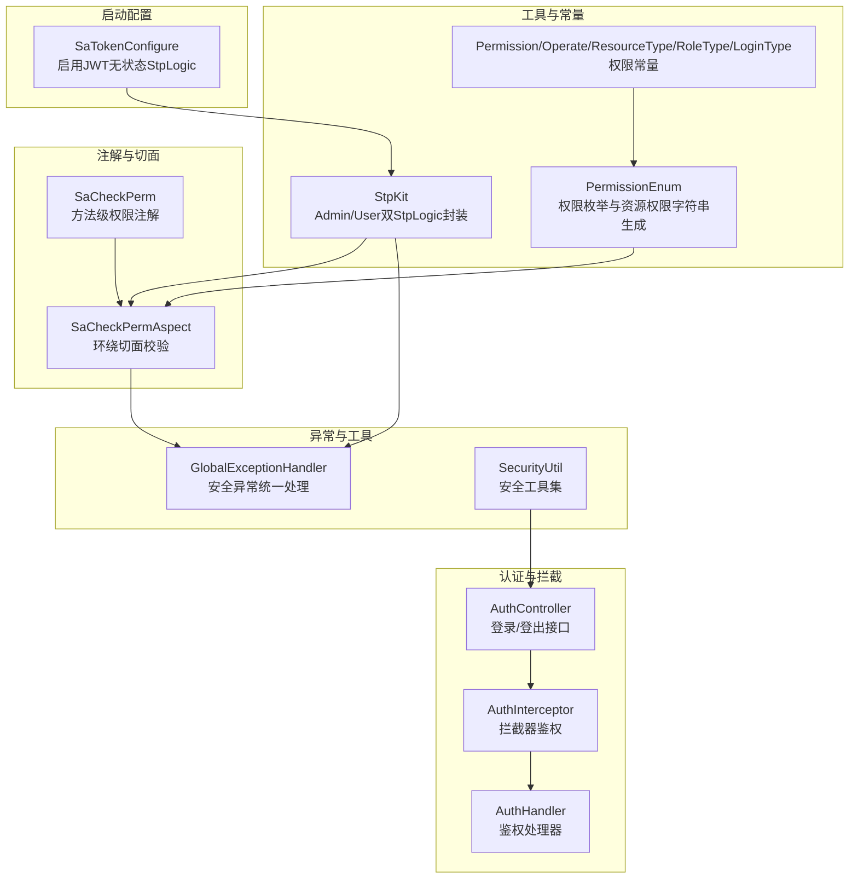
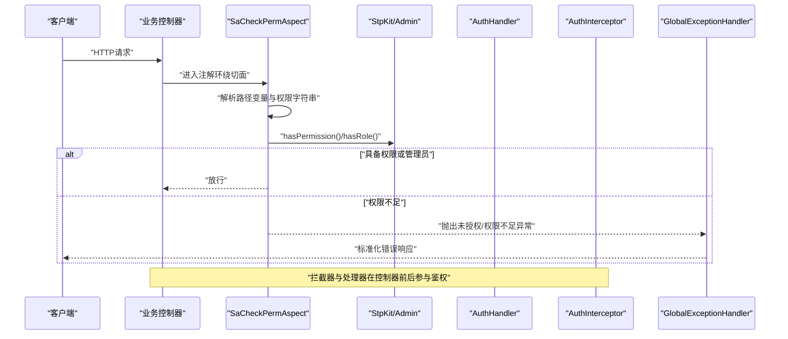
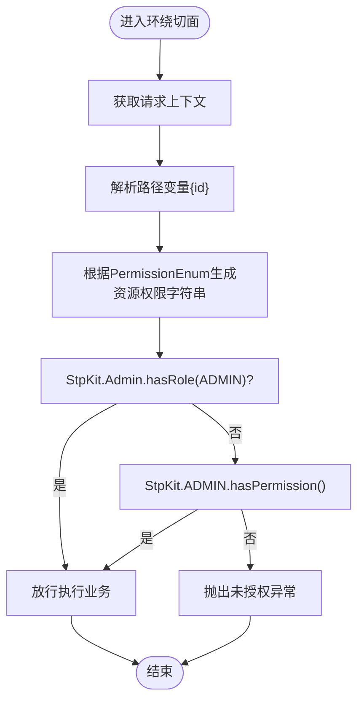
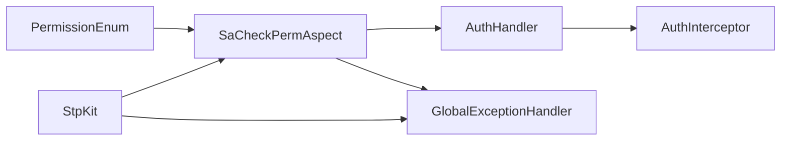

# 安全配置

<cite>
**本文引用的文件**   
- [SaTokenConfigure.java](file://maxkb4j-start/src/main/java/com/maxkb4j/start/config/SaTokenConfigure.java)
- [StpKit.java](file://maxkb4j-common/src/main/java/com/maxkb4j/common/util/StpKit.java)
- [SaCheckPerm.java](file://maxkb4j-common/src/main/java/com/maxkb4j/common/annotation/SaCheckPerm.java)
- [SaCheckPermAspect.java](file://maxkb4j-common/src/main/java/com/maxkb4j/common/aspect/SaCheckPermAspect.java)
- [PermissionEnum.java](file://maxkb4j-common/src/main/java/com/maxkb4j/common/enums/PermissionEnum.java)
- [Permission.java](file://maxkb4j-common/src/main/java/com/maxkb4j/common/constant/Permission.java)
- [Operate.java](file://maxkb4j-common/src/main/java/com/maxkb4j/common/constant/Operate.java)
- [ResourceType.java](file://maxkb4j-common/src/main/java/com/maxkb4j/common/constant/ResourceType.java)
- [RoleType.java](file://maxkb4j-common/src/main/java/com/maxkb4j/common/constant/RoleType.java)
- [LoginType.java](file://maxkb4j-common/src/main/java/com/maxkb4j/common/constant/LoginType.java)
- [AuthController.java](file://maxkb4j-service/maxkb4j-system/src/main/java/com/maxkb4j/system/controller/AuthController.java)
- [AuthHandler.java](file://maxkb4j-core/src/main/java/com/maxkb4j/core/handler/AuthHandler.java)
- [AuthInterceptor.java](file://maxkb4j-core/src/main/java/com/maxkb4j/core/interceptor/AuthInterceptor.java)
- [GlobalExceptionHandler.java](file://maxkb4j-common/src/main/java/com/maxkb4j/common/handler/GlobalExceptionHandler.java)
- [SecurityUtil.java](file://maxkb4j-common/src/main/java/com/maxkb4j/common/util/SecurityUtil.java)
- [application.yml](file://maxkb4j-start/src/main/resources/application.yml)
- [application-prod.yml](file://maxkb4j-start/src/main/resources/application-prod.yml)
</cite>

## 目录
1. [引言](#引言)
2. [项目结构](#项目结构)
3. [核心组件](#核心组件)
4. [架构总览](#架构总览)
5. [详细组件分析](#详细组件分析)
6. [依赖分析](#依赖分析)
7. [性能考虑](#性能考虑)
8. [故障排查指南](#故障排查指南)
9. [结论](#结论)
10. [附录](#附录)

## 引言
本文件面向MaxKB4j系统的安全配置与实现，聚焦于基于Sa-Token的权限认证体系，涵盖JWT无状态登录、权限注解与切面校验、角色与资源权限模型、会话与令牌管理、异常处理与全局安全工具等。文档旨在帮助开发者与运维人员正确理解并实施安全配置，确保系统在开发、测试与生产环境中的安全与稳定。

## 项目结构
围绕安全主题的关键模块分布如下：
- 配置层：在启动模块中通过配置类启用Sa-Token JWT无状态逻辑。
- 工具与常量：统一的登录类型、角色类型、资源类型、操作类型与权限常量，以及基于Sa-Token的StpKit封装。
- 注解与切面：自定义权限注解与环绕切面，实现基于路径变量的动态权限字符串拼接与校验。
- 控制器与拦截器：认证控制器负责登录登出流程；拦截器与处理器用于统一鉴权与异常处理。
- 全局异常：集中处理未授权、权限不足等安全相关异常。

图表来源
- [SaTokenConfigure.java:1-21](file://maxkb4j-start/src/main/java/com/maxkb4j/start/config/SaTokenConfigure.java#L1-L21)
- [StpKit.java:1-37](file://maxkb4j-common/src/main/java/com/maxkb4j/common/util/StpKit.java#L1-L37)
- [SaCheckPerm.java:1-15](file://maxkb4j-common/src/main/java/com/maxkb4j/common/annotation/SaCheckPerm.java#L1-L15)
- [SaCheckPermAspect.java:1-60](file://maxkb4j-common/src/main/java/com/maxkb4j/common/aspect/SaCheckPermAspect.java#L1-L60)
- [PermissionEnum.java:1-120](file://maxkb4j-common/src/main/java/com/maxkb4j/common/enums/PermissionEnum.java#L1-L120)
- [Permission.java:1-8](file://maxkb4j-common/src/main/java/com/maxkb4j/common/constant/Permission.java#L1-L8)
- [Operate.java:1-29](file://maxkb4j-common/src/main/java/com/maxkb4j/common/constant/Operate.java#L1-L29)
- [ResourceType.java:1-11](file://maxkb4j-common/src/main/java/com/maxkb4j/common/constant/ResourceType.java#L1-L11)
- [RoleType.java:1-7](file://maxkb4j-common/src/main/java/com/maxkb4j/common/constant/RoleType.java#L1-L7)
- [LoginType.java:1-7](file://maxkb4j-common/src/main/java/com/maxkb4j/common/constant/LoginType.java#L1-L7)
- [AuthController.java](file://maxkb4j-service/maxkb4j-system/src/main/java/com/maxkb4j/system/controller/AuthController.java)
- [AuthInterceptor.java](file://maxkb4j-core/src/main/java/com/maxkb4j/core/interceptor/AuthInterceptor.java)
- [AuthHandler.java](file://maxkb4j-core/src/main/java/com/maxkb4j/core/handler/AuthHandler.java)
- [GlobalExceptionHandler.java](file://maxkb4j-common/src/main/java/com/maxkb4j/common/handler/GlobalExceptionHandler.java)
- [SecurityUtil.java](file://maxkb4j-common/src/main/java/com/maxkb4j/common/util/SecurityUtil.java)

章节来源
- [SaTokenConfigure.java:1-21](file://maxkb4j-start/src/main/java/com/maxkb4j/start/config/SaTokenConfigure.java#L1-L21)
- [StpKit.java:1-37](file://maxkb4j-common/src/main/java/com/maxkb4j/common/util/StpKit.java#L1-L37)
- [SaCheckPerm.java:1-15](file://maxkb4j-common/src/main/java/com/maxkb4j/common/annotation/SaCheckPerm.java#L1-L15)
- [SaCheckPermAspect.java:1-60](file://maxkb4j-common/src/main/java/com/maxkb4j/common/aspect/SaCheckPermAspect.java#L1-L60)
- [PermissionEnum.java:1-120](file://maxkb4j-common/src/main/java/com/maxkb4j/common/enums/PermissionEnum.java#L1-L120)
- [Permission.java:1-8](file://maxkb4j-common/src/main/java/com/maxkb4j/common/constant/Permission.java#L1-L8)
- [Operate.java:1-29](file://maxkb4j-common/src/main/java/com/maxkb4j/common/constant/Operate.java#L1-L29)
- [ResourceType.java:1-11](file://maxkb4j-common/src/main/java/com/maxkb4j/common/constant/ResourceType.java#L1-L11)
- [RoleType.java:1-7](file://maxkb4j-common/src/main/java/com/maxkb4j/common/constant/RoleType.java#L1-L7)
- [LoginType.java:1-7](file://maxkb4j-common/src/main/java/com/maxkb4j/common/constant/LoginType.java#L1-L7)
- [AuthController.java](file://maxkb4j-service/maxkb4j-system/src/main/java/com/maxkb4j/system/controller/AuthController.java)
- [AuthInterceptor.java](file://maxkb4j-core/src/main/java/com/maxkb4j/core/interceptor/AuthInterceptor.java)
- [AuthHandler.java](file://maxkb4j-core/src/main/java/com/maxkb4j/core/handler/AuthHandler.java)
- [GlobalExceptionHandler.java](file://maxkb4j-common/src/main/java/com/maxkb4j/common/handler/GlobalExceptionHandler.java)
- [SecurityUtil.java](file://maxkb4j-common/src/main/java/com/maxkb4j/common/util/SecurityUtil.java)

## 核心组件
- Sa-Token JWT无状态配置：通过配置类注入StpLogicJwtForStateless，使系统采用JWT进行无状态认证。
- StpKit封装：提供Admin与User两种StpLogic实例，并通过重写token名称后缀避免冲突，便于多端隔离。
- 权限注解与切面：自定义注解结合环绕切面，从路径变量解析资源ID，动态生成资源权限字符串并进行精确匹配校验。
- 权限枚举与常量：以资源类型、资源标识、操作类型与权限级别组合，形成统一的权限字符串模板，支持工作空间与目标资源ID占位符。
- 角色与登录类型：定义管理员与普通用户角色及登录域，支撑不同域下的权限与会话隔离。
- 认证控制器与拦截器：提供登录登出入口与统一鉴权拦截链路，配合处理器完成权限判定。
- 全局异常处理：集中捕获未授权与权限不足等异常，输出标准化错误响应。

章节来源
- [SaTokenConfigure.java:1-21](file://maxkb4j-start/src/main/java/com/maxkb4j/start/config/SaTokenConfigure.java#L1-L21)
- [StpKit.java:1-37](file://maxkb4j-common/src/main/java/com/maxkb4j/common/util/StpKit.java#L1-L37)
- [SaCheckPerm.java:1-15](file://maxkb4j-common/src/main/java/com/maxkb4j/common/annotation/SaCheckPerm.java#L1-L15)
- [SaCheckPermAspect.java:1-60](file://maxkb4j-common/src/main/java/com/maxkb4j/common/aspect/SaCheckPermAspect.java#L1-L60)
- [PermissionEnum.java:1-120](file://maxkb4j-common/src/main/java/com/maxkb4j/common/enums/PermissionEnum.java#L1-L120)
- [Permission.java:1-8](file://maxkb4j-common/src/main/java/com/maxkb4j/common/constant/Permission.java#L1-L8)
- [Operate.java:1-29](file://maxkb4j-common/src/main/java/com/maxkb4j/common/constant/Operate.java#L1-L29)
- [ResourceType.java:1-11](file://maxkb4j-common/src/main/java/com/maxkb4j/common/constant/ResourceType.java#L1-L11)
- [RoleType.java:1-7](file://maxkb4j-common/src/main/java/com/maxkb4j/common/constant/RoleType.java#L1-L7)
- [LoginType.java:1-7](file://maxkb4j-common/src/main/java/com/maxkb4j/common/constant/LoginType.java#L1-L7)
- [AuthController.java](file://maxkb4j-service/maxkb4j-system/src/main/java/com/maxkb4j/system/controller/AuthController.java)
- [AuthInterceptor.java](file://maxkb4j-core/src/main/java/com/maxkb4j/core/interceptor/AuthInterceptor.java)
- [AuthHandler.java](file://maxkb4j-core/src/main/java/com/maxkb4j/core/handler/AuthHandler.java)
- [GlobalExceptionHandler.java](file://maxkb4j-common/src/main/java/com/maxkb4j/common/handler/GlobalExceptionHandler.java)

## 架构总览
下图展示从请求进入至权限校验与响应的整体流程，包括JWT无状态认证、注解切面校验、角色与权限判定、异常处理等环节。

图表来源
- [SaCheckPermAspect.java:26-41](file://maxkb4j-common/src/main/java/com/maxkb4j/common/aspect/SaCheckPermAspect.java#L26-L41)
- [StpKit.java:17-33](file://maxkb4j-common/src/main/java/com/maxkb4j/common/util/StpKit.java#L17-L33)
- [AuthInterceptor.java](file://maxkb4j-core/src/main/java/com/maxkb4j/core/interceptor/AuthInterceptor.java)
- [AuthHandler.java](file://maxkb4j-core/src/main/java/com/maxkb4j/core/handler/AuthHandler.java)
- [GlobalExceptionHandler.java](file://maxkb4j-common/src/main/java/com/maxkb4j/common/handler/GlobalExceptionHandler.java)

## 详细组件分析

### Sa-Token JWT无状态配置
- 配置要点
  - 注入StpLogicJwtForStateless作为主要认证逻辑，实现无状态JWT认证。
  - 通过@Primary确保该Bean优先被使用。
- 影响范围
  - 所有登录、会话、权限校验均基于JWT令牌，适合分布式与微服务场景。
- 最佳实践
  - 生产环境建议开启HTTPS与安全的Cookie SameSite策略。
  - 明确令牌有效期与刷新策略，避免长期有效令牌带来的风险。

章节来源
- [SaTokenConfigure.java:11-16](file://maxkb4j-start/src/main/java/com/maxkb4j/start/config/SaTokenConfigure.java#L11-L16)

### StpKit封装与多域StpLogic
- 设计目的
  - 提供Admin与User两套StpLogic实例，分别对应后台与前台域。
  - 通过重写token名称拼接逻辑，避免不同域间令牌名称冲突。
- 使用场景
  - 登录成功后根据LoginType选择对应StpLogic进行权限校验与会话管理。
- 注意事项
  - 确保前端在不同域使用正确的令牌键名，避免跨域混淆。

章节来源
- [StpKit.java:17-33](file://maxkb4j-common/src/main/java/com/maxkb4j/common/util/StpKit.java#L17-L33)
- [LoginType.java:4-5](file://maxkb4j-common/src/main/java/com/maxkb4j/common/constant/LoginType.java#L4-L5)

### 自定义权限注解与切面
- 注解设计
  - SaCheckPerm标注于方法上，绑定一个PermissionEnum值。
- 切面逻辑
  - 从请求上下文中提取路径变量，解析资源ID。
  - 将PermissionEnum转换为资源权限字符串，支持工作空间与目标ID占位符。
  - 调用StpKit.Admin进行权限与角色校验，管理员直接放行，否则抛出未授权异常。
- 错误处理
  - 通过全局异常处理器统一捕获并返回标准错误格式。

图表来源
- [SaCheckPermAspect.java:26-41](file://maxkb4j-common/src/main/java/com/maxkb4j/common/aspect/SaCheckPermAspect.java#L26-L41)
- [SaCheckPerm.java:13-15](file://maxkb4j-common/src/main/java/com/maxkb4j/common/annotation/SaCheckPerm.java#L13-L15)
- [PermissionEnum.java:109-115](file://maxkb4j-common/src/main/java/com/maxkb4j/common/enums/PermissionEnum.java#L109-L115)
- [RoleType.java:4](file://maxkb4j-common/src/main/java/com/maxkb4j/common/constant/RoleType.java#L4)

章节来源
- [SaCheckPerm.java:11-15](file://maxkb4j-common/src/main/java/com/maxkb4j/common/annotation/SaCheckPerm.java#L11-L15)
- [SaCheckPermAspect.java:26-58](file://maxkb4j-common/src/main/java/com/maxkb4j/common/aspect/SaCheckPermAspect.java#L26-L58)
- [PermissionEnum.java:109-115](file://maxkb4j-common/src/main/java/com/maxkb4j/common/enums/PermissionEnum.java#L109-L115)

### 权限模型、角色管理与资源访问控制
- 权限模型
  - 资源类型：应用、知识库、工具、模型等。
  - 资源标识：如APPLICATION、KNOWLEDGE等。
  - 操作类型：READ、CREATE、EDIT、DELETE、EXPORT、IMPORT等。
  - 权限级别：MANAGE（管理）与VIEW（查看）。
- 资源权限字符串
  - 统一模板包含资源类型、资源标识、操作与目标资源路径，支持工作空间与目标ID占位符。
- 角色管理
  - 角色类型：ADMIN（管理员）、USER（普通用户）。
  - 管理员拥有最高权限，可绕过大部分校验。
- 资源访问控制
  - 通过注解与拦截器共同实现，优先检查管理员身份，再进行细粒度权限校验。

章节来源
- [PermissionEnum.java:16-85](file://maxkb4j-common/src/main/java/com/maxkb4j/common/enums/PermissionEnum.java#L16-L85)
- [PermissionEnum.java:109-115](file://maxkb4j-common/src/main/java/com/maxkb4j/common/enums/PermissionEnum.java#L109-L115)
- [ResourceType.java:5-8](file://maxkb4j-common/src/main/java/com/maxkb4j/common/constant/ResourceType.java#L5-L8)
- [Operate.java:4-26](file://maxkb4j-common/src/main/java/com/maxkb4j/common/constant/Operate.java#L4-L26)
- [Permission.java:4-6](file://maxkb4j-common/src/main/java/com/maxkb4j/common/constant/Permission.java#L4-L6)
- [RoleType.java:4-5](file://maxkb4j-common/src/main/java/com/maxkb4j/common/constant/RoleType.java#L4-L5)

### 认证控制器与拦截器
- 认证控制器
  - 提供登录与登出接口，登录成功后返回对应域的JWT令牌。
- 拦截器与处理器
  - 在请求进入控制器前进行统一鉴权，结合处理器完成权限判定。
- 协作方式
  - 注解切面与拦截器共同构成“方法级+请求级”的双重保护。

章节来源
- [AuthController.java](file://maxkb4j-service/maxkb4j-system/src/main/java/com/maxkb4j/system/controller/AuthController.java)
- [AuthInterceptor.java](file://maxkb4j-core/src/main/java/com/maxkb4j/core/interceptor/AuthInterceptor.java)
- [AuthHandler.java](file://maxkb4j-core/src/main/java/com/maxkb4j/core/handler/AuthHandler.java)

### 全局异常处理与安全工具
- 全局异常
  - 集中捕获未授权与权限不足等异常，输出标准化错误响应。
- 安全工具
  - 提供常用安全能力封装，辅助密码加密、签名、校验等。

章节来源
- [GlobalExceptionHandler.java](file://maxkb4j-common/src/main/java/com/maxkb4j/common/handler/GlobalExceptionHandler.java)
- [SecurityUtil.java](file://maxkb4j-common/src/main/java/com/maxkb4j/common/util/SecurityUtil.java)

## 依赖分析
- 组件耦合
  - SaCheckPermAspect依赖StpKit与PermissionEnum，形成注解驱动的权限校验闭环。
  - StpKit封装Admin/User StpLogic，降低调用方对具体实现的感知。
  - 认证控制器与拦截器/处理器协同，保证请求级与方法级安全。
- 外部依赖
  - Sa-Token核心库提供JWT、会话与权限API。
  - Spring MVC用于路径变量解析与请求上下文获取。

图表来源
- [SaCheckPermAspect.java:26-41](file://maxkb4j-common/src/main/java/com/maxkb4j/common/aspect/SaCheckPermAspect.java#L26-L41)
- [StpKit.java:17-33](file://maxkb4j-common/src/main/java/com/maxkb4j/common/util/StpKit.java#L17-L33)
- [PermissionEnum.java:109-115](file://maxkb4j-common/src/main/java/com/maxkb4j/common/enums/PermissionEnum.java#L109-L115)
- [AuthInterceptor.java](file://maxkb4j-core/src/main/java/com/maxkb4j/core/interceptor/AuthInterceptor.java)
- [AuthHandler.java](file://maxkb4j-core/src/main/java/com/maxkb4j/core/handler/AuthHandler.java)
- [GlobalExceptionHandler.java](file://maxkb4j-common/src/main/java/com/maxkb4j/common/handler/GlobalExceptionHandler.java)

## 性能考虑
- JWT无状态优势
  - 无需服务器端会话存储，减轻数据库压力，适合高并发场景。
- 切面开销
  - 注解切面在每个受保护方法执行前进行权限解析与校验，应避免过度使用深层嵌套与频繁反射。
- 缓存策略
  - 对热点权限数据可引入缓存，减少重复计算与查询。
- 令牌大小
  - 控制载荷字段数量与长度，避免过长令牌影响网络传输与存储。

## 故障排查指南
- 常见问题
  - 无法获取请求上下文：确认请求处于Spring Web环境中，且切面在Web线程内执行。
  - 权限不足异常：检查路径变量{id}是否正确传递，确认PermissionEnum映射是否匹配资源权限字符串模板。
  - 管理员仍被拒绝：核对StpKit.Admin的hasRole与hasPermission调用链，确保管理员角色已正确赋权。
  - 令牌冲突：若出现跨域或多域冲突，检查StpKit中token名称后缀是否按域区分。
- 排查步骤
  - 开启安全相关日志，定位异常抛出位置与权限字符串生成过程。
  - 使用最小化用例复现，逐步缩小问题范围。
  - 对比开发与生产配置差异，确保环境一致性。

章节来源
- [SaCheckPermAspect.java:28-32](file://maxkb4j-common/src/main/java/com/maxkb4j/common/aspect/SaCheckPermAspect.java#L28-L32)
- [SaCheckPermAspect.java:34-40](file://maxkb4j-common/src/main/java/com/maxkb4j/common/aspect/SaCheckPermAspect.java#L34-L40)
- [StpKit.java:17-33](file://maxkb4j-common/src/main/java/com/maxkb4j/common/util/StpKit.java#L17-L33)

## 结论
MaxKB4j基于Sa-Token实现了灵活、可扩展的JWT无状态认证与权限控制体系。通过注解驱动的权限校验、统一的权限枚举与资源权限字符串模板、以及Admin/User双域StpLogic封装，系统在保障安全性的同时兼顾了易用性与可维护性。建议在生产环境中结合HTTPS、令牌安全策略与完善的日志审计，持续优化性能与安全基线。

## 附录
- 配置文件参考
  - application.yml与application-prod.yml中可进一步细化JWT密钥、超时、跨域与安全头等配置项。
- 最佳实践清单
  - 密码策略：强制复杂度、定期轮换、禁止明文存储。
  - 会话管理：合理设置过期时间、自动续期与强制登出。
  - CSRF防护：结合Spring Security CSRF或自研令牌方案。
  - 审计与日志：记录登录、权限变更、敏感操作等关键事件。
  - 威胁防护：输入校验、速率限制、IP白名单、WAF集成。
  - 应急响应：建立预案、演练与快速回滚机制。

章节来源
- [application.yml](file://maxkb4j-start/src/main/resources/application.yml)
- [application-prod.yml](file://maxkb4j-start/src/main/resources/application-prod.yml)