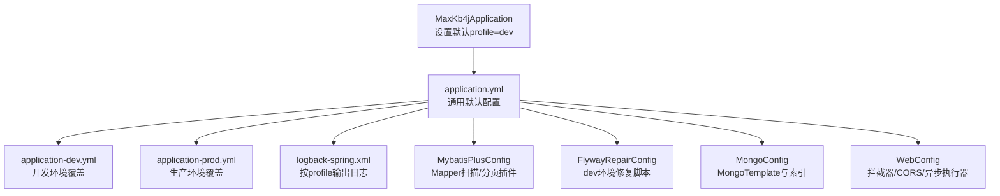
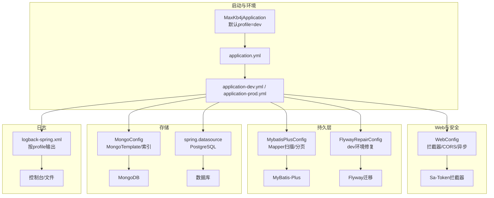
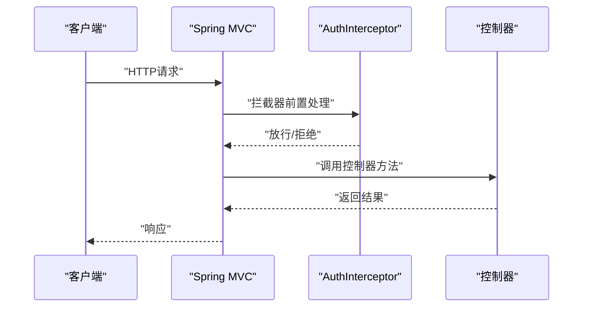
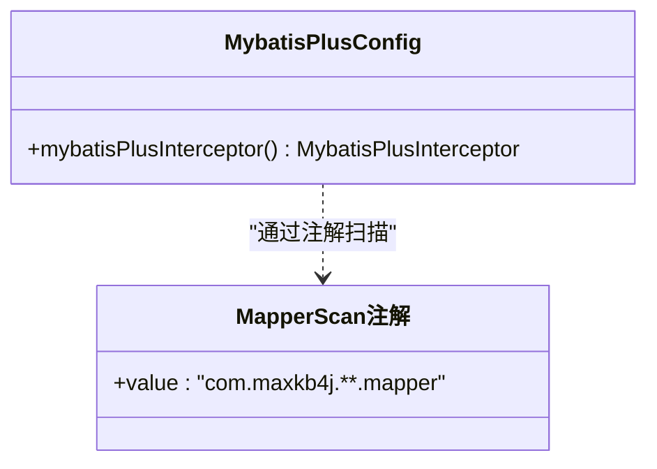
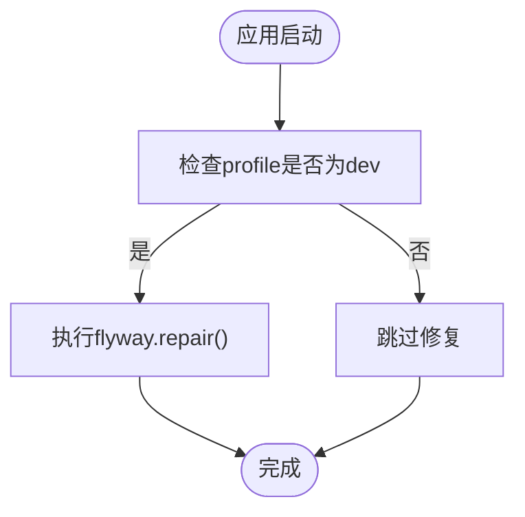
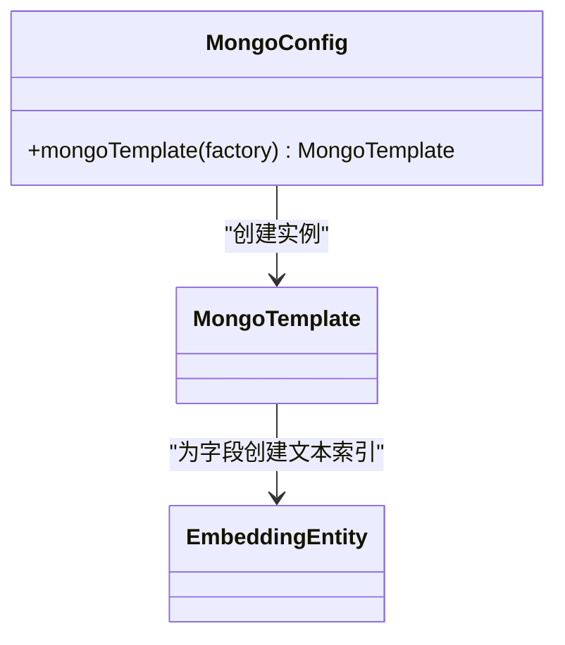
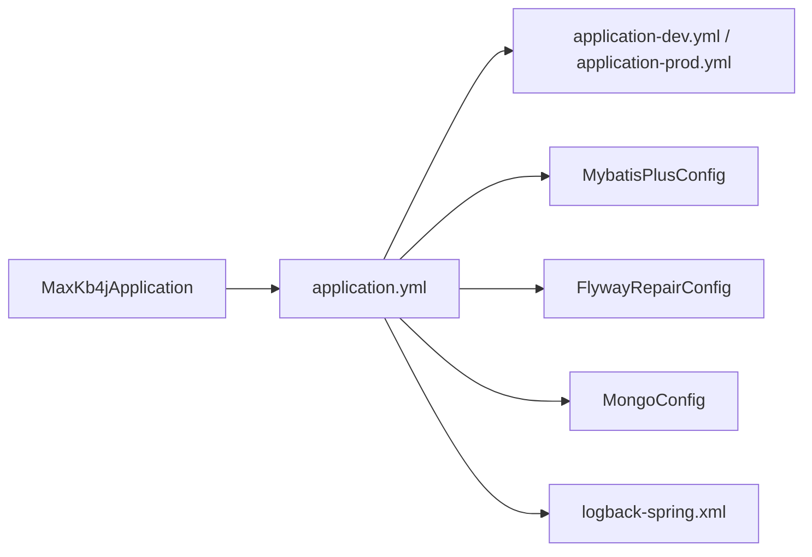

# 应用配置详解

<cite>
**本文引用的文件**
- [application.yml](file://maxkb4j-start/src/main/resources/application.yml)
- [application-dev.yml](file://maxkb4j-start/src/main/resources/application-dev.yml)
- [application-prod.yml](file://maxkb4j-start/src/main/resources/application-prod.yml)
- [logback-spring.xml](file://maxkb4j-start/src/main/resources/logback-spring.xml)
- [MaxKb4jApplication.java](file://maxkb4j-start/src/main/java/com/maxkb4j/start/MaxKb4jApplication.java)
- [MybatisPlusConfig.java](file://maxkb4j-start/src/main/java/com/maxkb4j/start/config/MybatisPlusConfig.java)
- [FlywayRepairConfig.java](file://maxkb4j-start/src/main/java/com/maxkb4j/start/config/FlywayRepairConfig.java)
- [MongoConfig.java](file://maxkb4j-start/src/main/java/com/maxkb4j/start/config/MongoConfig.java)
- [WebConfig.java](file://maxkb4j-start/src/main/java/com/maxkb4j/start/config/WebConfig.java)
- [pom.xml](file://pom.xml)
</cite>

## 目录
1. [简介](#简介)
2. [项目结构与配置文件总览](#项目结构与配置文件总览)
3. [核心配置项深度解析](#核心配置项深度解析)
4. [架构概览与配置关系图](#架构概览与配置关系图)
5. [详细组件与配置分析](#详细组件与配置分析)
6. [依赖关系与配置耦合分析](#依赖关系与配置耦合分析)
7. [性能与稳定性考量](#性能与稳定性考量)
8. [故障排查与调试指南](#故障排查与调试指南)
9. [结论](#结论)
10. [附录：配置参数速查表](#附录配置参数速查表)

## 简介
本文件面向MaxKB4j应用的运维与开发人员，系统性解读主配置文件application.yml及其开发/生产环境差异文件，并结合启动入口、MyBatis-Plus、Flyway、MongoDB、Web与日志配置，给出参数含义、最佳实践、常见问题与验证调试方法，帮助读者快速掌握从本地开发到生产部署的配置要点。

## 项目结构与配置文件总览
MaxKB4j采用Spring Boot多环境配置模式，主配置位于maxkb4j-start模块的resources目录下，包含：
- 主配置：application.yml（通用默认项）
- 环境配置：application-dev.yml（开发）、application-prod.yml（生产）
- 日志：logback-spring.xml（按profile输出到控制台与滚动文件）
- 启动类：MaxKb4jApplication.java（自动设置默认profile为dev）

图表来源
- [MaxKb4jApplication.java:14-20](file://maxkb4j-start/src/main/java/com/maxkb4j/start/MaxKb4jApplication.java#L14-L20)
- [application.yml:1-69](file://maxkb4j-start/src/main/resources/application.yml#L1-L69)
- [application-dev.yml:1-11](file://maxkb4j-start/src/main/resources/application-dev.yml#L1-L11)
- [application-prod.yml:1-9](file://maxkb4j-start/src/main/resources/application-prod.yml#L1-L9)
- [logback-spring.xml:111-129](file://maxkb4j-start/src/main/resources/logback-spring.xml#L111-L129)
- [MybatisPlusConfig.java:17-32](file://maxkb4j-start/src/main/java/com/maxkb4j/start/config/MybatisPlusConfig.java#L17-L32)
- [FlywayRepairConfig.java:10-23](file://maxkb4j-start/src/main/java/com/maxkb4j/start/config/FlywayRepairConfig.java#L10-L23)
- [MongoConfig.java:10-23](file://maxkb4j-start/src/main/java/com/maxkb4j/start/config/MongoConfig.java#L10-L23)
- [WebConfig.java:11-86](file://maxkb4j-start/src/main/java/com/maxkb4j/start/config/WebConfig.java#L11-L86)

章节来源
- [MaxKb4jApplication.java:14-20](file://maxkb4j-start/src/main/java/com/maxkb4j/start/MaxKb4jApplication.java#L14-L20)
- [application.yml:1-69](file://maxkb4j-start/src/main/resources/application.yml#L1-L69)
- [application-dev.yml:1-11](file://maxkb4j-start/src/main/resources/application-dev.yml#L1-L11)
- [application-prod.yml:1-9](file://maxkb4j-start/src/main/resources/application-prod.yml#L1-L9)
- [logback-spring.xml:111-129](file://maxkb4j-start/src/main/resources/logback-spring.xml#L111-L129)

## 核心配置项深度解析
以下逐项解释application.yml中的关键配置，并说明其作用、影响范围与调优建议。

- 服务器配置（端口、错误页面）
  - server.port：服务监听端口，默认8080。生产环境建议固定端口并配合反向代理。
  - server.error.whitelabel.enabled：启用白标签错误页（Spring Boot默认），便于开发阶段快速定位问题；生产可关闭或自定义错误页面。
  - 建议：生产关闭白标签错误页，统一返回JSON错误响应；开发开启以便快速排错。

- Spring Boot配置
  - spring.output.ansi.enabled：控制控制台ANSI颜色输出，开发环境建议开启以提升可读性。
  - spring.application.name：应用名，用于日志与监控标识。
  - spring.servlet.multipart.*：上传文件大小限制，max-file-size与max-request-size均设为100MB，适合知识库文档批量导入场景；可根据业务调整。
  - spring.jackson.*：日期格式与时区，统一为“yyyy-MM-dd HH:mm:ss”与GMT+8，确保前后端一致。
  - spring.cache.type：缓存实现为Caffeine，结合版本管理依赖可见于pom中caffeine条目。
  - 建议：大文件上传需同步调整网关/反向代理的client_max_body_size；Jackson时区与格式应与前端保持一致。

- MyBatis-Plus配置
  - mybatis-plus.global-config.db-config.*：大小写处理与表/列格式化策略，如开启双引号包裹，适配PostgreSQL等对大小写敏感的数据库。
  - mybatis-plus.mapper-locations：Mapper XML扫描路径，支持多层目录匹配，便于模块化组织SQL。
  - mybatis-plus.type-aliases-package：实体别名包扫描，简化XML中的类型引用。
  - mybatis-plus.type-handlers-package：类型处理器包扫描，统一处理复杂字段序列化/反序列化。
  - MybatisPlusConfig.java补充：通过@MapperScan扫描各模块mapper包，并注册分页插件，DbType指定为POSTGRE_SQL。
  - 建议：实体与XML命名规范统一，避免大小写差异导致查询异常；分页插件置于拦截器链末尾。

- Flyway数据库迁移配置
  - spring.flyway.enabled：启用数据库迁移。
  - spring.flyway.baseline-on-migrate：首次迁移前基线化，避免历史库冲突。
  - spring.flyway.validate-on-migrate：关闭迁移校验，降低启动成本；生产建议谨慎开启以保证迁移一致性。
  - spring.flyway.locations：迁移脚本位置class路径，与实际资源目录对应。
  - FlywayRepairConfig.java：仅在dev环境生效，启动时自动执行repair修复历史异常状态，避免误用于生产。
  - 建议：生产禁用自动repair，改为显式命令修复；迁移脚本按版本递增命名，变更前先备份数据库。

- Sa-Token权限认证配置
  - sa-token.jwt-secret-key：JWT密钥，建议通过环境变量注入，避免硬编码。
  - sa-token.token-name：令牌名称（同时作为Cookie名称）。
  - sa-token.timeout：Token有效期（秒），默认7天；根据安全策略调整。
  - sa-token.is-concurrent/is-share：多端登录策略与共享Token策略，按业务需求选择。
  - sa-token.is-log/is-read-cookie/is-write-header：日志与Cookie/Header读写开关。
  - 建议：生产务必设置强密钥并启用HTTPS；Token超时与刷新策略需与业务连续性平衡。

- 数据源与MongoDB
  - spring.datasource.*：PostgreSQL连接参数，驱动类名与URL/凭据在各环境文件中配置。
  - spring.data.mongodb.uri：MongoDB连接字符串，用于向量与全文检索能力。
  - MongoConfig.java：初始化MongoTemplate并在EmbeddingEntity上创建文本索引，支撑RAG检索。
  - 建议：生产使用只读用户与最小权限；MongoDB与PostgreSQL均需高可用与备份。

- 系统默认账户
  - system.default-username/system.default-password：初始管理员账户与密码，生产务必修改默认值。
  - 建议：首次启动后立即重置默认密码并回收明文配置。

章节来源
- [application.yml:1-69](file://maxkb4j-start/src/main/resources/application.yml#L1-L69)
- [MybatisPlusConfig.java:17-32](file://maxkb4j-start/src/main/java/com/maxkb4j/start/config/MybatisPlusConfig.java#L17-L32)
- [FlywayRepairConfig.java:10-23](file://maxkb4j-start/src/main/java/com/maxkb4j/start/config/FlywayRepairConfig.java#L10-L23)
- [MongoConfig.java:10-23](file://maxkb4j-start/src/main/java/com/maxkb4j/start/config/MongoConfig.java#L10-L23)
- [pom.xml:67-76](file://pom.xml#L67-L76)

## 架构概览与配置关系图
下图展示配置如何影响运行时行为：启动类设置profile，加载对应环境配置；Web层注册拦截器与CORS；MyBatis-Plus与Flyway分别负责持久层与数据库迁移；MongoDB支撑向量与全文检索；日志按profile输出到控制台与文件。

图表来源
- [MaxKb4jApplication.java:14-20](file://maxkb4j-start/src/main/java/com/maxkb4j/start/MaxKb4jApplication.java#L14-L20)
- [application.yml:1-69](file://maxkb4j-start/src/main/resources/application.yml#L1-L69)
- [application-dev.yml:1-11](file://maxkb4j-start/src/main/resources/application-dev.yml#L1-L11)
- [application-prod.yml:1-9](file://maxkb4j-start/src/main/resources/application-prod.yml#L1-L9)
- [WebConfig.java:11-86](file://maxkb4j-start/src/main/java/com/maxkb4j/start/config/WebConfig.java#L11-L86)
- [MybatisPlusConfig.java:17-32](file://maxkb4j-start/src/main/java/com/maxkb4j/start/config/MybatisPlusConfig.java#L17-L32)
- [FlywayRepairConfig.java:10-23](file://maxkb4j-start/src/main/java/com/maxkb4j/start/config/FlywayRepairConfig.java#L10-L23)
- [MongoConfig.java:10-23](file://maxkb4j-start/src/main/java/com/maxkb4j/start/config/MongoConfig.java#L10-L23)
- [logback-spring.xml:111-129](file://maxkb4j-start/src/main/resources/logback-spring.xml#L111-L129)

## 详细组件与配置分析

### 服务器与Web配置（端口、CORS、拦截器、异步）
- 端口与错误页：server.port与server.error.whitelabel控制服务暴露与错误呈现。
- CORS：WebConfig统一放行所有Origin/Method/Header，并暴露必要响应头，满足前端SPA跨域需求。
- 拦截器：注册Sa-Token拦截器，保护聊天相关接口；注意ViewControllerRegistry优先级高于@RestController，已通过注释说明。
- 异步执行器：配置线程池大小与队列容量，保障高并发请求的异步处理能力。

图表来源
- [WebConfig.java:33-40](file://maxkb4j-start/src/main/java/com/maxkb4j/start/config/WebConfig.java#L33-L40)

章节来源
- [WebConfig.java:11-86](file://maxkb4j-start/src/main/java/com/maxkb4j/start/config/WebConfig.java#L11-L86)

### MyBatis-Plus配置与Mapper扫描
- Mapper扫描：@MapperScan("com.maxkb4j.**.mapper")确保各模块mapper被纳入容器。
- 分页插件：PaginationInnerInterceptor(DbType.POSTGRE_SQL)，DbType明确有助于SQL方言识别。
- 类型处理器：type-handlers-package统一注册，减少XML冗余配置。
- XML与实体：mapper-locations与type-aliases-package配合，提升可维护性。

图表来源
- [MybatisPlusConfig.java:17-32](file://maxkb4j-start/src/main/java/com/maxkb4j/start/config/MybatisPlusConfig.java#L17-L32)

章节来源
- [MybatisPlusConfig.java:17-32](file://maxkb4j-start/src/main/java/com/maxkb4j/start/config/MybatisPlusConfig.java#L17-L32)

### Flyway数据库迁移与修复
- 启用与基线：spring.flyway.enabled与baseline-on-migrate确保首次迁移安全。
- 校验策略：validate-on-migrate默认关闭，降低启动开销；生产可按需开启。
- 修复机制：FlywayRepairConfig仅在dev生效，启动时执行repair，避免误用于生产。

图表来源
- [FlywayRepairConfig.java:10-23](file://maxkb4j-start/src/main/java/com/maxkb4j/start/config/FlywayRepairConfig.java#L10-L23)
- [application.yml:21-25](file://maxkb4j-start/src/main/resources/application.yml#L21-L25)

章节来源
- [FlywayRepairConfig.java:10-23](file://maxkb4j-start/src/main/java/com/maxkb4j/start/config/FlywayRepairConfig.java#L10-L23)
- [application.yml:21-25](file://maxkb4j-start/src/main/resources/application.yml#L21-L25)

### MongoDB配置与索引
- MongoTemplate：初始化模板并为EmbeddingEntity创建文本索引，支撑内容检索。
- 连接：spring.data.mongodb.uri在各环境文件中配置，确保不同环境指向正确实例。

图表来源
- [MongoConfig.java:10-23](file://maxkb4j-start/src/main/java/com/maxkb4j/start/config/MongoConfig.java#L10-L23)

章节来源
- [MongoConfig.java:10-23](file://maxkb4j-start/src/main/java/com/maxkb4j/start/config/MongoConfig.java#L10-L23)

### 日志配置（Logback）
- 按profile输出：dev与prod均输出到控制台与异步文件，INFO/WARN/ERROR分级落盘。
- 异步日志：AsyncAppender队列与阈值配置，兼顾吞吐与内存占用。
- 系统模块与第三方日志级别：对Spring、MyBatis、MongoDB等设置合理级别，避免噪声。

章节来源
- [logback-spring.xml:111-129](file://maxkb4j-start/src/main/resources/logback-spring.xml#L111-L129)
- [logback-spring.xml:141-157](file://maxkb4j-start/src/main/resources/logback-spring.xml#L141-L157)

## 依赖关系与配置耦合分析
- 启动类与profile：MaxKb4jApplication在未设置active profile时默认使用dev，确保本地开发无需额外参数即可运行。
- 缓存与日志：spring.cache.type与logback-spring.xml共同决定运行时缓存与日志输出策略。
- ORM与迁移：MyBatis-Plus与Flyway分别承担数据访问与Schema演进，二者通过数据源与事务协同工作。
- 存储：PostgreSQL与MongoDB分别承载关系型与向量/全文数据，配置文件中均有明确连接参数。

图表来源
- [MaxKb4jApplication.java:14-20](file://maxkb4j-start/src/main/java/com/maxkb4j/start/MaxKb4jApplication.java#L14-L20)
- [application.yml:1-69](file://maxkb4j-start/src/main/resources/application.yml#L1-L69)
- [MybatisPlusConfig.java:17-32](file://maxkb4j-start/src/main/java/com/maxkb4j/start/config/MybatisPlusConfig.java#L17-L32)
- [FlywayRepairConfig.java:10-23](file://maxkb4j-start/src/main/java/com/maxkb4j/start/config/FlywayRepairConfig.java#L10-L23)
- [MongoConfig.java:10-23](file://maxkb4j-start/src/main/java/com/maxkb4j/start/config/MongoConfig.java#L10-L23)
- [logback-spring.xml:111-129](file://maxkb4j-start/src/main/resources/logback-spring.xml#L111-L129)

章节来源
- [MaxKb4jApplication.java:14-20](file://maxkb4j-start/src/main/java/com/maxkb4j/start/MaxKb4jApplication.java#L14-L20)
- [application.yml:1-69](file://maxkb4j-start/src/main/resources/application.yml#L1-69)

## 性能与稳定性考量
- 上传限制：multipart大小与请求大小需与网关/反向代理一致，避免中间层截断。
- Jackson时区与格式：统一时区与时标格式，减少前后端解析差异引发的性能损耗。
- 缓存：Caffeine缓存适用于热点数据，结合业务场景评估容量与淘汰策略。
- 日志：INFO/WARN/ERROR分级与异步输出降低IO阻塞风险。
- 数据库：Flyway迁移关闭validate可加速启动，生产建议严格校验；MongoDB索引创建与维护需定期评估。
- 并发：WebConfig的异步执行器参数需结合CPU核数与QPS调优。

## 故障排查与调试指南
- 配置未生效
  - 检查是否正确设置spring.profiles.active或环境变量；启动类默认仅在未设置时生效。
  - 确认application-dev.yml或application-prod.yml路径与命名正确，且被Spring Boot发现。
  - 参考：[MaxKb4jApplication.java:14-20](file://maxkb4j-start/src/main/java/com/maxkb4j/start/MaxKb4jApplication.java#L14-L20)
- 数据库迁移失败
  - dev环境可使用FlywayRepairConfig自动修复；生产请先备份再手动修复。
  - 参考：[FlywayRepairConfig.java:10-23](file://maxkb4j-start/src/main/java/com/maxkb4j/start/config/FlywayRepairConfig.java#L10-L23)
- 文件上传失败
  - 检查multipart大小限制与网关/反向代理上限是否一致。
  - 参考：[application.yml:12-15](file://maxkb4j-start/src/main/resources/application.yml#L12-L15)
- 跨域问题
  - 确认CORS配置已生效，必要时细化允许来源与方法。
  - 参考：[WebConfig.java:68-85](file://maxkb4j-start/src/main/java/com/maxkb4j/start/config/WebConfig.java#L68-L85)
- 日志输出异常
  - 检查logback-spring.xml的springProfile与appender配置，确认当前profile匹配。
  - 参考：[logback-spring.xml:111-129](file://maxkb4j-start/src/main/resources/logback-spring.xml#L111-L129)
- 权限认证异常
  - 检查sa-token配置与JWT密钥，确保与前端一致；生产务必使用环境变量注入密钥。
  - 参考：[application.yml:37-57](file://maxkb4j-start/src/main/resources/application.yml#L37-L57)

## 结论
MaxKB4j的配置体系以application.yml为核心，结合环境差异化文件与启动类默认profile，形成清晰的开发/生产切换机制。MyBatis-Plus、Flyway、MongoDB与Web配置相互协作，支撑从数据访问到迁移、从存储到接口的安全与性能。遵循本文的最佳实践与调试方法，可在本地高效开发、在生产稳定运行。

## 附录：配置参数速查表
- 服务器
  - server.port：服务端口
  - server.error.whitelabel.enabled：错误页开关
- Spring Boot
  - spring.output.ansi.enabled：控制台颜色
  - spring.application.name：应用名
  - spring.servlet.multipart.max-file-size / max-request-size：上传限制
  - spring.jackson.date-format / time-zone：日期格式与时区
  - spring.cache.type：缓存类型
- MyBatis-Plus
  - mybatis-plus.global-config.db-config.*：大小写与格式化策略
  - mybatis-plus.mapper-locations：Mapper XML扫描路径
  - mybatis-plus.type-aliases-package：实体别名包
  - mybatis-plus.type-handlers-package：类型处理器包
  - MybatisPlusConfig：@MapperScan与分页插件
- Flyway
  - spring.flyway.enabled / baseline-on-migrate / validate-on-migrate / locations
  - FlywayRepairConfig（仅dev）
- Sa-Token
  - sa-token.jwt-secret-key / token-name / timeout / is-concurrent / is-share / is-log / is-read-cookie / is-write-header
- 数据源与MongoDB
  - spring.datasource.* / spring.data.mongodb.uri
  - MongoConfig：MongoTemplate与索引
- 日志
  - logback-spring.xml：按profile输出到控制台与文件

章节来源
- [application.yml:1-69](file://maxkb4j-start/src/main/resources/application.yml#L1-L69)
- [application-dev.yml:1-11](file://maxkb4j-start/src/main/resources/application-dev.yml#L1-L11)
- [application-prod.yml:1-9](file://maxkb4j-start/src/main/resources/application-prod.yml#L1-L9)
- [MybatisPlusConfig.java:17-32](file://maxkb4j-start/src/main/java/com/maxkb4j/start/config/MybatisPlusConfig.java#L17-L32)
- [FlywayRepairConfig.java:10-23](file://maxkb4j-start/src/main/java/com/maxkb4j/start/config/FlywayRepairConfig.java#L10-L23)
- [MongoConfig.java:10-23](file://maxkb4j-start/src/main/java/com/maxkb4j/start/config/MongoConfig.java#L10-L23)
- [WebConfig.java:11-86](file://maxkb4j-start/src/main/java/com/maxkb4j/start/config/WebConfig.java#L11-L86)
- [logback-spring.xml:111-129](file://maxkb4j-start/src/main/resources/logback-spring.xml#L111-L129)
- [pom.xml:67-76](file://pom.xml#L67-L76)