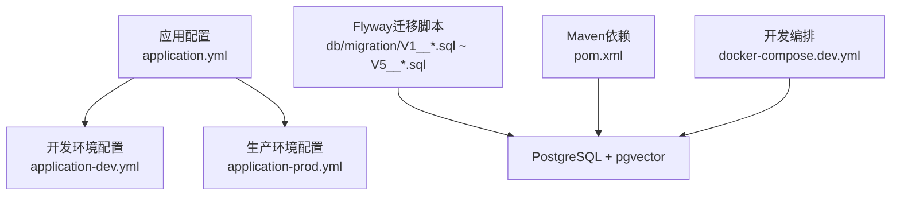
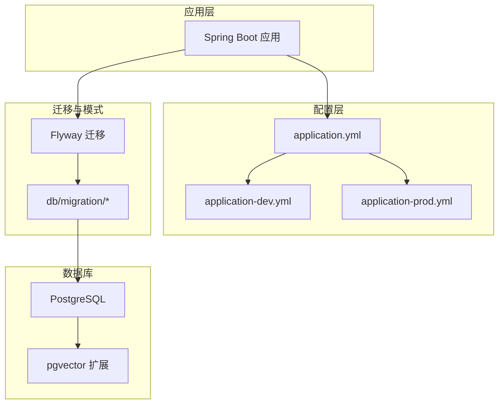
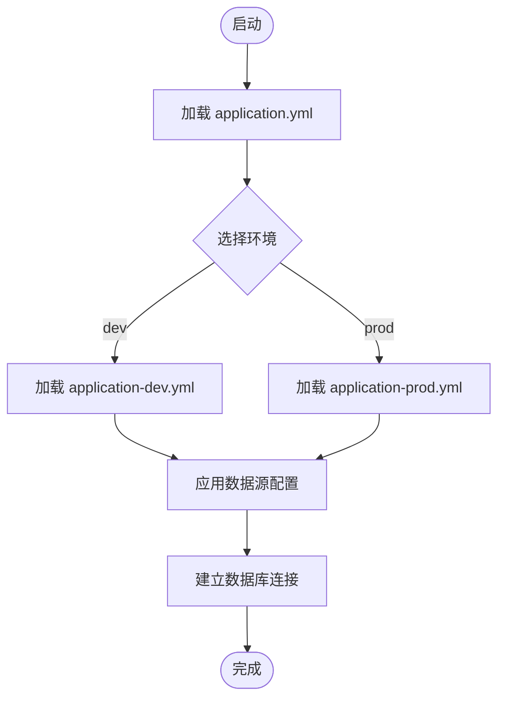
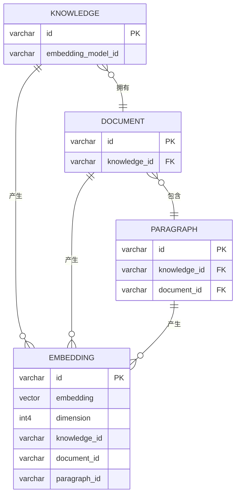
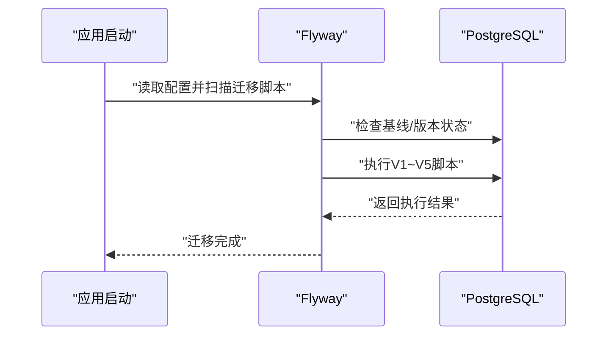
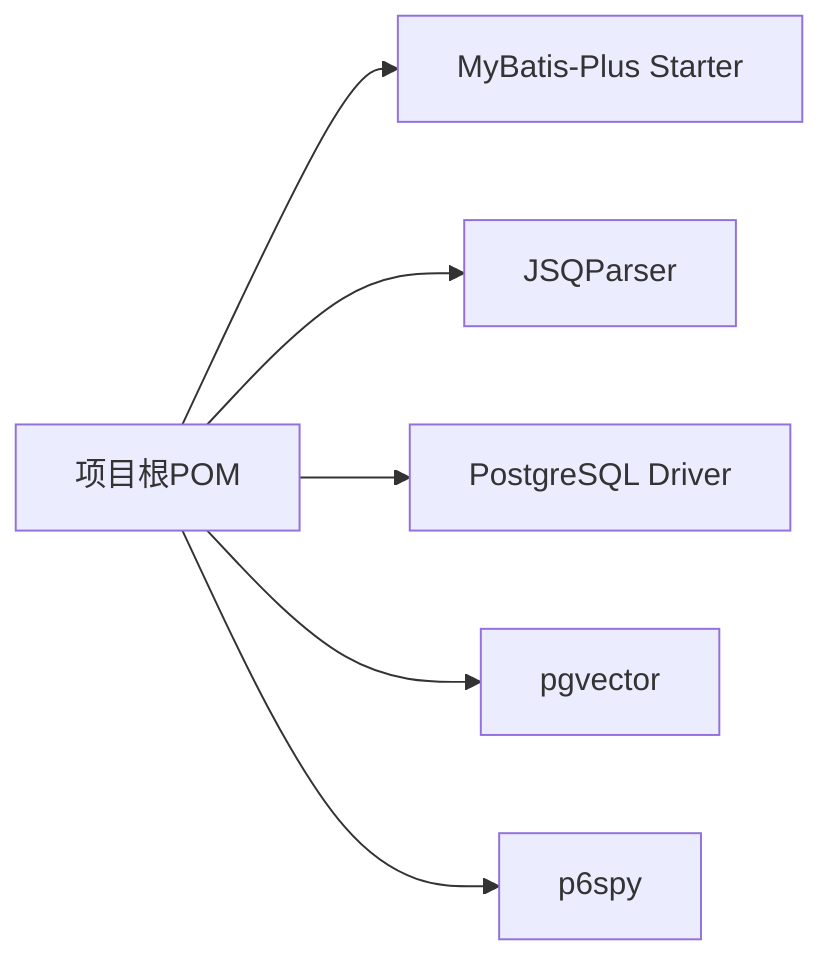

# 数据库配置

<cite>
**本文引用的文件**
- [application.yml](file://maxkb4j-start/src/main/resources/application.yml)
- [application-dev.yml](file://maxkb4j-start/src/main/resources/application-dev.yml)
- [application-prod.yml](file://maxkb4j-start/src/main/resources/application-prod.yml)
- [V1__init_tables.sql](file://maxkb4j-start/src/main/resources/db/migration/V1__init_tables.sql)
- [V2__add_table.sql](file://maxkb4j-start/src/main/resources/db/migration/V2__add_table.sql)
- [V3__add_trigger.sql](file://maxkb4j-start/src/main/resources/db/migration/V3__add_trigger.sql)
- [V4__update_table.sql](file://maxkb4j-start/src/main/resources/db/migration/V4__update_table.sql)
- [V5__add_table.sql](file://maxkb4j-start/src/main/resources/db/migration/V5__add_table.sql)
- [pom.xml](file://pom.xml)
- [docker-compose.dev.yml](file://docker-compose.dev.yml)
- [README_CN.md](file://README_CN.md)
</cite>

## 目录
1. [简介](#简介)
2. [项目结构](#项目结构)
3. [核心组件](#核心组件)
4. [架构总览](#架构总览)
5. [详细组件分析](#详细组件分析)
6. [依赖分析](#依赖分析)
7. [性能考量](#性能考量)
8. [故障排查指南](#故障排查指南)
9. [结论](#结论)
10. [附录](#附录)

## 简介
本文件面向MaxKB4j的数据库配置与运维，聚焦以下主题：
- 数据库连接配置与环境隔离（开发/生产）
- 连接池与事务管理现状与建议
- PostgreSQL与pgvector扩展配置要点
- Flyway数据库迁移机制与脚本演进
- 初始化脚本内容与版本管理
- 性能优化建议（连接池、查询超时、批量操作）
- 备份恢复策略与监控配置
- 安全考虑与最佳实践

## 项目结构
MaxKB4j采用Spring Boot工程，数据库相关配置集中在资源目录中，并通过Maven统一声明依赖。核心位置如下：
- 应用配置：application.yml、application-dev.yml、application-prod.yml
- 迁移脚本：db/migration/V1__*.sql 至 V5__*.sql
- 依赖声明：pom.xml
- 开发环境编排：docker-compose.dev.yml
- 文档与环境要求：README_CN.md

**图表来源**
- [application.yml:1-69](file://maxkb4j-start/src/main/resources/application.yml#L1-L69)
- [application-dev.yml:1-11](file://maxkb4j-start/src/main/resources/application-dev.yml#L1-L11)
- [application-prod.yml:1-9](file://maxkb4j-start/src/main/resources/application-prod.yml#L1-L9)
- [V1__init_tables.sql:1-801](file://maxkb4j-start/src/main/resources/db/migration/V1__init_tables.sql#L1-L801)
- [pom.xml:132-175](file://pom.xml#L132-L175)
- [docker-compose.dev.yml:1-28](file://docker-compose.dev.yml#L1-L28)

**章节来源**
- [application.yml:1-69](file://maxkb4j-start/src/main/resources/application.yml#L1-L69)
- [application-dev.yml:1-11](file://maxkb4j-start/src/main/resources/application-dev.yml#L1-L11)
- [application-prod.yml:1-9](file://maxkb4j-start/src/main/resources/application-prod.yml#L1-L9)
- [V1__init_tables.sql:1-801](file://maxkb4j-start/src/main/resources/db/migration/V1__init_tables.sql#L1-L801)
- [pom.xml:132-175](file://pom.xml#L132-L175)
- [docker-compose.dev.yml:1-28](file://docker-compose.dev.yml#L1-L28)
- [README_CN.md:46-91](file://README_CN.md#L46-L91)

## 核心组件
- 数据库连接配置
  - 通过Spring配置中的数据源属性定义URL、用户名、密码与驱动类名，分别在开发与生产环境配置文件中体现。
  - 环境变量注入方式支持运行时覆盖敏感信息。
- 连接池与事务管理
  - 工程未显式声明Hikari连接池参数；默认行为由Spring Boot自动配置提供。事务管理基于Spring声明式事务。
- PostgreSQL与pgvector
  - 初始化脚本显式创建vector扩展；实体与索引广泛使用向量类型与相关索引。
- Flyway迁移
  - 启用Flyway，指定迁移脚本位置为classpath:db/migration，基线迁移开启，校验策略按配置。

**章节来源**
- [application-dev.yml:1-11](file://maxkb4j-start/src/main/resources/application-dev.yml#L1-L11)
- [application-prod.yml:1-9](file://maxkb4j-start/src/main/resources/application-prod.yml#L1-L9)
- [application.yml:21-26](file://maxkb4j-start/src/main/resources/application.yml#L21-L26)
- [V1__init_tables.sql:3-5](file://maxkb4j-start/src/main/resources/db/migration/V1__init_tables.sql#L3-L5)
- [pom.xml:132-175](file://pom.xml#L132-L175)

## 架构总览
下图展示数据库配置在系统中的位置与交互关系：

**图表来源**
- [application.yml:1-69](file://maxkb4j-start/src/main/resources/application.yml#L1-L69)
- [application-dev.yml:1-11](file://maxkb4j-start/src/main/resources/application-dev.yml#L1-L11)
- [application-prod.yml:1-9](file://maxkb4j-start/src/main/resources/application-prod.yml#L1-L9)
- [V1__init_tables.sql:1-801](file://maxkb4j-start/src/main/resources/db/migration/V1__init_tables.sql#L1-L801)
- [pom.xml:132-175](file://pom.xml#L132-L175)

## 详细组件分析

### 数据库连接配置
- 开发环境
  - 数据源URL、用户名、密码与驱动类名在开发配置中定义，便于本地调试。
- 生产环境
  - 生产配置与开发配置结构一致，可通过环境变量注入实现安全覆盖。
- 环境隔离
  - application.yml作为通用配置入口，开发与生产通过各自profile文件覆盖关键参数。

**图表来源**
- [application.yml:1-69](file://maxkb4j-start/src/main/resources/application.yml#L1-L69)
- [application-dev.yml:1-11](file://maxkb4j-start/src/main/resources/application-dev.yml#L1-L11)
- [application-prod.yml:1-9](file://maxkb4j-start/src/main/resources/application-prod.yml#L1-L9)

**章节来源**
- [application-dev.yml:1-11](file://maxkb4j-start/src/main/resources/application-dev.yml#L1-L11)
- [application-prod.yml:1-9](file://maxkb4j-start/src/main/resources/application-prod.yml#L1-L9)
- [application.yml:1-69](file://maxkb4j-start/src/main/resources/application.yml#L1-L69)

### 连接池与事务管理
- 连接池
  - 未在配置中显式声明Hikari参数，遵循Spring Boot默认行为。建议结合业务QPS与峰值并发评估并显式配置连接池大小、空闲超时、最大生命周期等参数。
- 事务管理
  - 使用Spring声明式事务，确保跨多个DAO操作的一致性。建议对长事务与批量写入场景进行拆分与超时控制，避免长时间锁持有。

**章节来源**
- [application.yml:1-69](file://maxkb4j-start/src/main/resources/application.yml#L1-L69)
- [pom.xml:132-175](file://pom.xml#L132-L175)

### PostgreSQL与pgvector扩展
- 扩展启用
  - 初始化脚本显式创建vector扩展，确保向量类型可用。
- 表与索引
  - 多张表包含向量字段与索引，支撑向量相似度检索与全文检索（如tsvector）。
- 版本要求
  - 文档明确要求PostgreSQL 12+并启用pgvector扩展。

**图表来源**
- [V1__init_tables.sql:657-691](file://maxkb4j-start/src/main/resources/db/migration/V1__init_tables.sql#L657-L691)
- [V1__init_tables.sql:380-412](file://maxkb4j-start/src/main/resources/db/migration/V1__init_tables.sql#L380-L412)
- [V1__init_tables.sql:422-450](file://maxkb4j-start/src/main/resources/db/migration/V1__init_tables.sql#L422-L450)
- [V1__init_tables.sql:458-488](file://maxkb4j-start/src/main/resources/db/migration/V1__init_tables.sql#L458-L488)

**章节来源**
- [V1__init_tables.sql:3-5](file://maxkb4j-start/src/main/resources/db/migration/V1__init_tables.sql#L3-L5)
- [V1__init_tables.sql:657-691](file://maxkb4j-start/src/main/resources/db/migration/V1__init_tables.sql#L657-L691)
- [README_CN.md:52-55](file://README_CN.md#L52-L55)

### Flyway数据库迁移机制
- 启用与定位
  - 在application.yml中启用Flyway，迁移脚本位于classpath:db/migration。
- 基线迁移
  - 开启baseline-on-migrate，便于从现有库直接迁移。
- 脚本演进
  - V1初始化表结构与vector扩展；V2新增application_access表；V3引入事件触发器相关表；V4对聊天与记录表增加列；V5新增资源映射与分享链接表。

**图表来源**
- [application.yml:21-26](file://maxkb4j-start/src/main/resources/application.yml#L21-L26)
- [V1__init_tables.sql:1-801](file://maxkb4j-start/src/main/resources/db/migration/V1__init_tables.sql#L1-L801)
- [V2__add_table.sql:1-17](file://maxkb4j-start/src/main/resources/db/migration/V2__add_table.sql#L1-L17)
- [V3__add_trigger.sql:1-68](file://maxkb4j-start/src/main/resources/db/migration/V3__add_trigger.sql#L1-L68)
- [V4__update_table.sql:1-9](file://maxkb4j-start/src/main/resources/db/migration/V4__update_table.sql#L1-L9)
- [V5__add_table.sql:1-71](file://maxkb4j-start/src/main/resources/db/migration/V5__add_table.sql#L1-L71)

**章节来源**
- [application.yml:21-26](file://maxkb4j-start/src/main/resources/application.yml#L21-L26)
- [V1__init_tables.sql:1-801](file://maxkb4j-start/src/main/resources/db/migration/V1__init_tables.sql#L1-L801)
- [V2__add_table.sql:1-17](file://maxkb4j-start/src/main/resources/db/migration/V2__add_table.sql#L1-L17)
- [V3__add_trigger.sql:1-68](file://maxkb4j-start/src/main/resources/db/migration/V3__add_trigger.sql#L1-L68)
- [V4__update_table.sql:1-9](file://maxkb4j-start/src/main/resources/db/migration/V4__update_table.sql#L1-L9)
- [V5__add_table.sql:1-71](file://maxkb4j-start/src/main/resources/db/migration/V5__add_table.sql#L1-L71)

### 初始化脚本与版本管理
- V1：创建vector扩展与多张核心表（用户、知识、文档、段落、问题、嵌入、工作流等），包含主键、唯一约束、外键与索引。
- V2：新增application_access表。
- V3：新增事件触发器相关表（event_trigger、event_trigger_task、event_trigger_task_record）。
- V4：为application_chat与application_chat_record表增加IP与来源字段。
- V5：新增resource_mapping与application_chat_share_link表。

版本管理建议：
- 每次变更均应新增独立迁移脚本，保持幂等与可回滚。
- 对生产库执行前先在测试环境验证，保留回滚脚本或使用Flyway的回滚能力。

**章节来源**
- [V1__init_tables.sql:1-801](file://maxkb4j-start/src/main/resources/db/migration/V1__init_tables.sql#L1-L801)
- [V2__add_table.sql:1-17](file://maxkb4j-start/src/main/resources/db/migration/V2__add_table.sql#L1-L17)
- [V3__add_trigger.sql:1-68](file://maxkb4j-start/src/main/resources/db/migration/V3__add_trigger.sql#L1-L68)
- [V4__update_table.sql:1-9](file://maxkb4j-start/src/main/resources/db/migration/V4__update_table.sql#L1-L9)
- [V5__add_table.sql:1-71](file://maxkb4j-start/src/main/resources/db/migration/V5__add_table.sql#L1-L71)

### 开发环境编排与数据库准备
- docker-compose.dev.yml提供PostgreSQL与MongoDB服务示例，其中PostgreSQL使用pgvector镜像并挂载数据卷。
- 建议在容器启动后手动创建数据库与用户，并确保pgvector扩展已启用。

**章节来源**
- [docker-compose.dev.yml:1-28](file://docker-compose.dev.yml#L1-L28)

## 依赖分析
- MyBatis-Plus与SQL解析
  - 引入mybatis-plus-spring-boot3-starter与jsqlparser，用于简化DAO层与复杂SQL解析。
- PostgreSQL与pgvector
  - 显式依赖postgresql与pgvector，确保向量类型与扩展可用。
- SQL监控
  - 引入p6spy-spring-boot-starter，便于开发阶段SQL审计与性能分析。

**图表来源**
- [pom.xml:132-175](file://pom.xml#L132-L175)

**章节来源**
- [pom.xml:132-175](file://pom.xml#L132-L175)

## 性能考量
- 连接池大小
  - 建议结合QPS与并发线程数设定连接池大小，避免过大导致数据库压力，过小导致排队等待。
- 查询超时
  - 对批量查询与向量相似度检索设置合理超时，防止慢查询拖垮实例。
- 批量操作
  - 写入场景优先使用批量插入/更新，减少往返次数；对向量入库建议分批提交并控制单批大小。
- 索引与统计信息
  - 确保向量索引与常用查询字段索引处于可用状态；定期更新统计信息以提升计划质量。
- 事务边界
  - 将长事务拆分为短事务，避免长时间锁持有；对只读查询尽量使用只读事务。

[本节为通用性能建议，无需特定文件引用]

## 故障排查指南
- 迁移失败
  - 检查Flyway配置与脚本路径；确认数据库用户具备DDL权限；必要时使用baseline-on-migrate。
- 连接异常
  - 核对数据源URL、用户名、密码与驱动类名；确认数据库服务可达且端口开放。
- pgvector不可用
  - 确认PostgreSQL版本满足要求并已启用vector扩展；检查扩展安装与权限。
- SQL审计
  - 如需开启SQL日志，可在配置中调整p6spy开关与格式化选项。

**章节来源**
- [application.yml:21-26](file://maxkb4j-start/src/main/resources/application.yml#L21-L26)
- [application-dev.yml:1-11](file://maxkb4j-start/src/main/resources/application-dev.yml#L1-L11)
- [application-prod.yml:1-9](file://maxkb4j-start/src/main/resources/application-prod.yml#L1-L9)
- [V1__init_tables.sql:3-5](file://maxkb4j-start/src/main/resources/db/migration/V1__init_tables.sql#L3-L5)

## 结论
MaxKB4j的数据库配置以Spring Boot与Flyway为核心，结合pgvector实现向量检索能力。当前工程未显式配置连接池参数，建议在生产环境中补充连接池与事务相关参数，并完善监控与备份策略。迁移脚本清晰地描述了数据库演进历程，建议严格遵循版本管理规范以保障生产安全。

[本节为总结性内容，无需特定文件引用]

## 附录
- 环境要求与部署参考
  - 系统要求包含PostgreSQL 12+（启用pgvector）与MongoDB 6.0+（可选）。
  - 提供本地JAR启动、Docker与Docker-Compose三种部署方式。

**章节来源**
- [README_CN.md:52-55](file://README_CN.md#L52-L55)
- [README_CN.md:65-76](file://README_CN.md#L65-L76)