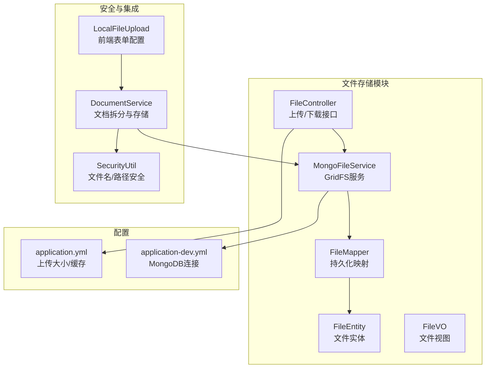
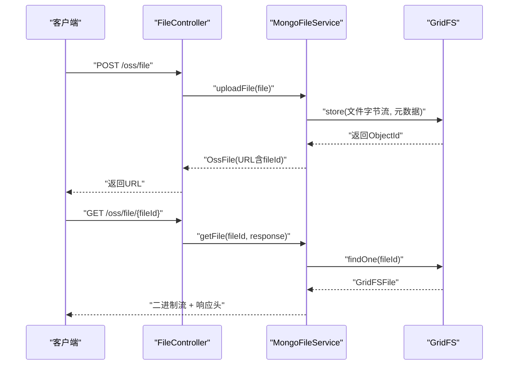
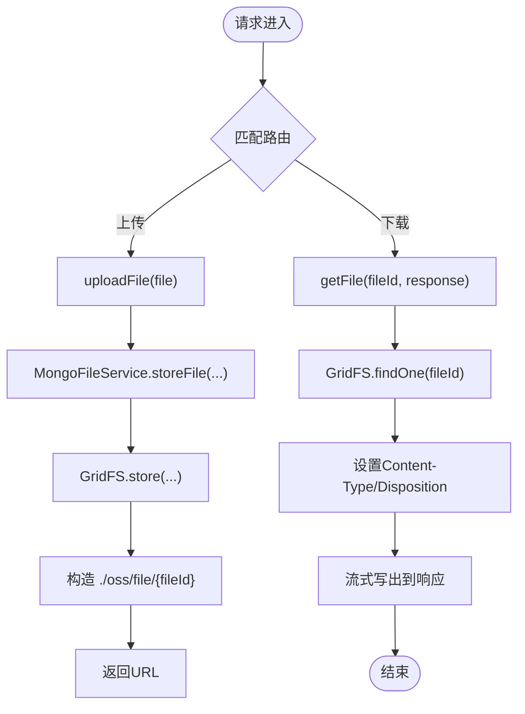
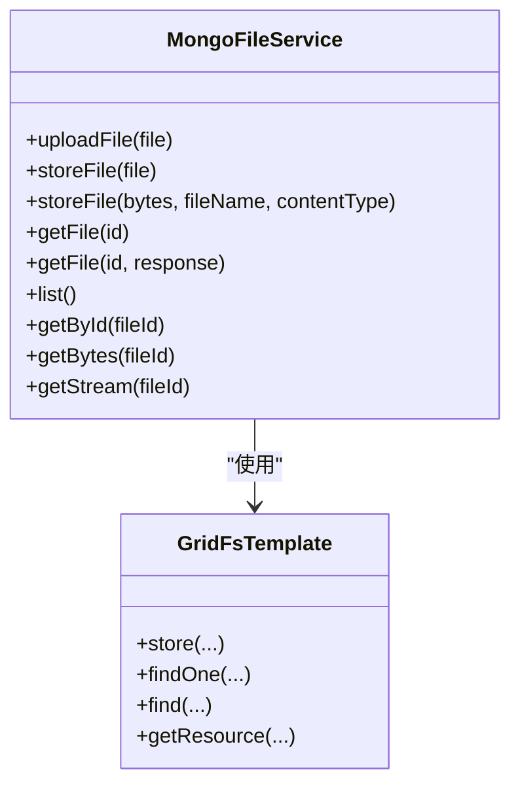
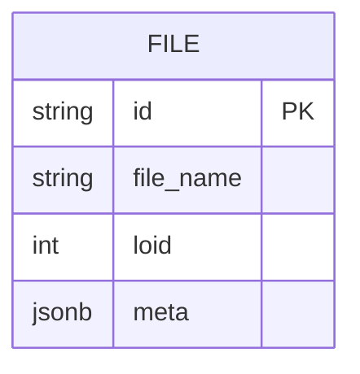
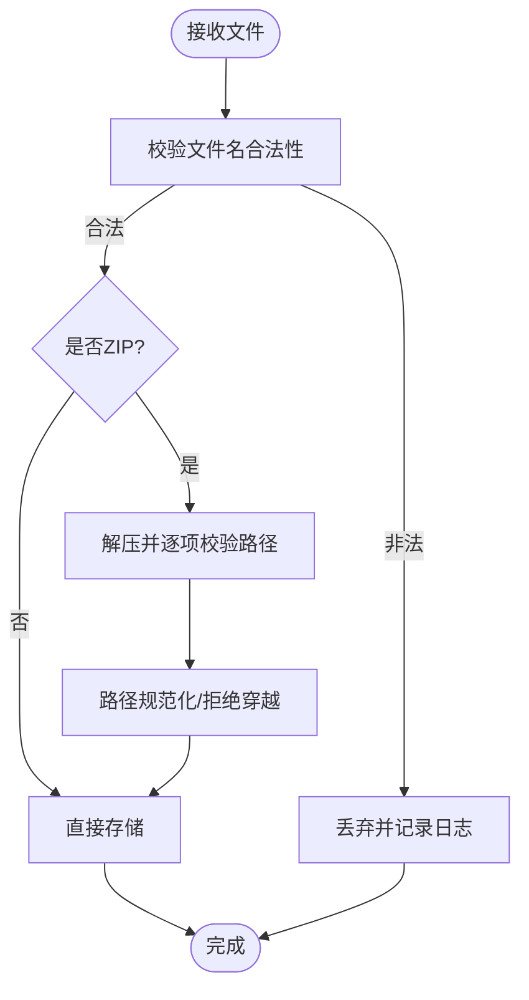
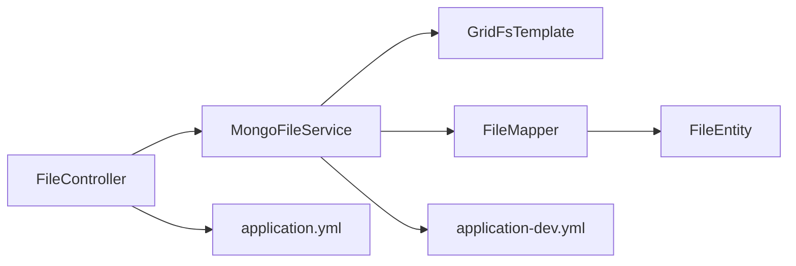

# 文件存储配置

<cite>
**本文引用的文件**
- [FileController.java](file://maxkb4j-service/maxkb4j-oss/src/main/java/com/maxkb4j/oss/controller/FileController.java)
- [MongoFileService.java](file://maxkb4j-service/maxkb4j-oss/src/main/java/com/maxkb4j/oss/service/MongoFileService.java)
- [FileMapper.java](file://maxkb4j-service/maxkb4j-oss/src/main/java/com/maxkb4j/oss/mapper/FileMapper.java)
- [FileEntity.java](file://maxkb4j-service-api/maxkb4j-oss-api/src/main/java/com/maxkb4j/oss/entity/FileEntity.java)
- [FileVO.java](file://maxkb4j-service-api/maxkb4j-oss-api/src/main/java/com/maxkb4j/oss/vo/FileVO.java)
- [DocumentService.java](file://maxkb4j-service/maxkb4j-knowledge/src/main/java/com/maxkb4j/knowledge/service/DocumentService.java)
- [SecurityUtil.java](file://maxkb4j-common/src/main/java/com/maxkb4j/common/util/SecurityUtil.java)
- [LocalFileUpload.java](file://maxkb4j-common/src/main/java/com/maxkb4j/common/domain/form/LocalFileUpload.java)
- [FileLimitExceededException.java](file://maxkb4j-common/src/main/java/com/maxkb4j/common/exception/FileLimitExceededException.java)
- [application.yml](file://maxkb4j-start/src/main/resources/application.yml)
- [application-dev.yml](file://maxkb4j-start/src/main/resources/application-dev.yml)
</cite>

## 目录
1. [简介](#简介)
2. [项目结构](#项目结构)
3. [核心组件](#核心组件)
4. [架构总览](#架构总览)
5. [详细组件分析](#详细组件分析)
6. [依赖关系分析](#依赖关系分析)
7. [性能考虑](#性能考虑)
8. [故障排查指南](#故障排查指南)
9. [结论](#结论)
10. [附录](#附录)

## 简介
本文件面向MaxKB4j的文件存储配置与使用，聚焦于基于MongoDB GridFS的文件存储能力。内容涵盖：
- 上传大小限制与请求参数配置
- 存储路径与访问URL生成
- 文件类型与文件名安全策略
- 元数据管理与访问控制
- 生命周期管理与清理策略
- 性能优化建议（分片、压缩、缓存）
- 安全配置（病毒扫描、内容审核）
- 监控、备份与容量管理

## 项目结构
围绕文件存储的关键模块分布如下：
- 控制层：提供文件上传与下载接口
- 服务层：封装GridFS读写、元数据与流式传输
- 数据模型：文件实体与视图对象
- 安全工具：文件名规范化与路径穿越防护
- 应用侧集成：知识库文档拆分与文件存储联动
- 配置：Spring Boot多环境配置与MongoDB连接

图表来源
- [FileController.java:1-49](file://maxkb4j-service/maxkb4j-oss/src/main/java/com/maxkb4j/oss/controller/FileController.java#L1-L49)
- [MongoFileService.java:1-178](file://maxkb4j-service/maxkb4j-oss/src/main/java/com/maxkb4j/oss/service/MongoFileService.java#L1-L178)
- [FileMapper.java:1-13](file://maxkb4j-service/maxkb4j-oss/src/main/java/com/maxkb4j/oss/mapper/FileMapper.java#L1-L13)
- [FileEntity.java:1-23](file://maxkb4j-service-api/maxkb4j-oss-api/src/main/java/com/maxkb4j/oss/entity/FileEntity.java#L1-L23)
- [FileVO.java:1-14](file://maxkb4j-service-api/maxkb4j-oss-api/src/main/java/com/maxkb4j/oss/vo/FileVO.java#L1-L14)
- [DocumentService.java:307-358](file://maxkb4j-service/maxkb4j-knowledge/src/main/java/com/maxkb4j/knowledge/service/DocumentService.java#L307-L358)
- [SecurityUtil.java:1-45](file://maxkb4j-common/src/main/java/com/maxkb4j/common/util/SecurityUtil.java#L1-L45)
- [LocalFileUpload.java:1-23](file://maxkb4j-common/src/main/java/com/maxkb4j/common/domain/form/LocalFileUpload.java#L1-L23)
- [application.yml:1-69](file://maxkb4j-start/src/main/resources/application.yml#L1-L69)
- [application-dev.yml:1-11](file://maxkb4j-start/src/main/resources/application-dev.yml#L1-L11)

章节来源
- [FileController.java:1-49](file://maxkb4j-service/maxkb4j-oss/src/main/java/com/maxkb4j/oss/controller/FileController.java#L1-L49)
- [MongoFileService.java:1-178](file://maxkb4j-service/maxkb4j-oss/src/main/java/com/maxkb4j/oss/service/MongoFileService.java#L1-L178)
- [application.yml:1-69](file://maxkb4j-start/src/main/resources/application.yml#L1-L69)
- [application-dev.yml:1-11](file://maxkb4j-start/src/main/resources/application-dev.yml#L1-L11)

## 核心组件
- 文件控制器：提供统一的上传与下载REST接口，支持多路由前缀，便于后台与聊天场景复用。
- GridFS服务：封装上传、下载、元数据读取、流式传输与列表查询；负责响应头设置与内容类型判定。
- 文件实体与视图：定义文件元信息字段，支撑后续权限与状态管理扩展。
- 安全工具：对文件名与压缩包内路径进行规范化与合法性校验，防范路径穿越。
- 应用侧集成：文档拆分流程中调用GridFS存储原始文件，并记录源文件ID以便检索与溯源。

章节来源
- [FileController.java:27-45](file://maxkb4j-service/maxkb4j-oss/src/main/java/com/maxkb4j/oss/controller/FileController.java#L27-L45)
- [MongoFileService.java:37-173](file://maxkb4j-service/maxkb4j-oss/src/main/java/com/maxkb4j/oss/service/MongoFileService.java#L37-L173)
- [FileEntity.java:14-22](file://maxkb4j-service-api/maxkb4j-oss-api/src/main/java/com/maxkb4j/oss/entity/FileEntity.java#L14-L22)
- [DocumentService.java:311-357](file://maxkb4j-service/maxkb4j-knowledge/src/main/java/com/maxkb4j/knowledge/service/DocumentService.java#L311-L357)
- [SecurityUtil.java:24-43](file://maxkb4j-common/src/main/java/com/maxkb4j/common/util/SecurityUtil.java#L24-L43)

## 架构总览
下图展示文件上传与下载的端到端流程，以及与MongoDB GridFS的交互关系。

图表来源
- [FileController.java:31-45](file://maxkb4j-service/maxkb4j-oss/src/main/java/com/maxkb4j/oss/controller/FileController.java#L31-L45)
- [MongoFileService.java:37-142](file://maxkb4j-service/maxkb4j-oss/src/main/java/com/maxkb4j/oss/service/MongoFileService.java#L37-L142)

## 详细组件分析

### 文件上传与下载接口
- 上传接口：支持多路由前缀，接收MultipartFile并调用服务层完成存储，返回包含fileId的URL。
- 下载接口：根据fileId获取文件流，设置Content-Type与Content-Disposition，支持预览型与附件型两种模式。

图表来源
- [FileController.java:27-45](file://maxkb4j-service/maxkb4j-oss/src/main/java/com/maxkb4j/oss/controller/FileController.java#L27-L45)
- [MongoFileService.java:37-142](file://maxkb4j-service/maxkb4j-oss/src/main/java/com/maxkb4j/oss/service/MongoFileService.java#L37-L142)

章节来源
- [FileController.java:27-45](file://maxkb4j-service/maxkb4j-oss/src/main/java/com/maxkb4j/oss/controller/FileController.java#L27-L45)
- [MongoFileService.java:37-142](file://maxkb4j-service/maxkb4j-oss/src/main/java/com/maxkb4j/oss/service/MongoFileService.java#L37-L142)

### GridFS文件服务
- 上传：支持MultipartFile与字节数组两种输入，自动推断内容类型，返回ObjectId作为fileId。
- 下载：根据fileId读取GridFS文件，设置合适的Content-Type与Content-Disposition，支持预览与下载。
- 列表与查询：提供按条件查询与遍历列表的能力，便于管理与审计。
- 元数据：当前实现未显式写入自定义元数据键，但保留了扩展点以支持后续增强。

图表来源
- [MongoFileService.java:33-175](file://maxkb4j-service/maxkb4j-oss/src/main/java/com/maxkb4j/oss/service/MongoFileService.java#L33-L175)

章节来源
- [MongoFileService.java:33-175](file://maxkb4j-service/maxkb4j-oss/src/main/java/com/maxkb4j/oss/service/MongoFileService.java#L33-L175)

### 文件实体与视图
- 文件实体：包含文件名、逻辑ID（loid）、元数据JSON等字段，可用于后续权限与状态管理。
- 文件视图：对外暴露fileId、name、url、status、size、uid等字段，便于前端展示与管理。

图表来源
- [FileEntity.java:14-22](file://maxkb4j-service-api/maxkb4j-oss-api/src/main/java/com/maxkb4j/oss/entity/FileEntity.java#L14-L22)

章节来源
- [FileEntity.java:14-22](file://maxkb4j-service-api/maxkb4j-oss-api/src/main/java/com/maxkb4j/oss/entity/FileEntity.java#L14-L22)
- [FileVO.java:6-13](file://maxkb4j-service-api/maxkb4j-oss-api/src/main/java/com/maxkb4j/oss/vo/FileVO.java#L6-L13)

### 安全与合规
- 文件名与路径安全：对文件名与压缩包内路径进行规范化处理，拒绝包含相对路径片段的路径穿越尝试。
- 文件类型判定：通过MIME类型映射确定内容类型，用于响应头与预览行为控制。
- 上传限制：通过Spring配置限制单文件与请求总大小，避免资源滥用。

图表来源
- [SecurityUtil.java:24-43](file://maxkb4j-common/src/main/java/com/maxkb4j/common/util/SecurityUtil.java#L24-L43)
- [DocumentService.java:318-346](file://maxkb4j-service/maxkb4j-knowledge/src/main/java/com/maxkb4j/knowledge/service/DocumentService.java#L318-L346)

章节来源
- [SecurityUtil.java:1-45](file://maxkb4j-common/src/main/java/com/maxkb4j/common/util/SecurityUtil.java#L1-L45)
- [DocumentService.java:318-346](file://maxkb4j-service/maxkb4j-knowledge/src/main/java/com/maxkb4j/knowledge/service/DocumentService.java#L318-L346)

### 应用侧集成与文件类型过滤
- 文档拆分流程：在知识库文档拆分时，先进行文件数量与文件名安全检查，再将文件内容写入GridFS，并记录源文件ID。
- 类型过滤：当前实现未见显式的后端类型白名单/黑名单逻辑，可在上层表单或业务层补充。

章节来源
- [DocumentService.java:311-357](file://maxkb4j-service/maxkb4j-knowledge/src/main/java/com/maxkb4j/knowledge/service/DocumentService.java#L311-L357)
- [LocalFileUpload.java:13-22](file://maxkb4j-common/src/main/java/com/maxkb4j/common/domain/form/LocalFileUpload.java#L13-L22)

## 依赖关系分析
- 控制器依赖服务层；服务层依赖GridFS模板；持久化映射与实体用于扩展文件元数据与状态。
- 配置层面，Spring Boot在application.yml中设置上传大小与缓存类型；MongoDB连接在application-dev.yml中配置。

图表来源
- [FileController.java:24-24](file://maxkb4j-service/maxkb4j-oss/src/main/java/com/maxkb4j/oss/controller/FileController.java#L24-L24)
- [MongoFileService.java:35-35](file://maxkb4j-service/maxkb4j-oss/src/main/java/com/maxkb4j/oss/service/MongoFileService.java#L35-L35)
- [FileMapper.java:10-10](file://maxkb4j-service/maxkb4j-oss/src/main/java/com/maxkb4j/oss/mapper/FileMapper.java#L10-L10)
- [FileEntity.java:14-14](file://maxkb4j-service-api/maxkb4j-oss-api/src/main/java/com/maxkb4j/oss/entity/FileEntity.java#L14-L14)
- [application.yml:13-15](file://maxkb4j-start/src/main/resources/application.yml#L13-L15)
- [application-dev.yml:7-10](file://maxkb4j-start/src/main/resources/application-dev.yml#L7-L10)

章节来源
- [application.yml:13-15](file://maxkb4j-start/src/main/resources/application.yml#L13-L15)
- [application-dev.yml:7-10](file://maxkb4j-start/src/main/resources/application-dev.yml#L7-L10)

## 性能考虑
- 上传大小限制
  - 当前通过Spring配置限制单文件与请求总大小，建议结合业务场景调整阈值，避免过大文件导致内存压力。
  - 参考路径：[application.yml:14-15](file://maxkb4j-start/src/main/resources/application.yml#L14-L15)
- 流式传输
  - 下载采用流式写出，避免一次性加载至内存，适合大文件传输。
  - 参考路径：[MongoFileService.java:125-136](file://maxkb4j-service/maxkb4j-oss/src/main/java/com/maxkb4j/oss/service/MongoFileService.java#L125-L136)
- 缓存策略
  - Spring启用Caffeine缓存类型，可针对热点文件ID或元数据进行缓存，降低重复查询开销。
  - 参考路径：[application.yml:20](file://maxkb4j-start/src/main/resources/application.yml#L20)
- 分片存储
  - MongoDB GridFS天然支持分块存储，适合大文件；如需进一步优化，可在应用层引入分块并发上传与断点续传机制（建议在后续版本中扩展）。
- 压缩配置
  - 当前未见内置压缩逻辑；如需节省带宽与存储，可在上传前对文本类文件进行压缩，并在下载时解压（需评估CPU与延迟权衡）。

[本节为通用性能建议，不涉及具体文件分析]

## 故障排查指南
- 上传失败或超限
  - 检查Spring上传大小配置与客户端请求是否超过限制。
  - 参考路径：[application.yml:14-15](file://maxkb4j-start/src/main/resources/application.yml#L14-L15)
- 下载为空或404
  - 确认fileId正确且文件存在；查看服务端日志定位异常。
  - 参考路径：[MongoFileService.java:100-104](file://maxkb4j-service/maxkb4j-oss/src/main/java/com/maxkb4j/oss/service/MongoFileService.java#L100-L104)
- 文件名或路径异常
  - 若出现路径穿越或非法字符，安全工具会拒绝处理并记录日志。
  - 参考路径：[SecurityUtil.java:24-43](file://maxkb4j-common/src/main/java/com/maxkb4j/common/util/SecurityUtil.java#L24-L43)
- 文件数量超限
  - 文档拆分阶段会抛出业务异常，提示超出限制。
  - 参考路径：[DocumentService.java:312-314](file://maxkb4j-service/maxkb4j-knowledge/src/main/java/com/maxkb4j/knowledge/service/DocumentService.java#L312-L314)，[FileLimitExceededException.java:11-16](file://maxkb4j-common/src/main/java/com/maxkb4j/common/exception/FileLimitExceededException.java#L11-L16)

章节来源
- [application.yml:14-15](file://maxkb4j-start/src/main/resources/application.yml#L14-L15)
- [MongoFileService.java:100-104](file://maxkb4j-service/maxkb4j-oss/src/main/java/com/maxkb4j/oss/service/MongoFileService.java#L100-L104)
- [SecurityUtil.java:24-43](file://maxkb4j-common/src/main/java/com/maxkb4j/common/util/SecurityUtil.java#L24-L43)
- [DocumentService.java:312-314](file://maxkb4j-service/maxkb4j-knowledge/src/main/java/com/maxkb4j/knowledge/service/DocumentService.java#L312-L314)
- [FileLimitExceededException.java:11-16](file://maxkb4j-common/src/main/java/com/maxkb4j/common/exception/FileLimitExceededException.java#L11-L16)

## 结论
MaxKB4j基于MongoDB GridFS实现了简洁高效的文件存储方案，具备良好的可扩展性与安全性基础。通过Spring配置可快速实现上传大小限制，配合安全工具与严格的文件名/路径校验，能够满足多数应用场景。建议在后续版本中完善文件类型过滤、生命周期管理、安全扫描与内容审核、缓存与分片优化等能力，以进一步提升稳定性与安全性。

[本节为总结性内容，不涉及具体文件分析]

## 附录

### 配置要点清单
- 上传大小限制
  - 单文件与请求总大小：参考 [application.yml:14-15](file://maxkb4j-start/src/main/resources/application.yml#L14-L15)
- 缓存类型
  - Caffeine缓存：参考 [application.yml:20](file://maxkb4j-start/src/main/resources/application.yml#L20)
- MongoDB连接
  - 开发环境连接串：参考 [application-dev.yml:7-10](file://maxkb4j-start/src/main/resources/application-dev.yml#L7-L10)

### 接口与数据模型参考
- 上传接口
  - 路由与实现：参考 [FileController.java:27-34](file://maxkb4j-service/maxkb4j-oss/src/main/java/com/maxkb4j/oss/controller/FileController.java#L27-L34)
- 下载接口
  - 路由与实现：参考 [FileController.java:36-45](file://maxkb4j-service/maxkb4j-oss/src/main/java/com/maxkb4j/oss/controller/FileController.java#L36-L45)
- 文件实体
  - 字段定义：参考 [FileEntity.java:14-22](file://maxkb4j-service-api/maxkb4j-oss-api/src/main/java/com/maxkb4j/oss/entity/FileEntity.java#L14-L22)
- 文件视图
  - 字段定义：参考 [FileVO.java:6-13](file://maxkb4j-service-api/maxkb4j-oss-api/src/main/java/com/maxkb4j/oss/vo/FileVO.java#L6-L13)