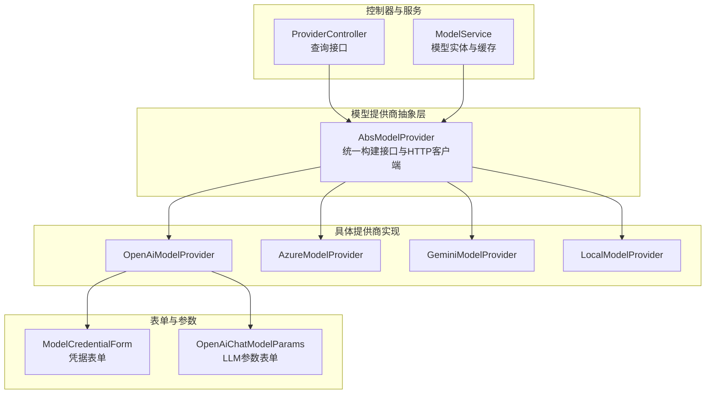
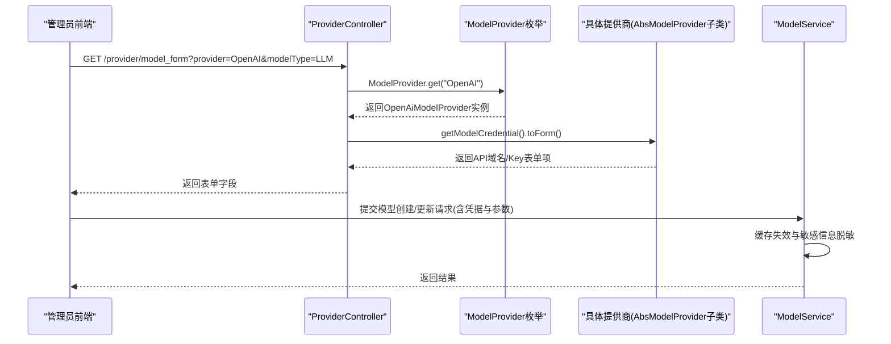
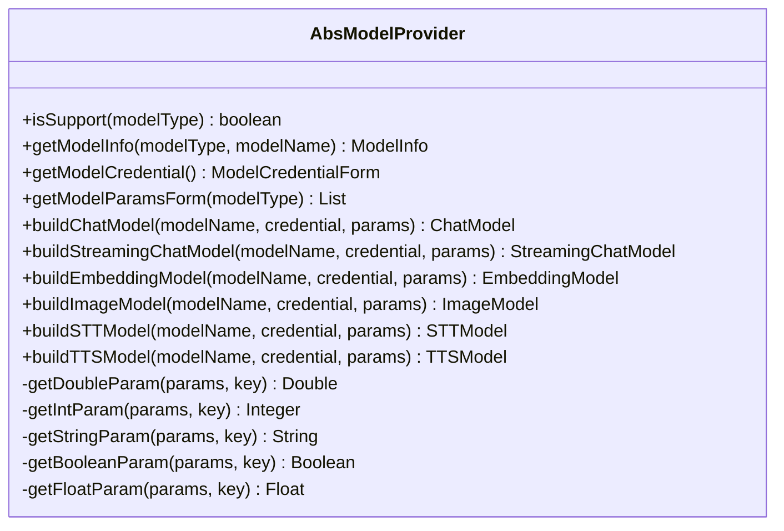
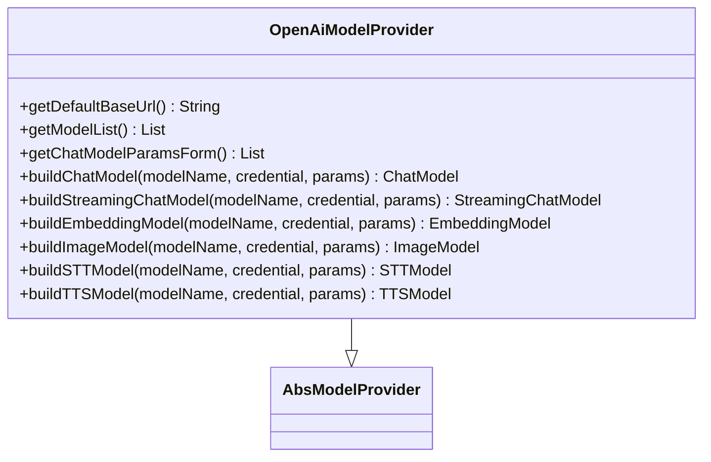
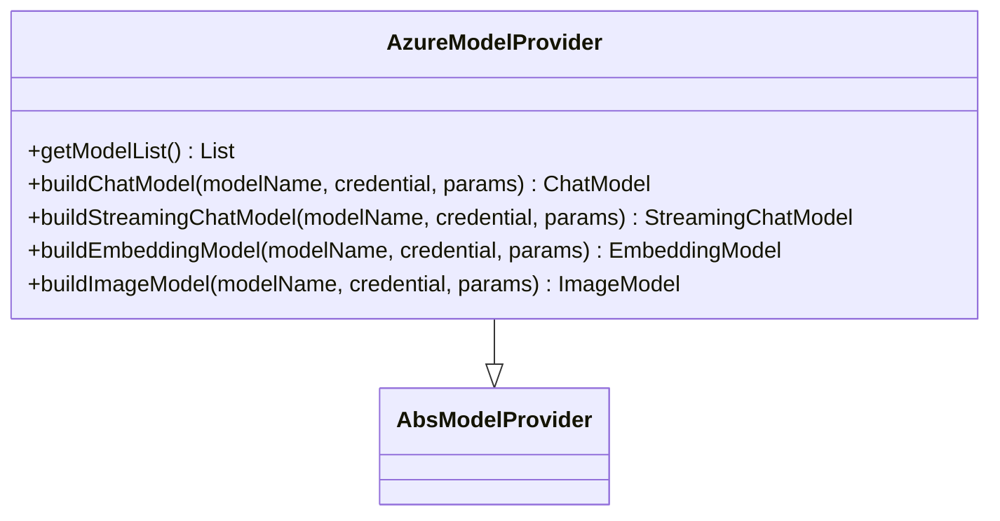
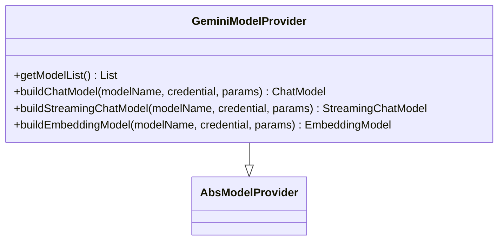
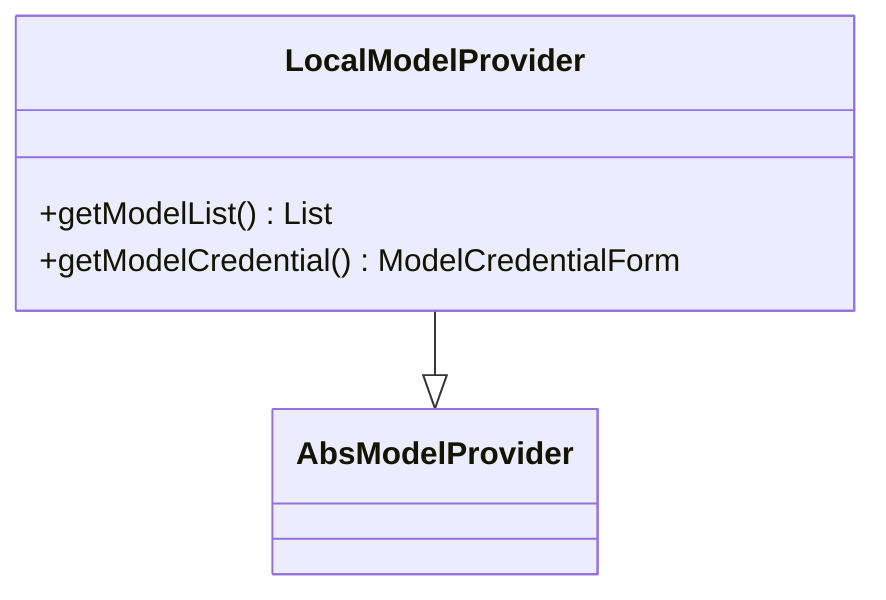
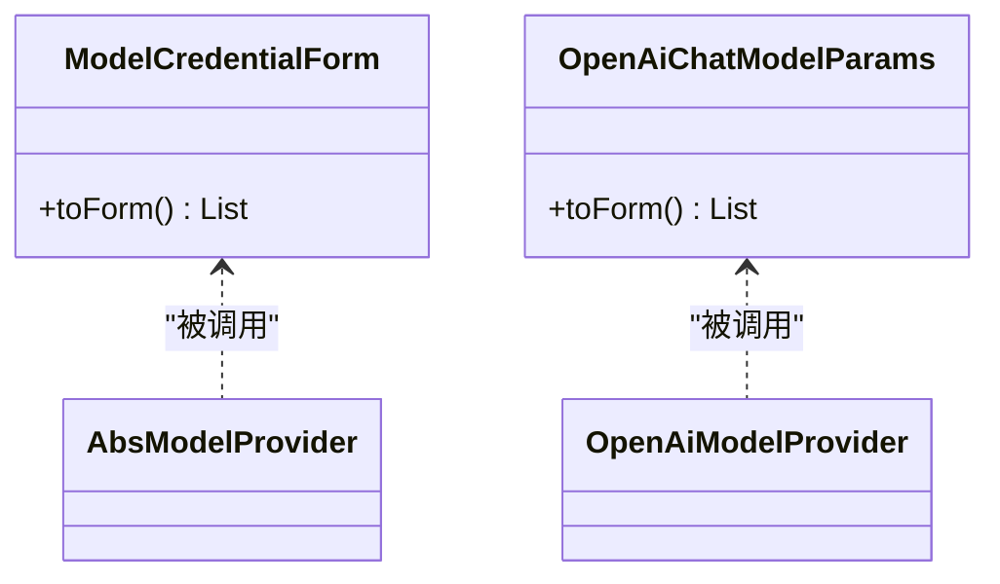
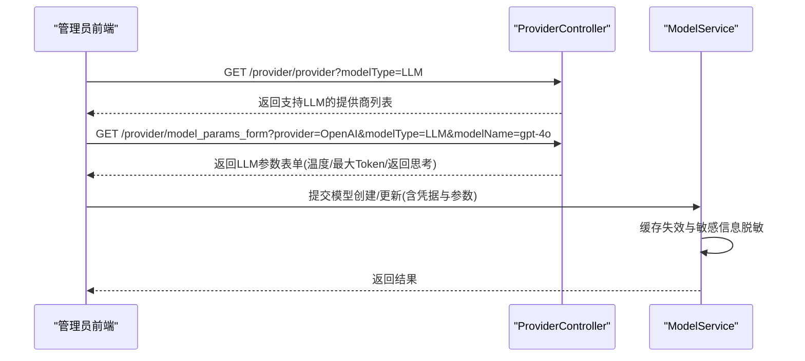
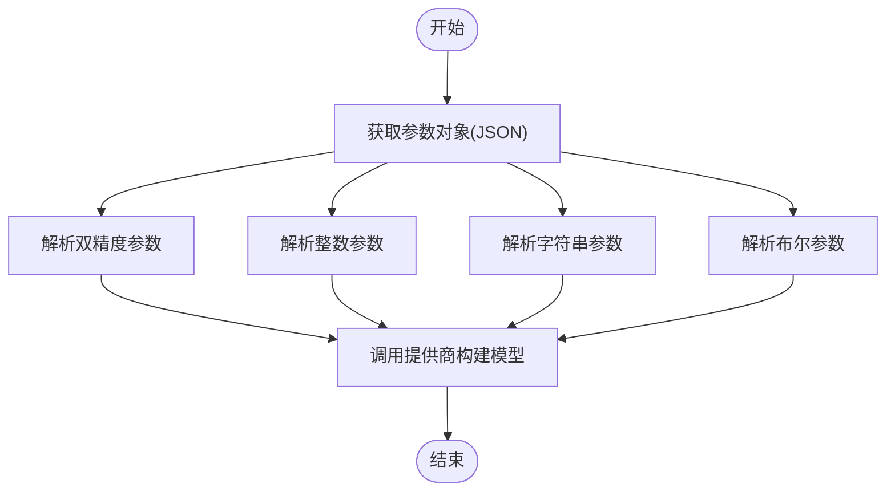

# 模型提供商配置

<cite>
**本文引用的文件**
- [AbsModelProvider.java](file://maxkb4j-service/maxkb4j-model/src/main/java/com/maxkb4j/model/provider/AbsModelProvider.java)
- [OpenAiModelProvider.java](file://maxkb4j-service/maxkb4j-model/src/main/java/com/maxkb4j/model/provider/OpenAiModelProvider.java)
- [AzureModelProvider.java](file://maxkb4j-service/maxkb4j-model/src/main/java/com/maxkb4j/model/provider/AzureModelProvider.java)
- [GeminiModelProvider.java](file://maxkb4j-service/maxkb4j-model/src/main/java/com/maxkb4j/model/provider/GeminiModelProvider.java)
- [LocalModelProvider.java](file://maxkb4j-service/maxkb4j-model/src/main/java/com/maxkb4j/model/provider/LocalModelProvider.java)
- [ModelCredentialForm.java](file://maxkb4j-service/maxkb4j-model/src/main/java/com/maxkb4j/model/custom/credential/ModelCredentialForm.java)
- [OpenAiChatModelParams.java](file://maxkb4j-service/maxkb4j-model/src/main/java/com/maxkb4j/model/custom/params/impl/OpenAiChatModelParams.java)
- [OpenAiSTTModel.java](file://maxkb4j-service/maxkb4j-model/src/main/java/com/maxkb4j/model/custom/model/OpenAiSTTModel.java)
- [OpenAiTTSModel.java](file://maxkb4j-service/maxkb4j-model/src/main/java/com/maxkb4j/model/custom/model/OpenAiTTSModel.java)
- [ModelProvider.java](file://maxkb4j-service/maxkb4j-model/src/main/java/com/maxkb4j/model/enums/ModelProvider.java)
- [ProviderController.java](file://maxkb4j-service/maxkb4j-model/src/main/java/com/maxkb4j/model/controller/ProviderController.java)
- [ModelService.java](file://maxkb4j-service/maxkb4j-model/src/main/java/com/maxkb4j/model/service/ModelService.java)
- [ModelProviderInfo.java](file://maxkb4j-service/maxkb4j-model/src/main/java/com/maxkb4j/model/vo/ModelProviderInfo.java)
</cite>

## 目录
1. [简介](#简介)
2. [项目结构](#项目结构)
3. [核心组件](#核心组件)
4. [架构总览](#架构总览)
5. [详细组件分析](#详细组件分析)
6. [依赖分析](#依赖分析)
7. [性能考虑](#性能考虑)
8. [故障排查指南](#故障排查指南)
9. [结论](#结论)
10. [附录](#附录)

## 简介
本文件面向MaxKB4j的“模型提供商配置”主题，系统化说明如何在平台中对接与配置各类AI模型提供商（如OpenAI、Azure OpenAI、Gemini、本地模型等），涵盖以下内容：
- 凭证管理：API域名、API Key的收集与表单展示策略
- 模型参数配置：温度、最大Token、返回思考等参数的定义与传递
- 构建模型实例：聊天、流式聊天、嵌入、图像、语音（STT/TTS）等能力的构建流程
- 高级配置：调用频率限制、成本控制、可用性监控与故障转移思路
- 可视化与调试：通过ProviderController提供的接口进行配置校验与参数表单获取
- 存储与访问控制：模型实体的缓存、权限与敏感信息脱敏展示

## 项目结构
模型提供商相关代码主要集中在maxkb4j-model模块，采用“抽象基类 + 具体提供商实现 + 控制器 + 服务”的分层设计：
- 抽象层：AbsModelProvider定义统一的构建接口与通用工具方法
- 适配层：各具体提供商（OpenAI、Azure、Gemini、Local等）实现自身模型清单与构建逻辑
- 表单层：ModelCredentialForm与IModelParams实现凭据与参数的可视化表单
- 控制器层：ProviderController提供查询提供商、模型列表、参数表单等接口
- 服务层：ModelService负责模型实体的增删改查、缓存与敏感信息处理



图表来源
- [AbsModelProvider.java:36-244](file://maxkb4j-service/maxkb4j-model/src/main/java/com/maxkb4j/model/provider/AbsModelProvider.java#L36-L244)
- [OpenAiModelProvider.java:29-125](file://maxkb4j-service/maxkb4j-model/src/main/java/com/maxkb4j/model/provider/OpenAiModelProvider.java#L29-L125)
- [AzureModelProvider.java:21-77](file://maxkb4j-service/maxkb4j-model/src/main/java/com/maxkb4j/model/provider/AzureModelProvider.java#L21-L77)
- [GeminiModelProvider.java:19-65](file://maxkb4j-service/maxkb4j-model/src/main/java/com/maxkb4j/model/provider/GeminiModelProvider.java#L19-L65)
- [LocalModelProvider.java:11-26](file://maxkb4j-service/maxkb4j-model/src/main/java/com/maxkb4j/model/provider/LocalModelProvider.java#L11-L26)
- [ModelCredentialForm.java:10-37](file://maxkb4j-service/maxkb4j-model/src/main/java/com/maxkb4j/model/custom/credential/ModelCredentialForm.java#L10-L37)
- [OpenAiChatModelParams.java:12-21](file://maxkb4j-service/maxkb4j-model/src/main/java/com/maxkb4j/model/custom/params/impl/OpenAiChatModelParams.java#L12-L21)
- [ProviderController.java:27-88](file://maxkb4j-service/maxkb4j-model/src/main/java/com/maxkb4j/model/controller/ProviderController.java#L27-L88)
- [ModelService.java:40-173](file://maxkb4j-service/maxkb4j-model/src/main/java/com/maxkb4j/model/service/ModelService.java#L40-L173)

章节来源
- [AbsModelProvider.java:36-244](file://maxkb4j-service/maxkb4j-model/src/main/java/com/maxkb4j/model/provider/AbsModelProvider.java#L36-L244)
- [ModelProvider.java:11-95](file://maxkb4j-service/maxkb4j-model/src/main/java/com/maxkb4j/model/enums/ModelProvider.java#L11-L95)
- [ProviderController.java:27-88](file://maxkb4j-service/maxkb4j-model/src/main/java/com/maxkb4j/model/controller/ProviderController.java#L27-L88)
- [ModelService.java:40-173](file://maxkb4j-service/maxkb4j-model/src/main/java/com/maxkb4j/model/service/ModelService.java#L40-L173)

## 核心组件
- 抽象基类AbsModelProvider
  - 统一的模型构建入口：buildChatModel、buildStreamingChatModel、buildEmbeddingModel、buildImageModel、buildSTTModel、buildTTSModel
  - 参数解析工具：getDoubleParam、getIntParam、getStringParam、getBooleanParam、getFloatParam
  - HTTP客户端延迟初始化：getHttpClientBuilder/buildHttpClientBuilder
  - 默认凭据表单：getModelCredential（默认显示API Key，OpenAI默认显示API域名）
  - 模型类型支持检测：isSupport、getModelInfo
- 具体提供商
  - OpenAI：内置常用模型清单；支持LLM、Embedding、Vision、TTI、STT/TTS
  - Azure OpenAI：基于部署名（deploymentName）的模型构建
  - Gemini：Google AI系列模型清单与参数映射
  - Local：本地ONNX模型占位，不强制凭据
- 表单与参数
  - ModelCredentialForm：按提供商需求动态显示API域名与API Key
  - OpenAiChatModelParams：温度、最大Token、是否返回思考等参数
- 控制器ProviderController：提供查询提供商、模型类型、模型列表、参数表单的REST接口
- 服务ModelService：模型实体的CRUD、缓存、权限与敏感信息脱敏

章节来源
- [AbsModelProvider.java:36-244](file://maxkb4j-service/maxkb4j-model/src/main/java/com/maxkb4j/model/provider/AbsModelProvider.java#L36-L244)
- [OpenAiModelProvider.java:29-125](file://maxkb4j-service/maxkb4j-model/src/main/java/com/maxkb4j/model/provider/OpenAiModelProvider.java#L29-L125)
- [AzureModelProvider.java:21-77](file://maxkb4j-service/maxkb4j-model/src/main/java/com/maxkb4j/model/provider/AzureModelProvider.java#L21-L77)
- [GeminiModelProvider.java:19-65](file://maxkb4j-service/maxkb4j-model/src/main/java/com/maxkb4j/model/provider/GeminiModelProvider.java#L19-L65)
- [LocalModelProvider.java:11-26](file://maxkb4j-service/maxkb4j-model/src/main/java/com/maxkb4j/model/provider/LocalModelProvider.java#L11-L26)
- [ModelCredentialForm.java:10-37](file://maxkb4j-service/maxkb4j-model/src/main/java/com/maxkb4j/model/custom/credential/ModelCredentialForm.java#L10-L37)
- [OpenAiChatModelParams.java:12-21](file://maxkb4j-service/maxkb4j-model/src/main/java/com/maxkb4j/model/custom/params/impl/OpenAiChatModelParams.java#L12-L21)
- [ProviderController.java:27-88](file://maxkb4j-service/maxkb4j-model/src/main/java/com/maxkb4j/model/controller/ProviderController.java#L27-L88)
- [ModelService.java:40-173](file://maxkb4j-service/maxkb4j-model/src/main/java/com/maxkb4j/model/service/ModelService.java#L40-L173)

## 架构总览
下图展示了从“查询配置表单”到“构建模型实例”的关键交互路径，以及凭据与参数在链路中的传递。



图表来源
- [ProviderController.java:55-59](file://maxkb4j-service/maxkb4j-model/src/main/java/com/maxkb4j/model/controller/ProviderController.java#L55-L59)
- [ModelProvider.java:77-82](file://maxkb4j-service/maxkb4j-model/src/main/java/com/maxkb4j/model/enums/ModelProvider.java#L77-L82)
- [AbsModelProvider.java:145-147](file://maxkb4j-service/maxkb4j-model/src/main/java/com/maxkb4j/model/provider/AbsModelProvider.java#L145-L147)
- [ModelService.java:120-131](file://maxkb4j-service/maxkb4j-model/src/main/java/com/maxkb4j/model/service/ModelService.java#L120-L131)

## 详细组件分析

### 抽象基类AbsModelProvider
- 设计要点
  - 将“模型构建”与“HTTP客户端”解耦，延迟初始化以减少启动开销
  - 提供统一的参数解析工具，保证调用方无需关心空值处理
  - 为未实现的功能提供“禁用实现”，避免空指针
- 关键方法
  - 构建方法族：buildChatModel、buildStreamingChatModel、buildEmbeddingModel、buildImageModel、buildSTTModel、buildTTSModel
  - 参数工具：getDoubleParam、getIntParam、getStringParam、getBooleanParam、getFloatParam
  - 凭据表单：getModelCredential（默认显示API Key；OpenAI默认显示API域名）



图表来源
- [AbsModelProvider.java:36-244](file://maxkb4j-service/maxkb4j-model/src/main/java/com/maxkb4j/model/provider/AbsModelProvider.java#L36-L244)

章节来源
- [AbsModelProvider.java:36-244](file://maxkb4j-service/maxkb4j-model/src/main/java/com/maxkb4j/model/provider/AbsModelProvider.java#L36-L244)

### OpenAI提供商
- 模型清单：包含LLM、Embedding、Vision、TTI、STT/TTS等多类型模型
- 默认基础URL：OpenAI官方v1端点
- 参数映射：温度、最大Token、是否返回思考
- 特殊能力：STT/TTS使用独立客户端封装



图表来源
- [OpenAiModelProvider.java:29-125](file://maxkb4j-service/maxkb4j-model/src/main/java/com/maxkb4j/model/provider/OpenAiModelProvider.java#L29-L125)
- [OpenAiSTTModel.java:13-37](file://maxkb4j-service/maxkb4j-model/src/main/java/com/maxkb4j/model/custom/model/OpenAiSTTModel.java#L13-L37)
- [OpenAiTTSModel.java:15-46](file://maxkb4j-service/maxkb4j-model/src/main/java/com/maxkb4j/model/custom/model/OpenAiTTSModel.java#L15-L46)

章节来源
- [OpenAiModelProvider.java:29-125](file://maxkb4j-service/maxkb4j-model/src/main/java/com/maxkb4j/model/provider/OpenAiModelProvider.java#L29-L125)
- [OpenAiChatModelParams.java:12-21](file://maxkb4j-service/maxkb4j-model/src/main/java/com/maxkb4j/model/custom/params/impl/OpenAiChatModelParams.java#L12-L21)
- [OpenAiSTTModel.java:13-37](file://maxkb4j-service/maxkb4j-model/src/main/java/com/maxkb4j/model/custom/model/OpenAiSTTModel.java#L13-L37)
- [OpenAiTTSModel.java:15-46](file://maxkb4j-service/maxkb4j-model/src/main/java/com/maxkb4j/model/custom/model/OpenAiTTSModel.java#L15-L46)

### Azure OpenAI提供商
- 模型清单：覆盖LLM、Embedding、Vision、TTI等
- 构建方式：使用部署名（deploymentName）而非模型名
- 参数映射：温度、最大Token



图表来源
- [AzureModelProvider.java:21-77](file://maxkb4j-service/maxkb4j-model/src/main/java/com/maxkb4j/model/provider/AzureModelProvider.java#L21-L77)

章节来源
- [AzureModelProvider.java:21-77](file://maxkb4j-service/maxkb4j-model/src/main/java/com/maxkb4j/model/provider/AzureModelProvider.java#L21-L77)

### Gemini提供商
- 模型清单：包含Gemini系列LLM与Embedding
- 参数映射：最大输出Token、温度



图表来源
- [GeminiModelProvider.java:19-65](file://maxkb4j-service/maxkb4j-model/src/main/java/com/maxkb4j/model/provider/GeminiModelProvider.java#L19-L65)

章节来源
- [GeminiModelProvider.java:19-65](file://maxkb4j-service/maxkb4j-model/src/main/java/com/maxkb4j/model/provider/GeminiModelProvider.java#L19-L65)

### 本地模型提供商
- 特点：不强制凭据，模型清单为空，用于本地ONNX等场景占位



图表来源
- [LocalModelProvider.java:11-26](file://maxkb4j-service/maxkb4j-model/src/main/java/com/maxkb4j/model/provider/LocalModelProvider.java#L11-L26)

章节来源
- [LocalModelProvider.java:11-26](file://maxkb4j-service/maxkb4j-model/src/main/java/com/maxkb4j/model/provider/LocalModelProvider.java#L11-L26)

### 凭证与参数表单
- ModelCredentialForm
  - 动态显示API域名与API Key，OpenAI默认显示API域名
  - 支持自定义默认基础URL
- OpenAiChatModelParams
  - 温度、最大Token、是否返回思考等参数的可视化表单



图表来源
- [ModelCredentialForm.java:10-37](file://maxkb4j-service/maxkb4j-model/src/main/java/com/maxkb4j/model/custom/credential/ModelCredentialForm.java#L10-L37)
- [OpenAiChatModelParams.java:12-21](file://maxkb4j-service/maxkb4j-model/src/main/java/com/maxkb4j/model/custom/params/impl/OpenAiChatModelParams.java#L12-L21)
- [AbsModelProvider.java:145-147](file://maxkb4j-service/maxkb4j-model/src/main/java/com/maxkb4j/model/provider/AbsModelProvider.java#L145-L147)
- [OpenAiModelProvider.java:51-53](file://maxkb4j-service/maxkb4j-model/src/main/java/com/maxkb4j/model/provider/OpenAiModelProvider.java#L51-L53)

章节来源
- [ModelCredentialForm.java:10-37](file://maxkb4j-service/maxkb4j-model/src/main/java/com/maxkb4j/model/custom/credential/ModelCredentialForm.java#L10-L37)
- [OpenAiChatModelParams.java:12-21](file://maxkb4j-service/maxkb4j-model/src/main/java/com/maxkb4j/model/custom/params/impl/OpenAiChatModelParams.java#L12-L21)
- [AbsModelProvider.java:145-147](file://maxkb4j-service/maxkb4j-model/src/main/java/com/maxkb4j/model/provider/AbsModelProvider.java#L145-L147)
- [OpenAiModelProvider.java:51-53](file://maxkb4j-service/maxkb4j-model/src/main/java/com/maxkb4j/model/provider/OpenAiModelProvider.java#L51-L53)

### 控制器与服务
- ProviderController
  - 查询提供商列表、模型类型、模型列表、参数表单
  - 依据模型类型过滤支持的提供商
- ModelService
  - 模型实体的CRUD、缓存（Caffeine）、权限控制
  - 更新时对敏感信息进行脱敏处理



图表来源
- [ProviderController.java:31-85](file://maxkb4j-service/maxkb4j-model/src/main/java/com/maxkb4j/model/controller/ProviderController.java#L31-L85)
- [ModelService.java:120-131](file://maxkb4j-service/maxkb4j-model/src/main/java/com/maxkb4j/model/service/ModelService.java#L120-L131)

章节来源
- [ProviderController.java:31-85](file://maxkb4j-service/maxkb4j-model/src/main/java/com/maxkb4j/model/controller/ProviderController.java#L31-L85)
- [ModelService.java:120-131](file://maxkb4j-service/maxkb4j-model/src/main/java/com/maxkb4j/model/service/ModelService.java#L120-L131)

## 依赖分析
- 枚举到实现的映射：ModelProvider枚举通过静态工厂创建具体提供商实例，并建立名称到实例的映射，便于控制器按名称检索
- 控制器依赖：ProviderController直接依赖ModelProvider枚举与具体提供商实例，用于返回表单与模型列表
- 服务依赖：ModelService依赖用户权限与缓存，确保安全与性能

```mermaid
graph LR
MPEnum["ModelProvider枚举"] --> |get()| Prov["具体提供商实例"]
PC["ProviderController"] --> |调用| Prov
MS["ModelService"] --> |读取/更新| Prov
```

图表来源
- [ModelProvider.java:77-82](file://maxkb4j-service/maxkb4j-model/src/main/java/com/maxkb4j/model/enums/ModelProvider.java#L77-L82)
- [ProviderController.java:47-48](file://maxkb4j-service/maxkb4j-model/src/main/java/com/maxkb4j/model/controller/ProviderController.java#L47-L48)
- [ModelService.java:164-172](file://maxkb4j-service/maxkb4j-model/src/main/java/com/maxkb4j/model/service/ModelService.java#L164-L172)

章节来源
- [ModelProvider.java:77-82](file://maxkb4j-service/maxkb4j-model/src/main/java/com/maxkb4j/model/enums/ModelProvider.java#L77-L82)
- [ProviderController.java:47-48](file://maxkb4j-service/maxkb4j-model/src/main/java/com/maxkb4j/model/controller/ProviderController.java#L47-L48)
- [ModelService.java:164-172](file://maxkb4j-service/maxkb4j-model/src/main/java/com/maxkb4j/model/service/ModelService.java#L164-L172)

## 性能考虑
- HTTP客户端延迟初始化：避免在构造阶段创建昂贵资源，提升启动速度
- 模型实体缓存：Caffeine缓存模型实体，设置写入与访问过期时间，降低数据库压力
- 参数解析空值安全：统一的参数解析工具减少空指针风险与重复判断
- 建议
  - 在高并发场景下，结合限流与熔断策略，避免上游API限流或抖动影响整体稳定性
  - 对于大模型调用，合理设置最大Token与温度，平衡质量与成本

章节来源
- [AbsModelProvider.java:44-60](file://maxkb4j-service/maxkb4j-model/src/main/java/com/maxkb4j/model/provider/AbsModelProvider.java#L44-L60)
- [ModelService.java:45-52](file://maxkb4j-service/maxkb4j-model/src/main/java/com/maxkb4j/model/service/ModelService.java#L45-L52)

## 故障排查指南
- 凭证问题
  - 确认API域名与API Key是否正确填写；OpenAI默认显示API域名，Azure需使用部署名
  - 若更新模型时仅修改了基础URL，系统会保留原API Key（脱敏展示），避免误删
- 参数问题
  - 温度过高可能导致输出不稳定；最大Token过大可能触发成本上升或超限
  - 若返回“禁用模型”，检查提供商是否实现了对应能力（如Local不提供STT/TTS）
- 接口问题
  - 使用ProviderController的参数表单接口确认当前模型支持的参数项
  - 通过模型列表接口核对目标模型是否存在
- 缓存问题
  - 更新模型后，系统会主动使缓存失效，确保下次读取最新配置

章节来源
- [ModelCredentialForm.java:27-36](file://maxkb4j-service/maxkb4j-model/src/main/java/com/maxkb4j/model/custom/credential/ModelCredentialForm.java#L27-L36)
- [OpenAiChatModelParams.java:14-20](file://maxkb4j-service/maxkb4j-model/src/main/java/com/maxkb4j/model/custom/params/impl/OpenAiChatModelParams.java#L14-L20)
- [ProviderController.java:55-73](file://maxkb4j-service/maxkb4j-model/src/main/java/com/maxkb4j/model/controller/ProviderController.java#L55-L73)
- [ModelService.java:122-127](file://maxkb4j-service/maxkb4j-model/src/main/java/com/maxkb4j/model/service/ModelService.java#L122-L127)

## 结论
MaxKB4j通过抽象基类与枚举映射，将多家模型提供商的差异收敛到统一的构建接口与表单体系中。OpenAI、Azure、Gemini等提供商在凭据与参数层面各有侧重，但均遵循一致的配置与调用流程。配合缓存与权限控制，系统在易用性、安全性与性能之间取得平衡。建议在生产环境中结合限流、熔断与成本监控，进一步提升稳定性与可控性。

## 附录

### 配置模板与示例（路径指引）
- OpenAI
  - 凭证表单字段：[ModelCredentialForm.toForm:27-36](file://maxkb4j-service/maxkb4j-model/src/main/java/com/maxkb4j/model/custom/credential/ModelCredentialForm.java#L27-L36)
  - LLM参数表单：[OpenAiChatModelParams.toForm:14-20](file://maxkb4j-service/maxkb4j-model/src/main/java/com/maxkb4j/model/custom/params/impl/OpenAiChatModelParams.java#L14-L20)
  - 构建聊天模型：[OpenAiModelProvider.buildChatModel:66-77](file://maxkb4j-service/maxkb4j-model/src/main/java/com/maxkb4j/model/provider/OpenAiModelProvider.java#L66-L77)
- Azure OpenAI
  - 模型清单：[AzureModelProvider.getModelList:37-40](file://maxkb4j-service/maxkb4j-model/src/main/java/com/maxkb4j/model/provider/AzureModelProvider.java#L37-L40)
  - 构建聊天模型：[AzureModelProvider.buildChatModel:43-50](file://maxkb4j-service/maxkb4j-model/src/main/java/com/maxkb4j/model/provider/AzureModelProvider.java#L43-L50)
- Gemini
  - 构建聊天模型：[GeminiModelProvider.buildChatModel:36-44](file://maxkb4j-service/maxkb4j-model/src/main/java/com/maxkb4j/model/provider/GeminiModelProvider.java#L36-L44)
- 本地模型
  - 凭证表单：[LocalModelProvider.getModelCredential:22-24](file://maxkb4j-service/maxkb4j-model/src/main/java/com/maxkb4j/model/provider/LocalModelProvider.java#L22-L24)

### 调用流程（参数解析与构建）


图表来源
- [AbsModelProvider.java:68-115](file://maxkb4j-service/maxkb4j-model/src/main/java/com/maxkb4j/model/provider/AbsModelProvider.java#L68-L115)
- [OpenAiModelProvider.java:66-114](file://maxkb4j-service/maxkb4j-model/src/main/java/com/maxkb4j/model/provider/OpenAiModelProvider.java#L66-L114)