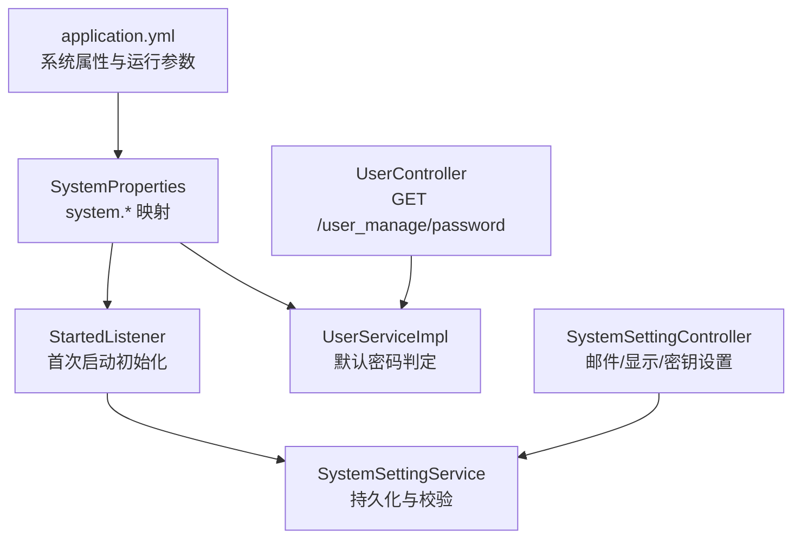
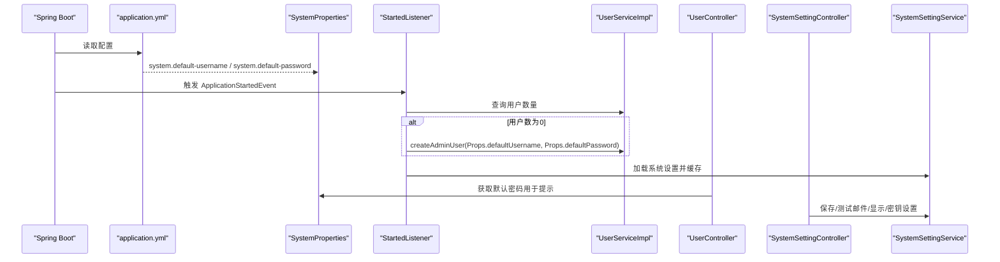
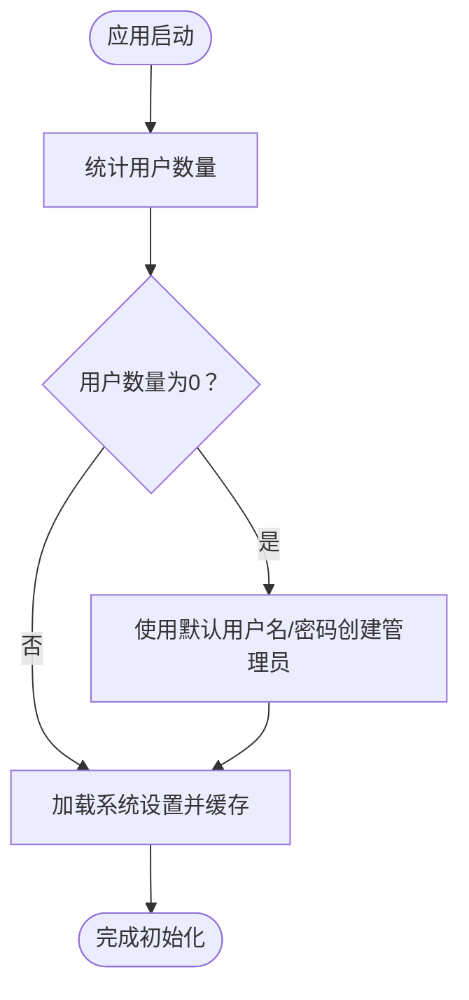
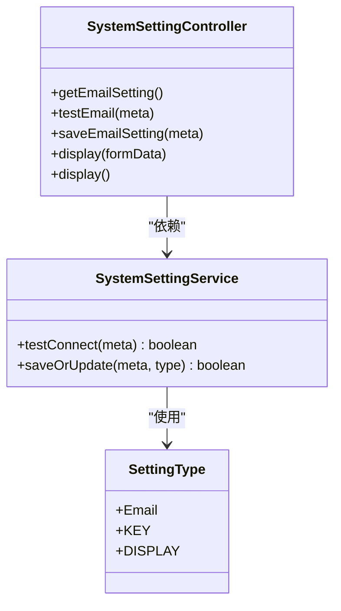
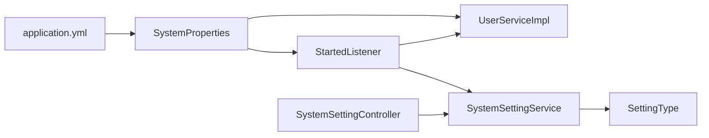

# 系统属性配置

<cite>
**本文引用的文件**
- [SystemProperties.java](file://maxkb4j-common/src/main/java/com/maxkb4j/common/props/SystemProperties.java)
- [application.yml](file://maxkb4j-start/src/main/resources/application.yml)
- [application-dev.yml](file://maxkb4j-start/src/main/resources/application-dev.yml)
- [application-prod.yml](file://maxkb4j-start/src/main/resources/application-prod.yml)
- [StartedListener.java](file://maxkb4j-start/src/main/java/com/maxkb4j/start/listener/StartedListener.java)
- [UserController.java](file://maxkb4j-service/maxkb4j-system/src/main/java/com/maxkb4j/system/controller/UserController.java)
- [UserServiceImpl.java](file://maxkb4j-service/maxkb4j-system/src/main/java/com/maxkb4j/system/service/impl/UserServiceImpl.java)
- [SystemSettingController.java](file://maxkb4j-service/maxkb4j-system/src/main/java/com/maxkb4j/system/controller/SystemSettingController.java)
- [SystemSettingService.java](file://maxkb4j-service/maxkb4j-system/src/main/java/com/maxkb4j/system/service/SystemSettingService.java)
- [SettingType.java](file://maxkb4j-service/maxkb4j-system/src/main/java/com/maxkb4j/system/enums/SettingType.java)
</cite>

## 目录
1. [简介](#简介)
2. [项目结构](#项目结构)
3. [核心组件](#核心组件)
4. [架构总览](#架构总览)
5. [详细组件分析](#详细组件分析)
6. [依赖关系分析](#依赖关系分析)
7. [性能与可用性考量](#性能与可用性考量)
8. [故障排查指南](#故障排查指南)
9. [结论](#结论)
10. [附录](#附录)

## 简介
本文件聚焦于 MaxKB4j 的系统属性配置，围绕 SystemProperties 类及其在启动流程、用户服务与系统设置中的使用进行深入解析。内容涵盖：
- 系统默认用户名/密码配置项的来源、作用与影响范围
- 系统行为控制参数（如 JWT 密钥、邮件设置、显示配置等）
- 运行时配置选项（系统设置持久化、缓存加载、启动初始化）
- 环境变量的使用方法与优先级规则
- 动态修改与热更新机制说明
- 属性对应用行为的影响与配置验证方法
- 调试技巧与故障排查建议
- 不同部署场景下的属性配置建议

## 项目结构
与系统属性配置直接相关的模块与文件如下：
- 配置模型：SystemProperties（system 命名空间）
- 启动监听器：StartedListener（首次启动自动创建管理员账户、加载系统设置）
- 用户服务：UserServiceImpl（使用默认密码判断“是否需要修改初始密码”）
- 控制器：UserController（对外暴露默认密码查询接口）
- 系统设置：SystemSettingController/SystemSettingService（邮件、显示、密钥等设置的读写与校验）
- 配置文件：application.yml 及其环境配置文件（dev/prod）

图表来源
- [application.yml:67-69](file://maxkb4j-start/src/main/resources/application.yml#L67-L69)
- [SystemProperties.java:10-17](file://maxkb4j-common/src/main/java/com/maxkb4j/common/props/SystemProperties.java#L10-L17)
- [StartedListener.java:44-68](file://maxkb4j-start/src/main/java/com/maxkb4j/start/listener/StartedListener.java#L44-L68)
- [UserServiceImpl.java:161](file://maxkb4j-service/maxkb4j-system/src/main/java/com/maxkb4j/system/service/impl/UserServiceImpl.java#L161)
- [UserController.java:54-56](file://maxkb4j-service/maxkb4j-system/src/main/java/com/maxkb4j/system/controller/UserController.java#L54-L56)
- [SystemSettingController.java:28-66](file://maxkb4j-service/maxkb4j-system/src/main/java/com/maxkb4j/system/controller/SystemSettingController.java#L28-L66)
- [SystemSettingService.java:25-32](file://maxkb4j-service/maxkb4j-system/src/main/java/com/maxkb4j/system/service/SystemSettingService.java#L25-L32)

章节来源
- [application.yml:1-69](file://maxkb4j-start/src/main/resources/application.yml#L1-L69)
- [SystemProperties.java:1-18](file://maxkb4j-common/src/main/java/com/maxkb4j/common/props/SystemProperties.java#L1-L18)
- [StartedListener.java:1-92](file://maxkb4j-start/src/main/java/com/maxkb4j/start/listener/StartedListener.java#L1-L92)
- [UserServiceImpl.java:1-235](file://maxkb4j-service/maxkb4j-system/src/main/java/com/maxkb4j/system/service/impl/UserServiceImpl.java#L1-L235)
- [UserController.java:1-97](file://maxkb4j-service/maxkb4j-system/src/main/java/com/maxkb4j/system/controller/UserController.java#L1-L97)
- [SystemSettingController.java:1-68](file://maxkb4j-service/maxkb4j-system/src/main/java/com/maxkb4j/system/controller/SystemSettingController.java#L1-L68)
- [SystemSettingService.java:1-34](file://maxkb4j-service/maxkb4j-system/src/main/java/com/maxkb4j/system/service/SystemSettingService.java#L1-L34)

## 核心组件
- SystemProperties：通过 @ConfigurationProperties("system") 将 application.yml 中 system.* 键映射到 Java 对象，当前包含默认用户名与默认密码两个字段。
- StartedListener：应用启动后执行初始化逻辑，若无用户则使用 SystemProperties 创建管理员；若系统设置为空则生成并保存密钥对。
- UserServiceImpl：在用户查询时使用 SystemProperties.defaultPassword 判断用户是否使用初始密码。
- UserController：提供查询默认密码的接口，便于前端提示初始登录后的修改引导。
- SystemSettingController/SystemSettingService：提供邮件、显示、密钥等系统设置的读取、测试与保存。

章节来源
- [SystemProperties.java:10-17](file://maxkb4j-common/src/main/java/com/maxkb4j/common/props/SystemProperties.java#L10-L17)
- [StartedListener.java:44-68](file://maxkb4j-start/src/main/java/com/maxkb4j/start/listener/StartedListener.java#L44-L68)
- [UserServiceImpl.java:161](file://maxkb4j-service/maxkb4j-system/src/main/java/com/maxkb4j/system/service/impl/UserServiceImpl.java#L161)
- [UserController.java:54-56](file://maxkb4j-service/maxkb4j-system/src/main/java/com/maxkb4j/system/controller/UserController.java#L54-L56)
- [SystemSettingController.java:28-66](file://maxkb4j-service/maxkb4j-system/src/main/java/com/maxkb4j/system/controller/SystemSettingController.java#L28-L66)
- [SystemSettingService.java:25-32](file://maxkb4j-service/maxkb4j-system/src/main/java/com/maxkb4j/system/service/SystemSettingService.java#L25-L32)

## 架构总览
下图展示系统属性在启动与运行阶段的关键交互路径：

图表来源
- [application.yml:67-69](file://maxkb4j-start/src/main/resources/application.yml#L67-L69)
- [SystemProperties.java:10-17](file://maxkb4j-common/src/main/java/com/maxkb4j/common/props/SystemProperties.java#L10-L17)
- [StartedListener.java:44-68](file://maxkb4j-start/src/main/java/com/maxkb4j/start/listener/StartedListener.java#L44-L68)
- [UserServiceImpl.java:161](file://maxkb4j-service/maxkb4j-system/src/main/java/com/maxkb4j/system/service/impl/UserServiceImpl.java#L161)
- [UserController.java:54-56](file://maxkb4j-service/maxkb4j-system/src/main/java/com/maxkb4j/system/controller/UserController.java#L54-L56)
- [SystemSettingController.java:28-66](file://maxkb4j-service/maxkb4j-system/src/main/java/com/maxkb4j/system/controller/SystemSettingController.java#L28-L66)
- [SystemSettingService.java:25-32](file://maxkb4j-service/maxkb4j-system/src/main/java/com/maxkb4j/system/service/SystemSettingService.java#L25-L32)

## 详细组件分析

### SystemProperties 类与 system 命名空间
- 映射前缀：system
- 字段：
  - defaultUsername：默认用户名
  - defaultPassword：默认密码（支持环境变量覆盖）
- 作用：作为系统默认凭据，驱动首次启动创建管理员账户与前端提示初始密码修改。

章节来源
- [SystemProperties.java:10-17](file://maxkb4j-common/src/main/java/com/maxkb4j/common/props/SystemProperties.java#L10-L17)
- [application.yml:67-69](file://maxkb4j-start/src/main/resources/application.yml#L67-L69)

### 启动初始化与默认管理员创建
- 流程要点：
  - 应用启动后，StartedListener 检查用户数量
  - 若为 0，则使用 SystemProperties.defaultUsername 与 SystemProperties.defaultPassword 创建管理员
- 影响：确保首次部署无需手动创建管理员，提升初始体验。

图表来源
- [StartedListener.java:44-68](file://maxkb4j-start/src/main/java/com/maxkb4j/start/listener/StartedListener.java#L44-L68)
- [SystemProperties.java:10-17](file://maxkb4j-common/src/main/java/com/maxkb4j/common/props/SystemProperties.java#L10-L17)

章节来源
- [StartedListener.java:44-68](file://maxkb4j-start/src/main/java/com/maxkb4j/start/listener/StartedListener.java#L44-L68)

### 默认密码判定与前端提示
- UserServiceImpl 在获取用户详情时，会将当前密码与 SystemProperties.defaultPassword 的加密结果对比，用于判断是否为初始密码。
- UserController 提供查询默认密码的接口，便于前端提示用户首次登录后修改密码。

章节来源
- [UserServiceImpl.java:161](file://maxkb4j-service/maxkb4j-system/src/main/java/com/maxkb4j/system/service/impl/UserServiceImpl.java#L161)
- [UserController.java:54-56](file://maxkb4j-service/maxkb4j-system/src/main/java/com/maxkb4j/system/controller/UserController.java#L54-L56)

### 系统设置与运行时配置
- 邮件设置：SystemSettingController 提供读取、测试与保存接口；SystemSettingService 负责持久化与连接测试。
- 显示设置：SystemSettingController 支持上传/读取显示配置。
- 密钥设置：首次启动若未存在密钥对，StartedListener 会生成并保存，类型为 SettingType.KEY。

图表来源
- [SystemSettingController.java:28-66](file://maxkb4j-service/maxkb4j-system/src/main/java/com/maxkb4j/system/controller/SystemSettingController.java#L28-L66)
- [SystemSettingService.java:25-32](file://maxkb4j-service/maxkb4j-system/src/main/java/com/maxkb4j/system/service/SystemSettingService.java#L25-L32)
- [SettingType.java:6-19](file://maxkb4j-service/maxkb4j-system/src/main/java/com/maxkb4j/system/enums/SettingType.java#L6-L19)

章节来源
- [SystemSettingController.java:1-68](file://maxkb4j-service/maxkb4j-system/src/main/java/com/maxkb4j/system/controller/SystemSettingController.java#L1-L68)
- [SystemSettingService.java:1-34](file://maxkb4j-service/maxkb4j-system/src/main/java/com/maxkb4j/system/service/SystemSettingService.java#L1-L34)
- [SettingType.java:1-20](file://maxkb4j-service/maxkb4j-system/src/main/java/com/maxkb4j/system/enums/SettingType.java#L1-L20)

### 环境变量使用与优先级规则
- 系统默认密码支持环境变量覆盖：当未在配置文件中设置时，可由环境变量注入。
- JWT 密钥同样支持环境变量覆盖，避免硬编码在配置文件中。
- 优先级（从高到低）：环境变量 > application.yml > 默认值。

章节来源
- [application.yml:39-40](file://maxkb4j-start/src/main/resources/application.yml#L39-L40)
- [application.yml:69](file://maxkb4j-start/src/main/resources/application.yml#L69)

### 动态修改与热更新机制
- 系统设置（邮件、显示、密钥）可通过 SystemSettingController 接口进行动态修改，并由 SystemSettingService 持久化。
- StartedListener 在启动时会将系统设置加载至缓存，后续运行期间可直接从缓存读取。
- 注意：SystemProperties 的值在启动时绑定，运行时修改不会自动生效；如需生效，需重启应用。

章节来源
- [SystemSettingController.java:28-66](file://maxkb4j-service/maxkb4j-system/src/main/java/com/maxkb4j/system/controller/SystemSettingController.java#L28-L66)
- [SystemSettingService.java:25-32](file://maxkb4j-service/maxkb4j-system/src/main/java/com/maxkb4j/system/service/SystemSettingService.java#L25-L32)
- [StartedListener.java:64-66](file://maxkb4j-start/src/main/java/com/maxkb4j/start/listener/StartedListener.java#L64-L66)

### 配置验证方法
- 邮件设置：通过 SystemSettingController 的测试接口验证连接。
- 显示设置：通过上传接口保存后读取确认。
- 密钥设置：首次启动自动生成并保存，后续可通过接口查看。

章节来源
- [SystemSettingController.java:36-50](file://maxkb4j-service/maxkb4j-system/src/main/java/com/maxkb4j/system/controller/SystemSettingController.java#L36-L50)
- [SystemSettingService.java:21-23](file://maxkb4j-service/maxkb4j-system/src/main/java/com/maxkb4j/system/service/SystemSettingService.java#L21-L23)
- [StartedListener.java:52-62](file://maxkb4j-start/src/main/java/com/maxkb4j/start/listener/StartedListener.java#L52-L62)

## 依赖关系分析
- SystemProperties 依赖 application.yml 的 system.* 配置。
- StartedListener 依赖 SystemProperties、UserService、SystemSettingService。
- UserServiceImpl 依赖 SystemProperties 与数据库。
- SystemSettingController 依赖 SystemSettingService。
- SettingType 定义了系统设置的类型枚举。

图表来源
- [application.yml:67-69](file://maxkb4j-start/src/main/resources/application.yml#L67-L69)
- [SystemProperties.java:10-17](file://maxkb4j-common/src/main/java/com/maxkb4j/common/props/SystemProperties.java#L10-L17)
- [StartedListener.java:44-68](file://maxkb4j-start/src/main/java/com/maxkb4j/start/listener/StartedListener.java#L44-L68)
- [UserServiceImpl.java:161](file://maxkb4j-service/maxkb4j-system/src/main/java/com/maxkb4j/system/service/impl/UserServiceImpl.java#L161)
- [SystemSettingController.java:28-66](file://maxkb4j-service/maxkb4j-system/src/main/java/com/maxkb4j/system/controller/SystemSettingController.java#L28-L66)
- [SystemSettingService.java:25-32](file://maxkb4j-service/maxkb4j-system/src/main/java/com/maxkb4j/system/service/SystemSettingService.java#L25-L32)
- [SettingType.java:6-19](file://maxkb4j-service/maxkb4j-system/src/main/java/com/maxkb4j/system/enums/SettingType.java#L6-L19)

章节来源
- [application.yml:1-69](file://maxkb4j-start/src/main/resources/application.yml#L1-L69)
- [SystemProperties.java:1-18](file://maxkb4j-common/src/main/java/com/maxkb4j/common/props/SystemProperties.java#L1-L18)
- [StartedListener.java:1-92](file://maxkb4j-start/src/main/java/com/maxkb4j/start/listener/StartedListener.java#L1-L92)
- [UserServiceImpl.java:1-235](file://maxkb4j-service/maxkb4j-system/src/main/java/com/maxkb4j/system/service/impl/UserServiceImpl.java#L1-L235)
- [SystemSettingController.java:1-68](file://maxkb4j-service/maxkb4j-system/src/main/java/com/maxkb4j/system/controller/SystemSettingController.java#L1-L68)
- [SystemSettingService.java:1-34](file://maxkb4j-service/maxkb4j-system/src/main/java/com/maxkb4j/system/service/SystemSettingService.java#L1-L34)
- [SettingType.java:1-20](file://maxkb4j-service/maxkb4j-system/src/main/java/com/maxkb4j/system/enums/SettingType.java#L1-L20)

## 性能与可用性考量
- 首次启动初始化仅在用户数为 0 时触发，避免不必要的开销。
- 系统设置加载至缓存，减少重复读取数据库的次数。
- JWT 密钥与密钥对生成属于启动时一次性操作，对运行时性能影响极小。
- 建议在生产环境通过环境变量注入敏感配置，避免明文写入配置文件。

[本节为通用建议，不涉及具体文件分析]

## 故障排查指南
- 默认管理员未创建
  - 检查 SystemProperties 的 defaultUsername/defaultPassword 是否正确配置
  - 确认应用启动日志中是否执行了初始化逻辑
- 默认密码提示异常
  - 确认 UserServiceImpl 中对默认密码的加密比对逻辑是否正常
  - 检查 UserController 返回的默认密码是否与配置一致
- 邮件设置无法保存或测试失败
  - 使用 SystemSettingController 的测试接口验证连接
  - 检查 SystemSettingService 的持久化逻辑与数据库状态
- 密钥设置缺失
  - 首次启动应自动生成并保存；若缺失，检查 StartedListener 的执行与异常日志
- 环境变量未生效
  - 确认环境变量名称与 application.yml 中占位符一致
  - 检查容器/进程的环境变量注入是否正确

章节来源
- [StartedListener.java:44-68](file://maxkb4j-start/src/main/java/com/maxkb4j/start/listener/StartedListener.java#L44-L68)
- [UserServiceImpl.java:161](file://maxkb4j-service/maxkb4j-system/src/main/java/com/maxkb4j/system/service/impl/UserServiceImpl.java#L161)
- [UserController.java:54-56](file://maxkb4j-service/maxkb4j-system/src/main/java/com/maxkb4j/system/controller/UserController.java#L54-L56)
- [SystemSettingController.java:36-50](file://maxkb4j-service/maxkb4j-system/src/main/java/com/maxkb4j/system/controller/SystemSettingController.java#L36-L50)
- [SystemSettingService.java:21-32](file://maxkb4j-service/maxkb4j-system/src/main/java/com/maxkb4j/system/service/SystemSettingService.java#L21-L32)

## 结论
SystemProperties 作为系统默认配置的核心载体，贯穿启动初始化、用户管理与系统设置等多个环节。通过合理的环境变量注入与运行时配置管理，可实现安全、灵活且易维护的部署体验。建议在生产环境中严格区分环境变量与配置文件，结合系统设置的动态修改能力，确保系统属性的可控与可观测。

[本节为总结性内容，不涉及具体文件分析]

## 附录

### 不同部署场景下的属性配置建议
- 开发环境
  - 使用 application-dev.yml 配置数据源与 MongoDB 连接
  - 默认密码可在 application.yml 中设置，便于本地调试
- 生产环境
  - 通过环境变量注入 system.default-password 与 sa-token.jwt-secret-key
  - 数据源与 MongoDB 连接使用 application-prod.yml 或外部配置中心
  - 系统设置（邮件、显示、密钥）通过接口动态配置并持久化

章节来源
- [application-dev.yml:1-11](file://maxkb4j-start/src/main/resources/application-dev.yml#L1-L11)
- [application-prod.yml:1-9](file://maxkb4j-start/src/main/resources/application-prod.yml#L1-L9)
- [application.yml:67-69](file://maxkb4j-start/src/main/resources/application.yml#L67-L69)
- [application.yml:39-40](file://maxkb4j-start/src/main/resources/application.yml#L39-L40)