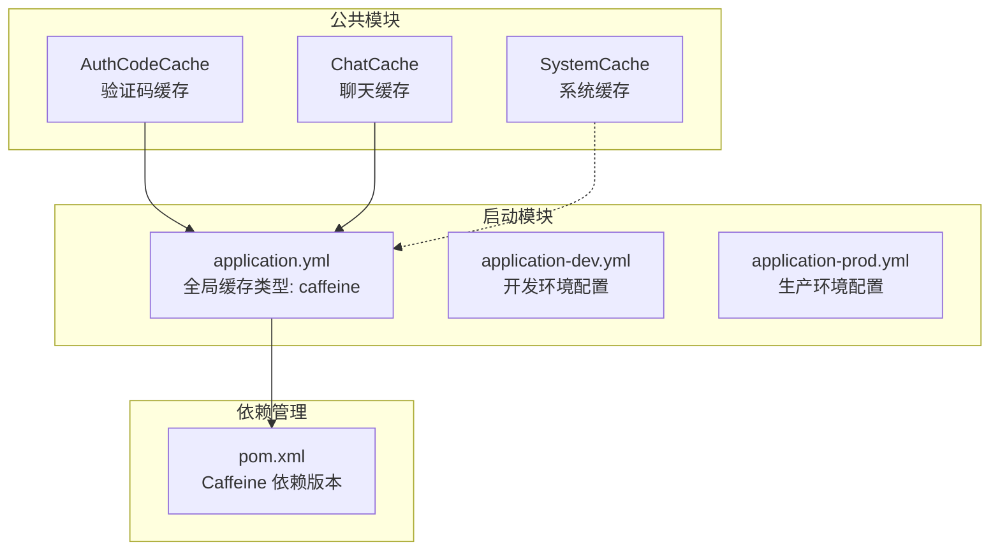
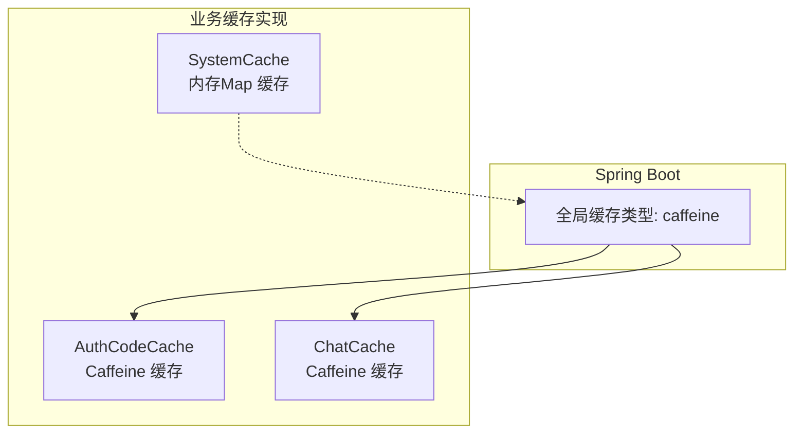
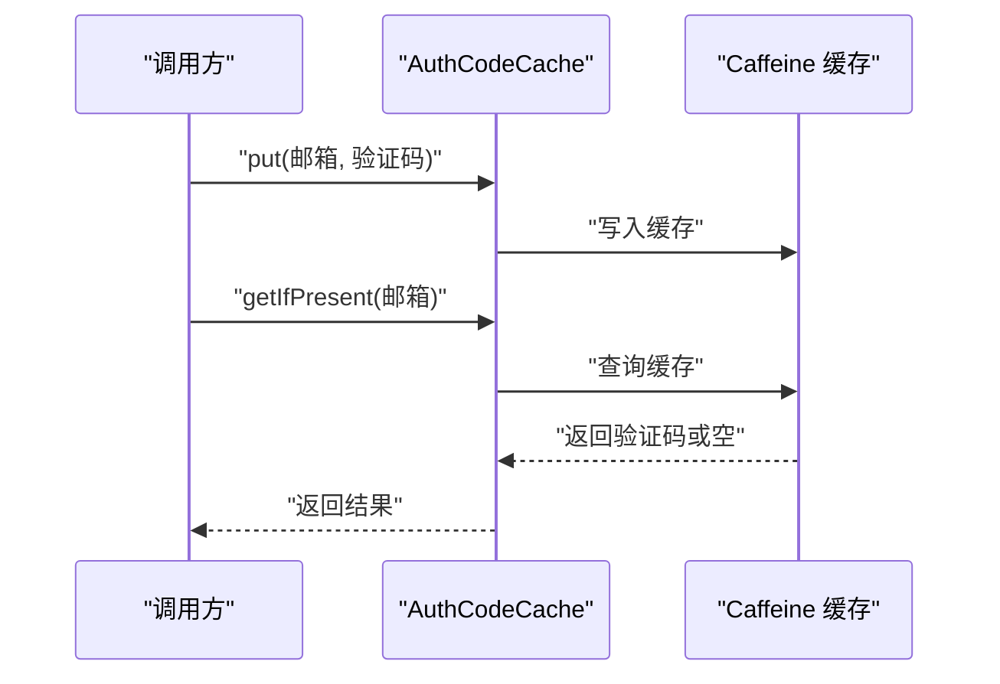
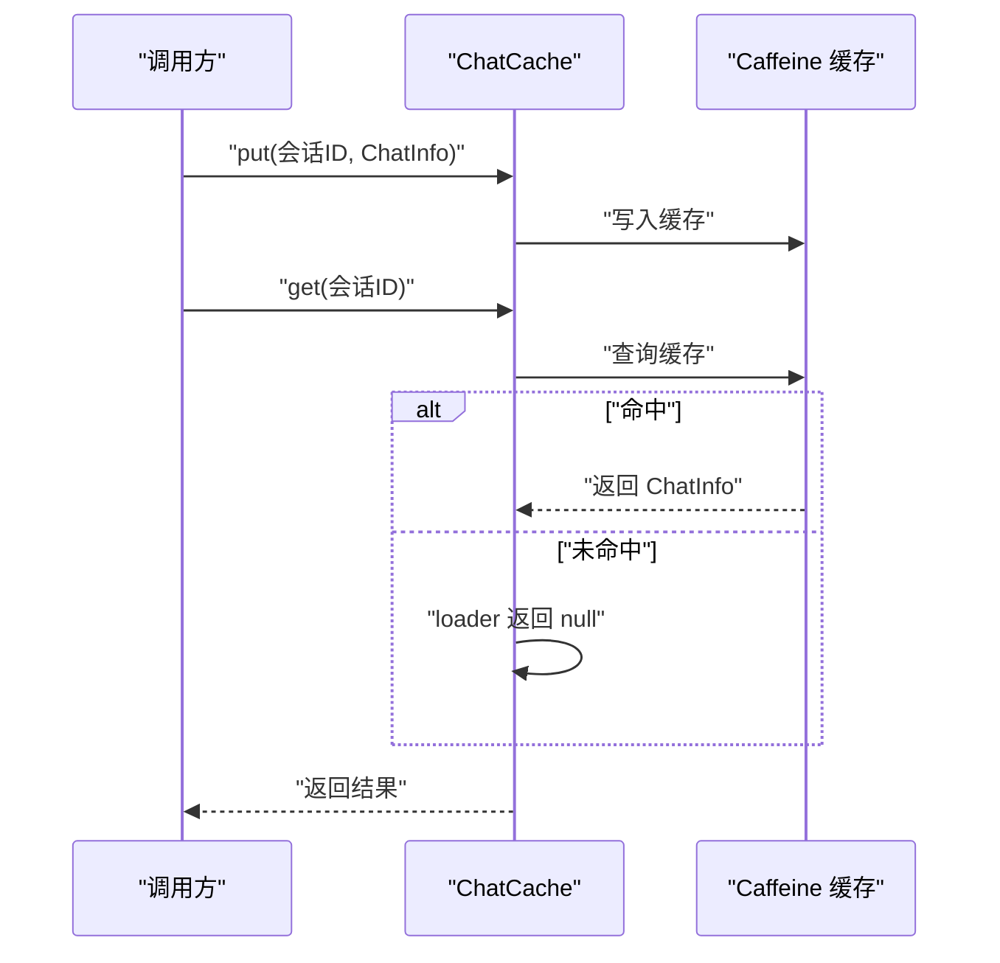
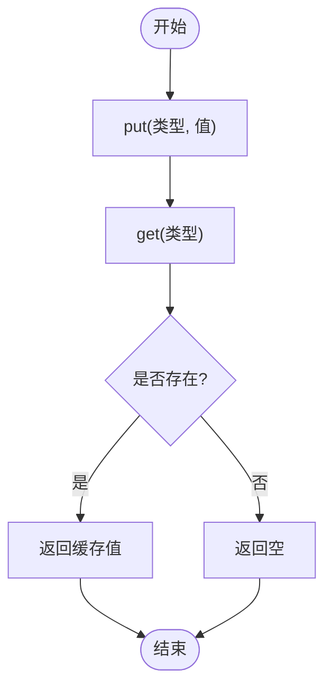
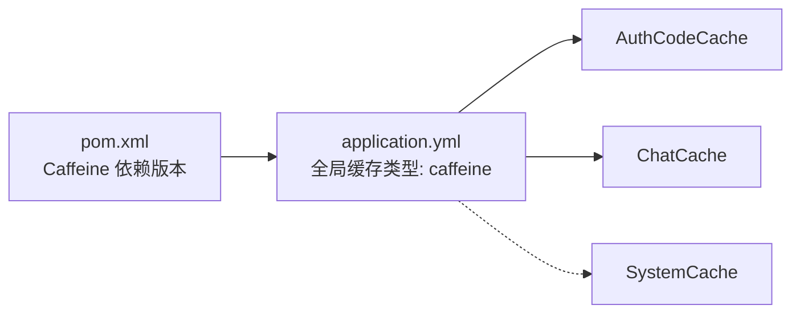

# 缓存配置

<cite>
**本文引用的文件**
- [AuthCodeCache.java](file://maxkb4j-common/src/main/java/com/maxkb4j/common/cache/AuthCodeCache.java)
- [ChatCache.java](file://maxkb4j-common/src/main/java/com/maxkb4j/common/cache/ChatCache.java)
- [SystemCache.java](file://maxkb4j-common/src/main/java/com/maxkb4j/common/cache/SystemCache.java)
- [application.yml](file://maxkb4j-start/src/main/resources/application.yml)
- [application-dev.yml](file://maxkb4j-start/src/main/resources/application-dev.yml)
- [application-prod.yml](file://maxkb4j-start/src/main/resources/application-prod.yml)
- [pom.xml](file://pom.xml)
</cite>

## 目录
1. [简介](#简介)
2. [项目结构](#项目结构)
3. [核心组件](#核心组件)
4. [架构总览](#架构总览)
5. [详细组件分析](#详细组件分析)
6. [依赖分析](#依赖分析)
7. [性能考量](#性能考量)
8. [故障排查指南](#故障排查指南)
9. [结论](#结论)
10. [附录](#附录)

## 简介
本文件面向MaxKB4j的缓存系统，聚焦于Caffeine本地缓存的配置与使用。当前代码库中存在三类缓存实现：
- 验证码缓存：用于短期验证码存储与校验
- 聊天缓存：用于会话上下文或临时状态的缓存
- 系统缓存：基于内存Map的简单键值缓存，用于系统级配置或密钥等

同时，Spring Boot层面已启用Caffeine作为全局缓存类型，但未见显式自定义Caffeine配置参数（如初始容量、过期策略、统计等）。因此，本文将结合现有实现与Spring配置，给出参数解读、使用场景、键设计原则、过期策略、内存限制、性能调优、分布式一致性考虑以及故障排查与监控建议。

## 项目结构
与缓存相关的关键位置如下：
- 公共模块中的缓存实现位于 maxkb4j-common 的 com.maxkb4j.common.cache 包
- Spring Boot全局缓存类型在 maxkb4j-start 的 application.yml 中声明为 Caffeine
- 顶层pom.xml声明了Caffeine依赖版本

图表来源
- [AuthCodeCache.java:1-28](file://maxkb4j-common/src/main/java/com/maxkb4j/common/cache/AuthCodeCache.java#L1-L28)
- [ChatCache.java:1-31](file://maxkb4j-common/src/main/java/com/maxkb4j/common/cache/ChatCache.java#L1-L31)
- [SystemCache.java:1-36](file://maxkb4j-common/src/main/java/com/maxkb4j/common/cache/SystemCache.java#L1-L36)
- [application.yml:19-20](file://maxkb4j-start/src/main/resources/application.yml#L19-L20)
- [application-dev.yml:1-11](file://maxkb4j-start/src/main/resources/application-dev.yml#L1-L11)
- [application-prod.yml:1-9](file://maxkb4j-start/src/main/resources/application-prod.yml#L1-L9)
- [pom.xml:64-76](file://pom.xml#L64-L76)

章节来源
- [application.yml:1-69](file://maxkb4j-start/src/main/resources/application.yml#L1-L69)
- [application-dev.yml:1-11](file://maxkb4j-start/src/main/resources/application-dev.yml#L1-L11)
- [application-prod.yml:1-9](file://maxkb4j-start/src/main/resources/application-prod.yml#L1-L9)
- [pom.xml:64-76](file://pom.xml#L64-L76)

## 核心组件
本节对三类缓存进行参数与行为解读，并说明其适用场景。

- 验证码缓存（AuthCodeCache）
  - 初始容量：较小（用于短期验证码）
  - 最大容量：较大（支持高并发场景）
  - 过期策略：写入后与访问后均1分钟过期
  - 适用场景：邮箱/手机号验证码的短期存储与一次性校验
  - 键设计原则：以用户标识（如邮箱）为键，避免重复发送导致的覆盖问题
  - 内存限制：由最大容量与键值大小共同决定；建议控制验证码长度与数量

- 聊天缓存（ChatCache）
  - 最大容量：较大（支持多会话并发）
  - 过期策略：写入后30分钟过期
  - 适用场景：会话上下文、临时状态或中间结果的短期缓存
  - 键设计原则：以会话ID为键，确保唯一性；避免跨会话污染
  - 注意：当前实现未设置初始容量与访问过期；loader返回null，需谨慎处理空值

- 系统缓存（SystemCache）
  - 存储结构：基于内存Map
  - 适用场景：系统级配置、密钥等轻量数据的快速读取
  - 键设计原则：以类型枚举或常量为键，避免动态拼接导致的键冲突
  - 内存限制：受JVM堆内存限制；建议仅缓存必要且稳定的对象

章节来源
- [AuthCodeCache.java:11-18](file://maxkb4j-common/src/main/java/com/maxkb4j/common/cache/AuthCodeCache.java#L11-L18)
- [ChatCache.java:13-16](file://maxkb4j-common/src/main/java/com/maxkb4j/common/cache/ChatCache.java#L13-L16)
- [SystemCache.java:10-10](file://maxkb4j-common/src/main/java/com/maxkb4j/common/cache/SystemCache.java#L10-L10)

## 架构总览
从整体看，MaxKB4j通过Spring Boot启用Caffeine作为全局缓存类型，但具体到业务侧，仍存在两类实现：
- 显式Caffeine缓存：验证码缓存、聊天缓存
- 自定义内存缓存：系统缓存

图表来源
- [application.yml:19-20](file://maxkb4j-start/src/main/resources/application.yml#L19-L20)
- [AuthCodeCache.java:11-18](file://maxkb4j-common/src/main/java/com/maxkb4j/common/cache/AuthCodeCache.java#L11-L18)
- [ChatCache.java:13-16](file://maxkb4j-common/src/main/java/com/maxkb4j/common/cache/ChatCache.java#L13-L16)
- [SystemCache.java:10-10](file://maxkb4j-common/src/main/java/com/maxkb4j/common/cache/SystemCache.java#L10-L10)

## 详细组件分析

### 验证码缓存（AuthCodeCache）
- 配置要点
  - 初始容量：较小，适合验证码短生命周期
  - 最大容量：较大，满足高并发场景
  - 过期策略：写入与访问后均1分钟过期，兼顾安全与时效
- 使用流程（序列图）

图表来源
- [AuthCodeCache.java:20-26](file://maxkb4j-common/src/main/java/com/maxkb4j/common/cache/AuthCodeCache.java#L20-L26)

- 键设计原则
  - 唯一性：以用户标识（邮箱）为键
  - 可预测性：避免动态拼接，减少键冲突
  - 安全性：不缓存敏感信息本身，仅缓存一次性令牌或摘要

- 过期策略说明
  - 写入后与访问后均1分钟过期，防止长时间占用内存
  - 若验证码校验失败，建议删除对应键，避免重放攻击

章节来源
- [AuthCodeCache.java:11-18](file://maxkb4j-common/src/main/java/com/maxkb4j/common/cache/AuthCodeCache.java#L11-L18)
- [AuthCodeCache.java:20-26](file://maxkb4j-common/src/main/java/com/maxkb4j/common/cache/AuthCodeCache.java#L20-L26)

### 聊天缓存（ChatCache）
- 配置要点
  - 最大容量：较大，支持多会话并发
  - 过期策略：写入后30分钟过期
  - 初始容量：未设置，建议根据峰值QPS估算
  - 访问过期：未设置，建议按需开启
- 使用流程（序列图）

图表来源
- [ChatCache.java:18-29](file://maxkb4j-common/src/main/java/com/maxkb4j/common/cache/ChatCache.java#L18-L29)

- 键设计原则
  - 唯一性：以会话ID为键，确保全局唯一
  - 可扩展性：若需要按用户维度隔离，可在键中加入用户ID前缀

- 过期策略说明
  - 当前未设置访问过期，建议结合业务设定访问过期，降低“僵尸会话”占用
  - loader返回null，调用方需自行处理空值并决定是否回源加载

章节来源
- [ChatCache.java:13-16](file://maxkb4j-common/src/main/java/com/maxkb4j/common/cache/ChatCache.java#L13-L16)
- [ChatCache.java:18-29](file://maxkb4j-common/src/main/java/com/maxkb4j/common/cache/ChatCache.java#L18-L29)

### 系统缓存（SystemCache）
- 特点
  - 基于内存Map，非Caffeine
  - 适用于系统级配置、密钥等轻量数据
- 使用流程（流程图）

图表来源
- [SystemCache.java:12-18](file://maxkb4j-common/src/main/java/com/maxkb4j/common/cache/SystemCache.java#L12-L18)

- 键设计原则
  - 使用类型枚举或常量作为键，避免字符串拼接
  - 建议对键进行命名空间化，避免与其他模块冲突

- 内存限制
  - 受JVM堆内存限制；建议仅缓存必要且稳定的对象，避免无限增长

章节来源
- [SystemCache.java:10-10](file://maxkb4j-common/src/main/java/com/maxkb4j/common/cache/SystemCache.java#L10-L10)
- [SystemCache.java:12-18](file://maxkb4j-common/src/main/java/com/maxkb4j/common/cache/SystemCache.java#L12-L18)
- [SystemCache.java:20-34](file://maxkb4j-common/src/main/java/com/maxkb4j/common/cache/SystemCache.java#L20-L34)

## 依赖分析
- Spring Boot全局缓存类型
  - application.yml中明确设置缓存类型为Caffeine，便于统一管理与扩展
- Caffeine依赖版本
  - 顶层pom.xml中声明Caffeine版本，确保依赖一致
- 模块耦合
  - 业务缓存实现与Spring缓存类型解耦，既可直接使用Caffeine，也可按需替换

图表来源
- [pom.xml:64-76](file://pom.xml#L64-L76)
- [application.yml:19-20](file://maxkb4j-start/src/main/resources/application.yml#L19-L20)
- [AuthCodeCache.java:11-18](file://maxkb4j-common/src/main/java/com/maxkb4j/common/cache/AuthCodeCache.java#L11-L18)
- [ChatCache.java:13-16](file://maxkb4j-common/src/main/java/com/maxkb4j/common/cache/ChatCache.java#L13-L16)
- [SystemCache.java:10-10](file://maxkb4j-common/src/main/java/com/maxkb4j/common/cache/SystemCache.java#L10-L10)

章节来源
- [pom.xml:64-76](file://pom.xml#L64-L76)
- [application.yml:19-20](file://maxkb4j-start/src/main/resources/application.yml#L19-L20)

## 性能考量
- 命中率优化
  - 合理设置初始容量与最大容量，避免频繁淘汰
  - 对高频键设置访问过期，降低无效数据占用
  - 使用更细粒度的键，减少热点冲突
- 内存使用监控
  - 对于Caffeine缓存，建议开启统计功能（如记录命中率、淘汰数等），以便持续优化
  - 对于SystemCache，建议限制条目数量与单条目大小，避免内存膨胀
- 过期策略
  - 验证码：短时过期，兼顾安全与时效
  - 聊天：较长过期，结合访问过期，避免长时间占用
- 并发与线程安全
  - Caffeine内部线程安全；SystemCache为HashMap，需注意并发读写风险，必要时加锁或采用并发容器

[本节为通用指导，无需特定文件来源]

## 故障排查指南
- 验证码缓存常见问题
  - 验证码丢失：检查过期时间是否过短或键冲突
  - 高并发下容量不足：提升最大容量或缩短过期时间
- 聊天缓存常见问题
  - 未命中：确认loader逻辑与键是否正确
  - 数据陈旧：调整过期时间或引入访问过期
- 系统缓存常见问题
  - 内存溢出：限制条目数量与对象大小，定期清理
  - 键冲突：使用命名空间或枚举键
- 监控与诊断
  - 对Caffeine缓存启用统计，观察命中率与淘汰数
  - 对SystemCache增加计数器与日志，定位异常增长

[本节为通用指导，无需特定文件来源]

## 结论
MaxKB4j当前的缓存体系以Caffeine为核心，辅以业务定制的缓存实现。验证码缓存强调时效与安全，聊天缓存强调并发与容量，系统缓存强调简洁与可控。建议在现有基础上完善统计与监控，结合业务负载持续优化容量与过期策略，并在分布式环境下评估一致性与共享方案。

[本节为总结，无需特定文件来源]

## 附录
- Spring Boot全局缓存类型已在application.yml中启用Caffeine
- Caffeine依赖版本在顶层pom.xml中声明
- 开发与生产环境配置分别位于application-dev.yml与application-prod.yml

章节来源
- [application.yml:19-20](file://maxkb4j-start/src/main/resources/application.yml#L19-L20)
- [application-dev.yml:1-11](file://maxkb4j-start/src/main/resources/application-dev.yml#L1-L11)
- [application-prod.yml:1-9](file://maxkb4j-start/src/main/resources/application-prod.yml#L1-L9)
- [pom.xml:64-76](file://pom.xml#L64-L76)