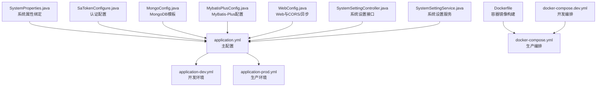
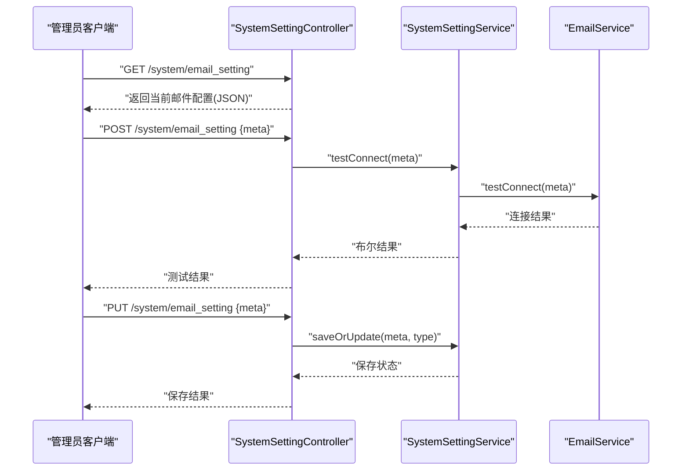

# 配置管理

<cite>
**本文引用的文件**
- [application.yml](file://maxkb4j-start/src/main/resources/application.yml)
- [application-dev.yml](file://maxkb4j-start/src/main/resources/application-dev.yml)
- [application-prod.yml](file://maxkb4j-start/src/main/resources/application-prod.yml)
- [Dockerfile](file://maxkb4j-start/Dockerfile)
- [docker-compose.yml](file://docker-compose.yml)
- [docker-compose.dev.yml](file://docker-compose.dev.yml)
- [SystemProperties.java](file://maxkb4j-common/src/main/java/com/maxkb4j/common/props/SystemProperties.java)
- [SaTokenConfigure.java](file://maxkb4j-start/src/main/java/com/maxkb4j/start/config/SaTokenConfigure.java)
- [MongoConfig.java](file://maxkb4j-start/src/main/java/com/maxkb4j/start/config/MongoConfig.java)
- [MybatisPlusConfig.java](file://maxkb4j-start/src/main/java/com/maxkb4j/start/config/MybatisPlusConfig.java)
- [WebConfig.java](file://maxkb4j-start/src/main/java/com/maxkb4j/start/config/WebConfig.java)
- [SystemSettingController.java](file://maxkb4j-service/maxkb4j-system/src/main/java/com/maxkb4j/system/controller/SystemSettingController.java)
- [SystemSettingService.java](file://maxkb4j-service/maxkb4j-system/src/main/java/com/maxkb4j/system/service/SystemSettingService.java)
</cite>

## 目录
1. [简介](#简介)
2. [项目结构与配置文件总览](#项目结构与配置文件总览)
3. [核心配置项详解](#核心配置项详解)
4. [环境配置与差异对比](#环境配置与差异对比)
5. [系统属性与模型提供商配置](#系统属性与模型提供商配置)
6. [文件存储与对象存储配置](#文件存储与对象存储配置)
7. [邮件配置与通知机制](#邮件配置与通知机制)
8. [Docker 部署与环境变量](#docker-部署与环境变量)
9. [配置优先级与加载顺序](#配置优先级与加载顺序)
10. [动态配置更新与验证](#动态配置更新与验证)
11. [性能与稳定性配置建议](#性能与稳定性配置建议)
12. [故障排查与常见问题](#故障排查与常见问题)
13. [结论](#结论)

## 简介
本文件面向运维与开发人员，系统性梳理 MaxKB4j 的配置体系，覆盖主配置文件 application.yml 的关键参数、环境差异化配置、系统属性、模型提供商、文件存储、邮件通知、Docker 部署与环境变量、配置优先级与动态更新机制，并提供最佳实践与排障建议。

## 项目结构与配置文件总览
MaxKB4j 的配置主要集中在启动模块的资源目录中，采用 Spring Boot 的多环境配置策略，结合容器编排与 Dockerfile 进行部署时的环境注入。

图表来源
- [application.yml:1-69](file://maxkb4j-start/src/main/resources/application.yml#L1-L69)
- [application-dev.yml:1-11](file://maxkb4j-start/src/main/resources/application-dev.yml#L1-L11)
- [application-prod.yml:1-9](file://maxkb4j-start/src/main/resources/application-prod.yml#L1-L9)
- [Dockerfile:1-27](file://maxkb4j-start/Dockerfile#L1-L27)
- [docker-compose.yml:1-58](file://docker-compose.yml#L1-L58)
- [docker-compose.dev.yml:1-28](file://docker-compose.dev.yml#L1-L28)
- [SystemProperties.java:1-18](file://maxkb4j-common/src/main/java/com/maxkb4j/common/props/SystemProperties.java#L1-L18)
- [SaTokenConfigure.java:1-21](file://maxkb4j-start/src/main/java/com/maxkb4j/start/config/SaTokenConfigure.java#L1-L21)
- [MongoConfig.java:1-23](file://maxkb4j-start/src/main/java/com/maxkb4j/start/config/MongoConfig.java#L1-L23)
- [MybatisPlusConfig.java:1-32](file://maxkb4j-start/src/main/java/com/maxkb4j/start/config/MybatisPlusConfig.java#L1-L32)
- [WebConfig.java:1-86](file://maxkb4j-start/src/main/java/com/maxkb4j/start/config/WebConfig.java#L1-L86)
- [SystemSettingController.java:1-68](file://maxkb4j-service/maxkb4j-system/src/main/java/com/maxkb4j/system/controller/SystemSettingController.java#L1-L68)
- [SystemSettingService.java:1-34](file://maxkb4j-service/maxkb4j-system/src/main/java/com/maxkb4j/system/service/SystemSettingService.java#L1-L34)

章节来源
- [application.yml:1-69](file://maxkb4j-start/src/main/resources/application.yml#L1-L69)
- [application-dev.yml:1-11](file://maxkb4j-start/src/main/resources/application-dev.yml#L1-L11)
- [application-prod.yml:1-9](file://maxkb4j-start/src/main/resources/application-prod.yml#L1-L9)
- [docker-compose.yml:1-58](file://docker-compose.yml#L1-L58)
- [docker-compose.dev.yml:1-28](file://docker-compose.dev.yml#L1-L28)
- [Dockerfile:1-27](file://maxkb4j-start/Dockerfile#L1-L27)

## 核心配置项详解
以下为 application.yml 中的关键配置段落与作用说明（以路径定位代替代码片段）：

- 服务器与静态资源
  - server.port、server.error.whitelabel.enabled
  - 参考路径：[application.yml:1-6](file://maxkb4j-start/src/main/resources/application.yml#L1-L6)
- Spring 应用与上传限制
  - spring.application.name、spring.servlet.multipart.*
  - 参考路径：[application.yml:10-15](file://maxkb4j-start/src/main/resources/application.yml#L10-L15)
- Jackson 时区与日期格式
  - spring.jackson.date-format、spring.jackson.time-zone
  - 参考路径：[application.yml:16-18](file://maxkb4j-start/src/main/resources/application.yml#L16-L18)
- 缓存与 Flyway 迁移
  - spring.cache.type、spring.flyway.*
  - 参考路径：[application.yml:19-25](file://maxkb4j-start/src/main/resources/application.yml#L19-L25)
- MyBatis-Plus 全局配置
  - mybatis-plus.global-config.db-config.*、mapper-locations、type-aliases-package、type-handlers-package
  - 参考路径：[application.yml:28-36](file://maxkb4j-start/src/main/resources/application.yml#L28-L36)
- Sa-Token JWT 与会话
  - sa-token.*（含 jwt-secret-key、timeout、is-share 等）
  - 参考路径：[application.yml:38-57](file://maxkb4j-start/src/main/resources/application.yml#L38-L57)
- 数据源与 MongoDB（开发/生产）
  - decorator.datasource.p6spy.*、spring.datasource.*、spring.data.mongodb.*
  - 参考路径：[application-dev.yml:1-11](file://maxkb4j-start/src/main/resources/application-dev.yml#L1-L11)、[application-prod.yml:1-9](file://maxkb4j-start/src/main/resources/application-prod.yml#L1-L9)
- 系统默认账户
  - system.default-username、system.default-password（支持环境变量覆盖）
  - 参考路径：[application.yml:67-69](file://maxkb4j-start/src/main/resources/application.yml#L67-L69)

章节来源
- [application.yml:1-69](file://maxkb4j-start/src/main/resources/application.yml#L1-L69)
- [application-dev.yml:1-11](file://maxkb4j-start/src/main/resources/application-dev.yml#L1-L11)
- [application-prod.yml:1-9](file://maxkb4j-start/src/main/resources/application-prod.yml#L1-L9)

## 环境配置与差异对比
- 开发环境（application-dev.yml）
  - 数据库：PostgreSQL（本地或容器）
  - MongoDB：本地或容器
  - 参考路径：[application-dev.yml:1-11](file://maxkb4j-start/src/main/resources/application-dev.yml#L1-L11)
- 生产环境（application-prod.yml）
  - 数据库：PostgreSQL（本地或容器）
  - MongoDB：本地或容器
  - 参考路径：[application-prod.yml:1-9](file://maxkb4j-start/src/main/resources/application-prod.yml#L1-L9)
- Docker 编排
  - docker-compose.yml 提供生产级编排，包含 PostgreSQL、MongoDB 与应用服务，以及环境变量注入
  - docker-compose.dev.yml 提供开发级编排，仅数据库服务
  - 参考路径：[docker-compose.yml:1-58](file://docker-compose.yml#L1-L58)、[docker-compose.dev.yml:1-28](file://docker-compose.dev.yml#L1-L28)

章节来源
- [application-dev.yml:1-11](file://maxkb4j-start/src/main/resources/application-dev.yml#L1-L11)
- [application-prod.yml:1-9](file://maxkb4j-start/src/main/resources/application-prod.yml#L1-L9)
- [docker-compose.yml:1-58](file://docker-compose.yml#L1-L58)
- [docker-compose.dev.yml:1-28](file://docker-compose.dev.yml#L1-L28)

## 系统属性与模型提供商配置
- 系统属性绑定
  - system.default-username、system.default-password 通过 SystemProperties 绑定并支持环境变量覆盖
  - 参考路径：[application.yml:67-69](file://maxkb4j-start/src/main/resources/application.yml#L67-L69)、[SystemProperties.java:1-18](file://maxkb4j-common/src/main/java/com/maxkb4j/common/props/SystemProperties.java#L1-L18)
- 认证与会话
  - Sa-Token 采用 JWT 无状态模式，jwt-secret-key 支持环境变量注入
  - 参考路径：[application.yml:38-57](file://maxkb4j-start/src/main/resources/application.yml#L38-L57)、[SaTokenConfigure.java:1-21](file://maxkb4j-start/src/main/java/com/maxkb4j/start/config/SaTokenConfigure.java#L1-L21)
- 数据层与索引
  - MyBatis-Plus 分页插件与 Mapper 扫描；MongoDB 文本索引在实体上创建
  - 参考路径：[MybatisPlusConfig.java:1-32](file://maxkb4j-start/src/main/java/com/maxkb4j/start/config/MybatisPlusConfig.java#L1-L32)、[MongoConfig.java:1-23](file://maxkb4j-start/src/main/java/com/maxkb4j/start/config/MongoConfig.java#L1-L23)

章节来源
- [SystemProperties.java:1-18](file://maxkb4j-common/src/main/java/com/maxkb4j/common/props/SystemProperties.java#L1-L18)
- [application.yml:38-69](file://maxkb4j-start/src/main/resources/application.yml#L38-L69)
- [SaTokenConfigure.java:1-21](file://maxkb4j-start/src/main/java/com/maxkb4j/start/config/SaTokenConfigure.java#L1-L21)
- [MybatisPlusConfig.java:1-32](file://maxkb4j-start/src/main/java/com/maxkb4j/start/config/MybatisPlusConfig.java#L1-L32)
- [MongoConfig.java:1-23](file://maxkb4j-start/src/main/java/com/maxkb4j/start/config/MongoConfig.java#L1-L23)

## 文件存储与对象存储配置
- 上传大小限制
  - spring.servlet.multipart.max-file-size、spring.servlet.multipart.max-request-size
  - 参考路径：[application.yml:13-15](file://maxkb4j-start/src/main/resources/application.yml#L13-L15)
- 对象存储服务
  - 文件上传与存储由 OSS 模块提供，控制器与服务位于 maxkb4j-oss 模块
  - 参考路径：[maxkb4j-oss 模块](file://maxkb4j-service/maxkb4j-oss/src/main/java/com/maxkb4j/oss/controller/FileController.java)、[maxkb4j-oss 模块](file://maxkb4j-service/maxkb4j-oss/src/main/java/com/maxkb4j/oss/service/MongoFileService.java)

章节来源
- [application.yml:13-15](file://maxkb4j-start/src/main/resources/application.yml#L13-L15)
- [maxkb4j-oss 模块](file://maxkb4j-service/maxkb4j-oss/src/main/java/com/maxkb4j/oss/controller/FileController.java)
- [maxkb4j-oss 模块](file://maxkb4j-service/maxkb4j-oss/src/main/java/com/maxkb4j/oss/service/MongoFileService.java)

## 邮件配置与通知机制
- 接口与流程
  - 管理员角色可通过系统设置接口进行邮件配置的查询、测试与保存
  - 服务层负责持久化与连接测试
  - 参考路径：[SystemSettingController.java:1-68](file://maxkb4j-service/maxkb4j-system/src/main/java/com/maxkb4j/system/controller/SystemSettingController.java#L1-L68)、[SystemSettingService.java:1-34](file://maxkb4j-service/maxkb4j-system/src/main/java/com/maxkb4j/system/service/SystemSettingService.java#L1-L34)

图表来源
- [SystemSettingController.java:21-50](file://maxkb4j-service/maxkb4j-system/src/main/java/com/maxkb4j/system/controller/SystemSettingController.java#L21-L50)
- [SystemSettingService.java:17-32](file://maxkb4j-service/maxkb4j-system/src/main/java/com/maxkb4j/system/service/SystemSettingService.java#L17-L32)

章节来源
- [SystemSettingController.java:1-68](file://maxkb4j-service/maxkb4j-system/src/main/java/com/maxkb4j/system/controller/SystemSettingController.java#L1-L68)
- [SystemSettingService.java:1-34](file://maxkb4j-service/maxkb4j-system/src/main/java/com/maxkb4j/system/service/SystemSettingService.java#L1-L34)

## Docker 部署与环境变量
- 构建与运行
  - Dockerfile 基于 Amazon Corretto 21，设置时区，暴露 8080 端口，使用 UTF-8 编码运行 jar 包
  - 参考路径：[Dockerfile:1-27](file://maxkb4j-start/Dockerfile#L1-L27)
- 编排与环境注入
  - docker-compose.yml 将数据库与应用服务编排，通过 environment 注入数据库与 MongoDB 连接信息
  - 参考路径：[docker-compose.yml:44-48](file://docker-compose.yml#L44-L48)
- 开发编排
  - docker-compose.dev.yml 仅启动数据库服务，便于快速本地联调
  - 参考路径：[docker-compose.dev.yml:1-28](file://docker-compose.dev.yml#L1-L28)

章节来源
- [Dockerfile:1-27](file://maxkb4j-start/Dockerfile#L1-L27)
- [docker-compose.yml:1-58](file://docker-compose.yml#L1-L58)
- [docker-compose.dev.yml:1-28](file://docker-compose.dev.yml#L1-L28)

## 配置优先级与加载顺序
- Spring Boot 配置优先级（从高到低）
  1) 命令行参数
  2) SPRING_APPLICATION_JSON
  3) 环境变量
  4) application-{profile}.yml
  5) application.yml
  6) @PropertySource
  7) 默认属性
- 关键点
  - Sa-Token 的 jwt-secret-key 与 system.default-password 明确使用了环境变量占位符，可在容器或系统环境中覆盖
  - 开发/生产 profile 通过 spring.profiles.active 切换
- 参考路径
  - [application.yml:38-40](file://maxkb4j-start/src/main/resources/application.yml#L38-L40)、[application.yml:67-69](file://maxkb4j-start/src/main/resources/application.yml#L67-L69)

章节来源
- [application.yml:38-40](file://maxkb4j-start/src/main/resources/application.yml#L38-L40)
- [application.yml:67-69](file://maxkb4j-start/src/main/resources/application.yml#L67-L69)

## 动态配置更新与验证
- 动态更新
  - 邮件配置通过系统设置接口进行保存与更新，服务层负责删除旧记录并写入新配置
  - 参考路径：[SystemSettingService.java:25-32](file://maxkb4j-service/maxkb4j-system/src/main/java/com/maxkb4j/system/service/SystemSettingService.java#L25-L32)
- 验证机制
  - 提供“测试连接”接口，服务层调用 EmailService 执行连通性校验
  - 参考路径：[SystemSettingController.java:36-44](file://maxkb4j-service/maxkb4j-system/src/main/java/com/maxkb4j/system/controller/SystemSettingController.java#L36-L44)、[SystemSettingService.java:21-23](file://maxkb4j-service/maxkb4j-system/src/main/java/com/maxkb4j/system/service/SystemSettingService.java#L21-L23)

章节来源
- [SystemSettingController.java:36-44](file://maxkb4j-service/maxkb4j-system/src/main/java/com/maxkb4j/system/controller/SystemSettingController.java#L36-L44)
- [SystemSettingService.java:21-23](file://maxkb4j-service/maxkb4j-system/src/main/java/com/maxkb4j/system/service/SystemSettingService.java#L21-L23)

## 性能与稳定性配置建议
- 上传与并发
  - 合理设置 spring.servlet.multipart.*，避免过大文件导致内存压力
  - 异步线程池容量与队列长度可根据业务峰值调整
  - 参考路径：[application.yml:13-15](file://maxkb4j-start/src/main/resources/application.yml#L13-L15)、[WebConfig.java:17-27](file://maxkb4j-start/src/main/java/com/maxkb4j/start/config/WebConfig.java#L17-L27)
- 数据库与迁移
  - Flyway 迁移启用，确保 schema 一致性；生产环境建议关闭 validate-on-migrate 并开启 baseline-on-migrate
  - 参考路径：[application.yml:21-25](file://maxkb4j-start/src/main/resources/application.yml#L21-L25)
- 缓存与序列化
  - 使用 Caffeine 缓存，注意合理设置过期策略与统计开关
  - 参考路径：[application.yml:19-20](file://maxkb4j-start/src/main/resources/application.yml#L19-L20)
- 安全与会话
  - JWT 密钥务必轮换；超时与分享策略按业务需求调整
  - 参考路径：[application.yml:38-57](file://maxkb4j-start/src/main/resources/application.yml#L38-L57)

章节来源
- [application.yml:13-25](file://maxkb4j-start/src/main/resources/application.yml#L13-L25)
- [WebConfig.java:17-27](file://maxkb4j-start/src/main/java/com/maxkb4j/start/config/WebConfig.java#L17-L27)
- [application.yml:38-57](file://maxkb4j-start/src/main/resources/application.yml#L38-L57)

## 故障排查与常见问题
- 数据库连接失败
  - 检查 spring.datasource.url/username/password 与网络连通性；生产/开发 profile 是否正确
  - 参考路径：[application-dev.yml:2-6](file://maxkb4j-start/src/main/resources/application-dev.yml#L2-L6)、[application-prod.yml:2-6](file://maxkb4j-start/src/main/resources/application-prod.yml#L2-L6)
- MongoDB 连接失败
  - 检查 spring.data.mongodb.uri 与认证参数；确认容器网络与端口映射
  - 参考路径：[application-dev.yml:7-9](file://maxkb4j-start/src/main/resources/application-dev.yml#L7-L9)、[application-prod.yml:7-9](file://maxkb4j-start/src/main/resources/application-prod.yml#L7-L9)
- JWT 密钥问题
  - 确认 SA_TOKEN_JWT_SECRET_KEY 环境变量已注入且未泄露
  - 参考路径：[application.yml:38-40](file://maxkb4j-start/src/main/resources/application.yml#L38-L40)
- 默认账户密码
  - system.default-password 支持环境变量覆盖，首次登录后应立即修改
  - 参考路径：[application.yml:67-69](file://maxkb4j-start/src/main/resources/application.yml#L67-L69)
- CORS 与静态资源
  - 如遇跨域或前端路由问题，检查 WebConfig 中 CORS 与 ViewController 配置
  - 参考路径：[WebConfig.java:68-85](file://maxkb4j-start/src/main/java/com/maxkb4j/start/config/WebConfig.java#L68-L85)

章节来源
- [application-dev.yml:2-9](file://maxkb4j-start/src/main/resources/application-dev.yml#L2-L9)
- [application-prod.yml:2-9](file://maxkb4j-start/src/main/resources/application-prod.yml#L2-L9)
- [application.yml:38-40](file://maxkb4j-start/src/main/resources/application.yml#L38-L40)
- [application.yml:67-69](file://maxkb4j-start/src/main/resources/application.yml#L67-L69)
- [WebConfig.java:68-85](file://maxkb4j-start/src/main/java/com/maxkb4j/start/config/WebConfig.java#L68-L85)

## 结论
MaxKB4j 的配置体系以 Spring Boot 为核心，结合多环境配置、容器编排与系统设置接口，实现了数据库、缓存、认证、上传、邮件等关键能力的灵活管理。建议在生产环境严格区分环境变量与密钥管理，完善监控与告警，并基于业务负载持续优化并发与缓存策略。