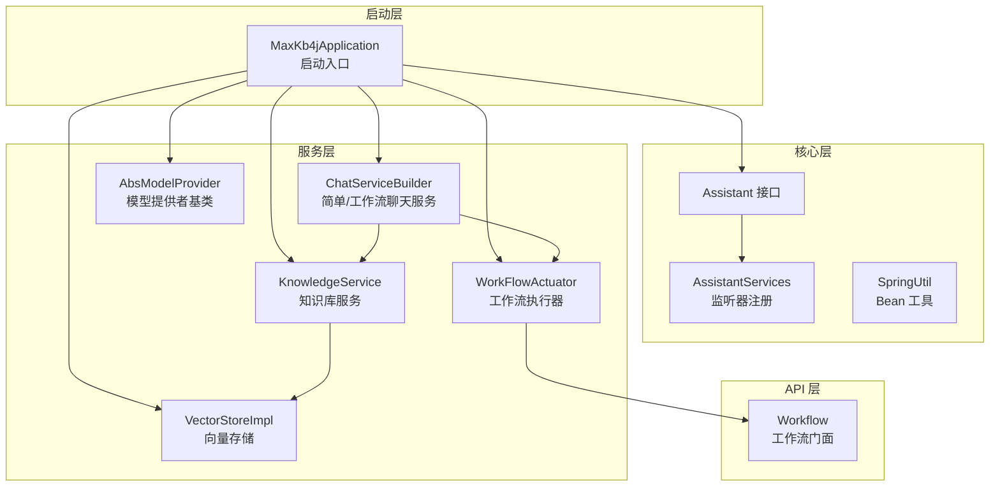
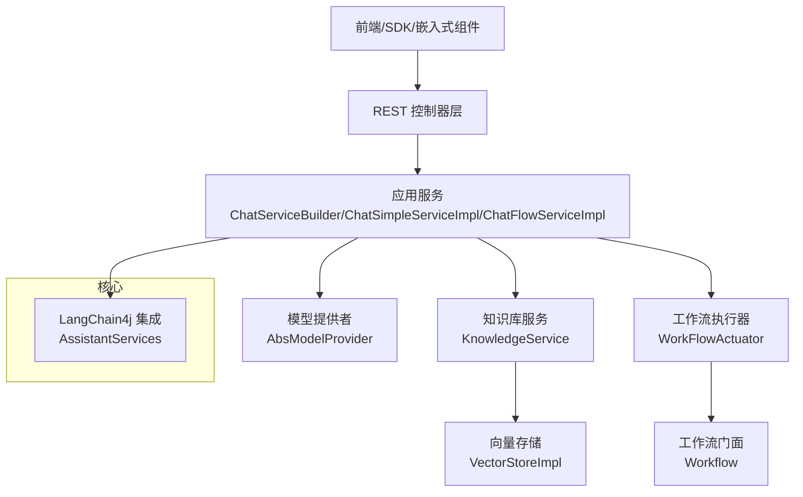
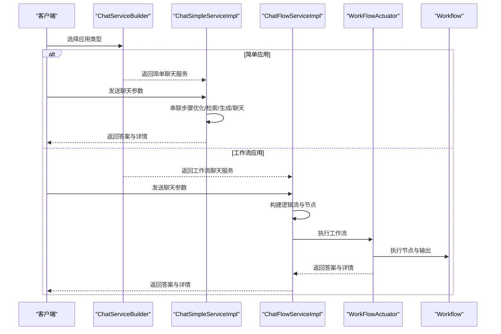
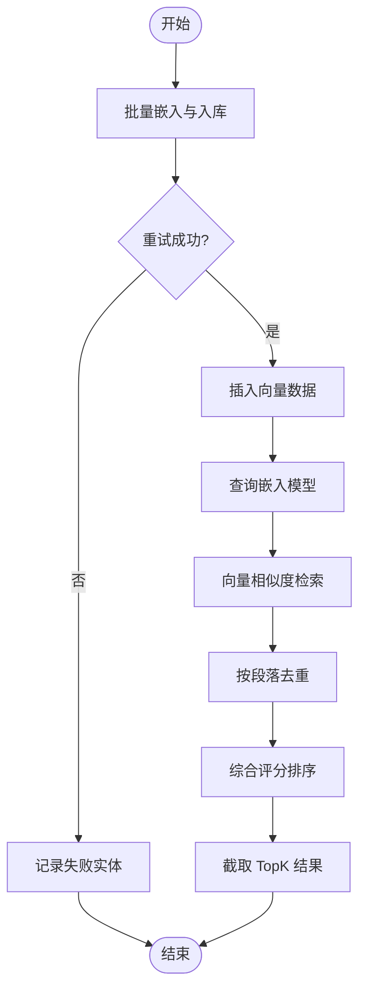
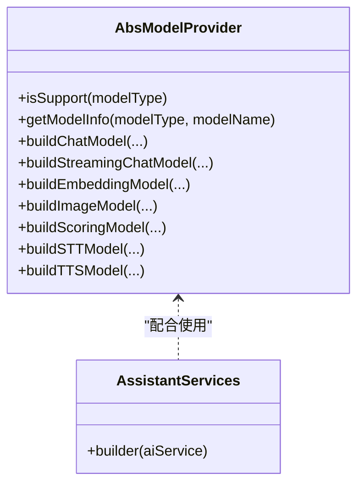
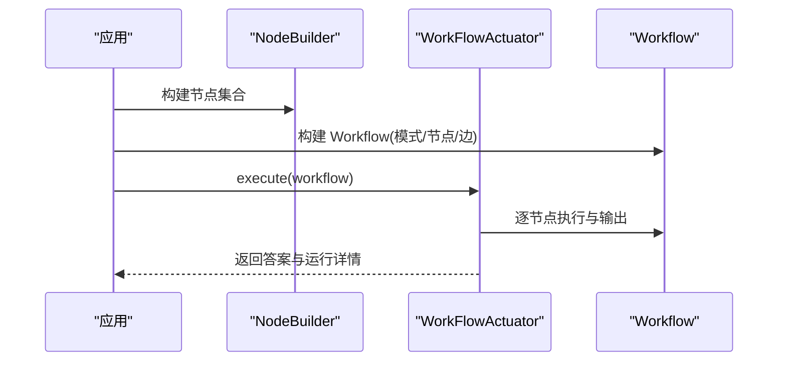
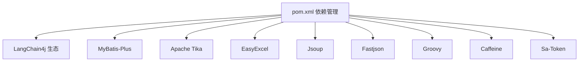

# 项目概述

<cite>
**本文档引用的文件**
- [README_CN.md](file://README_CN.md)
- [pom.xml](file://pom.xml)
- [MaxKb4jApplication.java](file://maxkb4j-start/src/main/java/com/maxkb4j/start/MaxKb4jApplication.java)
- [Assistant.java](file://maxkb4j-core/src/main/java/com/maxkb4j/core/assistant/Assistant.java)
- [AssistantServices.java](file://maxkb4j-core/src/main/java/com/maxkb4j/core/langchain4j/AssistantServices.java)
- [ChatServiceBuilder.java](file://maxkb4j-service/maxkb4j-application/src/main/java/com/maxkb4j/application/builder/ChatServiceBuilder.java)
- [ChatSimpleServiceImpl.java](file://maxkb4j-service/maxkb4j-application/src/main/java/com/maxkb4j/application/service/impl/ChatSimpleServiceImpl.java)
- [ChatFlowServiceImpl.java](file://maxkb4j-service/maxkb4j-application/src/main/java/com/maxkb4j/application/service/impl/ChatFlowServiceImpl.java)
- [WorkFlowActuator.java](file://maxkb4j-service/maxkb4j-workflow/src/main/java/com/maxkb4j/workflow/service/WorkFlowActuator.java)
- [VectorStoreImpl.java](file://maxkb4j-service/maxkb4j-knowledge/src/main/java/com/maxkb4j/knowledge/store/VectorStoreImpl.java)
- [AbsModelProvider.java](file://maxkb4j-service/maxkb4j-model/src/main/java/com/maxkb4j/model/provider/AbsModelProvider.java)
- [SpringUtil.java](file://maxkb4j-common/src/main/java/com/maxkb4j/common/util/SpringUtil.java)
- [Workflow.java](file://maxkb4j-service-api/maxkb4j-workflow-api/src/main/java/com/maxkb4j/workflow/model/Workflow.java)
- [KnowledgeService.java](file://maxkb4j-service/maxkb4j-knowledge/src/main/java/com/maxkb4j/knowledge/service/KnowledgeService.java)
</cite>

## 目录
1. [引言](#引言)
2. [项目结构](#项目结构)
3. [核心组件](#核心组件)
4. [架构总览](#架构总览)
5. [详细组件分析](#详细组件分析)
6. [依赖分析](#依赖分析)
7. [性能考量](#性能考量)
8. [故障排查指南](#故障排查指南)
9. [结论](#结论)
10. [附录](#附录)

## 引言
MaxKB4j 是面向企业级的智能问答系统，提供“检索增强生成（RAG）+ LLM 工作流引擎”的一体化解决方案。它针对 Java 团队在 AI 应用集成中的痛点，提供高并发、模型无关、可视化工作流编排与低代码扩展能力，帮助企业在不重构既有系统的情况下，快速获得“理解、推理、执行”的智能能力。

- 解决痛点
  - 入门门槛：告别 Python 生态依赖，Java 团队可直接上手
  - 准确性：结合企业内部数据，显著降低大模型“幻觉”
  - 并发瓶颈：基于虚拟线程与响应式模型，支撑高并发场景
  - 复杂业务：通过可视化工作流与多 Agent 协作，覆盖复杂业务流程

- 应用场景
  - 智能客服、企业内部知识库、数据分析、学术研究与教育等

**章节来源**
- [README_CN.md:19-46](file://README_CN.md#L19-L46)

## 项目结构
MaxKB4j 采用多模块 Maven 结构，围绕“通用基础层、核心能力层、服务层、API 层、启动层”进行分层组织，便于复用与扩展。

- 模块划分
  - maxkb4j-common：通用工具、常量、异常、缓存、类型处理器等
  - maxkb4j-core：核心抽象与能力（助手接口、LangChain4j 集成、监听器）
  - maxkb4j-service：业务服务（应用、知识库、模型、工具、触发器、工作流）
  - maxkb4j-service-api：服务 API（实体、Mapper、DTO、VO、枚举）
  - maxkb4j-start：Spring Boot 启动入口与配置

**图表来源**
- [MaxKb4jApplication.java:10-21](file://maxkb4j-start/src/main/java/com/maxkb4j/start/MaxKb4jApplication.java#L10-L21)
- [Assistant.java:11-21](file://maxkb4j-core/src/main/java/com/maxkb4j/core/assistant/Assistant.java#L11-L21)
- [AssistantServices.java:13-26](file://maxkb4j-core/src/main/java/com/maxkb4j/core/langchain4j/AssistantServices.java#L13-L26)
- [ChatServiceBuilder.java:14-37](file://maxkb4j-service/maxkb4j-application/src/main/java/com/maxkb4j/application/builder/ChatServiceBuilder.java#L14-L37)
- [KnowledgeService.java:66-82](file://maxkb4j-service/maxkb4j-knowledge/src/main/java/com/maxkb4j/knowledge/service/KnowledgeService.java#L66-L82)
- [WorkFlowActuator.java:16-36](file://maxkb4j-service/maxkb4j-workflow/src/main/java/com/maxkb4j/workflow/service/WorkFlowActuator.java#L16-L36)
- [AbsModelProvider.java:36-53](file://maxkb4j-service/maxkb4j-model/src/main/java/com/maxkb4j/model/provider/AbsModelProvider.java#L36-L53)
- [VectorStoreImpl.java:32-34](file://maxkb4j-service/maxkb4j-knowledge/src/main/java/com/maxkb4j/knowledge/store/VectorStoreImpl.java#L32-L34)
- [Workflow.java:34-74](file://maxkb4j-service-api/maxkb4j-workflow-api/src/main/java/com/maxkb4j/workflow/model/Workflow.java#L34-L74)

**章节来源**
- [pom.xml:57-63](file://pom.xml#L57-L63)
- [README_CN.md:102-112](file://README_CN.md#L102-L112)

## 核心组件
- 助手与 LangChain4j 集成
  - Assistant 接口定义聊天与流式聊天能力
  - AssistantServices 统一注册监听器（开始、完成、工具执行、错误）

- 聊天服务编排
  - ChatServiceBuilder 基于应用类型选择简单聊天或工作流聊天
  - ChatSimpleServiceImpl 串联“问题优化/检索/生成人类消息/LLM 聊天”步骤
  - ChatFlowServiceImpl 将应用工作流转换为逻辑流并交由工作流执行器执行

- 知识库与向量检索
  - KnowledgeService 提供知识库 CRUD、版本发布、工作流执行、导出等功能
  - VectorStoreImpl 基于 PostgreSQL + pgvector 实现向量嵌入的增删改查与检索

- 模型提供者
  - AbsModelProvider 定义模型提供者契约，支持多种模型类型与参数解析

- 工作流执行
  - WorkFlowActuator 使用策略模式选择处理器执行工作流
  - Workflow 作为工作流门面，提供上下文、历史、输出与执行访问器

**章节来源**
- [Assistant.java:11-21](file://maxkb4j-core/src/main/java/com/maxkb4j/core/assistant/Assistant.java#L11-L21)
- [AssistantServices.java:13-26](file://maxkb4j-core/src/main/java/com/maxkb4j/core/langchain4j/AssistantServices.java#L13-L26)
- [ChatServiceBuilder.java:14-37](file://maxkb4j-service/maxkb4j-application/src/main/java/com/maxkb4j/application/builder/ChatServiceBuilder.java#L14-L37)
- [ChatSimpleServiceImpl.java:24-54](file://maxkb4j-service/maxkb4j-application/src/main/java/com/maxkb4j/application/service/impl/ChatSimpleServiceImpl.java#L24-L54)
- [ChatFlowServiceImpl.java:23-45](file://maxkb4j-service/maxkb4j-application/src/main/java/com/maxkb4j/application/service/impl/ChatFlowServiceImpl.java#L23-L45)
- [KnowledgeService.java:66-82](file://maxkb4j-service/maxkb4j-knowledge/src/main/java/com/maxkb4j/knowledge/service/KnowledgeService.java#L66-L82)
- [VectorStoreImpl.java:32-34](file://maxkb4j-service/maxkb4j-knowledge/src/main/java/com/maxkb4j/knowledge/store/VectorStoreImpl.java#L32-L34)
- [AbsModelProvider.java:36-53](file://maxkb4j-service/maxkb4j-model/src/main/java/com/maxkb4j/model/provider/AbsModelProvider.java#L36-L53)
- [WorkFlowActuator.java:16-36](file://maxkb4j-service/maxkb4j-workflow/src/main/java/com/maxkb4j/workflow/service/WorkFlowActuator.java#L16-L36)
- [Workflow.java:34-74](file://maxkb4j-service-api/maxkb4j-workflow-api/src/main/java/com/maxkb4j/workflow/model/Workflow.java#L34-L74)

## 架构总览
MaxKB4j 的整体架构以“服务层 + API 层 + 核心层 + 启动层”分层组织，结合 LangChain4j 的 AI 能力与 Spring 生态，形成可扩展的企业级智能问答平台。

**图表来源**
- [MaxKb4jApplication.java:10-21](file://maxkb4j-start/src/main/java/com/maxkb4j/start/MaxKb4jApplication.java#L10-L21)
- [ChatServiceBuilder.java:14-37](file://maxkb4j-service/maxkb4j-application/src/main/java/com/maxkb4j/application/builder/ChatServiceBuilder.java#L14-L37)
- [ChatSimpleServiceImpl.java:24-54](file://maxkb4j-service/maxkb4j-application/src/main/java/com/maxkb4j/application/service/impl/ChatSimpleServiceImpl.java#L24-L54)
- [ChatFlowServiceImpl.java:23-45](file://maxkb4j-service/maxkb4j-application/src/main/java/com/maxkb4j/application/service/impl/ChatFlowServiceImpl.java#L23-L45)
- [KnowledgeService.java:66-82](file://maxkb4j-service/maxkb4j-knowledge/src/main/java/com/maxkb4j/knowledge/service/KnowledgeService.java#L66-L82)
- [VectorStoreImpl.java:32-34](file://maxkb4j-service/maxkb4j-knowledge/src/main/java/com/maxkb4j/knowledge/store/VectorStoreImpl.java#L32-L34)
- [AbsModelProvider.java:36-53](file://maxkb4j-service/maxkb4j-model/src/main/java/com/maxkb4j/model/provider/AbsModelProvider.java#L36-L53)
- [WorkFlowActuator.java:16-36](file://maxkb4j-service/maxkb4j-workflow/src/main/java/com/maxkb4j/workflow/service/WorkFlowActuator.java#L16-L36)
- [Workflow.java:34-74](file://maxkb4j-service-api/maxkb4j-workflow-api/src/main/java/com/maxkb4j/workflow/model/Workflow.java#L34-L74)

## 详细组件分析

### 组件A：聊天服务编排（简单/工作流）
- 简单聊天流程
  - 步骤：问题优化（可选）→ 检索知识库 → 生成人类消息 → LLM 聊天
  - 输出：答案列表与运行详情
- 工作流聊天流程
  - 将应用工作流转换为逻辑流，构建 Workflow 并交由执行器执行
  - 输出：答案列表与运行详情

**图表来源**
- [ChatServiceBuilder.java:14-37](file://maxkb4j-service/maxkb4j-application/src/main/java/com/maxkb4j/application/builder/ChatServiceBuilder.java#L14-L37)
- [ChatSimpleServiceImpl.java:24-54](file://maxkb4j-service/maxkb4j-application/src/main/java/com/maxkb4j/application/service/impl/ChatSimpleServiceImpl.java#L24-L54)
- [ChatFlowServiceImpl.java:23-45](file://maxkb4j-service/maxkb4j-application/src/main/java/com/maxkb4j/application/service/impl/ChatFlowServiceImpl.java#L23-L45)
- [WorkFlowActuator.java:16-36](file://maxkb4j-service/maxkb4j-workflow/src/main/java/com/maxkb4j/workflow/service/WorkFlowActuator.java#L16-L36)
- [Workflow.java:34-74](file://maxkb4j-service-api/maxkb4j-workflow-api/src/main/java/com/maxkb4j/workflow/model/Workflow.java#L34-L74)

**章节来源**
- [ChatServiceBuilder.java:14-37](file://maxkb4j-service/maxkb4j-application/src/main/java/com/maxkb4j/application/builder/ChatServiceBuilder.java#L14-L37)
- [ChatSimpleServiceImpl.java:24-54](file://maxkb4j-service/maxkb4j-application/src/main/java/com/maxkb4j/application/service/impl/ChatSimpleServiceImpl.java#L24-L54)
- [ChatFlowServiceImpl.java:23-45](file://maxkb4j-service/maxkb4j-application/src/main/java/com/maxkb4j/application/service/impl/ChatFlowServiceImpl.java#L23-L45)

### 组件B：知识库与向量检索
- 能力
  - 文档/段落/问题管理
  - 向量嵌入批量处理与重试
  - 基于 pgvector 的相似度检索与去重排序
  - 知识库版本发布与导出

**图表来源**
- [VectorStoreImpl.java:49-91](file://maxkb4j-service/maxkb4j-knowledge/src/main/java/com/maxkb4j/knowledge/store/VectorStoreImpl.java#L49-L91)
- [VectorStoreImpl.java:214-278](file://maxkb4j-service/maxkb4j-knowledge/src/main/java/com/maxkb4j/knowledge/store/VectorStoreImpl.java#L214-L278)

**章节来源**
- [VectorStoreImpl.java:32-34](file://maxkb4j-service/maxkb4j-knowledge/src/main/java/com/maxkb4j/knowledge/store/VectorStoreImpl.java#L32-L34)
- [VectorStoreImpl.java:49-91](file://maxkb4j-service/maxkb4j-knowledge/src/main/java/com/maxkb4j/knowledge/store/VectorStoreImpl.java#L49-L91)
- [VectorStoreImpl.java:214-278](file://maxkb4j-service/maxkb4j-knowledge/src/main/java/com/maxkb4j/knowledge/store/VectorStoreImpl.java#L214-L278)

### 组件C：模型提供者与监听器
- 模型提供者
  - 统一参数解析与模型实例构建
  - 支持多种模型类型（聊天、嵌入、图像、评分、TTS/STT）
- 监听器
  - 注册 AI 服务生命周期监听器，捕获开始、完成、工具执行、错误事件

**图表来源**
- [AbsModelProvider.java:36-53](file://maxkb4j-service/maxkb4j-model/src/main/java/com/maxkb4j/model/provider/AbsModelProvider.java#L36-L53)
- [AssistantServices.java:13-26](file://maxkb4j-core/src/main/java/com/maxkb4j/core/langchain4j/AssistantServices.java#L13-L26)

**章节来源**
- [AbsModelProvider.java:36-53](file://maxkb4j-service/maxkb4j-model/src/main/java/com/maxkb4j/model/provider/AbsModelProvider.java#L36-L53)
- [AssistantServices.java:13-26](file://maxkb4j-core/src/main/java/com/maxkb4j/core/langchain4j/AssistantServices.java#L13-L26)

### 组件D：工作流执行与门面
- 工作流执行器
  - 通过处理器列表选择对应处理器执行
- 工作流门面
  - 提供上下文、历史、输出与执行访问器，简化调用

**图表来源**
- [ChatFlowServiceImpl.java:23-45](file://maxkb4j-service/maxkb4j-application/src/main/java/com/maxkb4j/application/service/impl/ChatFlowServiceImpl.java#L23-L45)
- [WorkFlowActuator.java:16-36](file://maxkb4j-service/maxkb4j-workflow/src/main/java/com/maxkb4j/workflow/service/WorkFlowActuator.java#L16-L36)
- [Workflow.java:34-74](file://maxkb4j-service-api/maxkb4j-workflow-api/src/main/java/com/maxkb4j/workflow/model/Workflow.java#L34-L74)

**章节来源**
- [WorkFlowActuator.java:16-36](file://maxkb4j-service/maxkb4j-workflow/src/main/java/com/maxkb4j/workflow/service/WorkFlowActuator.java#L16-L36)
- [Workflow.java:34-74](file://maxkb4j-service-api/maxkb4j-workflow-api/src/main/java/com/maxkb4j/workflow/model/Workflow.java#L34-L74)

## 依赖分析
- 技术栈与版本
  - 后端：Java 21、Spring Boot 3、Sa-Token
  - AI 框架：LangChain4j
  - 向量数据库：PostgreSQL 15 + pgvector
  - 全文检索：MongoDB 5.0+
  - 缓存：Caffeine
  - 前端：Vue 3、Node.js v20.16.0

- 关键依赖
  - LangChain4j 各模块（OpenAI、Azure、Ollama、各云厂商 Provider 等）
  - MyBatis-Plus、Tika、EasyExcel、JSoup、Fastjson、Groovy、Caffeine 等

**图表来源**
- [pom.xml:64-492](file://pom.xml#L64-L492)

**章节来源**
- [pom.xml:64-492](file://pom.xml#L64-L492)
- [README_CN.md:102-112](file://README_CN.md#L102-L112)

## 性能考量
- 并发与吞吐
  - 基于 Java 21 + Spring Boot 3 + 虚拟线程，结合响应式模型与异步非阻塞 I/O，提升高并发下的吞吐与延迟表现
- 缓存与重试
  - 多级缓存与向量嵌入批量处理 + 重试机制，保障稳定性与性能
- 数据库与检索
  - PostgreSQL + pgvector 的向量检索与去重排序，结合分页与 TopK 截断，平衡精度与性能

[本节为通用性能指导，不直接分析具体文件]

## 故障排查指南
- 启动与环境
  - 默认激活 dev 环境，若未设置 profile，将自动设置为 dev
  - 确认数据库端口未被占用，首次启动会自动初始化 PostgreSQL 与 MongoDB
- 常见问题定位
  - 向量入库失败：检查嵌入模型可用性与批次大小、重试次数配置
  - 工作流执行异常：确认节点构建与处理器匹配，查看运行详情
  - 模型调用失败：核对模型凭据与参数表单，确认 Provider 支持的模型类型

**章节来源**
- [MaxKb4jApplication.java:14-20](file://maxkb4j-start/src/main/java/com/maxkb4j/start/MaxKb4jApplication.java#L14-L20)
- [VectorStoreImpl.java:98-145](file://maxkb4j-service/maxkb4j-knowledge/src/main/java/com/maxkb4j/knowledge/store/VectorStoreImpl.java#L98-L145)
- [WorkFlowActuator.java:22-34](file://maxkb4j-service/maxkb4j-workflow/src/main/java/com/maxkb4j/workflow/service/WorkFlowActuator.java#L22-L34)
- [AbsModelProvider.java:122-124](file://maxkb4j-service/maxkb4j-model/src/main/java/com/maxkb4j/model/provider/AbsModelProvider.java#L122-L124)

## 结论
MaxKB4j 通过“RAG + LLM 工作流引擎”的组合，为企业提供开箱即用、高并发、模型无关、可视化编排的智能问答能力。其模块化架构与 LangChain4j 集成，使 Java 团队能在不重构系统的情况下，快速落地 AI 应用，并在复杂业务场景中实现多 Agent 协作与低代码扩展。

[本节为总结性内容，不直接分析具体文件]

## 附录

### 快速开始
- 环境要求
  - Java 21+
  - PostgreSQL 12+（启用 pgvector 扩展）
  - MongoDB 6.0+（可选，用于全文检索）
- 启动方式
  - JAR 启动：java -jar maxkb4j-start.jar
  - Docker 启动：docker run ... registry.cn-hangzhou.aliyuncs.com/tarzanx/maxkb4j
  - Docker Compose：docker-compose up -d
- 访问界面
  - http://localhost:8080/admin/login
  - 默认账号：admin，默认密码：tarzan@123456

**章节来源**
- [README_CN.md:50-98](file://README_CN.md#L50-L98)